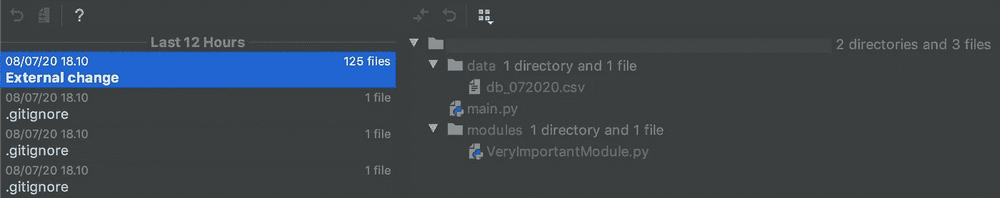

# 意外“rm -rf *”后怎么办

> 原文：<https://blog.devgenius.io/what-to-do-after-accidental-rm-rf-ba544a6b2564?source=collection_archive---------6----------------------->

## 编程；编排

## 第一，不要重启电脑，不要关闭任何 ide。

由 Giphy 制造

冷静点。

深呼吸。

喝一杯水。

当我一个月前做同样的事情时，这些话帮助我冷静下来。

我当时在做一个项目，涉及到很多实验。不得不做实验和很短的期限意味着大量肮脏的代码，当然你不想以你的名义提交它们，不是吗？

事实证明，意外删除数周工作的感觉比犯下肮脏代码的感觉更可怕。

如果你像我一样不小心删除了你的文件，那么我有一个坏消息和一个好消息给你。

坏消息是你的文件可能不见了。`rm`命令解除指定文件路径的链接，并将它们标记为空闲内存。与从 Finder 或 Windows 资源管理器中删除文件不同，受`rm`影响的文件不会出现在回收站或回收站中。

好消息是，仍然有一些方法可以轻松保存你的文件。简单地说，我的意思是不使用文件恢复软件。

顺便说一句，作为预防措施，最好在不同的机器上阅读这篇文章和浏览网页，而不是在你刚刚丢失文件的机器上。稍后我会解释原因。

## 饭桶

你最后一次提交工作是什么时候？如果，不管什么原因，你和我一样，两个星期都忘了做任何事情，那么跳过这一部分。

如果答案是最近，那么你很幸运。命令`rm -rf *`的大多数变种不会删除被删除文件夹中的隐藏文件。

用`ls -a`检查剩下的隐藏文件，看看`.git`文件夹是否还在。

您可以使用`git checkout <branch>`恢复最近一次提交

如果你没有使用任何分支，那么使用`git checkout master`

还缺少一些没有提交给 git 的文件吗？继续读。

## IDE 和代码编辑器

你用 IDE 或代码编辑器编辑过这些文件吗？当这种情况发生时，我使用 PyCharm，但是任何来自 IntelliJ 的 ide 或者其他支持本地历史的 ide 都应该可以工作。

对于智能智能，请转到 VCS >本地历史>显示历史

PyCharm 当地历史截图

它应该将`rm -rf`动作列为“外部变更”,您可以通过右键单击历史并选择“恢复”来撤销该动作

一旦所有文件开始重新出现，这让我觉得 IntelliJ 收取的高额许可费终于值得了。

对于其他 ide，尝试谷歌“<ide name="">本地历史”。如果 IDE 实际上支持本地历史，应该有关于如何访问它的指南。</ide>

大多数代码编辑器没有现成的本地历史支持。VS Code 和 Sublime Text 对此有插件，但是你需要在事故之前*安装它们。*

没有当地历史支持？那么恐怕我们需要进行最后一步了。

## 删除数据恢复工具

此时，最好立即关闭您的机器，以防止意外覆盖。

当您使用浏览器浏览时，它很可能会记录缓存。由于先前被删除数据占用的内存被标记为空闲，机器有可能在其上写入新数据。如果发生这种情况，那么恢复文件将更加困难。

大多数(如果不是全部)数据恢复工具会要求您卸载驱动器。这意味着你需要一个活动的 USB 来启动和使用这些工具。我推荐使用 [UNetbootin](https://unetbootin.github.io/) 来创建一个。

您也可以将受影响的驱动器连接到另一台机器，因为受影响的驱动器是可拆卸的(不是焊接的),并且您有另一台机器可以访问它。

对于特定的`ext3`或`ext4`分区，我会推荐 extundelete、ext4magic 或 scalpel。这里有一些关于如何使用[拔管](https://wiki.archlinux.org/index.php/File_recovery#Extundelete)、 [ext4magic](https://wiki.archlinux.org/index.php/File_recovery#Ext4Magic) 和[手术刀](https://www.howtoforge.com/recover-deleted-files-with-scalpel)的详细指南。

另一个很棒的工具是 [Testdisk](https://www.tecmint.com/recover-deleted-files-using-testdisk-in-linux/) ，它可以支持更多的分区，比如 NTFS 和 FAT32。

无论您使用哪种工具，在尝试恢复数据时，请务必仔细遵循指南。

希望本指南能帮助您恢复数据。我祝你好运。