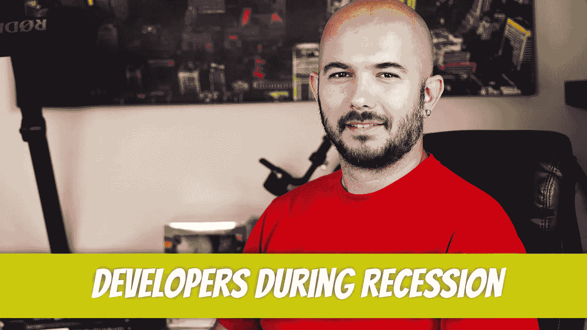

# 作为一名软件开发人员，在经济衰退期间应该做些什么？

> 原文：<https://blog.devgenius.io/what-to-do-as-a-software-developer-during-a-recession-dd0cd01697ba?source=collection_archive---------0----------------------->

到目前为止，经济低迷是我最赚钱的时候。当其他人都在恐慌的时候，我开始工作。有时是职业发展，有时纯粹是财务问题；大多数时候他们都是。我们正处于另一个关键时刻。你将如何利用这种情况？

## 大多数人做的事

你可能听说过一句谚语，“流血则导致死亡。”这是新闻机构感到兴奋的时候。他们喜欢混乱，因为人们会粘在他们选择的新闻站。市场将继续大幅波动，我们很可能会进入衰退，如果我们还没到那一步的话。

在这种情况下，你必须问自己的问题是，一遍又一遍地听同样可怕的故事对你的财务决策有帮助吗？我总是看行业专家的预测，远离主流媒体。例如，有人说 2023 年上半年将会出现经济衰退。 [CPI 今天刚刚发布 8.6%](https://seekingalpha.com/news/3847638-cpi-surges-86-in-may-core-inflation-rises-6-both-more-than-expected) 。市场反应过度了吗？您如何处理这类信息？

如果你和大多数人一样，你会撤资，损失潜在利润，等待经济好转。这是这些人放弃寻找机会，并希望确保他们在自己所在的地方有一个安全的位置的时候了。现在是他们蹲下等待飓风过去的时候了。

那不是我。

## 是时候学习新技能了

你会注意到一个趋势，即仍然有职位需要填补，但没有多少有技能的人申请。熟练的开发人员坚守着他们现有的职位，希望他们能在即将到来的裁员中幸存下来。

这是获得新技能来改变工作的绝好机会。你可能认为你没有足够的时间。看看这已经拖了多长时间了。它始于去年年底，一直延续到今年夏天。预测是经济将在 2023 年夏天开始走出衰退。这意味着你有大约一年的时间来学习新技能。

## 推销自己

当我听到招聘人员提到“开发人员应该在面试中改善他们的照明”时，我简直要疯了。即使我个人喜欢照明，为什么这会增加他们被雇用的机会。我以为我们看的是技能和经验，而不是灯光。

不用说，你还是应该推销自己。每个人都有独特的方法，但这是我的:

*教*。如果你有耐心的话，创建能帮助其他开发者的内容是很重要的。创建一个 YouTube 频道，开始教授你想要宣传的技能。作为奖励，你可能真的开始从 YouTube 上赚钱了。

*写文章*。我经历了写作的各个阶段。我的任务是在接下来的 365 天里每天写一篇文章。到目前为止，我已经坚持了一个月，并没有打算放慢速度。你可以在申请的时候把你的个人博客添加到简历中。人们会检查的，相信我。

*写书*。如果你在写文章，下一个合乎逻辑的步骤就是写书。只要你的一天安排得当，你可以在一年内写出一本像样的书。再次强调，战略性地选择你想进入的领域并写下来。在你为了写一本高质量的书而做了大量的研究之后，你实际上会在某种程度上成为这方面的专家。

社交媒体。你可以向算法输入你是谁，或者你可以训练社交媒体算法将你视为你想要成为的个体。向 LinkedIn、Twitter、Instagram 和抖音发布战略内容。了解受众以及每个算法的偏好。例如，格式化你在 LinkedIn 上的帖子，这样你就不会发布大段大段的内容。对于 Instagram，张贴质量卷轴。

## 找份新工作

你说你已经很熟练了？是时候开始寻找了。你有工作，市场会变得稀缺。追求月亮，不要接受任何少了的东西。自信地去参加面试，不要渴望机会。如果公司非常想要你，他们会为你工作。一个小秘密:大多数公司都没有申请到足够数量的优秀开发人员，所以你的时机再好不过了。

当你满怀信心地参加面试时，你会开始注意到他们实际上有多想要你。你可以观察他们的方法和你自己的方法。调整实时有效的方法。最后，如果你不明白，你就有了一次无压力的学习经历。继续下一次面试，运用你完美的面试技巧。

## 使用该应用程序并接触 MVP 产品

公司受到了伤害，正在寻求削减开支。其他公司希望将该新软件整合到他们的业务中，但现在负担不起。这是你的黄金机会。让你的应用在任何环境下运行的方法是在你开发应用的时候，让一些用户为你的应用付费。他们给你反馈，你继续建设。

当现金短缺时，这些公司更有可能合作，特别是如果他们认为他们可以用你的软件改善他们的业务。采用 MVP 方法，定期发布更新。到经济衰退结束时，你应该会有一些忠实的客户，他们会觉得这个应用是为他们而生的。然后，你可以以更高的成本将其引入市场。

## 投资还是储蓄来投资

罗伯特·清崎刚才说什么都要买，包括卫生纸。第一次，我在等待。

我为什么要等？首先，经济在好转之前可能会变得更糟。基于我所读到的一切，这就是我所打赌的。我们仍处于下降趋势。

那么，你应该存多少钱再投入股市呢？这个问题没有明确的答案，但我有一些建议。如果你有房子，看看你剩余的抵押贷款。假装你正在偿还你的房子，把钱放在一边。只要你拥有的钱不超过你必须偿还的金额，你的状况就很好。

现在，假设经济全面崩溃。是时候把卡车开回股票市场，抢走所有那些交易了。确保你有足够的储备，以防万一你失去工作，需要寻找另一份工作。

如果经济复苏快于预期，你仍然可以投资股市，看着你的钱增值。如果你觉得你已经完全错过了这条船，你可以把这笔钱放入你的家庭收支平衡表，然后还清这笔钱。一旦你卖掉你的房子，这笔钱将会以和一年前你把这笔钱投入你的房子一样的方式上涨。

请注意，以下几点来自我个人的经验，决不能指导你的金融投资。这正是对我有用的。

Dino Cajic 目前是 [LSBio(寿命生物科学公司)](https://www.lsbio.com/)、[绝对抗体](https://absoluteantibody.com/)、 [Kerafast](https://www.kerafast.com/) 、 [Everest BioTech](https://everestbiotech.com/) 、 [Nordic MUbio](https://www.nordicmubio.com/) 和 [Exalpha](https://www.exalpha.com/) 的 IT 主管。他还担任我的自动系统的首席执行官。他有十多年的软件工程经验。他拥有计算机科学学士学位，辅修生物学。他的背景包括创建企业级电子商务应用程序、执行基于研究的软件开发，以及通过写作促进知识的传播。

你可以在 [LinkedIn](https://www.linkedin.com/in/dinocajic/) 上联系他，在 [Instagram](https://instagram.com/think.dino) 上关注他，或者[订阅他的媒体出版物](https://dinocajic.medium.com/subscribe)。

阅读迪诺·卡吉克(以及媒体上成千上万的其他作家)的每一个故事。你的会员费直接支持迪诺·卡吉克和你阅读的其他作家。你也可以在媒体上看到所有的故事。