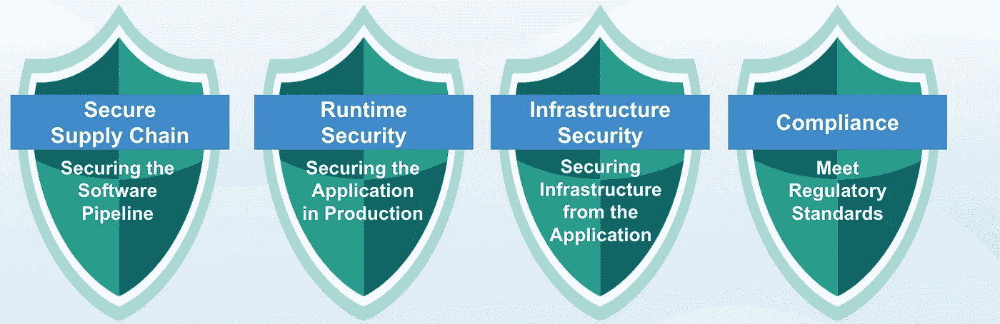

# 评估容器注册解决方案时要注意什么

> 原文：<https://blog.devgenius.io/what-to-look-for-when-evaluating-a-container-registry-solution-b79856ed0f89?source=collection_archive---------9----------------------->

Kubernetes 正迅速成为事实上的云操作系统。它为运行分布在现代基于云的基础设施上的软件提供了通用的 API 和服务。在所有云技术巨头的大力支持下，它已经被数千个基于云的软件项目所采用。这太棒了！对吗？

设置 Kubernetes 服务已经变得相对容易，无论是在内部还是在公共云服务中。然而，建立一个经过验证的容器注册解决方案来确保软件供应链的安全并不容易。对于容器注册中心来说，有许多解决方案，选择一个满足企业需求的解决方案是具有挑战性的。正确的解决方案需要能够安全地验证、遵从、自动化和组织映像和工作负载。

首先，组织需要确定他们想要私有还是公共注册。一般来说，公共存储库对于想要相对快速地启动和运行的个人和小团队来说是有意义的。也就是说，公共存储库没有隐私和访问控制等安全特性，这使得它们不可能满足企业需求。

想要扩展其容器计划的组织需要一个符合企业标准的私有容器注册中心。该解决方案需要能够扫描漏洞，确保基于角色的访问控制管理，优化自动化，并支持各种身份验证系统。

容器注册在任何容器管理策略中都扮演着至关重要的角色。在这篇博客中，我将讨论不同类型的容器注册中心，以及如何选择一个来满足企业需求。

# 公共注册管理机构与私有注册管理机构

尽管采用图像注册中心看起来很简单，但并不是所有的注册中心解决方案都是同等构建的，它们之间存在显著的差异。让我们来看看最常用的注册中心类型:公共注册中心和私有注册中心。

# 公共登记处

像 Docker Hub 这样的公共注册中心是许多容器管理策略的常见解决方案。公共解决方案非常基本且易于使用，小型团队和组织可以开始利用公共注册中心相对快速地建立和运行。需要注意的是，当您开始在成千上万的开发人员和地点之间扩展和共享图像时。公共注册中心只有基本的功能，并且在试图满足企业需求时不能很好地工作。随着注册表使用的增长，图像变得更加脆弱，并成为一个安全问题。这就是公共解决方案可能开始达不到预期的地方。

随着最近 Log4J 的安全漏洞的新闻，扫描您的图像的漏洞比以往任何时候都更重要。然而，大多数公共注册表解决方案不具备扫描图像漏洞的能力，因此不符合企业要求。最近，公共云提供商并非万无一失。正如数据所表明的那样，公共云不是看不见的，会发生中断。需要满足法规要求的企业需要一个简单的解决方案。

# 私有注册表

私有注册中心通常是安全企业容器管理策略的首选解决方案，这是有充分理由的。如上所述，公共注册中心很少满足企业需求，并且容易受到许多漏洞的影响。企业需要满足所有用例的私有注册解决方案。

评估正确的容器注册解决方案从来都不容易；该解决方案需要满足几个用例。最强大的私有注册中心可以保护软件供应链、存储和管理映像，并满足治理和法规遵从性要求。

既然我们已经了解了公共和私有注册中心，那么让我们深入了解一下在评估容器注册中心解决方案时应该注意什么。

# 关键容器注册功能

在评估容器注册解决方案时，有许多用例可以寻找。要寻找的最重要的特性之一是存储库的镜像策略。

当映像被推送到存储库并满足镜像标准时，注册中心会自动将其推送到远程注册中心的存储库。最强大的容器注册解决方案应该满足这些使用案例中的每一个，保护软件供应链，存储和管理图像，并满足治理和合规性要求。

下面，我将快速展示满足上述所有三个用例需求所需的每个特性。

**企业级注册表特性**

*   访问控制
    - IDM 集成和基于角色的访问控制，确保严格的访问控制
*   图像扫描
    -了解图像中的安全漏洞
*   图像存储
    -安全地存储图像，并向所有开发人员开放
*   缓存和监控
    -将图像放在需要的地方
*   策略和推广
    -通过推广策略实施安全控制
*   映像生命周期
    -基于策略自动管理映像
*   图像签名
    -运行前验证图像真实性

compass 中上面列出的每一项功能都是保护软件供应链、确保图像安全存储以及满足合规性要求所必需的。评估和选择正确的容器注册解决方案是任何容器管理策略的关键组成部分。

# 最终想法:

为了保证软件供应链的安全，必须从容器注册开始。随着各种类型的注册中心的出现，团队和组织需要了解哪种用例最适合他们。从企业的角度来看，安全和策略管理控制在选择正确的容器注册中心方面起着至关重要的作用。较小的团队可能会选择公共注册，以便快速移动。下面您将找到一个容器注册解决方案列表，您可以立即开始使用。

容器注册解决方案:

1.  [Mirantis Secure Registry](https://bit.ly/3HazhtL) (前身为 Docker Trusted Registry)
    -企业级容器注册表旨在安全地在任何地方共享、存储和部署容器软件
2.  [亚马逊弹性容器注册表](https://aws.amazon.com/ecr/) ——轻松地在任何地方存储、共享和部署你的容器软件
3.  [谷歌容器注册表](https://cloud.google.com/container-registry) -存储、管理和保护你的 Docker 容器图像