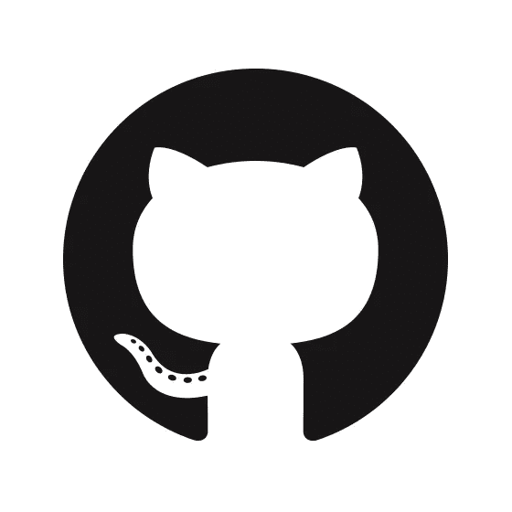
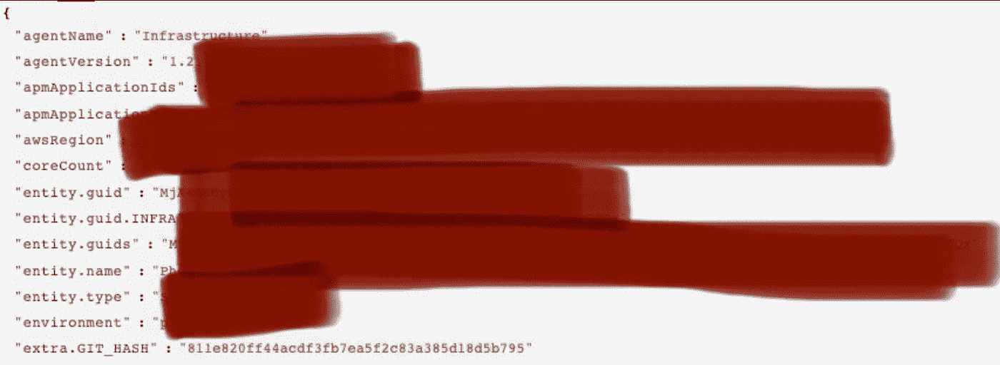

# 您的代码正在运行什么版本，在哪里运行？

> 原文：<https://blog.devgenius.io/what-version-of-your-code-is-running-and-where-b200ec7353bc?source=collection_archive---------12----------------------->



图片来自 github.com

# 背景

对于软件工程团队来说，拥有多个部署环境作为他们开发和 CICD 管道的一部分是很常见的。多部署环境允许您彻底发布和测试特性，而不会破坏最终用户和外部系统所看到的内容。有了这个开发良好的无缝工作流，团队可以更有效率，并及时交付可靠的软件。

这些环境的常见模式是:

*   **开发(或者仅仅是 dev):** 很多时候这个环境可能是开发人员的本地环境，或者是云中的虚拟机，只有最少的支持基础设施。这种环境通常被认为是漏洞的第一道防线，在这里，开发人员用一套`unit tests`测试新特性，以确保他们的代码逻辑是合理的，并且涵盖了所有的极限情况。这个*开发、单元测试、开发、单元测试*的循环一直执行，直到开发人员合并他们的代码并推到下一个环境进行进一步测试。
*   **试运行:**试运行环境是 QA 和`integration tests`通常发生的地方。根据应用的不同，一个人或一个自动化框架将确认新开发的软件的行为符合预期，并且不会中断任何上游或下游服务。如果发现了 bug，它们会被报告给开发人员，然后*开发、单元测试、…* 的循环再次开始。
*   **生产:**一旦所有各方(开发团队、质量保证团队、..)同意代码已经过彻底的测试，代码被发送到生产环境，并且从此快乐地工作。

# 是什么把我带到这里的

只不过事情没那么简单。在试运行/生产中发现错误，发生中断，服务可能会弃用某个端点，开发人员和他或她的团队有责任追踪问题的根源并进行 ***调试。***

我们如何能使这变得更容易？每天都有从 1 到 n 的开发人员向您的存储库提交代码，将变更和部署发布到您的所有环境中。我们如何追踪在哪里执行了什么代码？

上个月左右，我在构建 docker-compose 和 AWS Elastic Beanstalk 环境时遇到了这个问题。我已经成功地部署和运行了应用程序，连接到 RDS，排队芹菜任务等等，但是你瞧有一个错误。我的应用程序崩溃了。

我做了一些调查，想办法从我的应用程序日志中找出我运行的是哪个版本的代码。当然，我已经安装并运行了 New Relic，它给了我堆栈跟踪，但是它没有告诉我运行的是哪个版本的代码。这变成了一个故事，讲述了我如何试图弄清楚如何将最新的 git 提交散列作为一个参数放入我的 Docker 容器。

# **将最新的 Git 提交散列注入 Docker**

有两个地方我觉得我需要,*可以从那里获得 git 散列。我将在下面简要强调这两种方法。*

## **Dockerfile:**

我想我可以直接将我的 git 提交散列作为一个参数添加到 Dockerfile 文件中作为一个`ARG`。从那时起，您就可以将它设置为一个环境变量，并在您的代码中用于任意数量的用例；对我来说，这变成了在`logging...`函数的`extra={}`参数中设置它。您的 docker 构建命令看起来会像这样。

无论是否从命令行构建参数，都可以从 docker 文件中访问。我用它在我的应用程序中设置一个环境变量，这样我就知道从 [Amazon Secrets Manager 中提取哪些秘密。](https://aws.amazon.com/secrets-manager/)然而，对于这个特定的用例，我只是将它作为一个环境标志来表示我正在构建和推送的代码的当前 git 提交散列。现在我的 python 环境中有了这个变量，我可以随心所欲地使用它。点击查看更多使用 Dockerfile 参数[的方法。](https://docs.docker.com/engine/reference/builder/#arg)

从命令行读入 GIT_HASH build-arg

在 python 应用程序代码中使用 GIT_HASH 环境变量

## **Github 动作:**

在某个时候，我会写一些关于 Github 如何行动的文章，以及一些我插入到 CICD 管道中的收藏夹。这包括我编写的部署到我的 [Elastic Beanstalk 环境](https://awstip.com/taking-a-fastapi-app-to-production-on-aws-189ebf3defed)的定制作业之一！

我们可以通过 Github 操作中的一个额外步骤来构建 Docker 映像，从而实现我们在上面的命令行中所做的事情。首先，我们需要了解如何在 Github 操作中使用环境变量。要点是，Github 为你的工作流运行设置默认参数，*和*你也可以在你的代码中添加自定义变量！Github 提供的默认环境变量列表可以在[这里](https://docs.github.com/en/actions/learn-github-actions/environment-variables)找到，这些变量可以通过在变量名前添加一个`$`在你的工作流程中访问。例如，在动作的步骤中，要打印`GITHUB_SHA`我的命令可能如下所示:

```
name: Print Git Hash
    shell: bash
    run: |
        echo $GITHUB_SHA
```

为了便于学习，让我们将这个默认环境变量设置为一个自定义变量，并在工作流的构建步骤中使用它。我认为添加自定义变量作为环境变量的最直接的方法是`echo`-将变量放入`$GITHUB_ENV`。这样做之后，您可以通过调用`env.<var_name>`来使用该变量

```
name: Extract Git Hash
    shell: bash
    run: |
        echo "sha=$GITHUB_SHA" >> $GITHUB_ENVname: Print Git Hash
    shell: bash
    run: |
        echo ${{ env.sha }}
```

最后，您可以将自定义变量设置为`docker/build-push-action@v2`步骤的 build-arg。重复我之前的观点，通过这样的 GitHub 动作来做，本质上与之前使用命令行选项是一样的，只是现在自动化了。设置提交散列并将其用作工作流中的构建参数的完整描述如下。

# **这对我有什么好处？**

参考我的[上一篇文章](https://awstip.com/logging-and-monitoring-elastic-beanstalk-with-new-relic-eb6ad00e7db9)关于我的应用程序如何记录到 New Relic，我提到了目标是将我们的应用程序日志从不同的环境带到一个可查询的接口用于调试目的。使用上下文进行日志记录使我能够看到哪些基础架构日志与哪些 APM 相关联，现在这将可观察性提升到了另一个层次。运行的代码版本之间的任何差异都可以用我的新环境变量来表示！

不同的[日志级别函数](https://awstip.com/logging-and-monitoring-elastic-beanstalk-with-new-relic-eb6ad00e7db9)都可以有一个`extra` kwarg，它传入一个值字典来填充您的日志记录器的格式字符串。`newrelic.agent.NewRelicContextFormatter`获取我传递到`extra`字典中的任何内容，并将其添加到 LogRecord 中！



来自 New Relic 的带有 GIT_HASH 变量的日志示例！

调试愉快！