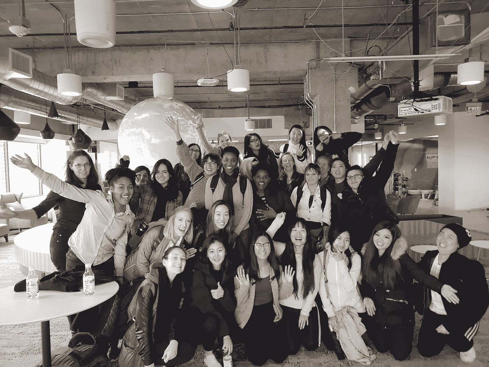

# 你在编码训练营的经历是怎样的？

> 原文：<https://blog.devgenius.io/what-was-your-experience-at-a-coding-bootcamp-like-2d88a6b23573?source=collection_archive---------4----------------------->

我破产了吗？我被退学了吗？做一个会不会不及格？我非常怀疑😊。但是，如果你正在考虑一个训练营，请阅读这篇文章。

你参加了哪个夏令营？

哈克布莱特学院

**为什么是那一个？**

他们教 Python，这是一种实用的语言，在大多数顶级科技公司都有，也是我毕业后想去的公司的主要语言，离家通勤很方便，我喜欢这里的员工，我认识公司的校友。最以后者来判断一个阵营。我在大学一年级的时候也拒绝了计算机科学，因为我没有看到自己在那里的代表。身处一个被这些代表包围的营地令人振奋。

**多少钱？**

$8,000.我获得了训练营的奖学金。如果没有奖学金，它将是 16，000 美元，或者通过每月付款计划预付，或者当你在夏令营后被雇用时，你的薪水的%。 [42](https://www.42.us.org/) 自由。其他的可能高达 22k 美元。

**$ 8000？？$16,000!？！听起来很多。**

没错。这还不包括机会成本(感谢经济学学位)、租金等。

*   8k 美元计划
*   200 美元/月杂货(x6 个月)
*   81 美元/月过境通行证(x6 个月)
*   34 美元/月的健身房会员资格(6 个月)
*   我离职时的月薪为 4.5 美元(x6 个月)
*   800 美元/月租金(x6 个月)
*   我离职时遗留在桌面上的未归属股权:567 股，在我离开时定价为 60 美元/股(税前 34020 美元)
*   **总显性&机会成本&费用:> $75k**
*   **计划中的总自付费用&失业:17k 美元**

所以要确定这是你想要的行动/投资。当然，这是对我的投资，我现在赚得更多，我已经拿回了这些股票，而且在更短的授权时间内还会有更多，一个无价的新校友网络，以及酷工程技能，伙计！

我建议参加一个免费的 Python(或任何语言)入门课程( [Udacity](https://www.udacity.com/course/introduction-to-python--ud1110) 、 [Udemy](https://www.udemy.com/course/complete-python-bootcamp/) 、[来自语言的官方教程](https://docs.python.org/3/tutorial/)、 [Codeacademy](https://www.codecademy.com/learn/react-101) 、 [YouTube](https://www.youtube.com/watch?v=rfscVS0vtbw) )，参加一个[如何构建应用](https://www.codementor.io/@mide/how-to-build-restful-apis-with-python-and-flask-fh5x7zjrx)课程，找一个作为专业软件工程师编程的伟大导师(去 LinkedIn，问一个朋友，在 Meetups 或 Eventbrite 中搜索“技术”，或者参加黑客马拉松)。 每天练习一个算法( [Leetcode](https://leetcode.com/) ，我个人最喜欢的 [Codewars](https://www.codewars.com/) ，[降临 Code](https://adventofcode.com/) ，这里有一个[把](http://pythontutor.com/visualize.html#mode=edit)当成你正在解决的那些问题，然后用#100DaysofCode 的标签发布在 Twitter 上，阅读[破解编码面试](https://www.amazon.com/Cracking-Coding-Interview-Programming-Questions/dp/0984782850)，做[面试蛋糕](https://www.interviewcake.com/)和[算法专家](https://www.algoexpert.io/product)。 除了书&采访蛋糕，一切都是免费的，但这就是 GoFundMe，奶奶给的生日钱，或者储蓄的目的！那里！我刚帮你省了 16k！在这里感谢我:现金 App: **$blkgenwealth** 或者 Venmo: @Ryan-Barner。我只是在开玩笑😉…(有点🙂)

你为什么不先做那些免费的事情？

我头脑冷静，没有耐心。不要像我一样:)而且，我认为我申请的学徒计划需要它。当我得到这份工作时，我向经理提出了这一点，他说，“训练营不是一项要求……”那些 8k 美元中的每一个都在我眼前闪过…

就像任何工作一样。学位并不意味着你知道如何做这份工作，它只是招聘人员/公司的一个更容易的赌注。

我确实很感激有这个营地，因为很多原因，其中一个原因是当我在构建的时候，课程指导者救了我，因为我在构建我的应用程序时遇到挫折，我没有把我的笔记本电脑扔出窗外。如果你不习惯自己摆脱困境，这可能会让人不知所措…但当你工作时遇到困难，这将是一个很好的练习…

为什么不从一所被认可的大学获得某个专业的硕士学位呢？

太长而且更贵。再加上 FAFSA，GRE，GRE 预科，通勤时间更长等等。营地是三个月。研究生课程至少要一年，而且不会绕过教科书，让你更快地掌握知识。它们也不都是为了让你在大学毕业后找到一份工作。它们是为学术界设计的。

**训练营是什么样的？**

上午 10 点上课，2 个小时的讲座，1 个小时的实验来练习我们在讲座中所学的内容，1 个小时的午餐，另外 2 个小时的讲座在下午 4 点结束，然后是家庭作业或另外 1-2 个小时的应用程序工作。

**训练营开始前你在做什么？**

南加州大学经济学学士学位，南加州大学马歇尔商学院商业法辅修专业，五大会计师事务所反洗钱项目助理和电子发现助理，金融分析师，金融数据分析师，以及一家科技公司的自动驾驶汽车工程运营分析师。

我的同事中的女性有医生、药剂师、牙科保健员、教师、计算机科学毕业生、分析师、艺术家、行政助理、收银员、妈妈、工程师，或是 20-35 岁刚从非技术专业毕业的大学生。营地里有年轻的/年长的。有些人在面试前从未接触过代码。有些人已经建造了一些东西。不管我们之前在做什么，我们都活了下来。知道你的训练营想要你达到什么水平。

这些是我同伴中的漂亮女士。你能说出哪些是医生吗？学生们？没有。他们现在都是软件工程师了！

就我个人而言，我一直在和很多“不”作斗争导师和朋友们告诉我这样的事情，“他们不会雇用你”，“你已经有了一些好东西”，“为什么你会羡慕软件工程？”我必须倾听，评估，然后屏蔽它，倾听我和我想参加夏令营的原因(因为我一直认为编码很酷，我当时的工作没有太大的不同，报酬也低得多，我喜欢软件工程带来的社区，我的目的是打破世代财务债务的循环)。

我也在改变我的习惯，这样我就可以攒够钱，在旧金山享受年轻的时光，而不会挨饿或无家可归(自己做饭，少出去吃饭，乘坐公共交通或步行或拼车/开车，做头发，等等)。).这包括(多次)搬家，找一个便宜的地方，和那些不会给我已经紧张的生活增加压力的人在一起，我在一家处于上市前状态的成长中的科技公司。

在开始训练营之前，你希望自己知道些什么？

专注于学习，而不是试图在演示日使用最大、最差、最漂亮的应用。我出来时并不知道什么是资源、服务或端点，我的应用程序到底是做什么的*，也不知道互联网是如何工作的。当然，我写了我的应用程序，但是我从来没有花时间去弄清楚事情为什么会这样。我只是想建造。*

***你造了什么？***

*[whoproduced.org](http://whoproduced.org)*

*找到你最喜欢的歌曲的制作人。我喜欢 hip hop &有数据分析/可视化的背景。我的应用程序感觉不像工作。*

*k-nearest ML algo 来确定相似的艺术家/制作人，主要是因为机器学习听起来很酷&我有编写 SQL 的背景，在大学里学过计量经济学和统计学。*

*训练营结束后你做了什么？*

*每天给同学打电话，和他们一起练习面试。通过电话，谷歌视频，白板。参加网络活动。花时间与导师和专业的软件工程朋友在一起，并请他们解释，“我在 camp 中构建的应用程序到底做了什么，为什么？!"*

*夏令营是三个月，你每天都学到一些东西。你不可能真正深入到所涉及的每个主题(Python、JavaScript、React、SQL、终端、开发工具、git、GitHub、数据结构、排序算法、互联网如何工作、面试、白板、薪资谈判、网络)。不过，有一件事它给了我一个介绍，告诉我通过面试需要深入探讨的话题。露营前，我不知从何开始。Camp 帮助我提供了学习指南，让我有时间练习和建立一些东西，我可以迭代和货比三家找工作，给我一个网络，并帮助招聘人员相信我是“关于那种生活”，当我说我是时。*

*然后，我每天练习一种算法，每天申请大约 10 个职位，寻求推荐，与我认识和不认识的软件工程师交谈，并寻求谈判建议。*

*我参加了在 Eventbrite/Meetup 搜索“技术”找到的免费技术学习课程。这些通常是由训练营向训练营的购物者提供的课程预览。这些非常有帮助，但是经常被忽视。不要以为你住在农村/郊区，它们就不存在。他们有！其中许多都是虚拟的。我用了我在一个夏令营举办的免费会议中学到的一些东西，我没有参加夏令营后的工作面试。*

*我回到自己的社区，回到自己的营地，与跟在我后面的同学交谈，练习数据结构，做像“如何构建应用程序”这样的教程，弄清楚互联网是如何工作的，制作了一个个人网站，并与我在一次黑客马拉松上遇到的斯坦福大学 d.school 的设计师一起构建了另一个应用程序。*

*我做的一件非常酷的事情是在 Genius 找到一名招聘人员，并在拜访他们位于布鲁克林的办公室时，向他展示了我从他公司的 API 制作的应用程序。*

*你参加了几次面试？*

*很多是通过电话。两个在现场。提供并接受了其中一个。我没有得到的那份在我被拒绝了两年后也没有存活下来(凡事皆有因！).*

***你失业多久了？***

*6 个月:训练营 3 个月，毕业后 3 个月。*

***这很典型吗？***

*没错。有人在营地被雇佣了。大多数人在毕业一年内就被录用了。有些人正在寻找他们的第二或第三个角色，我们于 2019 年春季毕业(今天之前一年多一点……嘿，技术是积极的&不断变化的！).*

*你现在在做什么？*

*全职软件工程。我做过软件工程学徒，然后实习，现在我进入全职角色已经几个月了。我选择成为一名后端产品工程师，因为我喜欢商业和工程的结合，喜欢为外部客户提供工程服务，而不是让我的工程师同事的生活一天比一天轻松，因为这是基础软件的主要职责。*

*我经常很困惑，但*大部分*工程师也是如此，无论水平还是背景。有太多的东西是你在学校学不到的，不管是在斯坦福还是在 Udemy。我每天都在学习和成长！我认为这是一笔不错的投资。*

***什么是软件工程？***

*解决问题。它是获取数据、操作数据、存储数据，然后将修改后的版本、东西或什么都没有的数据发送回其来源的一种变体。这也是创造未来的一种方式，或者随着就业市场的变化而变化(其中大部分将很快成为知识型角色)。*

*专业的软件工程工作大多不是编码。是的，你 50-80%的时间都在编写代码，但这也是在浏览你公司的开发工具，学习诸如 [Kubernetes](https://kubernetes.io/) 、 [salt](https://github.com/saltstack/salt) 之类的东西，什么是 [manifest.yaml](https://docs.cloudfoundry.org/devguide/deploy-apps/manifest.html) 、 [Envoy](https://www.envoyproxy.io/) 、[微服务](https://microservices.io/)，如何将你团队的服务连接到另一个团队的服务，如何[测试你的代码](https://realpython.com/python-testing/)，学习一个产品经理到底在做什么，以及他与谁不同😂).camp 和我提供的任何资源都没有涉及到这些，但是感谢谷歌！*

*软件工程师典型的一天是怎样的？*

*回复电子邮件/Slack 消息，与我的团队一起参与讨论(报告昨天完成了什么，今天将完成什么，存在哪些障碍)，解决问题，构建，测试，阅读文档，调试，在 Slack 通道中找到答案，文档，堆栈溢出，更新文档。有时会有一些技术规范(记录要构建什么，为什么需要构建它，正在考虑的构建它的可能方法，试图通过构建实现的目标，设定时间表)。通常会有一两次会议…或者五次😕。*

***有软件工程/训练营经验可以做什么？职业前景如何？***

*几乎任何事情……以下是人们在训练营后做的一些常见的事情:*

*   *[前端软件工程师](https://www.linkedin.com/jobs/search/?geoId=103644278&keywords=frontend%20engineer&location=United%20States)*
*   *[后端软件工程师](https://www.linkedin.com/jobs/search/?geoId=103644278&keywords=backend%20engineer&location=United%20States)*
*   *[全栈软件工程师](https://www.linkedin.com/jobs/search/?geoId=103644278&keywords=fullstack%20engineer&location=United%20States)*
*   *[移动工程师(又名客户端、iOS、安卓工程师)](https://www.linkedin.com/jobs/search/?geoId=103644278&keywords=mobile%20engineer&location=United%20States)*
*   *[机器学习工程师](https://www.linkedin.com/jobs/search/?geoId=103644278&keywords=machine%20learning%20engineer&location=United%20States)*
*   *[安全工程师](https://www.linkedin.com/jobs/search/?currentJobId=1901114217&geoId=103644278&keywords=security%20engineer&location=United%20States)*
*   *[开发工程师](https://www.linkedin.com/jobs/search/?keywords=devops%20engineer)*
*   *[开发商代言人](https://www.linkedin.com/jobs/search/?geoId=103644278&keywords=evangelist&location=United%20States)*
*   *[数据科学家](https://www.linkedin.com/jobs/search/?geoId=103644278&keywords=data%20scientist&location=United%20States)*
*   *[数据分析师](https://www.linkedin.com/jobs/search/?geoId=103644278&keywords=data%20analyst&location=United%20States)*
*   *[科技博主](https://www.linkedin.com/jobs/search/?geoId=103644278&keywords=tech%20blogger&location=United%20States)*
*   *[技术作家](https://www.linkedin.com/jobs/search/?geoId=103644278&keywords=technical%20writer&location=United%20States)*
*   *[科技投资者](https://www.linkedin.com/jobs/search/?geoId=103644278&keywords=investor&location=United%20States)*
*   *[创始人](https://www.startupschool.org/?utm_source=yc&utm_campaign=ycdc_header)*

*有哪些训练营？*

*[哈克布莱特学院](https://hackbrightacademy.com/)、[熨斗学院](https://flatironschool.com/)、[编码道场](https://www.codingdojo.com/)、 [App 学院](https://www.appacademy.io/)、 [Hack Reactor](https://www.hackreactor.com/) 、[拉姆达学院](https://lambdaschool.com/)、[总装](https://generalassemb.ly/)，还有很多很多...*

*我如何知道自己准备好了？*

*回答这些:*

*   *兼职还是全职？*
*   *你的预算是多少？你能负担得起你的营地，食物，旅行，租金吗？*
*   *你的训练营什么时候开始/结束？你能有完美的，如果不是该死的接近完美的出席率吗？COVID 期间会毕业吗？……好吧，你可能无法预测下一次全球疫情和经济衰退……但你知道临近假期时招聘会放缓，因此应该避免在假期前后出来。*
*   *你即将有一个改变人生的事件吗？结婚？孩子快出生了吗？这可能不是兼顾两者的最佳时机。*
*   *你希望申请的公司使用什么语言和技术？你的训练营教这些或类似的东西吗？*
*   *我上面推荐的免费(或者几乎免费)的事情你都做过吗？为什么不呢？你还在等什么？！开始吧。开始吧。*
*   *为什么要这么做？*
*   *你和你正在考虑的夏令营的毕业生谈过吗？*
*   *你准备好成为你团队中唯一的女性了吗？你准备好成为你的团队/公司中唯一一个“代表性不足”的人了吗？你要去的公司有能力教你吗？我说公司是因为你想在毕业后找份工作，对吗？如果你要开自己的公司，那就做你自己吧！[做吧](https://www.startupschool.org/)！*

*对我还没有回答的问题进行评论，我会在下面回答……干杯！*