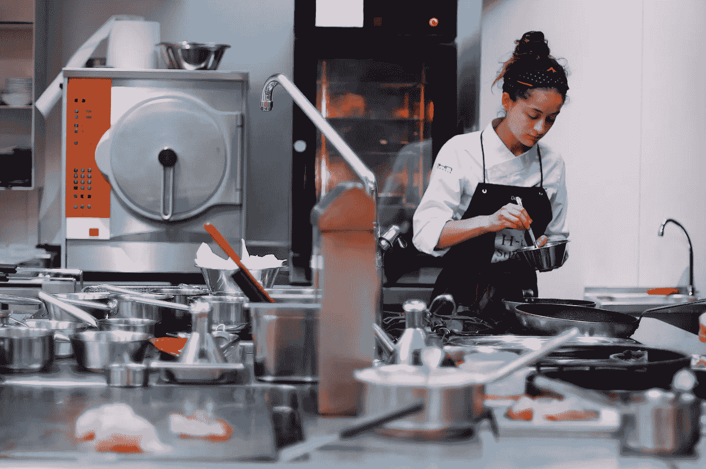

# 我们每天都在用，但其他人在生活中没有用过的东西:烹饪区

> 原文：<https://blog.devgenius.io/what-we-use-everyday-but-others-havent-used-in-their-lives-the-cooking-divide-27dec6b3f525?source=collection_archive---------43----------------------->

## 一瞥困扰数百万人的鸿沟:无法有效地为家人提供膳食

照片由[赫苏斯·特雷斯](https://unsplash.com/@nadaimporta?utm_source=unsplash&utm_medium=referral&utm_content=creditCopyText)在 [Unsplash](https://unsplash.com/s/photos/cooking?utm_source=unsplash&utm_medium=referral&utm_content=creditCopyText) 上拍摄

在美国，我们认为，当电视上有广告时，或者如果你离下次会议还有几分钟时间，跑去从冰箱里拿些东西是很常见的。虽然这可能是大多数美国人的现实，但对数百万其他人来说却是一种幻想。我们大大低估了清洁燃料和烹饪技术的价值，这是世界上许多家庭从未见过的两项资产。没有这项技术，社区不得不通过其他效率较低的方式获取食物。今天，我将简要分析各国在这个问题上的趋势。我将再次查看感兴趣的领域(AOI ),旨在确定在这一问题上取得进展的国家，以及在过去几年中有幸拥有这一指标高值的国家。

**AOI 1:为所有公民提供清洁燃料和烹饪技术的国家**

有许多国家(截至 2016 年)已经为其公民提供了 100%使用我们提到的这些工具的机会。这些国家包括但不限于澳大利亚、比利时、新加坡和美国。总共有 20 多个国家可以声称向其所有居民提供这些设施。

美国对感兴趣区域的价值观

以上数据代表了美国在过去十年左右的时间里在感兴趣领域的价值，这些数据突出了我们作为一个国家是多么的幸运。自 2000 年以来，美国每年都为 100%的公民提供清洁燃料和技术(CST)。

当我们谈论特权的时候，我认为重要的是也要认识和考虑那些没有我们拥有的资源的人。

卢旺达对利益区的价值

可以看出，在有些地区，该地区不到 1%的人口有机会获得任何国家儿童服务。在像卢旺达这样的国家，这可能意味着截至 2020 年 7 月 7 日星期二，生活在那里的 12，954，270 人，其中超过 1，200 万人缺乏接入。

AOI 2:越来越多地提供更多国家技术服务小组的国家

我还想看看那些把向所有公民提供 CST 作为优先事项的国家。经过分析，有几个国家脱颖而出，其中越南从 2010 年开始引领增长。

越南对利益区域的价值观

可以看出，越南获得儿童色情服务的人口比例增加了 35 个百分点。随着这样的稳定增长，越南将很快以极高的数值自豪。

正如我们对之前的指标所做的那样，我认为同样重要的是要认识到，在这一指标方面，也有一些国家不幸落后了。

玻利维亚对利益区的价值

可以看出，像玻利维亚这样的国家在这个指标上有所下滑，它们的价值在一年内下滑了大约 20%。虽然复苏缓慢，但我们看到他们正在努力反弹，近年来稳步增加了获得儿童色情服务的人口比例。

# 结论

哇哦。今天差点没成功。我今天真的很忙，还有很多其他的工作要做。我很高兴我还是完成了。今天想出一个主意非常困难，当太阳落山时，我终于想到了一个。令我好奇的是，我们有时认为整个世界都拥有我们所拥有的资源。事实上，我们生活在一个小泡泡里，而有些人甚至看不到里面的世界。对此，我们需要心存感激。与此同时，我们需要借此机会帮助那些在供养其公民方面有困难的人。明天见！

注:本文中的所有数据都是在[https://data.worldbank.org/](https://data.worldbank.org/)获得的。