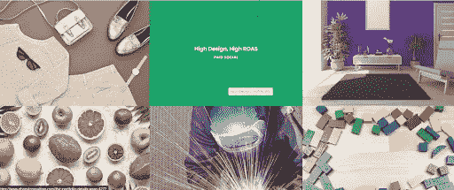

# 什么样的网页设计趋势将主导 2022 年？

> 原文：<https://blog.devgenius.io/what-web-design-trends-will-dominate-2022-25d7e788eeb2?source=collection_archive---------11----------------------->

就像技术一样，网页设计也在不断发展。随着每年新的趋势和技术的出现，很难跟上最新最好的网页设计。然而，如果你想让你的网站在 2022 年保持竞争力，你需要意识到即将出现的趋势。

那么，今年我们可以期待看到什么趋势主宰数字领域呢？以下是 2022 年的 5 大网站设计新趋势:

# 1.粗体印刷

网页设计就是为你的访问者创造一个视觉上吸引人和用户友好的体验。字体设计是一个强大的工具，可以用来实现这个目标，它正在以一种很大的方式接管网页设计世界。事实上，排版被预测为今年最大的网站设计趋势之一。

那么，是什么让印刷术如此受欢迎呢？我们可以想到三个原因:

1.它给你的网站增加了视觉趣味和个性。

2.良好的排版有助于提高可读性和可用性。

3.它可以用来创建动态和独特的设计，让你的信息。

如果你想让你的网站在 2022 年做一个大胆的声明，考虑使用大而粗的字体。只是一定要谨慎使用——任何东西太多都会让人不知所措。

# 2.交互式设计

在一个用户越来越不耐烦的世界里，交互元素对于保持他们的注意力是必不可少的。融入互动元素的网站设计更吸引人，视觉上更吸引人，这就是为什么它被预测为今年值得关注的新的网页设计趋势之一。

那么，你可以在你的网站上使用什么类型的交互元素呢？以下是一些想法:

1.视觉悬停效果。

2.动画和运动图形。

3.交互式菜单和导航。

4.用户输入表格(例如，调查、投票、测验)。

有效使用交互元素的关键是战略性地使用它们。太多只会分散你的访问者对你的内容的注意力，他们不太可能与他们互动。

# 3.自定义插图

现在，在新的网站设计趋势中，融入涂鸦、涂鸦和自定义插图非常流行。它们给你的网站增添了一点个性和奇思妙想，使它在视觉上更具吸引力和独特性。更不用说，自定义插图可以用来以简单而有趣的方式传达复杂的想法。它们肯定比标准的库存照片更令人难忘。

如果你想在 2022 年给你的网站一个清新现代的外观，考虑使用自定义插图。一定要选择一个擅长创造品牌和潮流视觉效果的插画师。

# 4.空格

在过去的几年里，有一个趋势正在形成:留白。留白是在设计中使用负空间来创造一种视觉上吸引人的极简外观。

那么，为什么留白越来越受欢迎呢？我想到了这三个原因:

1.它让你的网站看起来更加精致和专业。

2.通过提供视觉对比，它有助于将注意力集中在关键元素上。

3.它创造了一种放松和平静的效果，这对于有大量文本的网站来说是非常好的。

如果你想在 2022 年给你的网站一个更新的外观，考虑使用更多的空白空间。它能带来很大的不同！

# 5.滚动动画

另一个在网页设计领域迅速流行的是滚动动画。这些基本上是动画元素，当您向下滚动页面时，它们会滚动到视图中。它们可以用来增加视觉趣味，吸引你的访客，这就是为什么它们被预测为今年的大趋势之一。

有很多不同类型的滚动动画可以在你的网站上使用，所以选择对你的内容有效的滚动动画是很重要的。

一些需要考虑的事项包括:

1.动画的类型。

2.动画的速度。

3.动画的方向。

4.动画的长度。

在你的网站上添加滚动动画是一个很好的方法，可以让它在视觉上更吸引人，更吸引人。只是要确保选择适合你的内容，并能达到你想要的结果。

# 你的网站跟上 2022 年新的网站设计趋势了吗？

如果你的网站看起来有点过时，现在可能是时候更新一下最新的网站设计趋势了。在这里的 [Zluck Solutions](https://zluck.com/) ，我们可以帮你做到这一点！我们经验丰富的设计师团队将与您一起创建一个不仅在视觉上吸引人，而且在功能上有效的网站。请立即联系我们，了解更多关于我们的[网站](https://zluck.com/web-application-development/)和[移动应用开发服务](https://zluck.com/mobile-application-development/)的信息。