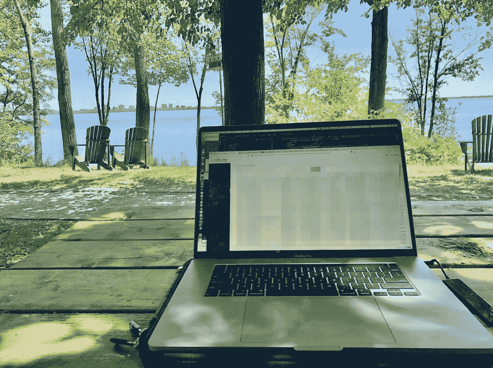
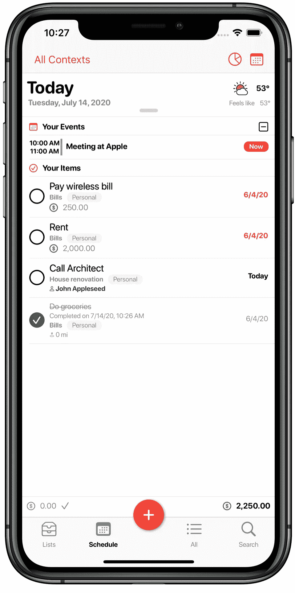

# 在隔离期间，你可以利用空闲时间做些什么

> 原文：<https://blog.devgenius.io/what-you-can-do-with-your-free-time-when-in-quarantine-70bf5951124a?source=collection_archive---------20----------------------->

好得不能再好了——照片由马龙·格雷斯拍摄

有些人会说“没什么”，有些人会说“网飞和冷静”，这是对的，我们都在做这样的事情，但如果你是一名软件工程师，没有太多时间进行实际的软件开发，因为你认为成为一名企业家是正确的事情，该怎么办？嗯，这就是我现在的处境！

不要误解我，建立一个成功的公司(顺便说一句，我还在路上)这一艰巨的任务非常令人兴奋，有这么多的知识，这么多新的联系和朋友，无论这次旅程的结果是什么，我相信它都是值得的。

我仍然在做大量的软件工程，同时管理一个开发团队，特别是和我的商业伙伴一起管理一家公司，但是尽管我非常积极地致力于我们的产品，但有时我想念*“让我们尝试这个新事物，看看我们得到了什么”*的方法，我们通常在年轻时和刚刚开始我们的职业生涯时有这种方法(显然我们在十几岁时有更多的时间，尽管我们浪费了很多时间睡懒觉)。

当我大约 16 岁的时候，我开始“专业地”发展。一个朋友的姐姐“雇佣”我们为她以前工作的公司开发一个非常简单的工资单应用程序。考虑到这是我的第一个真正的软件，这是相当成功的，那时我意识到我想做什么专业。创造具有几乎无限可能性的软件令我着迷，我全力以赴！

这篇文章的要点是:因为疫情，我们都被隔离了，我们不能见朋友，去酒吧，我们有了一些以前没有的时间，那时候我们都想放松一下。但是让软件工程师感到寒心的是:*“让我们试试这个新事物，看看我们会得到什么”*，尤其是在周末。

令我惊讶的是,*“我们看到了什么”*部分相当不错。我决定尝试苹果新的 Swift 框架 SwiftUI，这使得 iOS 开发变得非常容易。真的！我只需要两个周末就能完成一个完整的应用程序。

最后，我想开发一个对自己有用的应用，这就是著名的过度开发的任务和笔记列表应用。显然，我没有创建一个“hello-world”待办事项应用程序。我仔细考虑了一下，想出了一套在我的日常工作中非常有用的功能。叫做**definiti list**，与*肯定*一语双关。

这是我最喜欢的屏幕——马龙·盖里奥斯

总的来说，我很高兴我花了一些空闲时间并决定这样做，这就像回到了根本，当你甚至没有意识到你饿了，因为你必须完成那段代码。SwiftUI 是一个很棒的框架，我们将在我们的产品中使用它，所以这段休闲时间是非常值得的。

我也做了网飞和冷静，我仍然是一个正常人。

因此，如果你有兴趣试用这款应用，请点击下面的链接，分享你的反馈。非常感谢。我会继续努力，尽我所能改进它。

告诉我，你在用新的额外时间做什么？

**点击此处获取 app→**【https://apps.apple.com/us/app/definitelist/id1486470090? mt=8