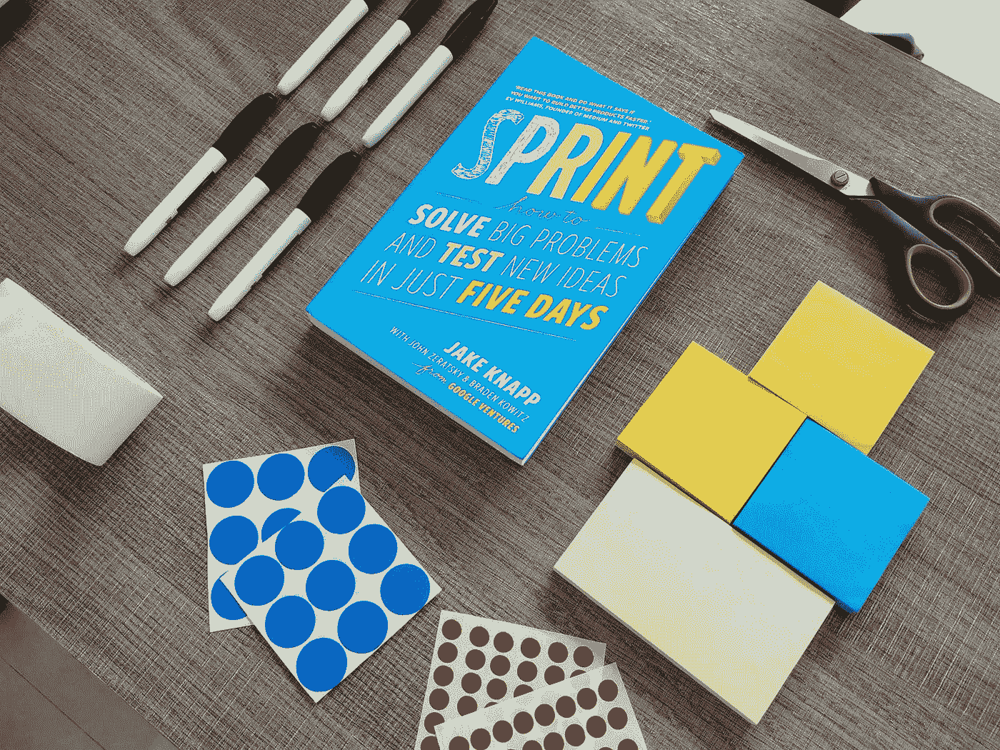
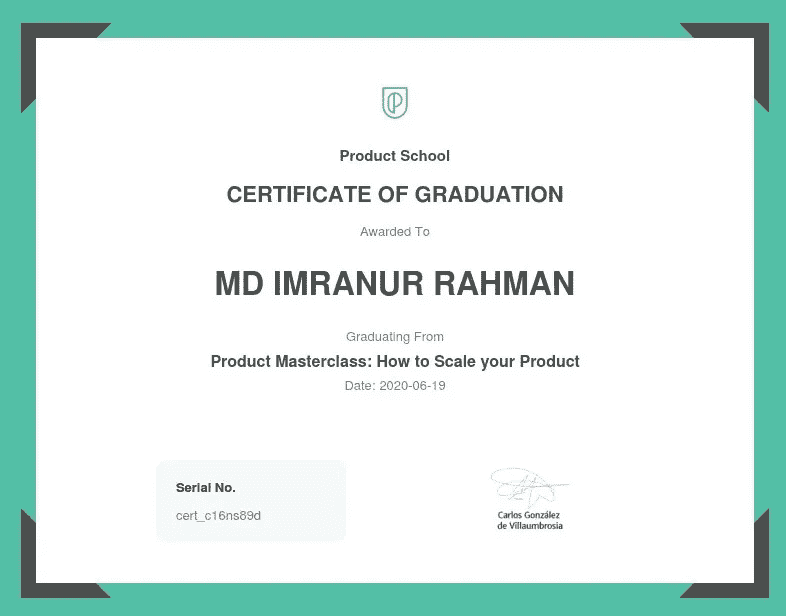

# 你能从产品学校的大师班学到什么

> 原文：<https://blog.devgenius.io/what-you-can-learn-from-product-schools-masterclass-9c52df6c6ed3?source=collection_archive---------17----------------------->

## 如何扩展您的产品

[产品学院](https://unsplash.com/@productschool?utm_source=medium&utm_medium=referral)在 [Unsplash](https://unsplash.com?utm_source=medium&utm_medium=referral) 上的照片

几天前，我了解到产品学校正在免费提供他们的一门课程。我做了一个快速的谷歌搜索，因为我不知道这个平台。在他们的网站上呆了几分钟后，我决定报名参加**产品大师班:如何扩展你的产品**。因为这是一门 999 美元的免费课程！此外，我最近改变了职业轨迹，现在担任产品经理。所以我觉得报名没什么坏处，对吧？

昨天我完成了课程。我正要分享我在 LinkedIn 的经历。突然想，为什么不写一篇中等的文章在上面呢？也许对你会有帮助。所以，我来了！

# 这门课程是关于什么的？

产品学院称这门课为大师课。你可以观看 5 个不同产品经理的产品演讲录音，他们在不同的公司工作:谷歌、Opendoor、Spotify 和 YouTube。

他们每个人都分享了自己作为产品经理的故事、经历和挑战。如果你是产品管理的新手，这些讲座会让你大开眼界。

[产品学院](https://unsplash.com/@productschool?utm_source=medium&utm_medium=referral)在 [Unsplash](https://unsplash.com?utm_source=medium&utm_medium=referral) 上的照片

# 产品讲座

这个大师班由 5 个演讲者的 5 个视频组成。你总共可以观看大约 307 分钟的视频。每位演讲者谈论以下话题之一:

1.  如何打造新产品
2.  如何构建产品路线图
3.  如何掌握设计冲刺
4.  如何建立产品开发流程
5.  产品扩展的挑战是什么

在下一部分，我将分享本课程大纲的摘要(阅读视频)。我希望它能帮助你决定这个课程对你来说是否是一个正确的选择。

# 让我们进入一点细节..

[金伯利农民](https://unsplash.com/@kimberlyfarmer?utm_source=medium&utm_medium=referral)在 [Unsplash](https://unsplash.com?utm_source=medium&utm_medium=referral) 拍摄的照片

## 1.如何打造新产品

这是第一个视频。这项研究是由谷歌的产品经理乔里斯·范·门斯进行的。他讲述了自己为印度等新兴市场开发产品的经历，这将帮助谷歌获得下一个 10 亿用户。

他专注于谷歌如何通过断断续续的互联网连接来满足低端智能手机用户的需求。观看这个视频让我想到“指导”客户使用你的应用程序是多么重要。

## 2.如何构建产品路线图

目前在 Opendoor 工作的 Hudson Levy 分享了他在沃尔玛担任高级产品经理时的故事。在产品开发中，开发项目的路线图是必不可少的。我喜欢他对项目进行优先排序并用图表描述的想法和方法。在这里，您将看到季度路线图、Ghant 路线图和传统路线图的比较。

[Slidebean](https://unsplash.com/@slidebean?utm_source=medium&utm_medium=referral) 在 [Unsplash](https://unsplash.com?utm_source=medium&utm_medium=referral) 上拍照

在准备路线图时，我们经常让它变得很难理解。视频中最吸引人的部分是**没人会去读他们不理解的路线图**。所以要把重点更多地放在让长长的清单不言自明、易于理解上！

## 3.如何掌握设计冲刺

这张是我最喜欢的！谷歌德国高级产品经理 Ganesh Shankar 讲述了在埃博拉危机期间，Design Sprint 如何帮助谷歌快速开发新技术。

我们常常不理解设计冲刺的重要性，直到我们在开发过程中面临失败并扭转局面——此时我们已经花费了太多的时间和精力，导致沉没成本。这就是 design sprint 扮演救世主角色的地方。在开发之前，你可以测试和评估你的想法。

照片由 [Unsplash](https://unsplash.com?utm_source=medium&utm_medium=referral) 上的[高塔姆·拉库姆](https://unsplash.com/@gautamlakum?utm_source=medium&utm_medium=referral)拍摄

我也期待着进行为期 5 天的设计冲刺，亲眼看看结果。也可以在 3 天内完成。

## 4.如何建立产品开发流程

Spotify 的产品经理 Miles Lennon 并不认为 Spotify 是一个单一的产品。这是一个产品集合，客户包括音乐爱好者、艺术家、开发者甚至广告商。我喜欢这个概念。有时候我们会把一个手机 app 当成一个产品，这可能是不正确的。应用程序行业的大多数大公司都会在应用程序中积累一些产品。

Mike 以简单的方式讲述了产品生命周期——思考、构建、运输和调整！

## 5.产品扩展的挑战是什么

我绝对可以把自己和这个联系起来。当你开始开发一个已经有大量活跃用户的大规模产品时，会发生什么？你可以从 YouTube.com 桌面产品经理 Seung Nam 那里了解到这一点。

卢克·切瑟在 [Unsplash](https://unsplash.com?utm_source=medium&utm_medium=referral) 上的照片

Seung 强调着眼于全局最大值而不是局部最大值。有时候，你会觉得你已经尽了一切努力从一个概念中创造出一个产品，并从中获得了最大的收益。你已经尽力了。你现在所做的一切只会产生最小的影响。这是你到达局部最大值的点。你不能从中获得更多！

然而，更好的设计会有更好的未来。你需要思考新的想法和新概念，这将有助于你得到更好的设计。你需要后退一步，建立一个新的愿景。这是最难的部分。你必须说服你的团队迈出这一步，为新的愿景而努力。

技术在不断变化。现在你不用等东西坏了再去修了！你提前做了更好的设计，这有助于你达到全局最大值。

# 这就是我要写的全部内容..

如果你已经是一名出色的产品经理，那么这个课程不适合你。如果你是产品经理这个角色的新手，或者像我一样被调换了，这肯定会帮助你正确地设定你的愿景。

你可以在 Product School 的 YouTube 频道中找到所有五个视频和更多视频。然而，如果你参加了产品学校的课程，你将在完成后获得证书。祝大家学习愉快！

