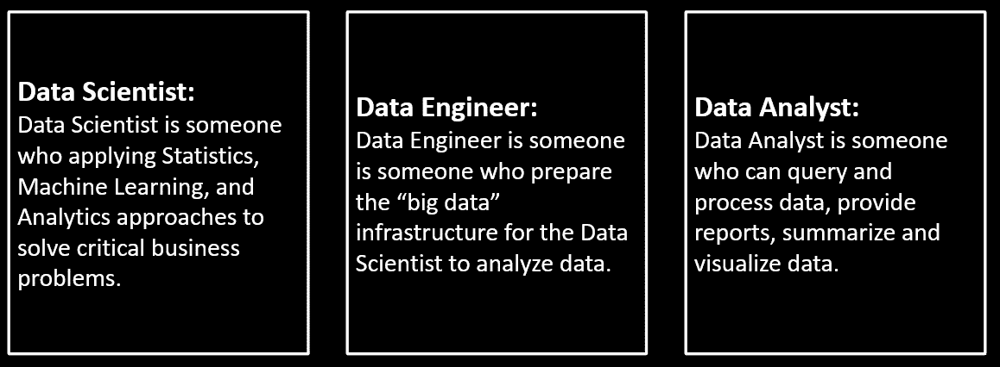
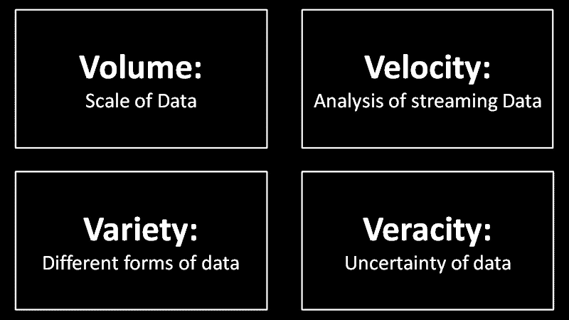
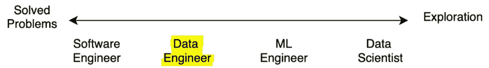

# 成为数据工程师之前你需要知道的。(职业建议)

> 原文：<https://blog.devgenius.io/what-you-need-to-know-before-you-become-a-data-engineer-career-advise-503b95e7a3cf?source=collection_archive---------0----------------------->

克里斯托夫·高尔在 [Unsplash](https://unsplash.com/s/photos/coding?utm_source=unsplash&utm_medium=referral&utm_content=creditCopyText) 上拍摄的照片

在 21 世纪，我们听到或读到的所有热门词汇都围绕着数据，无论是数据科学家、数据分析师、数据工程师、人工智能还是人工智能。在我们选择围绕这些领域的职业之前，我们需要了解这些领域之间的差异。

在这篇文章中，我不会只告诉你不同之处，但我也会解释什么时候和为什么你应该选择数据工程师作为你的职业选择。

> PS:有许多文章与数据科学相关，所以我不会深入探讨。在这里，我将只关注数据工程。

# 数据科学家 vs 数据工程师 vs 数据分析师:

这场辩论到此为止。让我们一劳永逸地结束这一切。

根据上面的定义，我们可以看到数据科学家**解决业务问题，**数据工程师**为数据科学家准备大数据基础设施**，数据分析师**查询和处理数据**并以可展示的方式呈现。这些是主要的角色，但不限于此，这三个专业人员作为他们工作角色的一部分。

# 谁是数据工程师，他们做什么？

数据工程师基本上是软件工程师，他们设计、构建软件基础架构，帮助集成来自各种来源的数据并管理大数据。数据工程师是所有大数据软件应用的骨干。数据工程师必须确保大数据基础架构正常运行。

## 什么是大数据基础设施？

大数据基础架构是数据工程师必须设计、构建和管理的东西。这是为确保大数据得到完美处理而构建的基础架构。它包括数据库/数据仓库模式、软件架构、其连接性以及解释数据如何从一个组件流向另一个组件的设计，即序列图。基础架构包括但不限于上面提到的所有内容。

## **4 伏电压:**

如果你想以数据工程师的身份开始你的职业生涯，你应该知道大数据意味着什么，没有 4 V 就不可能定义大数据。

大数据的 4 V

要了解什么是大数据，我们需要了解这些 4 V。

**体积**意味着数据的大小很大，这是显而易见的，因为当我们想到大数据时，我们脑海中想到的是真正大的东西。

**速度**是指特定方向上的速度，在大数据的环境中，它意味着数据(除了大小较大之外)以很快的速度传播，我们必须对从一个端点快速传播到另一个端点的实时数据进行分析，例如快速交易数据或来自飞机传感器的数据，以便根据数据输入做出实时快速决策。

**多样性**意味着数据可以有多种格式，比如结构化、非结构化、JSON 格式或 XML 格式、表结构或键值对。因为数据可能来自多个设备和多个传感器(例如在物联网的情况下)。

**准确性**是指数据是否正确。并非所有的数据都是正确或可信的。它指的是数据的噪声、偏差和异常。我们必须努力将不准确的数据排除在系统之外，以便对这些数据进行准确和公正的分析。

## **对数据工程师意味着什么？**

对于数据工程师来说，理解 4 V 非常重要，因为当这些 4 V 相加时，加起来就是第 5v，即**值**。

> 数量+速度+多样性+准确性=价值

数据工程师的目标应该是构建一个大数据基础架构，满足所有这些 4v 的需求，并从这些数据中提取出**价值**。基础设施应适应数据的大小、速度和不同格式，并应确保数据尽可能准确。

## 数据工程师是如何构建这种大数据基础设施的？

到目前为止，我们已经了解了大数据的 4 个 v，还了解到数据工程师必须构建大数据基础架构来满足 4 个 v，以便为组织或终端用户从数据中提取价值。

问题是他们如何构建它，以及数据工程师需要知道什么来构建这种基础设施。我们上面提到过，数据工程师首先是软件工程师，因此在成为数据工程师之前，他们需要了解编程和围绕编程的一切。

1.  **软件编程:**软件工程师的主要工作角色是编码或者至少知道如何编码。数据工程师可以用他们最喜欢的支持或处理大数据的语言编写代码。像 R、Ruby 和 Python 这样的编程语言是为定制大数据项目而构建的。传统的编程语言比如 Java，C#/。NET 和 JavaScript 之类的工具现在也支持大数据的实现，你可以使用它们定制的框架和库。
2.  **软件架构:**数据工程师必须了解行业中使用的软件架构的基本类型，如 MVC、MVP、客户机-服务器、从-主、微服务架构等。他们应该知道软件设计模式的基础，它们是什么，它的目的是什么。了解这些将有助于他们设计合适的大数据基础架构。他们还应该知道软件设计原则和 UML 图，如消息流和序列图，以帮助他们理解正在考虑的数据的生命周期。
3.  **API 和软件集成:**大数据是从不同来源收集的，并且使用了多种消息格式，因此对 API(如 SOAP 和 REST)的理解对于数据工程师理解大数据基础架构中的不同组件需要如何连接非常重要，如果需要，数据工程师应该知道如何将消息从一种格式转换为另一种格式，并通过与消息定义进行比较来检查消息的有效性。

# 结论:

在这篇文章中，我们学习了在考虑开始数据工程师职业生涯之前你需要知道的事情。首先，数据工程师不等于数据科学家。它是一个介于软件工程师和数据科学家之间的专业领域。数据工程师在设计、构建和管理大数据基础架构方面发挥着至关重要的作用。数据工程师应该了解大数据的基础知识，这意味着 4 V，并且应该理解数据科学项目的主要动机是从考虑的数据中提取价值。此外，从软件工程师的角度来看，数据工程师需要做编程或至少知道如何写代码。他们还应该知道软件架构、软件设计、API 和软件集成。**动机应该是构建基于大数据软件的基础设施，这将有助于满足大数据的 4 V 需求，并从中提取价值。**

因此，如果你认为自己擅长(或有兴趣)软件工程师和软件架构师，了解软件应用的设计方面，并且对大数据感兴趣，希望在设计、构建和管理大数据软件应用的团队中工作，那么数据工程师是一个适合你的领域。你仍然可以做与数据工程师相关的工作，但是你的职称是软件工程师或应用程序开发人员，你永远不会知道，这真的不重要。

> 归根结底，职位头衔并不重要，重要的是你在项目中做出了什么贡献，以及你从项目中学到了什么。

希望这篇文章能帮助你为自己做出更好的职业选择。

快乐学习！！！！