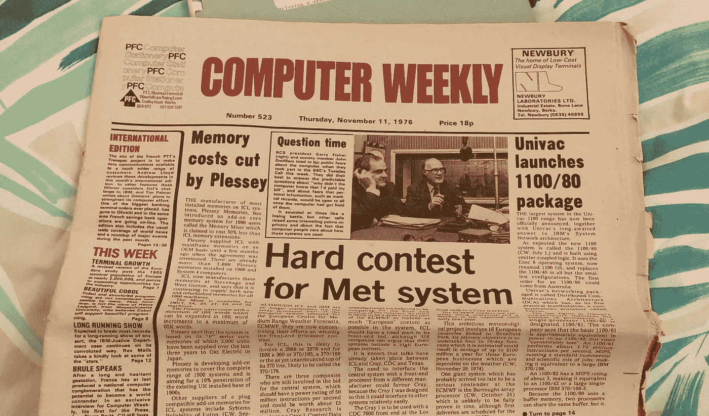
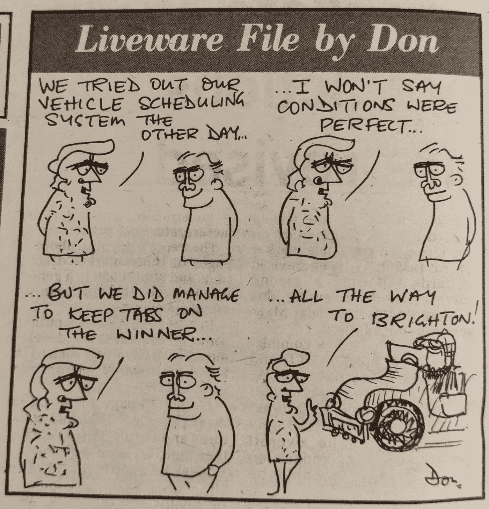

# 1976 年的计算机报纸是什么样的？

> 原文：<https://blog.devgenius.io/whats-a-computing-newspaper-from-1976-like-6885e642a270?source=collection_archive---------4----------------------->

## 40 年改变了多少？

我父亲的一个顾客最近给了他一本 1976 年的《计算机周刊》。他知道我正在攻读计算机学位，认为我可能会对 40 多年前的这个领域感兴趣。一些挖掘显示《计算机周刊》是一份从 1966 年到 2011 年的印刷报纸。它对任何使用计算机的人都是免费的，也在少数商店出售。

1979 年 11 月 11 日的头条新闻是关于 IBM 和 ICL(国际计算机有限公司)竞争为欧洲天气预报系统提供处理器。看到不包括英特尔或 ARM 名字的竞争处理器的讨论是很奇怪的。报纸上充斥着熟悉的公司名称，如 IBM，还有许多竞争对手，这些竞争对手已不复存在，并已变得默默无闻。

这篇第一篇文章开创了一种趋势，这种趋势被论文的其余部分所遵循。每次提到一个数字都很可笑。性能极其糟糕的处理器(以今天的标准来看)被宣传为价格过高。报纸本身卖了 18 便士！最令人惊讶的数字出现在报纸后面的就业部分。作为一名程序员，我能一年挣 5000 英镑就算幸运了。

内页有一种“编辑来信”，其内容至今仍有意义。他谈到将计算作为一种职业，呼吁像希波克拉底誓言那样的程序员道德准则。编辑警告我们，使用电脑的坏演员会给我们带来不好的影响。他还提出了一个关键的区别，即在 1976 年，计算机被科学家和大公司的管理人员使用，这些用户不是“计算机专业人员”。他正确地预言，在未来，更多的角色将会涉及到计算机的使用。

报纸上有一幅漫画，但我似乎想不出这是什么笑话。我把它加在这里，这样你也可以迷惑它。

“程序员视角”部分包括了对试图模仿英语的编程语言的价值的讨论。人们公认计算机不能被自然语言控制(以 Alexa 为例),但关于在编程中尽可能接近英语是否值得还有一些争论。

读者的问题集中在隐私方面。一个写信进来的人害怕，在他们的电脑上添加信息，会被全世界分享。作者礼貌地一笑，消除了这些恐惧；不幸的是，他们今天不会如此不屑一顾。

今天，有些技术似乎已经过时了。计算机本身从笨重到巨大都有，我至少看到过一个招聘“穿孔卡操作员”的广告。一篇文章宣布了一个磁带存储设施的开放，由于缺乏互联网，磁带可以通过信使自行车送到你的办公室。

一个特别大的计算机系统的广告

该报有时确实反映了其历史背景。照片中的人大多是男性，而且都是白人。一些文章提到了日益增长的“日本挑战”，还有一些文章提到了苏联和世界各地的共产党。一篇文章详细描述了一桩丑闻，起因是法国共产党人被发现利用公共资助者的计算机技术制作党的宣传材料。

看报纸，有些事情我很高兴已经改变了，但有些事情我希望没有改变。更小的计算机、更具包容性的工作空间以及冷战的结束都是受欢迎的，但我希望现代计算能够更多地致力于将计算确立为一种受编辑尊重的道德职业。