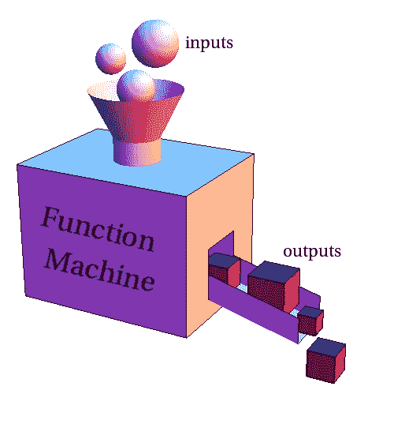
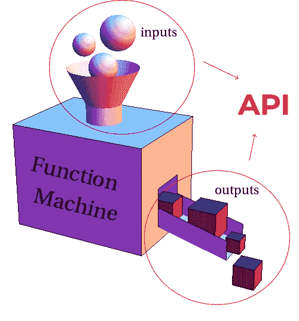

# 什么是 API？

> 原文：<https://blog.devgenius.io/whats-an-api-e385e8fa78d8?source=collection_archive---------26----------------------->

# 介绍

我发现软件行业的人经常使用“API”这个术语。而且坦白说，我编程 1 年半都没看懂。这真的很令人沮丧，尤其是因为它被广泛使用！

但是最近，天空变亮了，我有了动力去更深入地理解它的真正含义，并试图向你解释它。

API 代表“应用程序编程接口”。

嗯，这很明显。API 是一个接口，程序员可以通过它与应用程序交互，也就是一段代码(当然或大或小)。

这似乎是显而易见的，对不对？Huuuurrrgh…如果你正在读这篇文章，可能不会。所以我会用一些形象化的东西来解释我是怎么想的，然后给你一些例子。

# 形象化

就我个人而言，我认为 API 是一个接受输入并返回输出的函数。

我把它想象成一个不透明的盒子，顶部有一个洞，我们在那里提供输入，在输出返回的一侧有一个出口。

事实上，一个简单的函数公开了一个 API。在这种情况下，它是输入和输出。

就像功能机的人对你说:

> *嘿！我可以创建四个立方体。如果你想要他们，你需要给我三个球体。*

你不知道这家伙是怎么把三个球体做成四个立方体的，但你不在乎！这里唯一重要的事情是知道这个函数做什么(输出)以及你应该提供什么来使它工作(输入)。

# 函数的 API

一个简单的代码示例可能更具体:

[https://gist.github.com/5c987bb116afdad8d19d342f21bb64d4](https://gist.github.com/5c987bb116afdad8d19d342f21bb64d4)

这个代码块是用 TypeScript 编写的，TypeScript 是 JavaScript 的超集。我用它来明确函数需要的输入类型和它给出的输出。

我们可以看到，如果你给它两个数，`sum`承诺返回一个和。非常简单，对吗？

就像我之前说过的，函数如何求和的内部原理并不重要。也就是说，我们可以隐藏花括号之间的代码，但仍然使用`sum`。

让我们看一个使用`multiply`的例子，不知道它的实现，只知道它的 API。

[https://gist.github.com/f1a1a1fce516c8e33462627b1e80ff10](https://gist.github.com/f1a1a1fce516c8e33462627b1e80ff10)

你看到了吗？我们在不知道其实现的情况下使用了`multiply`！

好吧，你并不笨…你肯定已经猜到函数内部的代码是这样的:

[https://gist.github.com/8445d45bc6eb6b693bf5c8d6a02989f9](https://gist.github.com/8445d45bc6eb6b693bf5c8d6a02989f9)

…但是你明白了。

对于大而复杂的函数，你不知道它们的内部，但是你可以使用它们。我们会看到更复杂的例子。

# 库的 API

使用术语 API 的一个例子是当你处理一个库的时候。为了说明这一点，我们来看一个流行的 JavaScript:React。该库公开了一个全局对象作为名为`React`的入口点。

这个对象有几个 API，也就是几个方法，如果我们提供了预期的输入，这些方法就会产生输出。

看起来是这样的:

[https://gist.github.com/054269970294923e905f7ee746650493](https://gist.github.com/054269970294923e905f7ee746650493)

让我们使用其中的一个:useState。

根据 useState 的 [API 文档](https://reactjs.org/docs/hooks-reference.html#usestate)，它返回一个有状态值和一个更新它的函数，一起放在一个数组中。作为输入，它有一个参数，即初始状态。

例如:

[https://gist.github.com/b42a8737b351164fc8039ec24221fe99](https://gist.github.com/b42a8737b351164fc8039ec24221fe99)

我们可以使用一个叫做“数组析构”的 JS 特性，直接将`useState`返回的数组值赋给它们各自的变量:

[https://gist.github.com/d611280c870ef6bef2c3a72a3c446225](https://gist.github.com/d611280c870ef6bef2c3a72a3c446225)

现在我们可以使用`setState`来更新我们想要的状态:

[https://gist.github.com/696a8f9bd496da5eedaea2b5fa2638dd](https://gist.github.com/696a8f9bd496da5eedaea2b5fa2638dd)

所以我前面说了，我们对`useState`的内码一无所知。但是因为我们知道它的 API 规范，我们可以使用它提供的功能。

(注意:关于这个方法有更多的考虑和可能性，但是解释它们不是这篇文章的目的。)

# 第三方服务的 API

最后，我想展示另一个使用 API 的例子，一个隐含着第三方服务的例子(比如 Twitter、Youtube、Google Maps……)。

在我们的例子中，我们将使用 OpenWeather。这是一个收集世界各地天气数据的平台，并公开了一个 API，我们可以通过它请求这些数据。

这里，我们需要发出一个特定的 HTTP 请求来获取我们想要的数据。文档[说我们必须做一个`api.openweathermap.org/data/2.5/weather?q={city name}&appid={your api key}`形式的调用。](https://openweathermap.org/current)

让我们这样做:

[https://gist.github.com/87007e3e035dc691503db0c0959ae922](https://gist.github.com/87007e3e035dc691503db0c0959ae922)

很简单！

现在，我们可以在应用程序中使用数据，而不必担心如何获取数据、如何格式化数据等。

事实上，这比我们自己测量所有的东西来创建数据要简单得多，花费也少得多。

(事实上，我假设 OpenWeather 本身依赖于其他服务和 API 来获取所有天气数据。)

# API 的力量

API 是抽象的构建块。

它们允许模块化编程，即在我们自己的代码库中利用外部代码块(所谓的“模块”)的功能的能力。

在最底层的抽象中，只有 0 和 1。因此，程序员在上面添加了多层抽象，以便专注于真正重要的东西，从而更有效地工作。

今天，每个程序都依赖于某种抽象，这就是它们变得越来越强大原因。因为否则，一个人的大脑将无法跟上计算机在一天结束时消耗的所有 0 和 1。

# 结论

就是这样！

我希望这篇文章能帮助你理解这个术语。

如果你对某事有任何意见或建议，请随意分享。我真的很感激。

我渴望加深对那个主题的理解。