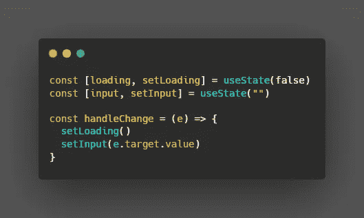

# React 18 有什么新功能？

> 原文：<https://blog.devgenius.io/whats-new-in-react-18-3cbfdf83dc5a?source=collection_archive---------4----------------------->

在本快速指南中，您将了解 React latests 版本中最相关的可用功能。

# 索引

*   怎么升级？
*   并发反应
*   新功能
*   结论

# 怎么升级？

为了将您当前的 React 项目迁移到最新版本，您需要遵循以下步骤

1.  `npm install react react-dom`。
2.  更改 ReactDOM.render 方法

现在，React 使用不同的 API 来呈现我们的应用程序。

在 React 17.0.0 中

使用 ReactDOM.render 方法

从 React 18.0.0 开始

使用 ReactDOM.createRoot 方法

# 并发反应

React 中的呈现引擎的工作方式类似于 JavaScript 中的异步。一旦更新开始渲染，没有什么可以阻止它，直到它完成。用户界面一次只能有一个变化。

然而，从 React 18 开始，情况就不完全是这样了。更新可以中途暂停，稍后继续。即使 React 也可以放弃正在进行的更新。这被称为**并发反应**，这一特性带来了性能和 UX 方面的许多改进。我们将在本文中讨论的改进。

# 新功能

## 自动配料

一些复杂的组件中有多个“使用状态”挂钩是很常见的。在有不止一个 **set** 语句的处理程序中结束，就像这样。

一个处理程序中的几个 **set** 语句称为一个*批处理*。问题是上面的组件将被重新渲染两次。一次在`setLoading`，另一次在`setInput`。

从 18 版本开始，React 了解何时有一个*批次*，并执行所有的 **set** 语句，以便以后只重新渲染组件一次。

主要优点是:这是自动发生的，我们不需要做任何事情。最后，性能显著提高。

## 过渡

转变是指状态的变化。例如，从`loading=true`到`loading=false`的过渡。

然而，在处理 UI 时，有些转换比其他转换更重要。

例如，在一个搜索栏中，每次你输入的时候，都会有一个关于你输入内容的视觉反馈，但同时，有一个进程在后台运行，试图从用户输入中找出一些匹配。

在最坏的情况下，由于其他进程同时运行，视觉反馈变得更慢，最终导致糟糕的用户体验。在这种特殊情况下，搜索过程没有视觉反馈重要。

这就是`startTransition`发挥作用的地方。一个新特性，当状态变化不紧急时，告诉显式地作出反应。

所有封装在`startTransition`中的转换都处于较低的优先级，因此可以暂停，以优先考虑该功能之外的转换。只要他们同时表演。

## 服务器上的悬念

在解释服务器特性的*悬念意味着什么之前，让我们快速回顾一下客户端和服务器端渲染的区别。*

一个基于客户端的应用程序将从服务器加载 html 以及使我们的应用程序交互所需的所有 JavaScript。如果我们的 app 是一个简单的“hello world”，就足够快了。然而，通常我们的应用程序是巨大的，这个过程可能需要一段时间，最终导致糟糕的用户体验。

基于服务器端的应用部分解决了这个问题。因为你从服务器获得 HTML，准备好显示在屏幕上，JavaScript 代码被加载，使我们的应用程序交互。

主要的优势是我们的用户界面在较短的时间内是空白的，这极大地改善了用户体验。

现在，想象你正处于 *Load JS* 阶段。你需要 3 个 API 来丰富你的用户界面。其中两个返回数据非常快，但最后一个需要太长时间才能解决。最后一个 API 延迟了整个页面。

您可以将这个场景想象为 Promise.all API。当所有的承诺都被解决时，就是它返回数据的时候。这就是它的工作原理。

现在，让我们想象慢速 API 负责在我们的应用程序中加载评论。在 React 18 之前，我们会等到所有这些 API 都解决了，但是有了悬念，我们现在可以包装组件以避免瓶颈，并且我们可以选择传递一个加载器作为后备。

通过这种方式，用户可以在注释(在本例中)等待解决时看到所有其他数据。

# 结论

React 18 为即将到来的版本和专注于用户体验和性能的功能奠定了基础。

因此，您必须开始在您的实际项目中实现它。它应该不会超过一个晚上，你会开始抓住这个主要版本的所有新的好处。