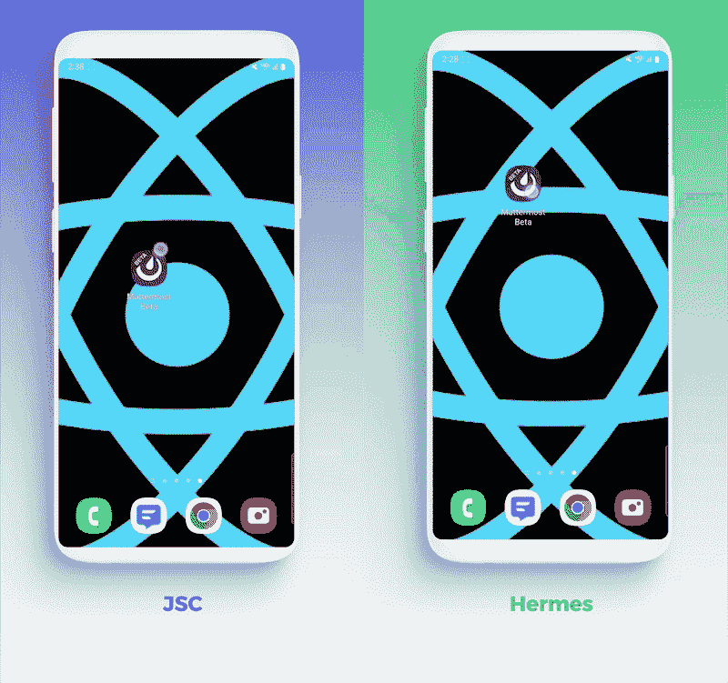

# React Native 0.70 的新增功能—如何升级以及为什么它很重要

> 原文：<https://blog.devgenius.io/whats-new-in-react-native-0-70-how-to-upgrade-and-why-it-matters-67aa35d75e37?source=collection_archive---------1----------------------->

## React Native 0.70 刚刚登陆——这是它的新特性，以及它的重要性

React Native 的最新版本 0.70 进行了大量改进，并继续推出了[新的 React Native 架构](https://reactnative.dev/docs/the-new-architecture/landing-page)。让我们深入了解一下新特性，更重要的是，为什么它如此重要。

由[菲利·桑蒂兰](https://unsplash.com/@filisantillan)在 Unsplash 上拍摄的照片

# 新特性:默认的 Hermes JavaScript 引擎

Hermes 是一个针对 React Native 优化的高性能 JavaScript 引擎。虽然它已经推出了一段时间，但它最初是一个插件，在构建 React 本机应用程序时必须单独安装和配置。从 React Native 0.69 开始，Hermes 与 React Native 捆绑在一起，更容易与框架的其他部分保持同步，也更容易启用和使用。

从当前版本 0.70 开始，Hermes 是默认的 JavaScript 引擎，这意味着创建新项目时不需要单独安装或配置。

使用和不使用 Hermes 引擎的 Android 发布时间。

## 为什么它很重要

Hermes 引擎在每个平台上提供了比默认 JavaScript 引擎更好的性能和内存使用。因为它以前需要单独配置和安装，所以许多应用程序没有利用该引擎。

因此，虽然它已经存在了一段时间，0.70 版本将在实践中通过默认启用 Hermes 来提供一个主要的性能提升。如果你有一个现有的应用程序，但还没有启用 Hermes，那么努力启用 Hermes 并获得性能优势是绝对值得的。

请参见公告上的[博客，了解更多详细信息，包括显示 Hermes 实现的显著性能提升的基准测试。](https://reactnative.dev/blog/2022/07/08/hermes-as-the-default)

# 新特性:构建改进和跨平台一致性

0.70 中的新特性还有几个改进，改进了 React 本地构建和开发过程，尤其是在处理新架构时。

*   新架构库的 Android 自动链接

自动链接是 React 本地开发过程的一个重要部分。它允许我们使用像`yarn`或`npm`这样的包管理器，通过 JavaScript 模块将本地代码合并到项目中。在此版本之前，新的架构库需要在 Android 上手动链接，但从 0.70 开始，iOS 和 Android 都完全支持自动链接。

*   对 Android 版本的全面 CMake 支持

新版本支持对 Android 构建的完全 CMake 支持，而不是依赖于不太常见的 NDK 构建系统。这意味着更好的支持，更小的配置文件(使它们更容易维护和升级)，以及与更成熟的 CMake 生态系统集成。

*   Codegen[T3 的新统一配置](https://reactnative.dev/blog/2022/09/05/version-070#a-new-unified-configuration-for-codegen)

库开发人员在 JavaScript 和本机代码之间构建绑定时，最感兴趣的就是这种变化。 [Codegen](https://reactnative.dev/docs/next/the-new-architecture/pillars-codegen) 在 React Native 中使用，根据 JavaScript 编写的规范自动生成本机代码绑定。在当前版本之前，Codegen 要求 iOS 和 Android 分别配置，但从 0.70 开始，配置已经统一，简化了与原生代码集成的过程。

## 为什么它很重要

所有这些变化都对开发人员的工作流程做出了重要的改进，尤其是在构建 Android 应用程序方面。最重要的是，它增加了 iOS 和 Android 构建和开发流程之间的一致性，有助于实现 React Native 作为无缝跨平台开发平台的真正承诺。

# 如何升级

升级 React Native *可能*有点棘手，因为有时需要在许多位置进行更改，例如，在 Android 和 iOS 构建文件夹中。升级 React 原生项目的最佳方式是始终使用 [React 原生升级助手](https://react-native-community.github.io/upgrade-helper)，它显示当前版本和目标版本之间的确切文件差异。

此外，一定要查看文档，特别是关于迁移到新架构的文档。随着每个 RN 版本的发布，使用新的架构变得越来越容易，但是了解这些变化以及它们如何影响您的特定应用程序仍然是很好的。

# 重述—新 React 原生架构的重要更新

虽然 React Native 0.70 中没有很多引人注目的新终端用户功能，但最重要的主题是改进对 React Native 的[新架构](https://reactnative.dev/docs/new-architecture-intro)的支持。新的架构已经酝酿了很长时间，并在几个 React 原生版本中逐步推出。令人兴奋的是看到越来越多的新版本默认启用它！

就我个人而言，我发现新的架构工作令人着迷，令人印象深刻，尤其是作为对针对旧版本 React Native 的一些性能批评的回应。React 本地团队已经在新的架构中正面解决了这些问题。这给了我作为开发人员的信心，RN 仍然是 2022 年跨平台开发的一个很好的选择，即使出现了新的替代方案。

关于 0.70 新特性的完整列表，请参见 React Native 博客上的[官方发布公告](https://reactnative.dev/blog/2022/09/05/version-070)。

[*乔纳森*](https://blog.devgenius.io/@jonnystartup) *在创业公司大&小有超过 20 年的工程领导经验。如果你喜欢这篇文章，* [*请考虑给乔纳森留个提示*](https://www.buymeacoffee.com/jonnystartup) *！*