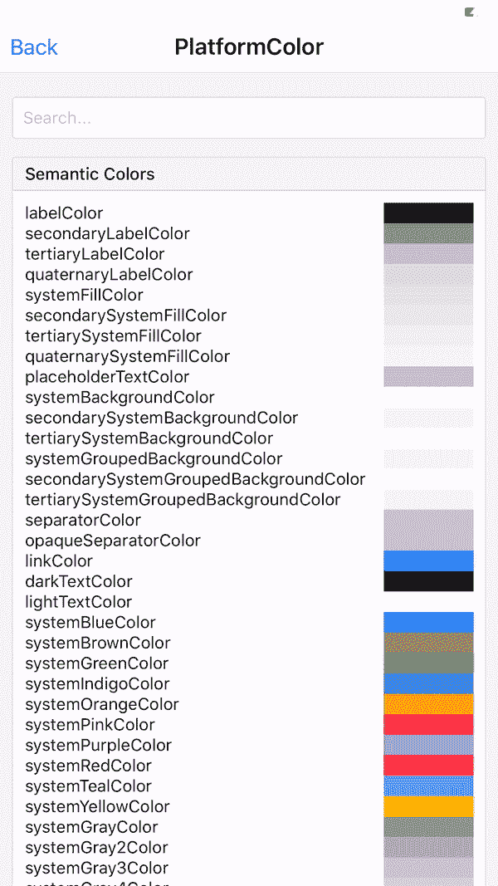
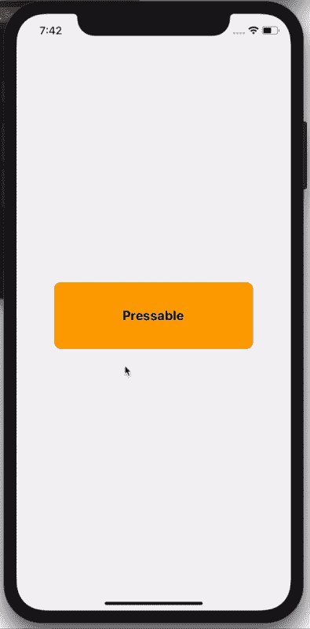

# React Native v 0.63 的新特性

> 原文：<https://blog.devgenius.io/whats-new-in-react-native-v-0-63-b53f353798fc?source=collection_archive---------23----------------------->

React native v0.63 为我们带来了三个真正令人兴奋的新功能，这三个功能将真正为开发者提供帮助。


**自然色彩(PlatformColor，DynamicColorIOS)**

现在在你的应用程序中支持黑暗模式变得非常简单，这里有两个新的 API 可以帮助开发者毫不费力地选择正确的颜色。

**PlatformColors:** 允许用户在应用程序中使用设备原生颜色，例如 iOS 或 Android。

**DynamicColorIOS:** 允许用户根据设备的外观模式配置颜色，例如深色或浅色。

您可以单独使用这两种 API，也可以两者都使用，如下所示。

```
<View
  style={{
    backgroundColor: DynamicColorIOS({
      light: PlatformColor("systemBlueColor"),
      dark: PlatformColor("systemRedColor"),
    }),
  }}
/>
```



你可以进一步了解这个组件[https://reactnative.dev/docs/dynamiccolorios](https://reactnative.dev/docs/dynamiccolorios)&[https://reactnative.dev/docs/platformcolor](https://reactnative.dev/docs/platformcolor)

**可按下**

这是我认为非常有用的第二个重要特性，可按压可以用来代替可触摸组件，例如可触摸不透明，可触摸无反馈等。

所有可触摸组件都提供视觉反馈，但缺乏设备原生体验，因为它们有自己的内置风格；因此，现有的可触摸组件的体验并不取决于平台。

还可按下保持组件的状态；所以你不必在外部维护它

```
<Pressable
  style={({ pressed }) => [
    {
      opacity: pressed ? 0.5 : 1,
      backgroundColor: pressed ? "red" : "orange",
    },
    styles.button,
    ,
  ]}
>
  <Text style={styles.buttonText}>Pressable</Text>
</Pressable>
```



你可以进一步了解这个组件[https://reactnative.dev/docs/pressable](https://reactnative.dev/docs/pressable)

**日志框**


顾名思义 LogBox 该功能将简化 react 本机应用程序的调试。该功能是从头开始设计的。观看此视频了解更多详情

# 有问题吗？

如有疑问，欢迎在下方评论，**。**

如果你喜欢这篇文章，请分享给你的朋友，并给我留下评论。此外，单击👏拍拍下面的按钮，表示你有多喜欢这篇文章。

感谢阅读！👨🏼‍💻

**来源:**

[](https://reactnative.dev/blog/2020/07/06/version-0.63) [## 宣布使用 LogBox React Native 发布 React Native 0.63

### 今天我们发布了 React Native 0.63，默认情况下它会打开 LogBox。我们经常听到来自…的反馈

反应性发展](https://reactnative.dev/blog/2020/07/06/version-0.63) [](https://github.com/facebook/react-native/releases) [## 发布 facebook/react-native

### 今天就创建您的免费 GitHub 帐户，订阅这个新版本库，并与 50…

github.com](https://github.com/facebook/react-native/releases) [](https://reactnativejobs.com/blog/react-native-pressable-platformcolor-dynamiccolor/) [## React 原生 0.63 预览-可压、平台颜色和动态颜色

### React Native 0.63 RC0 今天上午发布，它引入了去年宣布的新的可压组件…

reactnativejobs.com](https://reactnativejobs.com/blog/react-native-pressable-platformcolor-dynamiccolor/) 

# 您可以在以下网址找到我:

[Linkedin](https://www.linkedin.com/in/vishalsjadhav/)|[Twitter](https://twitter.com/vishaljadhav)|[insta gram](https://www.instagram.com/vishaljadhav.me/)