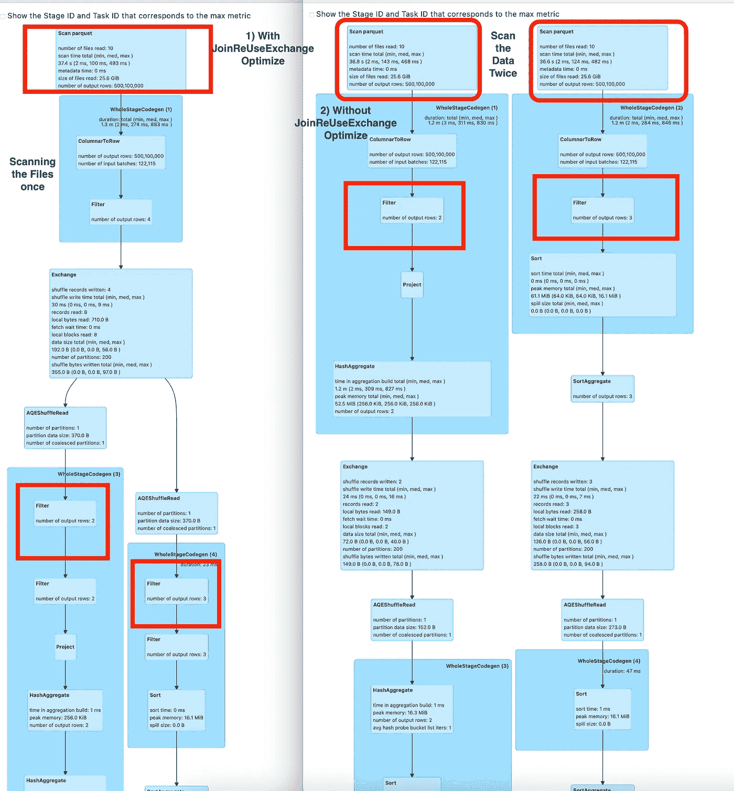

# Spark-Radiant 1.0.4 有什么新功能？

> 原文：<https://blog.devgenius.io/whats-new-in-spark-radiant-1-0-4-e8190c1370d3?source=collection_archive---------10----------------------->

[**Spark-Radiant**](https://github.com/SaurabhChawla100/spark-radiant) 是阿帕奇 Spark 性能和成本优化器。spark-Radiant 产品将有助于优化性能和成本，考虑催化剂优化规则、Spark 中增强的自动缩放、收集与 Spark 作业相关的重要指标、Spark 中的 BloomFilter 指数等。

我在[之前的博客](https://saurabhchawla100.medium.com/spark-radiant-is-now-available-13914e35a61f)中介绍了 Spark Radiant 这个项目。Spark-Radiant 1.0.4 现已推出，随时可用。Spark-Radiant 1.0.4 的依赖关系在 [maven central](https://mvnrepository.com/artifact/io.github.saurabhchawla100/spark-radiant-sql/1.0.4) 中可用。在这篇博客中，我将讨论 Spark-Radiant 1.0.4 的可用性，以及作为该版本的一部分添加的新功能。

> ***如何使用***[***Spark-Radiant-1.0？***](https://github.com/SaurabhChawla100/spark-radiant) ***4 用星火就业？***

对于 maven 项目，在 pom.xml 中使用下面的依赖关系

[**火花-辐射-sql**](https://mvnrepository.com/artifact/io.github.saurabhchawla100/spark-radiant-sql/1.0.4)

 <dependency><groupId>io . github . saurabhchawla 100</groupId>
<artifactId>spark-radiant-SQL</artifactId>
<版本>1 . 0 . 4</版本>
</依赖关系></dependency>

[**火花辐射核心**](https://mvnrepository.com/artifact/io.github.saurabhchawla100/spark-radiant-core/1.0.4)

 <dependency><groupId>io . github . saurabhchawla 100</groupId>
<artifactId>spark-radiant-core</artifactId>
<版本>1 . 0 . 4</版本>
</依赖></dependency>

> ***先决条件*** *a)Spark-3.0 . x 和 Spark 的更新版本支持 Spark-Radiant
> b)支持 Scala 版本 2.12 . x .
> c)Spark-1 . 0 . 4 提供 Scala、Pyspark、Java、spark-sql 支持*

# 用火花辐射器运行火花作业

运行 spark 作业时，在运行时使用 maven central 发布的 spark-radiant-sql-1.0.4.jar、spark-radiant-core-1.0.4.jar

```
./bin/spark-shell --packages "io.github.saurabhchawla100:spark-radiant-sql:1.0.4,io.github.saurabhchawla100:spark-radiant-core:1.0.4"./bin/spark-submit 
 --packages "io.github.saurabhchawla100:spark-radiant-sql:1.0.4,io.github.saurabhchawla100:spark-radiant-core:1.0.4"
 --class com.test.spark.examples.SparkTestDF /spark/examples/target/scala-2.12/jars/spark-test_2.12-3.2.0.jar
```

# Spark-Radiant 1.0.4 发行说明

a) **对 Spark 3.2 的支持:** Spark-Radiant 1.0.4 拥有 Apache Spark 的默认版本 Spark-3.2.1。发布的 maven jar 依赖于 spark-3.2.1。用于搭配 spark-radiant 使用较低版本的 spark(3.1.x)。需要使用 spark 3.1.x 构建 spark-radiant。spark 3.1 的配置文件已经得到支持。

使用下面的命令构建 spark-3.1.x

`mvn clean install -DskipTests -Pspark31 / mvn clean package -DskipTests -Pspark31`

b) **度量收集器的改进:**spark-radiant 1 . 0 . 4 的度量收集器中增加了一些新功能和改进。

1.  添加对为执行者能力提供计算建议的支持。
2.  为阶段级别指标提供作业 ID 信息。
3.  用户还可以通过扩展 org . Apache . spark . Publish metrics 接口并覆盖 publishStageLevelMetrics 方法，由他们自己的自定义 Publisher 类发布指标。SamplePublishMetrics 类已经添加到项目中以供参考，在运行 spark 应用程序时，需要在此配置中提供自定义发布类名。`--conf spark.radiant.metrics.publishClassName=com.spark.radiant.core.SamplePublishMetrics`

```
*****Stage Info Metrics*****
    ***** Stage Info Metrics Stage Id:0 *****
    {
    "Job Id":"0",
    "Stage Id":"0",
    "Final Stage Status":"succeeded",
    "Number of Task":"10",
    "Total Executors ran to complete all Task":"2",
    "Stage Completion Time":"858 ms",
    "Stage Completion Time Recommendation":"With 2x executors(4), time to complete stage 366 ms.
     With 4x executors(8), time to complete stage 183 ms.",
    "Average Task Completion Time":"139 ms"
    "Number of Task Failed in this Stage":"0"
    "Few Skew task info in Stage":"Skew task in not present in this stage"
    "Few Failed task info in Stage":"Failed task in not present in this stage"
    }
```

c)**joinreueseexchangeoptimizer ule:**joinreueseexchangeoptimizer ule 适用于相同表之间存在连接并且多次扫描表的情况。应用此规则后，文件扫描将进行一次。请参照星火计划执行



图 1 JoinReuseExchangeOptimizeRule

```
This feature is enabled using `--conf spark.sql.optimize.join.reuse.exchange.rule=true`
   There is need to add this conf for adding this rule in Sql Extension
   `--conf spark.sql.extensions=com.spark.radiant.sql.api.SparkRadiantSqlExtension`

   spark.sql("""select * from
   (select col_1, count(col_1) count from table1 where col_2 in ('value0', 'value09') group by col_1) a,
   (select col_1, max(col_2) max from table1 where col_2 in ('value0', 'value1', 'value119') group by col_1) b where a.col_1=b.col_1""")```
```

对于这个查询，JoinReuseExchangeOptimizeRule 比常规的 Spark Join 快 2 倍。

d) **改进** [**基于尺寸的连接重新排序**](https://github.com/SaurabhChawla100/spark-radiant/blob/master/docs/SizeBasedJoinOrderingRerInSpark.md)

1.  在两个排序合并连接之间增加了对基于大小的连接重新排序的支持。较小的表排序合并联接在较大的表排序合并联接之前执行。
2.  spark . sql . support . SBO . smj—Config 添加对 SQL 查询的 SizeBasedJoinReOrdering 的支持，当所有连接都不是 BHJ，只有 smj 时。默认值为 false。这将与 spark-radiant-1.0.4 一起工作。
3.  scala、pyspark、spark-sql、Java、R 使用 conf `--conf spark.sql.extensions=com.spark.radiant.sql.api.SparkRadiantSqlExtension`提供基于大小的连接重排序支持。

> **结论:**
> 
> 在这篇博客中，我讨论了如何使用[*Spark-Radiant*](https://github.com/SaurabhChawla100/spark-radiant)*1 . 0 . 4。Spark-Radiant 1.0.4 中添加的新功能，如对***joinreuseexchange optimizer、******SizeBasedJoinReOrdering****、* **指标收集器、** [**动态过滤器**](https://github.com/SaurabhChawla100/spark-radiant/blob/master/docs/dynamicFilterInSpark.md) *等的改进，将提供与性能和成本优化相关的好处。**
> 
> *在不久的将来，我们会推出新的相关博客。请继续关注此空间，了解更多信息！*