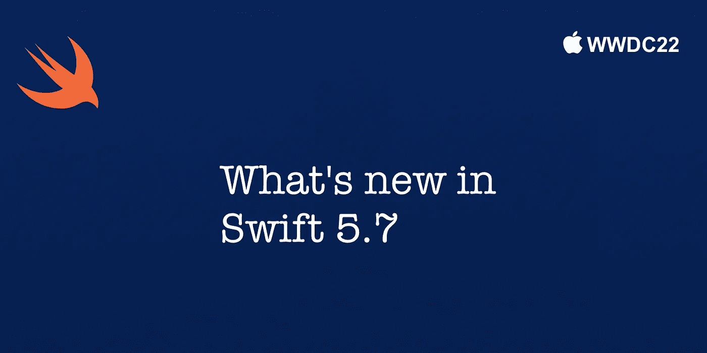

# Swift 5.7 有什么新功能？

> 原文：<https://blog.devgenius.io/whats-new-in-swift-5-7-8e3f06e93e30?source=collection_archive---------1----------------------->

## 新功能、增强和改进



Swift 5.7 提供了语言和标准库增强功能、可用性改进，并实施了一种新的通用技术，可提升性能并消除长期存在的缺陷。这一增强包括标准样板代码的一种新的速记语法，包括 **if let** 语句和多语句、闭包类型的注释。

Swift 5.7 新的 generics 实现修复了许多 bug，比如处理复杂的同类型需求，比如集合子序列关联类型，以及使用 CaseIterable 协议的代码，该协议定义了条件 Self。元素==自身。

下面我们将通过动手的例子看到一些变化。

**1。Swift 包管理器改进** [Swift 包管理器](https://www.swift.org/package-manager/)是 Swift 项目的依赖管理器，包括可以为 macOS 和 Linux 构建的构建系统。Swift 5.7，Swift 包管理器获得了令人兴奋的改进，这将帮助我们避免在项目中使用多个同名包的问题。它现在允许我们从定义模块的包外部命名模块，并添加模块别名。

**2。代码完成** 函数调用参数、变量和全局函数的代码完成现已紧密集成到 Swift 的类型检查器中。这允许代码完成在不明确的代码或有错误的代码中提供更准确的结果。

如果在下面的例子中的`+`之后完成，代码完成现在报告 **int** 和 **string** 匹配周围的上下文，允许编辑器将这些结果排在比**数组**更高的位置。

```
func makeIntOrString() **->** Int {}
func makeIntOrString() **->** String {}

let array **=** [4, 2]
let int **=** 42
let string **=** "Hello World!"
makeIntOrString() **+**
```

如果在下面的示例中完成缺少的参数，代码完成现在只建议 secondInt 参数标签并省略 secondString。

```
func add(_ firstInt: Int, secondInt: Int) {}
func add(_ firstString: String, secondString: String) {}
add(1, )
```

**3。展开可选选项的简写**([SE-0345](https://github.com/apple/swift-evolution/blob/main/proposals/0345-if-let-shorthand.md)) **Swift 5.7 引入了新的简写语法，使用 **if let** 和 **guard let 将可选选项展开到同名的隐藏变量中。****

**这种变化不会扩展到对象内部的属性，这意味着这样的代码将无法工作。**

****4。从默认表达式进行类型推断**([SE-0347](https://github.com/apple/swift-evolution/blob/main/proposals/0347-type-inference-from-default-exprs.md))Swift 扩展了使用带有通用参数类型的默认值的能力。如果我们有一个通用类型或函数，我们现在可以为默认表达式提供一个具体类型，而在以前 Swift 会抛出一个编译器错误。**

**我们也可以使用自定义序列调用该函数，或者使用默认序列。**

****5。多语句闭包类型推理**([SE-0326](https://github.com/apple/swift-evolution/blob/main/proposals/0326-extending-multi-statement-closure-inference.md))Swift 通过启用来自闭包体的参数和结果类型推理，改进了多语句闭包的推理行为。这将使类型推断对开发人员来说不那么令人惊讶，并消除了现有的行为悬崖，即在闭包中再添加一个表达式或语句可能会导致编译失败。**

```
**let** scores = [100, 80, 85]

**let** results = scores.map { score **in**
    **if** score >= 85 {
        **return** "Student score is \(score)%: Pass"
    } **else** {
        **return** "Student score is \(score)%: Fail"
    }
}
```

**在 Swift 5.7 之前，我们需要明确指定返回类型:**

```
**//** Prior to Swift 5.7 **let** results = scores.map { score -> String **in**
    **if** score >= 85 {
        **return** "Student score is \(score)%: Pass"
    } **else** {
        **return** "Student score is \(score)%: Fail"
    }
```

****6。解锁所有协议的存在性**([SE-0309](https://github.com/apple/swift-evolution/blob/main/proposals/0309-unlock-existential-types-for-all-protocols.md))Swift 5.7 大幅放宽了当协议有关联的类型需求时将协议作为类型使用的禁令。简单来说，这意味着下面的代码。**

```
**let** firstName: any Equatable = "iOS"
**let** lastName: any Equatable = 16
```

**Equatable 是一个带有 **Self** 的协议，它提供了引用采用它的特定类型的功能。**等价**协议有一个要求是这样的: **func ==(lhs: Self，rhs: Self) - > Bool** 。这意味着它将能够接受相同类型的两个实例，并告诉我们它们是否相同。实例可能是两个整数、两个字符串、两个布尔值，或者两个符合**等价**的任何其他类型。**

**在 Swift 5.7 之前，编译器不允许我们在这样的代码中使用它。**

```
**let** spaceflight: [any Equatable] = ["Apollo", 11]
```

**从 Swift 5.7 开始，这个代码*是允许的*，我们已经获得了对我们的数据进行运行时检查的能力，以准确识别我们正在处理的内容。**

```
**for** item **in** spaceflight {
    **if** **let** item = item **as**? String {
        print("Found string: \(item)")
    } **else** **if** **let** item = item **as**? Int {
        print("Found integer: \(item)")
    }
}
```

****7。结构不透明的结果类型**([SE-0328](https://github.com/apple/swift-evolution/blob/main/proposals/0328-structural-opaque-result-types.md))不透明的返回类型意味着，调用者不需要指定底层的返回类型或参数类型，调用者必须确定得到一个具体的类型。**

**SwiftUI 中的 HStack、ZStack、Group 和 List 包含了创建复杂类型结构的其他视图。不透明的结果类型对调用者非常有帮助，调用者只知道这个结构是**一些视图**。不透明的结果类型使代码在运行时更具性能。**

```
**func** makeFooterView(isIpad: Bool) -> **some** View {
    **return** VStack { 
      **if** isIpad { 
         Text("Hi It is iPad device!") 
      } **else** { 
        Text("Hi It is not iPad device?") 
        Button("Check device details", action: {})
    }
  }
}
```

**现在我们也可以一次返回多个不透明类型**

```
**func** makeHeaderView() -> (**some** Equatable, **some** Equatable)  {
     (Text("Title Text"), Text("Text"))
}
```

****8。不透明的参数声明**([SE-0341](https://github.com/apple/swift-evolution/blob/main/proposals/0341-opaque-parameters.md))不透明的结果类型`some P`表示一个未命名的类型，只有通过它的约束才能知道:它符合协议`P`。当参数类型中出现不透明类型时，它会被(未命名的)泛型参数替换。**

```
**func** isSorted(array: [**some** Comparable]) -> Bool {
    array == array.sorted()
}
```

**`**[some Comparable]**`参数类型意味着该函数使用一个数组，该数组包含一种符合`**Comparable**`协议的类型的元素，这相当于下面的通用代码:**

```
**func** isSorted<T: Comparable>(array: [T]) -> Bool {
    array == array.sorted()
}
```

****9。扩展绑定泛型类型**[**SE-0361**](https://github.com/apple/swift-evolution/blob/main/proposals/0361-bound-generic-extensions.md)扩展绑定泛型类型使用尖括号作为绑定类型参数，或者使用加糖类型，如【字符串】和`Int?`。**

```
**extension** Array where Element == String { … } 
**extension** Array<String> { … } 
**extension** [String] { … }
```

**Swift 5.7 之前的编译器产生如下错误。**

```
extension Array<String> { ... } **// error: Constrained extension must be declared on the unspecialized generic type 'Array' with constraints specified by a 'where' clause**
```

****10。Swift 中隐式打开的存在性**([SE-0352](https://github.com/apple/swift-evolution/blob/main/proposals/0352-implicit-open-existentials.md))存在性类型允许存储一个值，该值的具体类型未知，并且可能在运行时改变。那个存储值的动态类型，我们称之为存在的底层类型，只有它所符合的协议集以及它的超类才知道。虽然存在类型对于表达动态类型的值是有用的，但是由于它们的动态性质，它们必然受到限制。**

```
**func** square<T: Numeric>(**_** number: T) -> T {
    number * number
}
```

**当我们的数据符合协议时，隐式开放的存在允许函数可调用。**

```
**let** firstItem = 5
**let** secondItem = 7.0

**let** numbers: [any Numeric] = [firstItem, secondItem]

**for** number **in** numbers {
    print(double(number))
}
```

**若要打开存在，实参必须是存在类型`any P`或存在元类型`**any P.Type**`，并且必须提供给一个类型为泛型形参的形参，该形参可以直接绑定到存在的基础类型。**

****11。正则表达式文字**([SE-0354](https://github.com/apple/swift-evolution/blob/main/proposals/0354-regex-literals.md))正则表达式文字可以使用`/.../`分隔符来编写。编译器将解析 regex 文本的内容，在编译时诊断任何错误。捕获类型和标签是根据正则表达式中存在的捕获组自动推断出来的。**

```
func matchHexAssignment(_ input: String) -> (String, Int)? {
  let regex = /(?<identifier>[[:alpha:]]\w*) = (?<hex>[0-9A-F]+)/
  // regex: Regex<(Substring, identifier: Substring, hex: Substring)>

  guard let match = input.wholeMatch(of: regex), 
        let hex = Int(match.hex, radix: 16) 
  else { return nil }

  return (String(match.identifier), hex)
}
```

****12。regex builder**([SE-0351](https://github.com/apple/swift-evolution/blob/main/proposals/0351-regex-builder.md))
Swift 5.7 对字符串处理进行了重大更新，引入了 regex 文字和 [RegexBuilder](https://developer.apple.com/documentation/RegexBuilder) 库，并配有匹配方法和强类型捕获。**

```
**let** text = "I like Swift and SwiftUI"
**let** regex = /I like (?<text1>.+?) and (?<text2>.+?)/
**if** **let** likes = **try**? regex.wholeMatch(**in**: text) {
    print("Your first choice is \(likes.text1)")
    print("Your second choice is \(likes.text2)")
}
```

**使用 RegexBuilder，我们可以用 SwiftUI 风格的语言构建我们的 regex 搜索，这可以使它更具可读性，并释放更强大的功能。**

```
**import** RegexBuilder**let** text = "I like Swift and SwiftUI"
**let** word = OneOrMore(.word)
**let** regex = Regex {
    "I like "
    Capture { word }
    " and "
    Capture { word }
}**if** **let** votes = **try**? regex.wholeMatch(**in**: text) {
  **let** (_, bird1, bird2) = votes.output
  print("Your first choice is \(bird1)") 
  print("Your second choice is \(bird2)")
}
```

****13。顶层代码中的并发**([SE-0343](https://github.com/apple/swift-evolution/blob/main/proposals/0343-top-level-concurrency.md))在一个 macOS 命令行工具项目中，你可以将下面的代码直接写入 main.swift 文件中。之前，我们必须创建一个新的 **@main** 结构，它有一个异步的 **main()** 方法。**

```
**import** Foundation**let** url = URL(string: "[https://api.chucknorris.io/jokes/random](https://api.chucknorris.io/jokes/random)")!
**let** (data, **_**) = **try** **await** URLSession.shared.data(from: url)
**let** jokes= **try** JSONDecoder().decode(Jokes.**self**, from: data)
print("Found random jokes")
```

**14。从异步属性([SE-0340](https://github.com/apple/swift-evolution/blob/main/proposals/0340-swift-noasync.md))不可用 Swift 并发模型允许任务在不同线程上暂停和恢复。虽然这种行为允许更高的计算资源利用率，但是对于毫无防备的程序员来说，还是有一些令人讨厌的陷阱。**

**扩展 **@available** 来接受一个 **noasync** 可用性种类。 **noasync** 可用性类型适用于大多数声明，但不允许在析构函数上使用，因为这些析构函数没有被显式调用，必须可以从任何地方调用。**

```
**@available(*****, noasync)**
func doSomethingNefariousWithNoOtherOptions() { }

**@available(*, noasync, message**: "use our other shnazzy API instead!"**)**
func doSomethingNefariousWithLocks() { }

**func** asyncFun() **async** {
  // Error: doSomethingNefariousWithNoOtherOptions is unavailable from
  //        asynchronous contexts
  doSomethingNefariousWithNoOtherOptions()

  // Error: doSomethingNefariousWithLocks is unavailable from asynchronous
  //        contexts; use our other shanzzy API instead!
  doSomethingNefariousWithLocks()
}
```

**`noasync`可用性属性仅阻止 API 在即时异步上下文中使用；在同步上下文中包装对不可用 API 的调用并调用包装器不会发出错误。这允许在异步上下文中以特定的方式安全地使用 API。**

**感谢阅读。如果您有任何意见、问题或建议，请在下面的评论区发表！👇请**分享**并给予**掌声**👏👏如果你喜欢这篇文章。**