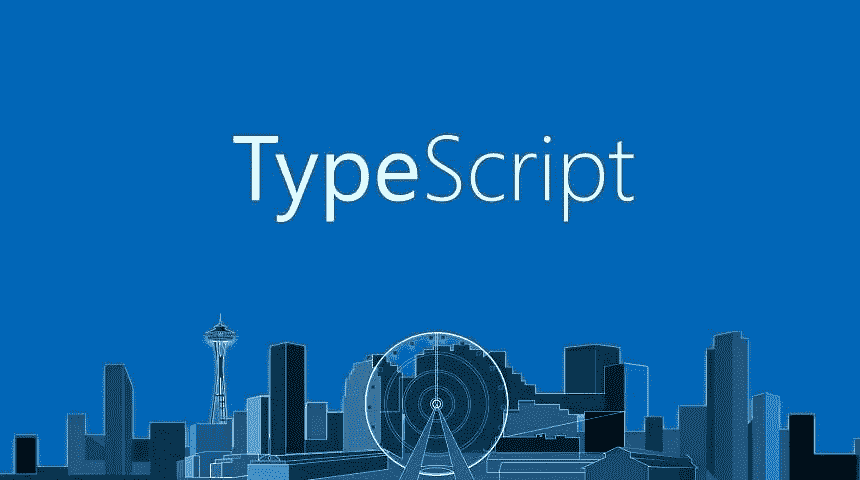

# Typescript 4.0 有什么新功能？

> 原文：<https://blog.devgenius.io/whats-new-in-typescript-4-0-4a8e2182cea7?source=collection_archive---------11----------------------->



今天我要谈谈 Typescript 4.0 的新特性。

TypeScript 4.0 提供了许多新特性，使得 JavaScript 开发更加容易。

# 标记元组元素

您可以标记元组元素。

你可以写:

```
type Range = [start: number, end: number];
```

限制`args`为一个字符串和一个数字。

你也可以写:

```
type Foo = [first: number, second?: string, ...rest: any[]];
```

在元组中有 rest 条目。

如果你的元组有类型`Foo`，那么元组以一个数字和一个字符串开始。

那么其余的条目可以是任何东西。

标签不要求你在析构时用不同的名字命名变量。

例如，如果您有:

```
function foo(x: [first: string, second: number]) {
  const [a, b] = x;
}
```

然后你可以给析构变量起任何你想要的名字。

# 从构造函数推断类属性

TypeScript 4.0 可以从构造函数推断类属性的类型。

例如，如果您有:

```
class Square {
  area;
  length;

  constructor(length: number) {
    this.length = length;
    this.area = length ** 2;
  }
}
```

然后 TypeScript 4.0 自动知道`this.length`和`this.area`是数字。

如果它们的值有可能是`undefined`，那么 TypeScript 编译器会通知你。

所以如果你有:

```
class Square {
  length;

  constructor(length: number) {
    if (Math.random()) {
      this.length = length;
    }
  }

  get area() {
    return this.length  ** 2;
  }
}
```

然后你就知道`this.length`可能是`undefined`。

你需要一个类型断言，即使你知道它总是被定义的。

例如，您可以写:

```
class Square {
  length!: number;

  constructor(length: number) {
    this.initialize(length);
  }

  initialize(length: number) {
    this.length = length;
  }

  get area() {
    return this.length ** 2;
  }
}
```

您用符号`!`将`length`设置为非空，并将其类型显式设置为`number`，以确保`this.length`始终是一个数字。

# 可变元组

TypeScript 4.0 附带了元素数量可变的元组的数据类型。

您可以使用 spread 操作符创建一个类型，其中包含您希望在元组中包含的元素。

例如，如果您写道:

```
type Strings = [string, string];
type Numbers = number[];

type Unbounded = [...Strings, ...Numbers, boolean];
```

创建一个`Unbounded`数据类型来添加一个包含字符串、数字和布尔值的元组类型。

推断过程也是自动的，因此如果您有两个顺序相同的字符串、数字和一个布尔值，TypeScript 将推断该元组具有`Unbounded`类型。

# `unknown`关于`catch`条款绑定

您可以将`catch`子句的绑定变量指定为`unknown`类型，而不是`any`类型。

对于`unknown`类型，在使用异常对象之前，您必须显式地转换它。

例如，您可以写:

```
try {
  // ...
} catch (e: unknown) {
  if (typeof e === "string") {
    console.log(e.toUpperCase());
  }
}
```

然后在调用`toUpperCase`之前检查`e`是否是一个字符串。

# 短路赋值运算符

TypeScript 4.0 有新的赋值运算符 shorthands。

现在，您用快捷键编写逻辑 AND、逻辑 OR 和看涨合并运算符。

例如，不要写:

```
a = a && b;
a = a || b;
a = a ?? b;
```

你可以写:

```
a &&= b;
a ||= b;
a ??= b;
```

# 结论

TypeScript 4.0 提供了许多新功能，您可以使用这些功能来检查类型。

类型推断也得到了改进。

今天到此为止。

感谢您的阅读！