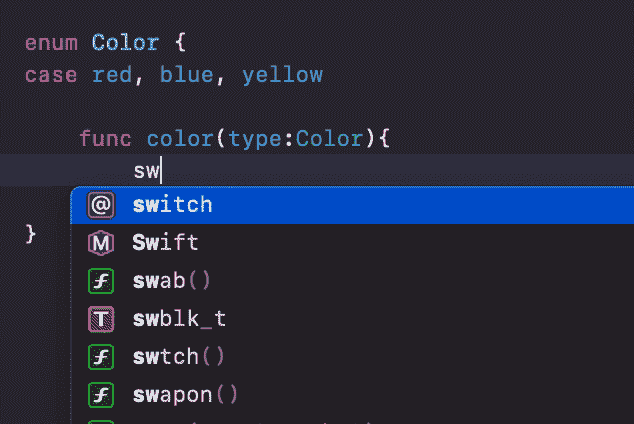
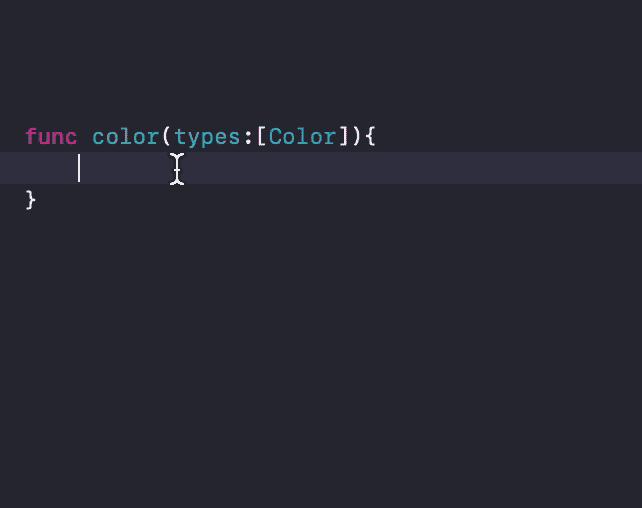
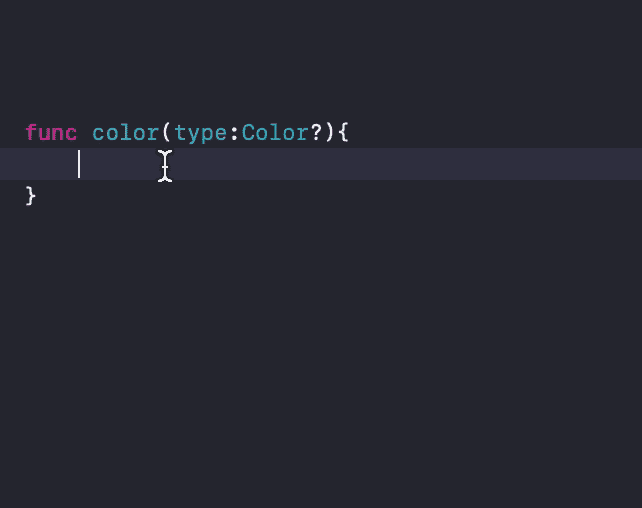
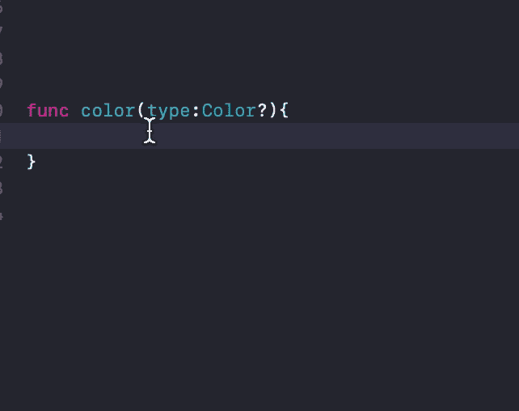
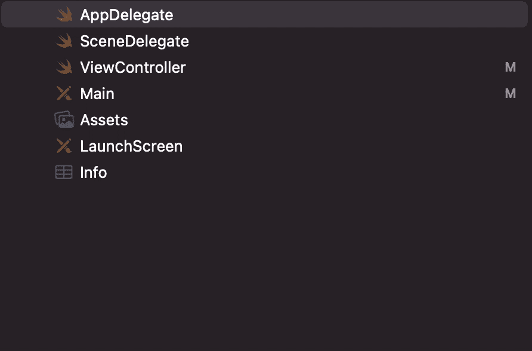
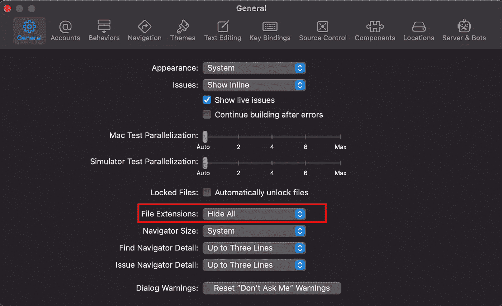

# Xcode 13 源代码编辑器有什么新功能？

> 原文：<https://blog.devgenius.io/whats-new-in-xcode-13-source-editor-c4b6cd8a7295?source=collection_archive---------1----------------------->

苹果几乎每年都会发布 Xcode 的主版本。这个版本的 Xcode 增加了一些功能和改进。

我要写 Xcode 13 中源代码编辑器的改进。没有必要延长这个，你已经从某个地方听到了。我先简短说一下。

我们开始吧。

# 源代码编辑器的特性和改进

Xcode 源代码编辑器有十几个特性，可以让您的编码技能变得更容易。

如果您有一个枚举列表，并且需要检查所有的大小写，那么您不再需要键入所有的大小写，因为自动完成功能会代替您写入所有的大小写。

如果你有一个名为复数的数组，Xcode 将完成代码块的剩余部分。

在编码过程中，如果你面对一个可选的变量，Xcode 会自动完成。

当然，您可以使用“if let”或“guard let”

Xcode 项目导航器现在有了一个新的视图。这里列出的所有文件都有一个图标。这些文件扩展名可以隐藏和显示。

Xcode->偏好设置，然后选择常规选项卡，您将看到文件扩展名选项。使用此选项，您可以隐藏和显示文件扩展名。

感谢阅读。

关于 Xcode 的更多信息，请查看苹果官方[链接](https://developer.apple.com/xcode/)。