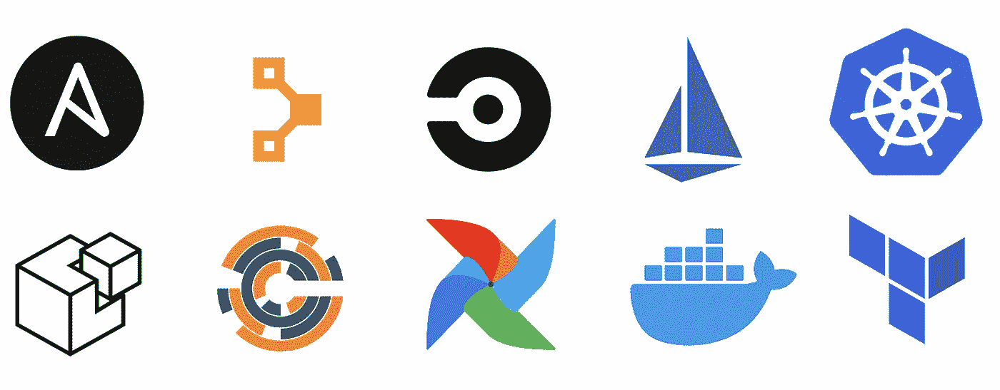
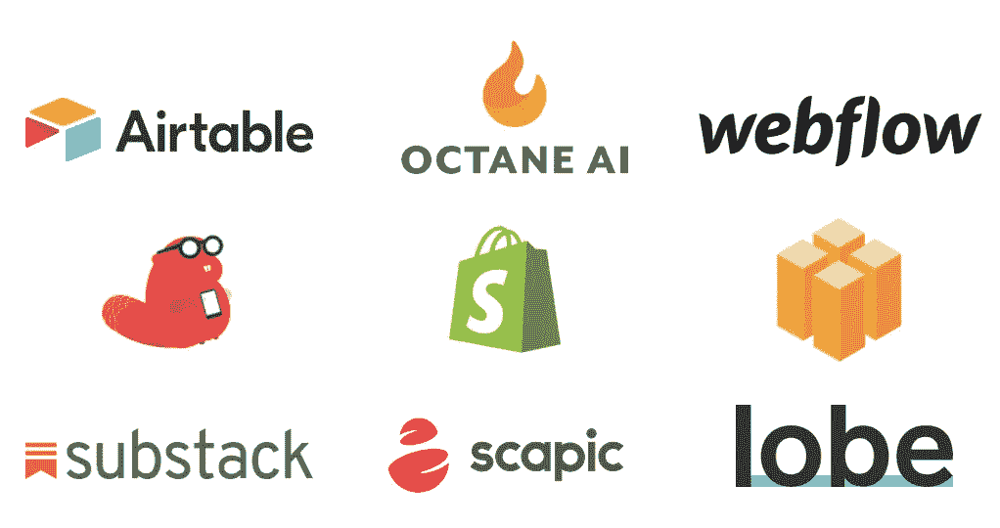
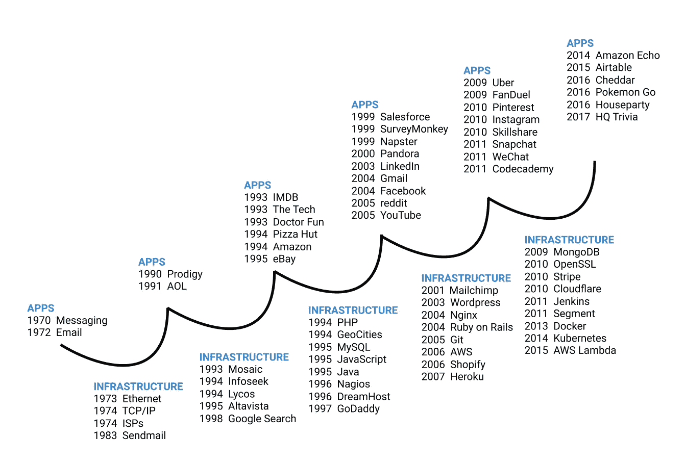
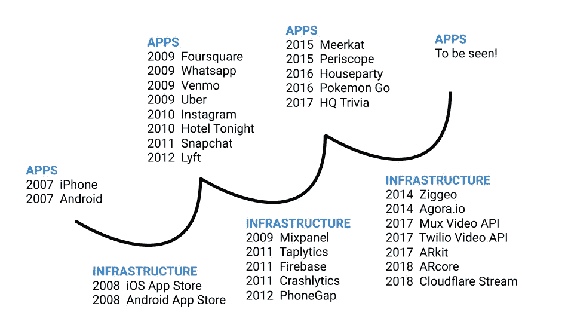

# 科技的下一步是什么？

> 原文：<https://blog.devgenius.io/whats-next-for-tech-3592e7904a03?source=collection_archive---------8----------------------->

软件吃掉了世界…现在怎么办？

[尼克·奈特](https://unsplash.com/@nicknight?utm_source=medium&utm_medium=referral)在 [Unsplash](https://unsplash.com?utm_source=medium&utm_medium=referral) 上拍照

距离马克·安德森发表他的标志性文章“[为什么软件正在吞噬世界](https://a16z.com/2011/08/20/why-software-is-eating-the-world/)”已经过去了近 10 年，他在文章中解释了为什么他和他的同名风险投资公司安德森-霍洛维茨(Andreessen-Horowitz)认为我们正处于“巨大而广泛的技术和经济转变之中，软件公司准备接管经济的很大一部分”，尽管专家们引用互联网泡沫来给科技贴上另一个危险的新泡沫的标签。安德森的理论经受住了时间的考验，十年后，可以肯定地说，软件吃掉了世界。从所谓的 FAMANG(脸书、苹果、微软、亚马逊、网飞、谷歌)公司的统治地位到移动和云计算的持续崛起，软件和技术已经扰乱了我们生活的方方面面。

最近，[we work](https://www.newyorker.com/culture/culture-desk/the-rise-and-fall-of-wework)的历史性垮台和[一系列科技公司的 IPO 斗争](https://www.wsj.com/articles/tech-ipos-arent-working-for-the-masses-11569925801)(例如优步、Lyft、SmileDirectClub)加上科技公司对隐私、零工经济中的就业问题以及社交媒体的有毒性质的担忧的反弹，从更广泛的意义上改变了“软件正在吞噬世界”的说法。本尼迪克特·埃文斯在他的演讲“[技术和新常态](https://www.ben-evans.com/presentations)”中做了完美的总结，他认为:

> 软件吞噬了世界。
> 
> 所以世界上所有的问题都可以用软件来表达。

硅谷理想主义的终结被新冠肺炎史无前例的传播所打断。就连安德森也发表了一篇新文章《[是时候建设了](https://a16z.com/2020/04/18/its-time-to-build/)》，反思应对疫情冠状病毒的制度性失败。

那么下一步是什么？

作为一名从事技术工作的工程师，我对技术的更大影响的看法最多也是有限的。对于这些讨论，我会把你引向更有说服力的文章，特别是亚历克斯·丹可的“[进步、后现代主义和技术反弹](https://alexdanco.com/2020/02/20/progress-postmodernism-and-the-tech-backlash/)”和本·汤普森的“[媒体、监管者和大型技术；放纵和禁令；更好的方法](https://stratechery.com/2020/media-regulators-and-big-tech-indulgences-and-injunctions-better-approaches/)相反，这篇文章是我对科技总体趋势的理解，以及我在网上读到的想法与我个人经验的结合，来推测接下来会发生什么。

 [## 进步、后现代主义和技术反弹

### 这里有两个方面的反技术反弹，我认为都是真实的，实际上是相互关联的…

alexdanco.com](https://alexdanco.com/2020/02/20/progress-postmodernism-and-the-tech-backlash/)  [## 媒体、监管机构和大型科技公司；放纵和禁令；更好的方法

### 早上好，指数——如我所承诺的！-将于明天回来，谈论播客、Spotify，并从…

stratechery.com](https://stratechery.com/2020/media-regulators-and-big-tech-indulgences-and-injunctions-better-approaches/) 

# 一切都是代码

在新冠肺炎时代，向云的转移因需要而加速。事实上，据微软首席执行官塞特亚·纳德拉在 4 月份的季度收益报告中称，微软在两个月 中看到了“ [**两年的数字化转型。随着越来越多的企业迁移到云或采用混合架构，随着管理和运营复杂云架构的需求增加，向代码化发展的趋势也在增长。虽然云巨头将基础架构层商品化为服务，但微服务和模块化组件的激增增加了操作现代软件堆栈的复杂性。**](https://www.microsoft.com/en-us/microsoft-365/blog/2020/04/30/2-years-digital-transformation-2-months/#:~:text=This%20week%2C%20CEO%20Satya%20Nadella,the%20era%20of%20COVID%2D19.&text=As%20Satya%20put%20it%2C%20%E2%80%9CWe,digital%20transformation%20in%20two%20months.)

“一切如代码”是一种通过代码定义和管理 ops 相关层的方法，因此我们可以将其视为另一个软件。这个想法始于基础设施即代码(IaC)，Martin Fowler 在他 2016 年的博客帖子中提出，这是一种使用源代码来“[允许可审计性和可复制的构建，服从测试实践，以及连续交付的完整规程](https://martinfowler.com/bliki/InfrastructureAsCode.html)”的方法在 DevOps 中，这个想法扩展到了其他方面:

*   **基础设施为代号** : [地形](https://www.terraform.io/)
*   **配置为代码:** [Ansible](https://www.ansible.com/) ，[厨师](https://www.chef.io/)，[木偶](https://puppet.com/)，[盐垛](https://www.saltstack.com/)
*   **CI/CD 为代码:** [CircleCI](https://circleci.com/) ， [Jenkins](https://www.jenkins.io/) ， [TravisCI](https://travis-ci.org/) ， [Spinnaker](https://spinnaker.io/)
*   **环境为代号** : [码头工人](https://www.docker.com/)，[流浪汉](https://www.vagrantup.com/)
*   **编排为代码** : [Kubernetes](https://kubernetes.io/) ， [Docker Swarm](https://docs.docker.com/engine/swarm/)
*   **数据管道为代码** : [气流](https://airflow.apache.org/)

此外，还有很多相关工具可以用来管理建立在这个生态系统之上的工作流。正如 Seth Vargo 在他的演讲中指出的，一切如代码在管理运营复杂性方面具有以下优势:

*   林挺、静态分析和警报
*   测试
*   为 DevOps 创建一种通用语言
*   关注点分离
*   模型抽象概念
*   将开发概念应用到 DevOps 中

到目前为止，我将代码作为商品化基础设施(例如用于容器编排的 Kubernetes、用于网络的 Istio)和通过自动化工作流减少人为错误(例如 CI/CD、GitOps)的所有方面的进步。未来值得关注的一个趋势是 AIOps:使用人工智能来自动化工作流程。也许一切如代码的最终目标是通过自动修复损坏的应用程序、检测异常和修补漏洞来消除人类操作员的干预。最明显的起点是自动化日志分析和异常检测，也许是在分布式跟踪级别。我们已经可以看到日志/监控垂直行业的公司(例如 [Splunk](https://www.splunk.com/en_us/machine-learning-artificial-intelligence.html) 、 [Datadog](https://www.datadoghq.com/solutions/machine-learning/) 、 [New Relic](https://newrelic.com/resources/white-papers/accelerate-incident-response-with-aiops) )进入这个领域。我认为下一个可能的候选是自动化安全(即 [DevSecOps](https://www.redhat.com/en/topics/devops/what-is-devsecops) )。除了静态分析和漏洞扫描，是否会有一种工具或系统通过软件自动修补安全问题？[谷歌云的 IAM 推荐](https://cloud.google.com/iam/docs/recommender-managing)是一个有趣的例子，但这能应用于更广泛的生态系统吗？

# 无代码/低代码

在*一切如代码*的另一边，我们有了*无代码*或*低代码*开发工具的兴起。随着亚马逊 Honeycode 的测试版发布，AWS 宣布进入这一领域，竞争变得更加激烈。亚马逊 Honeycode 加入了一个不断增长的生态系统，这个生态系统由各个垂直领域的无代码或低代码公司组成:

*   **艾:**[叶](https://lobe.ai/)[显然艾](http://Obviously.ai)
*   **AR/VR** [Blippar](https://www.blippar.com/)[Scapic](https://scapic.com/)
*   **聊天/语音:** [Octane AI](https://octaneai.com/) [Voiceflow](https://www.voiceflow.com/)
*   电子商务(T13):[Shopify(T15),](https://www.shopify.com/)[WooCommerce(T17)](https://woocommerce.com/)
*   **游戏**[Buildbox](https://www.buildbox.com/)[Dreamcraft](https://www.dreamcraft.com/)[Koji](https://withkoji.com/en/)
*   **行动应用程式** : [Adalo](https://www.adalo.com/) 、 [AppSheet](https://www.appsheet.com/) 、 [Draftbit](https://draftbit.com/) 、 [Thunkable](https://thunkable.com/#/)
*   **Newsletter (T37): [Substack (T39)](https://substack.com/)**
*   网页 : [Bubble](https://bubble.io/) [Carrd](https://carrd.co/) [Sheet2Site](https://www.sheet2site.com/) [Webflow](https://webflow.com/)
*   **工作流程** : [Airtable](https://airtable.com/) [IFTTT](https://ifttt.com/) [Retool](https://retool.com/) [Zapier](https://zapier.com/)

“无代码”这个术语在开发社区中是两极化的。对一些人来说，无代码的概念传达了“代码”是问题的潜在含义，为数百万“非技术”用户提供“简单的点击-拖动”工具是朝着错误方向迈出的一步。我听到的反对无代码的两个最常见的论点是:( 1) [这不是什么新东西](https://medium.com/@ODSC/low-code-panacea-or-revisited-hype-a9802387710f)(以前消除代码的尝试都失败了)和(2) [人为地将创作者限制在无代码工具的范围内是没有成效的](https://medium.com/hex-blog/lets-write-some-code-bdb6caaada97)与授权用户学习编码相比，因为这样做比以往任何时候都更容易。

暂且把这个收费的词放在一边，这些无代码和低代码平台能够并且确实为非程序员和程序员提供了巨大的价值。显然，使用固执己见的工具是有利弊的，新生的生态系统意味着功能可能会受到限制。然而，它消除了开始学习编码的障碍，同时为那些拥有扩展产品并使其有用的专业知识的人创建了一个新的生态系统。以 Shopify 的爆发式增长为例。Shopify 将构建电子商务网站所需的基础设施商品化。现在，任何人都可以开始在线销售，我们有 Shopify 专家和越来越多的 Shopify 应用程序和集成目录，以完善生态系统。

然而，这些批评也有一定的道理。目标不是删除代码，因为这就是问题所在。它消除了障碍，自动化了平凡的事物(类似于代码的一切)，从而更好地完成工作。对供应商锁定和可移植性的担忧有些道理，但总的来说，我认为这一运动是 Dani Grant 和 Nick Grossman 的“[基础设施阶段的神话](https://www.usv.com/writing/2018/10/the-myth-of-the-infrastructure-phase/)”中阐述的一个补充部分:

> Web 3.0 社区中的一个常见说法是，我们正处于基础设施阶段，现在要做的正确的事情是构建基础设施:更好的基础链、更好的链间互操作性、更好的客户端、钱包和浏览器。理由是:首先，我们需要一些工具，让构建和使用在区块链上运行的应用变得容易，一旦我们有了这些工具，我们就可以开始构建这些应用了。
> 
> 我们的假设是，事情实际上并不是这样的。**我们不是处于基础设施阶段，而是处于另一轮*应用-基础设施周期*。**事实上，新技术的历史表明，应用产生基础设施，而不是相反。这并不是说，我们首先建立所有的基础设施，一旦我们有了我们需要的基础设施，我们就开始构建应用程序。恰恰相反。
> 
> **首先，应用激发基础设施。然后，该基础架构支持新应用。**

网络应用的应用和基础设施周期— [图片来源:USV.com](https://www.usv.com/writing/2018/10/the-myth-of-the-infrastructure-phase/)

移动应用的应用和基础设施周期— [图片来源:USV.com](https://www.usv.com/writing/2018/10/the-myth-of-the-infrastructure-phase/)

我特别感兴趣的是，我们将在机器学习和人工智能领域看到哪些应用(以及随之而来的基础设施改进)。与 crypto 一起，AI 和 ML 被吹捧为数字化转型的下一阶段，但采用速度一直很慢。我们在框架(例如 Tensorflow、PyTorch)、硬件(例如 Nvidia、TPUs)和研究方面取得了惊人的进展，但如果没有数据科学团队，企业公司仍然很难建立时间序列预测模型或端到端数据管道。

如果我们将 AutoML 与数据科学领域的其他低代码平台归为核心基础架构部分，那么现在支持哪些新应用？因此，这些应用会激发什么样的新基础设施？

# 环境计算

我可能有偏见，因为我在物联网领域工作，但环境计算是计算发展过程中不可避免的自然进程。计算的历史可以用几次范式转变来描述。首先，有来自 IBM 的大型机。接着，微软和它的 Windows 操作系统乘着个人电脑革命的东风出现了。谷歌在网络上抓住了这个机会，随后随着苹果推出 iPhone 手机，移动领域也紧随其后。虽然亚马逊错过了移动革命，但它通过 AWS 开创了云计算的新时代。

那么云之后是什么呢？雾？答案可能就在谷歌设备和服务高级副总裁 Rick Osterloh 在谷歌 19 日主题演讲中的开场白中:

> 在移动时代，智能手机改变了世界。无论在哪里，拥有一台强大的电脑都是非常有用的。但是，当计算随时随地都在您需要的时候，它会更加有用。现在你听到我和 Baratunde 谈论这个想法，**有用的计算可以在你周围——环境计算**。您的设备与服务和人工智能协同工作，因此您可以随时随地获得帮助。**当你不需要这项技术时，它就会消失在背景中。所以设备不是系统的中心，你才是。这是我们对环境计算的愿景**。

我见过的另一个术语是*无摩擦计算*。物联网的承诺是通过环境计算释放传统孤岛数据的价值。一旦我们克服了新物联网连接的技术挑战，无论是用于远程监控的低功耗广域网(LPWAN)还是专用 LTE 网络上的高速流媒体用例，我们都将看到利用新数据流的捆绑应用的激增。

最大的问题将是谁在价值链中抓住了最多的机会？看看其他技术趋势(如自动驾驶汽车、清洁能源、AR/VR)，下一个占主导地位的公司会是一个通过智能合同连接数据口袋的平台，还是改变我们与日常物品互动的捆绑应用？或者说，环境计算只是移动计算的一个延伸，而目前的参与者仍将占据主导地位？

# 新常态

新冠肺炎事件导致的全球封锁迫使一切都在网上进行，并巩固了科技在我们生活中的重要性。它加速了更快采用的现有趋势(例如，转向云计算、电子商务的兴起、媒体的进一步分拆)，并为我们提供了假设所有事物和所有人都在线的新常态。

2020 年，软件吞噬了世界，并在技术价值创造周期中以一切如代码、无代码/低代码平台和环境计算的形式出现了新的但熟悉的趋势。借用本尼迪克特·埃文斯(Benedict Evans)的话来说，我们正处于开始阶段的末尾，科技已经成为社会的核心。