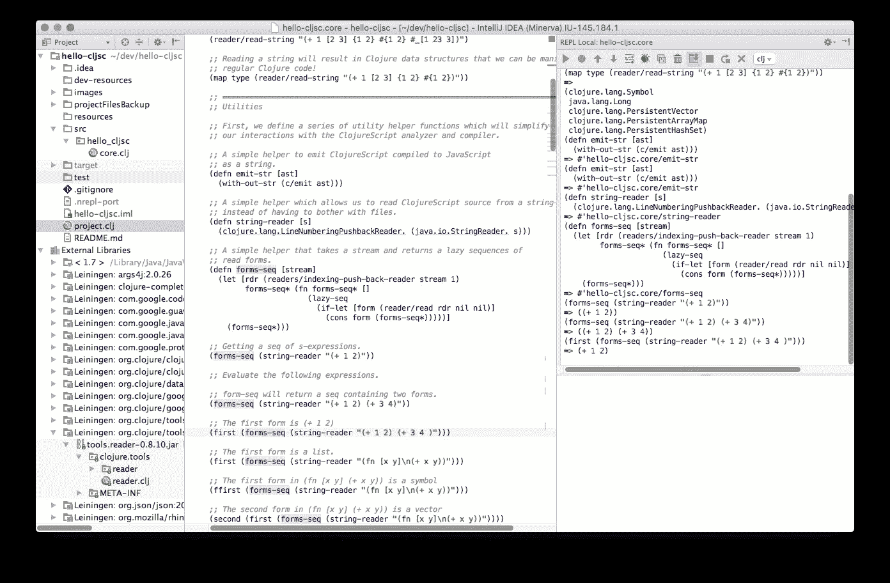
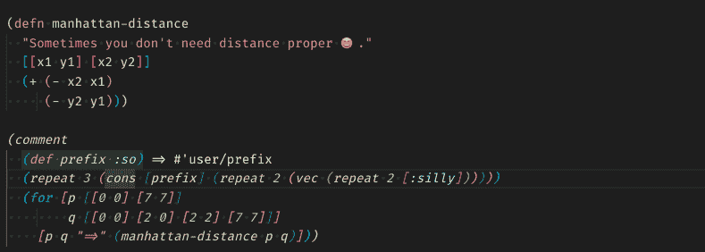
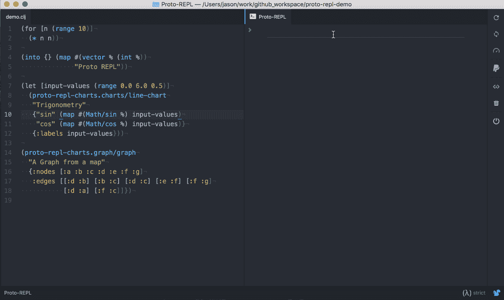
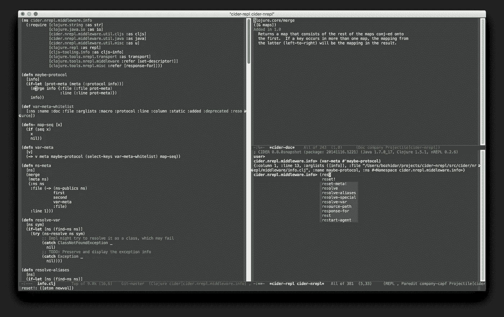
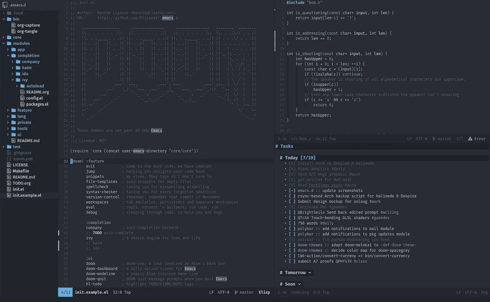
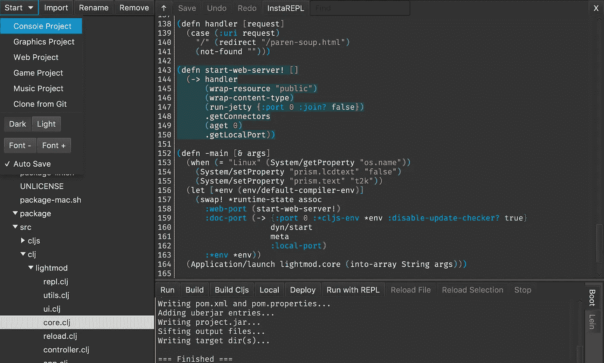
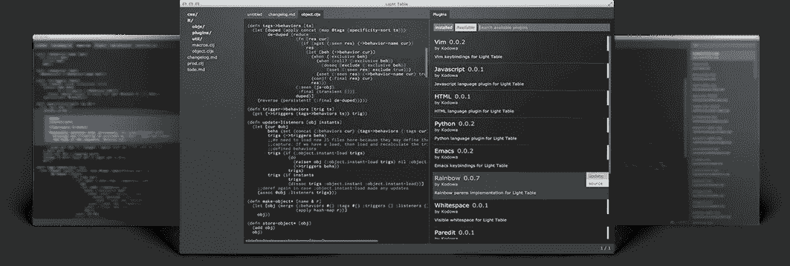
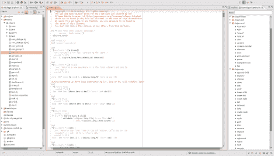

# 用 Clojure 开发最好的 IDE 和插件是什么？

> 原文：<https://blog.devgenius.io/whats-the-best-ide-and-plugins-for-developing-in-clojure-4eae33c8f46f?source=collection_archive---------1----------------------->

[Richard Brutyo](https://unsplash.com/@richardbrutyo?utm_source=unsplash&utm_medium=referral&utm_content=creditCopyText) 在 [Unsplash](https://unsplash.com/s/photos/computer?utm_source=unsplash&utm_medium=referral&utm_content=creditCopyText) 上的原图；插图由 Tremaine Eto 绘制，带有公有领域标志

想成为 Clojurian，或者使用 Clojure 编写代码的人？

第一步是找出适合你的设置。在这篇文章中，我们将讨论几种不同的选择，并提供一些其他 Clojurians 的真实意见，包括提示、建议、什么对他们有效，什么无效。

但是，不要花太多时间在担心哪个 IDE 上；重要的是开始并熟悉 Clojure。正如 Reddit 的 [/r/Clojure](https://www.reddit.com/r/Clojure/) 上的一位评论者(他已经删除了他们的账号)所说，“我不会太关注工具。我试图寻找 Clojure 的“完美”IDE 或编辑器，但我发现它只是分散了我学习语言的注意力。先用任何编辑器熟悉这种语言，如果你喜欢，再研究不同的选项。”

希望这篇文章能对它进行总结，这样你就有了一个坚实的基础，这样你就可以节省一些时间。

# IntelliJ +草书

礼遇[草书 IDE](https://cursive-ide.com/) 。

*   网址[此处](https://cursive-ide.com/)
*   IntelliJ 社区版[免费](https://www.jetbrains.com/idea/download/#section=windows)
*   IntelliJ 终极版是 [*不是*免费](https://www.jetbrains.com/idea/download/#section=windows)；有一个 30 天的免费试用期，但除此之外(个人用户)每年 149 美元，第二年 119 美元，第三年 89 美元

草书有，[我引用他们的网站](https://cursive-ide.com/):

*   代码完成，语法突出显示
*   一级 ClojureScript 支持
*   导航(跳转到符号，查找用法)
*   基于 nREPL 和 clojure.main 的复制器
*   莱宁根支架
*   clojure.test 支持
*   符号重命名、提取字母等
*   Paredit 风格的结构化编辑
*   代码格式
*   Clojure 调试器
*   面向混合项目的最佳 Java 互操作
*   所有标准 IntelliJ 功能(项目管理、VCS 等)

> 我在严肃的项目中使用草书，在小的一次性项目中使用 Calva。

—[上的](https://www.reddit.com/r/Clojure/comments/bqijvj/what_idetext_editor_are_you_using_to_write/eo4ym6c/)[/u/约格索斯](https://www.reddit.com/user/yogthos)/r/clo jure

> 我很想说“坚持使用你觉得舒服的任何 IDE/编辑器”，但是 Eclipse 本身的受欢迎程度甚至在更大的 Java(平台)社区中也在走下坡路。[1]就受欢迎程度而言，我不想投资于即将过时的东西。我和你有相似的背景(Java)，有时需要使用除 Clojure 之外的其他语言(例如 Java、Scala 和 Groovy)。因此，我需要一个对 Java 平台上的所有语言都有足够支持的 IDE。Emacs 肯定不在其中，所以我们只剩下 IntelliJ IDEA 了。[2]根据我过去 9 年使用 IntelliJ IDEA 的经验，就功能、开发人员工效学和 Java 平台上的可扩展性而言，它是最好的 IDE。至于对 Clojure 的支持，草书[3]相当不错，在 Clojure 社区中非常流行。[4]它是建立在 IntelliJ 平台提供的底层基础设施之上的，因此它能够利用所有由专门构建 ide(JetBrains)的专业人员构建的优秀东西。顺便说一下，这在调试 Clojure 代码和 Java-interop 时特别有用。
> 
> [1]https://snyk.io/blog/jvm-ecosystem-report-2018-tools/#ides
> 
> [2][https://www.jetbrains.com/idea/](https://www.jetbrains.com/idea/)
> 
> [https://cursive-ide.com/](https://cursive-ide.com/)
> 
> [https://www.surveymonkey.com/results/SM-S9JVNXNQV/](https://www.surveymonkey.com/results/SM-S9JVNXNQV/)

—[/u/final _ fantasia](https://www.reddit.com/user/final_fantasia)on[/r/clo jure](https://www.reddit.com/r/Clojure/comments/bqijvj/what_idetext_editor_are_you_using_to_write/eo4ym6c/)

> 我试着用 Emacs 和多种 Clojure 模式设置了几次，但是我用 IntelliJ 的草书插件更成功。Emacs 设置更常见，也更常被推荐，但是值得你花时间去看看草书。
> 
> 我个人也选择了相当标准的 Leiningen，但我也看到了 Boot 的许多优点。不过莱宁根为我工作，我会推荐它。

—[上的](https://www.reddit.com/r/Clojure/comments/5py384/whats_the_best_way_to_setup_a_development/dcuraj1/)[/u/鲁鲁尼](https://www.reddit.com/user/Rurouni)/r/clo jure

> 声明:我是 IntellIj IDEA 的长期用户。
> 
> 我试过草书和 Emacs+苹果酒。
> 
> 我投入了大量的时间学习 Emacs + Cider。我发现它对于我熟悉的小型项目和/或代码库来说非常好。
> 
> 然而，对于我不熟悉的大型项目，我只是认为草书更好。我可以更快地浏览项目，也更方便。项目树，“在路径中查找”，“动作”对话框，“查找用法”，以及其他功能对我帮助很大。我知道这些特性中的大多数都有替代方案，但是 IntellIj 在这种情况下更适合我。

—[/u/jumar](https://www.reddit.com/user/jumar)on[/r/clo jure](https://www.reddit.com/r/Clojure/comments/5py384/whats_the_best_way_to_setup_a_development/dd0tb50/)

> 虽然我喜欢 Emacs 并且自己也在使用它，但 Intellij JustWerkz 还是值得一试。
> 
> 如果你有点喜欢争论工具，Spacemacs 对我来说很好，它面向 Vimmers。

—[/u/bsless](https://www.reddit.com/user/bsless)on[/r/clo jure](https://www.reddit.com/r/Clojure/comments/ggxenn/new_clojurian_trying_to_find_best_editor/fq5d4m0/)

# VSCode + Calva

礼貌[卡尔瓦比明天更好](https://marketplace.visualstudio.com/items?itemName=betterthantomorrow.calva)

Calva 有，我引用插件页面上的话:

*   语法突出显示，加上:
*   彩虹父母
*   彩虹缩进参考线
*   突出显示活动缩进参考线
*   突出显示放错位置的括号
*   LISP 友好括号匹配
*   忽略表单(`#_`)变暗和`(comment)`表单高亮
*   根据[https://github.com/bbatsov/clojure-style-guide](https://github.com/bbatsov/clojure-style-guide)进行代码格式化和自动独立
*   结构编辑(通过[编辑](https://calva.io/paredit/)
*   [林挺](https://calva.io/linting/)
*   智能感知
*   转到/查看定义
*   查找所有引用
*   重命名符号
*   更改所有事件
*   参考代码镜头(在设置中启用)
*   大纲视图
*   悬停时查看文档字符串
*   悬停时查看函数签名，包括帮助了解您正在键入哪个参数
*   [调试器](https://calva.io/debugger/)
*   支持 [Clojure tools/deps](https://clojure.org/guides/deps_and_cli) 、 [Leiningen](https://leiningen.org/) 、 [shadow-cljs](http://shadow-cljs.org/) 、 [lein-figwheel](https://github.com/bhauman/lein-figwheel) 和 [Figwheel Main](https://figwheel.org/) 以及 Nashorn repls。(对于[开机](https://boot-clj.com/)，只有连接场景工作，还没有插孔。)
*   您的[定制连接序列](https://calva.io/connect-sequences/)，包括完全定制的 CLJS 复制器。
*   随意在不同的 CLJS 版本之间切换 CLJS REPL 连接。
*   编辑`cljc`文件时，点击状态栏中的`cljc/clj[s]`指示器，轻松选择 REPL 命令是发送到`clj`还是`cljs` REPL。
*   更多

这也很有意思，但是如果你需要联系他，Calva [的创造者似乎也在 Reddit 上很活跃。](https://www.reddit.com/user/CoBPEZ)

> 也是一个很好的选择。它提供的不如草书多，但是如果你不想使用 IntelliJ，这是一个不错的选择。

—[上的【删除】/r/Clojure](https://www.reddit.com/r/Clojure/comments/8vsirv/is_counterclockwise_on_eclipse_dead/e1zv8bb/)

> 对于 Clojure 来说，这是一个非常棒的开发环境，非常容易上手和运行。这种工具正是降低新来者门槛所需要的。

—[/u/yog thos](https://www.reddit.com/user/yogthos)on[/r/clo jure](https://www.reddit.com/r/Clojure/comments/bx2k5b/the_calva_journey_continues_please_jack_in/eq32f1e/)

> 尝试了卡尔瓦…但草书更容易启动和运行。

—[上的](https://www.reddit.com/r/Clojure/comments/ggxenn/new_clojurian_trying_to_find_best_editor/fq5bh88/)[/u/lambda curry](https://www.reddit.com/user/lambdacurry)/r/clo jure

> …我确实关闭了一些自动括号类型的东西，因为我习惯了在编辑器中没有它，它让我发疯。在某个时候，当我超越了学习阶段，我可能会重新打开它。此外，因为我用其他语言和 ide 编写代码，所以我需要编辑器行为的一致性。
> 
> 综上所述，Calva 非常棒。他们的网站也有助于你开始，因为一些重要命令的提示和描述并不是 100%清楚。

—[上的](https://www.reddit.com/r/Clojure/comments/iz4hgu/clojure_on_visual_studio_code_calva_vs_clojure/)[/u/ericb 1000](https://www.reddit.com/user/ericb1000)/r/clo jure

# 原子+原复制子

礼貌[原复制 GitHub](https://github.com/jasongilman/proto-repl)

*   原 REPL 原子页发现[此处](https://atom.io/packages/proto-repl)
*   原型 REPL GitHub 发现[在这里](https://github.com/jasongilman/proto-repl)

一些特性列在 proto-repl [页面](https://atom.io/packages/proto-repl)上，我引用一下:

*   交互式 REPL 驱动的开发环境。
*   [自动完成](https://atom.io/packages/proto-repl#autocompletion) Clojure 名称空间、函数名、变量和本地绑定
*   通过击键评估[代码块](https://atom.io/packages/proto-repl#sending-a-block)或[选定的代码](https://atom.io/packages/proto-repl#sending-a-selection)。
*   在代码旁边的 REPL 或[行内查看结果。](https://atom.io/packages/proto-repl#inline-results)
*   自动评估模式，在你输入的时候执行文件中的代码。
*   在一个命名空间或整个项目中轻松运行测试。
*   从链接的 Clojure 库中查看文档和代码。
*   [Atom 工具栏](https://atom.io/packages/tool-bar)允许控制 REPL 的集成。
*   可扩展，能够[添加自己的命令](https://atom.io/packages/proto-repl#extending-proto-repl)或[创建可视化效果](https://github.com/jasongilman/proto-repl-charts)。

另外，[这里的](https://gist.github.com/jasongilman/d1f70507bed021b48625)是 Jason Gilman 关于用 Atom 设置 Clojure 的一个很好的资源。

> 我决定在 MacOS 上使用 atom 和 proto-repl。我每天都用它，它看起来很稳定，帕瑞弗几乎训练过我:-)。我真的没有在 clojure 操作之外探索过。对我来说胜于 intelliJ、light table 和 vim(我不是 emacs 用户)。
> 
> 还有 java 1.8 和 lein 2.7

—[/u/全合成夹克](https://www.reddit.com/user/fullsyntheticjacket)上 [/r/Clojure](https://www.reddit.com/r/Clojure/comments/5py384/whats_the_best_way_to_setup_a_development/dcvn2kc/)

> 我使用 Atom(和 proto-repl 一起使用，从那以后，这是一种美妙的体验)。我以前试过 Emacs + CIDER，但是按键绑定把我吓坏了。此外，你会发现原始复制图，墨水和 parinfer 轻而易举。🍂

—[上的【删除】/r/Clojure](https://www.reddit.com/r/Clojure/comments/5py384/whats_the_best_way_to_setup_a_development/dcvn2kc/)

> Atom 感觉很慢，我没有让 Proto-Repl 按照我想要的方式工作。这可能是一个用户错误，但哦好吧。

—[上的【删除】/r/Clojure](https://www.reddit.com/r/Clojure/comments/8vsirv/is_counterclockwise_on_eclipse_dead/e1zv8bb/)

# Emacs +苹果酒(也叫 Spacemacs +苹果酒)

礼遇[苹果酒//文件](https://docs.cider.mx/cider/index.html)

CIDER 代表“Clojure(Script)交互式开发环境摇滚”。名字不错，对吧？

他们的知识库[声明](https://github.com/clojure-emacs/cider)“CIDER 扩展了 Emacs，支持 Clojure 中的[交互式编程](https://docs.cider.mx/cider/usage/interactive_programming.html)。这些特性都围绕着`cider-mode`展开，这是一个 Emacs 次要模式，是对 [clojure-mode](https://github.com/clojure-emacs/clojure-mode) 的补充。虽然`clojure-mode`支持编辑 Clojure 源文件，但是`cider-mode`增加了与正在运行的 Clojure 进程交互的支持，用于编译、代码完成、调试、定义和文档查找、运行测试等等。”

*   苹果酒 GitHub 回购[此处](https://github.com/clojure-emacs/cider)

Daw-Ran Liou 也有一个关于设置 Emacs 与 Clojure 协同工作的博客。

> Emacs，尽管我已经用它做了足够多的其他事情，我早就弥补了学习它所花的时间。

—[/u/retie f1](https://www.reddit.com/user/retief1)on[/r/clo jure](https://www.reddit.com/r/Clojure/comments/bqijvj/what_idetext_editor_are_you_using_to_write/eo4ym6c/)

> Emacs 还有 org-mode，非常有用。当编写 Java 代码时，我使用 Eclipse(单独使用)。

—[/u/maridon kers](https://www.reddit.com/user/maridonkers)on[/r/clo jure](https://www.reddit.com/r/Clojure/comments/bqijvj/what_idetext_editor_are_you_using_to_write/eo4ym6c/)

> 我个人无法使用 Spacemacs/Emacs，感觉它并没有真正提高我的工作效率，而且键盘快捷键似乎不一致/随意

—[/u/katorias](https://www.reddit.com/user/katorias)on[/r/clo jure](https://www.reddit.com/r/Clojure/comments/bqijvj/what_idetext_editor_are_you_using_to_write/eo4ym6c/)

> 在 windows 上设置 emacs 将会是一件非常痛苦的事情，除非你是 emacs 专家，并且想做很多修改，所以我建议你使用 us 草书+ Intelij。

—[/u/halg ari](https://www.reddit.com/user/halgari)on[/r/clo jure](https://www.reddit.com/r/Clojure/comments/5py384/whats_the_best_way_to_setup_a_development/dcusamc/)

> 对于编辑，你可以试试 Spacemacs。它提供了预配置的 clojure 布局。使用一段时间后，我喜欢它的工作方式，但也许它不是那么用户友好(远远超过 emacs 或 vim)。
> 
> 对于经理，您应该从 Leiningen 开始，它会下载您需要的所有内容，并且易于使用。我更喜欢 boot，但 leiningen 对开始更友好，你以后会有时间尝试 Boot。

—[/u/charlesHD](https://www.reddit.com/user/charlesHD)on[/r/clo jure](https://www.reddit.com/r/Clojure/comments/5py384/whats_the_best_way_to_setup_a_development/dcusamc/)

> 像 spacEmacs 这样的 emacs 发行版预装了 vim(邪恶模式)组合键。绝对值得一试，特别是因为 cider(clo jure 的 emacs 插件)是我用过的最好的，虽然还需要学习如何配置和使用它(可以简单到在配置文件中添加一个包)，但我认为它对 vim 用户来说非常简单。

—[上的](https://www.reddit.com/r/Clojure/comments/ggxenn/new_clojurian_trying_to_find_best_editor/fq5o19t/)[/u/ku emmel 234](https://www.reddit.com/user/kuemmel234)/r/clo jure

> 我不太喜欢 Emacs。感觉我只是在学习编辑器，这只会分散我学习 Clojure 的注意力。如果我学得好的话，也许我的效率会很高，但是我只是想写 Clojure，而不是学编辑器。

—[/r/clo jure](https://www.reddit.com/r/Clojure/comments/8vsirv/is_counterclockwise_on_eclipse_dead/e1zv8bb/)上的【删除】

# Doom Emacs

礼遇[末日 Emacs](https://github.com/hlissner/doom-emacs)

正如[从 GitHub repo](https://github.com/hlissner/doom-emacs#features) 中引用的那样，Doom Emacs 的功能包括:

*   极简主义的良好外观灵感来自现代编辑。
*   许多软件包、(主要)操作系统和 Emacs 本身的管理和 sane 缺省值。
*   一个模块化的组织结构，用于分离配置中的关注点。
*   旨在简化 elisp 自行车脱落的标准库。
*   带有命令行界面的声明式[包管理系统](https://github.com/hlissner/doom-emacs/blob/develop/docs/getting_started.org#package-management)(由 [straight.el](https://github.com/raxod502/straight.el) 提供支持)。从任何地方安装软件包，而不仅仅是(M)ELPA，并将它们固定到任何提交。
*   可选 vim 仿真由 [evil-mode](https://github.com/emacs-evil/evil) 驱动，包括热门 vim 插件的端口，如[vim-sleep](https://github.com/justinmk/vim-sneak)、 [vim-easymotion](https://github.com/easymotion/vim-easymotion) 、 [vim-unimpaired](https://github.com/tpope/vim-unimpaired) 和 [more](https://github.com/hlissner/doom-emacs/blob/develop/modules/editor/evil/README.org#ported-vim-plugins) ！
*   更多

Ian Jones 有一篇关于如何让它与 Clojure 一起工作的很好的文章。

> 绝对喜欢 Doom Emacs

—[上的](https://www.reddit.com/r/Clojure/comments/ggxenn/new_clojurian_trying_to_find_best_editor/fq70foc/)[/u/ActiveX ray](https://www.reddit.com/user/activeXray)/r/clo jure

> …试用了 Spacemacs，非常满意。然后查看了 Doom Emacs，对它更满意了。

—[/u/defiant average 1](https://www.reddit.com/user/DefiantAverage1)on[/r/clo jure](https://www.reddit.com/r/Clojure/comments/ggxenn/new_clojurian_trying_to_find_best_editor/fq5g4tf/)

> 从传统的 emacs 意义上来说，更容易配置定制。Spacemacs 使用了一种称为层的东西，这是一种为 emacs 打包配置的方式，但增加了尝试添加您自己的定制的复杂性。Doom 做了一个定制的软件包安装程序，但它更接近于传统的 emacs，有很好的功能来简化添加新功能。Doom 也有一些很好的内置功能来编译核心/所有的 elisp 文件，这加快了启动到< 1s with hundreds of packages (my experience)

— [/u/jagster 247](https://www.reddit.com/user/jagster247)on[/r/clo jure](https://www.reddit.com/r/Clojure/comments/ggxenn/new_clojurian_trying_to_find_best_editor/fq6le4u/)的速度

> …这样快多了。它的文档更少，但实际上并不需要，因为它要小得多，所以你可以更容易地看到发生了什么。此外，spacemacs 需要开发分支才能正常工作。我不得不检查几年前的问题，并惊讶地发现修复仍然没有掌握。

—[/u/iimblack](https://www.reddit.com/user/iimblack)on[/r/clo jure](https://www.reddit.com/r/Clojure/comments/ggxenn/new_clojurian_trying_to_find_best_editor/fq6nh09/)

# 精力

## 冰壁炉或魔法壁炉

*   壁炉链接[此处](https://github.com/tpope/vim-fireplace)
*   壁炉有一个透明的设置，评估从缓冲区，导航，omnicomplete，等等
*   冰封链接[此处](https://github.com/liquidz/vim-iced)
*   ice 具有异步评估、测试、重构、自动完成、格式化、引用、调试、框架、ClojureScript 支持、套接字 REPL 等等
*   变戏法链接[此处](https://github.com/Olical/conjure)
*   阅读[这里](https://github.com/Olical/conjure#user-experience)来看看 Maguire 的用户体验是什么样的

> 你可以考虑使用这些 Clojure 插件中的任何一个来切换到(Neo)Vim:壁炉(【https://github.com/tpope/vim-fireplacel】)、冰镇([【https://github.com/liquidz/vim-iced】](https://github.com/liquidz/vim-iced))或魔法([https://github.com/Olical/conjure](https://github.com/Olical/conjure))？恐怕我不能对每一个的优缺点给出任何建议，因为我自己刚刚开始使用 Clojure 和 Vim。

—[/u/j19 sch](https://www.reddit.com/user/j19sch)on[/r/clo jure](https://www.reddit.com/r/Clojure/comments/ggxenn/new_clojurian_trying_to_find_best_editor/fq5ff1v/)

> Vim 壁炉也不错，但是如果你想让你的插件非常简单，你更喜欢文本编辑器而不是更多的 IDE 特性。当使用 clojure 时，这完全没问题。

—[/u/kuem Mel 234](https://www.reddit.com/user/kuemmel234)on[/r/clo jure](https://www.reddit.com/r/Clojure/comments/ggxenn/new_clojurian_trying_to_find_best_editor/fq5o19t/)

## tslime

> tmux 中的 Vim + [tslime](https://github.com/jimmyharris/tslime.vim) 插件对我来说很好。

—[/u/naty io](https://www.reddit.com/user/natyio)on[/r/clo jure](https://www.reddit.com/r/Clojure/comments/bqijvj/what_idetext_editor_are_you_using_to_write/eo4ym6c/)

# 夜曲

图像公共领域

*   点击了解更多信息并下载
*   被一些人宣传为初学者友好的选择

> 快速尝试 clojure out 的 Nightcode 很有趣。查看 oakes 的其他 IDE 项目。btw[https://www . Maria . cloud](https://www.maria.cloud/)也很酷，虽然更小众。

—[上的](https://www.reddit.com/r/Clojure/comments/edf6qk/clojure_development_tool/fbip6u4/)[/u/eno 6 ohng](https://www.reddit.com/user/Eno6ohng)/r/clo jure

# 看版台

礼遇[灯台](http://lighttable.com/)。

*   点击了解更多信息并下载

**然而，网上有报道指出它没有被维护。因此，这似乎不再是一个合适的选择。**

> 它曾是一个如此有前途的编辑器，但不幸的是它已经被放弃了。还是一个还可以的选择，但是我不推荐。在 Ubuntu 上安装它也是一件痛苦的事情，这表明它真的没有得到维护。

—【删除】于 [/r/Clojure](https://www.reddit.com/r/Clojure/comments/8vsirv/is_counterclockwise_on_eclipse_dead/e1zv8bb/)

> 我也希望轻表开发将得到复兴。我认为，如果它专门专注于 Clojure，而不是一个通用编辑器，那么可以添加许多有趣的功能。事实上，它是用 ClojureScript 编写的，这也是一个很大的好处，因为它有可能成为 Emacs 的等价物，成为一个可编程的编辑器。

—[/u/yog thos](https://www.reddit.com/user/yogthos)on[/r/clo jure](https://www.reddit.com/r/Clojure/comments/9eamzx/calva_clojure_clojurescript_support_for_vscode/e5o1j1m/)

# 日食+逆时针

在 Eclipse Marketplace 上逆时针[提供](https://marketplace.eclipse.org/content/counterclockwise#group-screenshots)

*   逆时针是 Clojure 的一个 Eclipse 插件
*   在此找到回购
*   据说这对初学者来说很容易

从它的[文档](http://doc.ccw-ide.org/documentation.html#_what_is_counterclockwise)来看，它说——我引用一下——它已经:

*   用于从头开始或从 [Leiningen](http://leiningen.org/) 项目定义创建/导入现有 Clojure 项目的向导
*   具有高级编辑功能的 Clojure 编辑器
*   启动 Clojure REPLs，在 Clojure 编辑器和 Clojure REPLs 之间进行交互
*   与 [Leiningen](http://leiningen.org/) 紧密集成(Leiningen 是 clojure 项目中最流行的构建工具)

然而，来自在线用户的报告表明，Clojure 的逆时针 Eclipse 可能不会再被维护那么久了，因此我建议你考虑其他选择。

> 是的，不幸的是，CCW 基本上已经死了，劳伦特停止了对它的研究，也没有人去接它(见[这里](https://groups.google.com/d/msg/clojure/iSTZW6blRA8/kfjDoBvtAgAJ))。如果你想体验 Clojure 的 IDE，草书几乎是现在唯一的游戏了(完全公开:我开发了草书)。正如其他人提到的，如果你没有从 Clojure 作品中赚钱，你不必为 IntelliJ 和草书付费。
> 
> 如果你不能面对 Emacs，但又不想使用草书，那么 Atom 和(最近)VS Code 也有不错的模式，这些模式现在看起来都很棒。

—[/u/NZ lemming](https://www.reddit.com/user/nzlemming)on[/r/clo jure](https://www.reddit.com/r/Clojure/comments/8vsirv/is_counterclockwise_on_eclipse_dead/e1qsuse/)

> 在办公室，我们发现 CCW 的最新版本和 Eclipse 的更新版本似乎有问题，最后我们决定使用 Eclipse Luna/Mars 和 CCW 0.34(你需要使用不同的更新站点)，我们使用 Clojure 1.8，它工作正常。

—[/u/eccp](https://www.reddit.com/user/eccp)on[/r/clo jure](https://www.reddit.com/r/Clojure/comments/8vsirv/is_counterclockwise_on_eclipse_dead/e1q0em8/)

 [## 通过我的推荐链接加入媒体

### 作为一个媒体会员，你的会员费的一部分会给你阅读的作家，你可以完全接触到每一个故事…

tremaineeto.medium.com](https://tremaineeto.medium.com/membership)