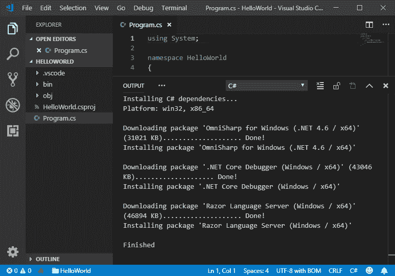
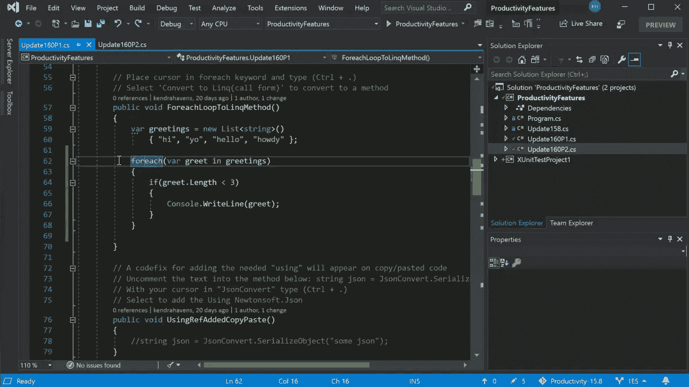
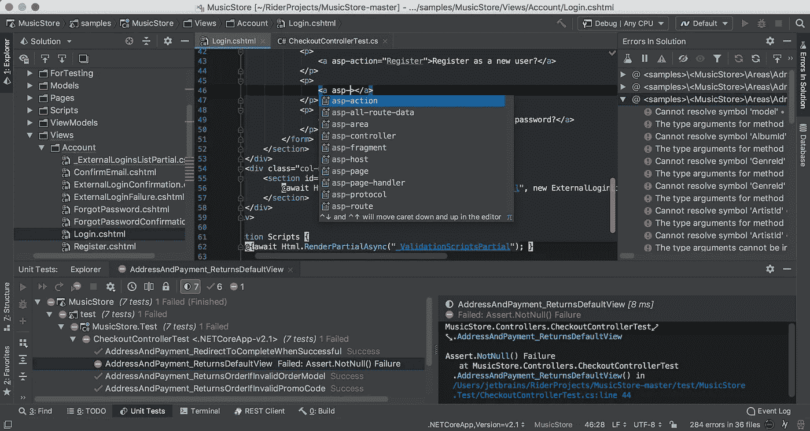
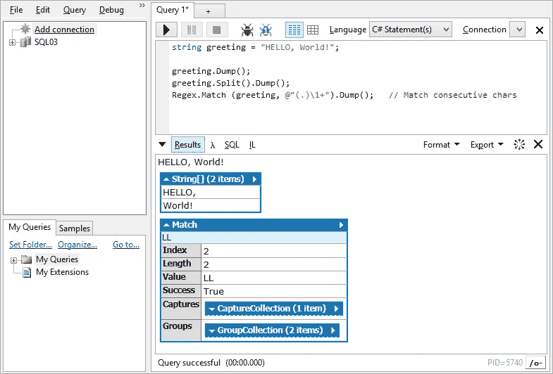

# 用 C#和. net 开发最好的 IDE 是什么？网？

> 原文：<https://blog.devgenius.io/whats-the-best-ide-for-developing-in-c-and-net-25b1bc70bbce?source=collection_archive---------0----------------------->

原始照片由 [ThisisEngineering RAEng](https://unsplash.com/@thisisengineering?utm_source=unsplash&utm_medium=referral&utm_content=creditCopyText) 在 [Unsplash](https://unsplash.com/s/photos/coding?utm_source=unsplash&utm_medium=referral&utm_content=creditCopyText) 上拍摄

C#(发音为 C Sharp)是微软在 2000 年开发的，是其。NET 框架，并且在当今的开发世界中仍然非常普遍。

无论您是希望开始使用 C#还是希望改进您的工作流，考虑一下使用什么 IDE 或集成开发环境总是一个好主意。

在本文中，我将列出一些常用的 ide，然后分享一些 C#用户在互联网上的观点，希望能更完整地描述每种 ide 的优缺点。

事不宜迟，我们开始吧。

# Visual Studio 代码(VS 代码)

礼貌[微软文档](https://docs.microsoft.com/en-us/dotnet/core/tutorials/with-visual-studio-code)

Visual Studio Code 是微软的一个相对轻量级的 IDE，对于许多语言来说是一个很好的选择，尤其是对于 C#。

下面，我将列出 VSCode 的一些细节和特性。

*   自由的
*   **这里下载**
*   **“我们对 VS 代码的关注是成为跨平台 C#开发的优秀编辑器”——[Visual Studio 代码](https://code.visualstudio.com/docs/languages/csharp)**
*   **C#语言支持，通过市场[可选安装](https://marketplace.visualstudio.com/items?itemName=ms-dotnettools.csharp)**
*   **支持。核心项目净额**
*   **支持 MSBuild 项目**
*   **支持 C#脚本(CSX)**
*   **智能感知**
*   **更名重组**
*   **内置代码片段**
*   **触发建议**
*   **搜索符号**
*   **代码透镜**
*   **查找参考/查看定义**
*   **快速解决方案/建议**

**此外，不要将 VS 代码与 Visual Studio 混淆。Visual Studio 是另一个 IDE 选项，我将在下一节介绍它。这位 Redditor 称:**

> **VS Code 不是 Visual Studio 的轻量版——它是一个完全不同的产品，我们可以感谢 MS 的市场部给了我们一个令人困惑的名字。**

**—[/u/gsej](https://www.reddit.com/user/gsej)on[/r/cs harp](https://www.reddit.com/r/csharp/comments/hio7cf/a_good_text_editor_for_c_that_is_not_visual_studio/fwi9dlf/)**

**现在，让我们回顾一下互联网上关于 C#开发 VS 代码的一些观点。**

> **另一方面，即使像智能感知这样的东西在 VS 中也比 VSC 更可靠。**
> 
> **我对此并不高兴，因为我想在 Linux 或其他系统上时不时地使用它，但是真实和虚拟之间的差别是可以感觉到的。**

**—[上的](https://www.reddit.com/r/csharp/comments/jor3sj/what_is_a_c_ide_that_runs_well_on_a/gbaoych/)[/u/exe usv](https://www.reddit.com/user/ExeusV)/r/cs harp**

> **一旦你使用了 VS 代码，你就再也不会回头，在我的 3GB 内存虚拟机上运行它，它不会给我带来任何问题**

**—[/u/-Manu _](https://www.reddit.com/user/-Manu_)on[/r/cs harp](https://www.reddit.com/r/csharp/comments/jor3sj/what_is_a_c_ide_that_runs_well_on_a/gbbwc1w/)**

> **如果你正在开发 web 应用，VS 代码是更好的方法(我用 VS 代码开发 Web，即使我有 VS Pro)。如果你正在制作 Xamarin 应用程序或 Web 表单或 WPF，你肯定要使用 VS Community/Pro。**

**—[/u/that internetguy](https://www.reddit.com/user/ThatInternetGuy)on[/r/cs harp](https://www.reddit.com/r/csharp/comments/jor37z/free_ides_that_can_be_used_commercially/gbbww2f/)**

> **VSCode 很棒，除非你需要 uwp、wpf 或 winforms 的 xaml 设计器。**

**—[/u/mos geo](https://www.reddit.com/user/MosGeo)on[/r/cs harp](https://www.reddit.com/r/csharp/comments/hio7cf/a_good_text_editor_for_c_that_is_not_visual_studio/fwh8crj/)**

# **可视化工作室**

****

**礼貌 [Visual Studio](https://visualstudio.microsoft.com/vs/)**

**谈到 C#，Visual Studio 是最重要的 ide 之一。事实上，如果你四处打听，你会发现大多数开发人员会回答他们使用 VS 代码或 Visual Studio 进行 C#开发(至于其他的，请继续阅读本文中关于其他 ide 的内容)。**

*   **社区版是免费的**
*   **专业版对企业来说是每月 45 美元**
*   **企业版每月 250 美元**
*   **定价详情可在[这里](https://visualstudio.microsoft.com/vs/pricing/)找到**
*   **版本对比可以在[这里找到](https://visualstudio.microsoft.com/vs/compare/)**
*   ****这里下载****
*   ****使用 Visual Studio 从 C#开始****
*   ****功能列表[此处](https://visualstudio.microsoft.com/vs/features/)****

> ****当与 C#一起使用时，常规的 Visual Studio 实际上是相当高性能的，并且几乎不使用任何 RAM。由于它基本上是一个网站，所以 VSCode 要臃肿得多。****

****—[上的](https://www.reddit.com/r/csharp/comments/jor3sj/what_is_a_c_ide_that_runs_well_on_a/gbfwotf/)[/u/劳拉什](https://www.reddit.com/user/Loraash)/r/cs harp****

> ****Visual Studio 是 WPF，它也占用大量内存(加上它占用大量 CPU)，但老实说，我会选择 Visual Studio，但性能很差，因为没有其他好的选择。你可以拿一些旧版本的 VS，但是你松了。NET 对最新版本的支持。****

****—[上的](https://www.reddit.com/r/csharp/comments/jor3sj/what_is_a_c_ide_that_runs_well_on_a/gba7362/)[/u/tkosamja](https://www.reddit.com/user/tkosamja)/r/cs harp****

> ****Deffo use VS .一开始可能看起来有点令人生畏，但是只要遵循简单的教程并坚持下去，最终让程序以你想要的方式操作字符串将会变得微不足道。还有其他的选择，比如 VScode 和 jet brains rider，我相信这是其中之一，但是常规的 visual studio 是行业标准，如果您曾经从事过更大、更复杂的项目，原因可能会变得很明显。****

****—[/u/chunkymunky 7](https://www.reddit.com/user/chunkymunky7)on[/r/cs harp](https://www.reddit.com/r/csharp/comments/g3bsbb/good_ides_for_beginners/fnqi0sy/)****

> ****如果我们谈论工具，Visual Studio 确实很好，但是它的编辑特性还有很多需要改进的地方。****
> 
> ****例如，在我使用的所有其他文本编辑器/ IDE 中，突出显示一些文本并按下开括号键会将整个选择内容括在括号中，而 Visual Studio 只会用开括号替换整个选择内容。****

****—[/u/Massimo _ dis agio](https://www.reddit.com/user/Massimo_DiSaggio)on[/r/cs harp](https://www.reddit.com/r/csharp/comments/hio7cf/a_good_text_editor_for_c_that_is_not_visual_studio/fwhiz0u/)****

****一些开发人员建议使用 VS 代码和 Visual Studio 的组合，这是值得的。****

> ****Imo 同时使用 vscode 和 visual studio。实际上，您可以同时在 vscode 和 visual studio 中打开解决方案文件夹。****
> 
> ****我在 visual studio 中完成所有的 c#、数据工具、调试等工作。****
> 
> ****我用 vscode 做所有的 js 和 html。****
> 
> ****我们的解决方案中也倾向于使用 cold fusion 和 python 文件，这使得 vscode 非常理想。****
> 
> ****这很难理解，但他们两个配合得很好。我从来不只用一个。****

****—[上的](https://www.reddit.com/r/csharp/comments/bzxxkc/vscode_vs_visual_studio/eqyudvb/)[/u/xa brol](https://www.reddit.com/user/xabrol)/r/cs harp****

> ****我附和其他一些人的想法，两者都用。当我想编辑代码文件并将它们推送到存储库时，我会使用代码。当我需要运行和调试项目时，我使用 Visual Studio。****
> 
> ****有一件事我没见过提到，那就是与 Visual Studio 相关的价格。所有人都可以免费使用代码，但是 Visual Studio(社区)的免费版本对谁可以使用它做什么有限制。****

****—[上的](https://www.reddit.com/r/csharp/comments/bzxxkc/vscode_vs_visual_studio/eqzjpl9/)[/u/squid 08](https://www.reddit.com/user/squid08)/r/cs harp****

# ****骑手****

********

****礼貌 [JetBrains](https://www.jetbrains.com/rider/features/)****

****Rider 是 JetBrains 的产品，对于一些已经深入 JetBrains 生态系统的开发人员来说(例如，想想 IntelliJ IDEA ),这可能是个好消息。****

****Rider 是一款“快速而强大的跨平台产品。NET IDE ”,这是 C#开发人员的明确选择。****

*   ****不自由****
*   ******此处下载******(带 30 天免费试用)********

****年度计费的工作方式如下:****

*   ****第一年 139 美元****
*   ****第二年 111 美元****
*   ****第三年起为 83 美元****

****如果你喜欢按月计费，那么每月 13.90 美元。****

****定价详情可在[这里](https://www.jetbrains.com/rider/buy/#personal?billing=yearly)找到。****

****下面，我列出了 JetBrains 吹嘘的功能。****

*   ****2200 多次实时代码检查****
*   ****ReSharper 带来的数百个上下文操作和重构****
*   ****代码分析和代码编辑****
*   ****单元测试转轮****
*   ****调试器****
*   ****导航和搜索****
*   ****展开性****
*   ****拖放标签****

> ****莱德很棒。我想我不会再用 VS 了，因为相比之下它的性能太差了。****

****—[上的](https://www.reddit.com/r/csharp/comments/jor3sj/what_is_a_c_ide_that_runs_well_on_a/gbccgvq/)[/u/sparky bear](https://www.reddit.com/user/Sparkybear)/r/cs harp****

> ****我在工作中使用 Rider 已经 1.5 年了。其他人都用 Visual Studio。****
> 
> ****我们从来没有任何问题。只要记住忽略骑手特定的文件夹/文件。****

****—[/u/前奏 _](https://www.reddit.com/user/prelude_) 于 [/r/csharp](https://www.reddit.com/r/csharp/comments/gti693/anyone_here_uses_rider_over_visual_studio/fsc8b41/)****

> ****我使用莱德已经有一段时间了——我再也不会回到 vs 了。莱德在一些地方比 vs 落后了几步，比如 wpf 预览或者 resx 文件编辑。但是看起来很漂亮，我可以用 vim 插件。而且速度非常快****

****—[上的](https://www.reddit.com/r/csharp/comments/gti693/anyone_here_uses_rider_over_visual_studio/fsbzx8y/)[/u/kacperfaber](https://www.reddit.com/user/kacperfaber)/r/cs harp****

> ****当我们开始用 C#工作时，我的公司评估了[Editor: Rider 和 Visual Studio],并得出结论，在我们考虑的每个指标上，Rider 都更好。****
> 
> ****我们有一些非开发人员(设计师，QA)，他们不会使用足够的代码来保证购买许可证，但有时需要构建或编辑项目，他们使用 visual studio 社区没有问题。****
> 
> ****Rider 对风格更有主见，这是我们非常喜欢的，但它也是完全可配置的，所以如果你不想看到在你的团队中没问题的风格警告，你可以关闭它们。****

****—[/u/pbtree](https://www.reddit.com/user/pbtree)on/r/cs harp****

> ****我试过用莱德一次。我非常喜欢它。直到我尝试在里面做 WPF/XAML 的工作。也许他们改进了它，但当时在《骑士》中与 XAML 合作是一件痛苦的事，所以我不得不切换回 Visual Studio。我希望我能回到莱德，因为我真的很享受这种经历。****

****—[/u/idark trooper](https://www.reddit.com/user/IDarkTrooper)on[/r/cs harp](https://www.reddit.com/r/csharp/comments/gti693/anyone_here_uses_rider_over_visual_studio/fseq0jd/)****

# ****LINQPad****

********

****礼貌 [LINQPad](https://www.linqpad.net/)****

****LINQPad 号称是一款[”。NET 程序员的乐园”](https://www.linqpad.net/)由在上面工作的人组成。它的网站列出了它的特点:****

*   ****自由的****
*   ******这里下载******
*   ******[立即测试](https://www.linqpad.net/#scratchpad)任何 C#/F#/VB 代码片段或程序******
*   ******[查询 LINQ 的数据库](https://www.linqpad.net/#db)(或 SQL)——SQL/Azure、Oracle、SQLite、Postgres & MySQL******
*   ******享受[丰富的输出格式](https://www.linqpad.net/#dump)，可选的自动完成和集成调试******
*   ******[在你最喜欢的地方编写脚本并自动化](https://www.linqpad.net/lprun.aspx)。网络语言******
*   ******超级轻量级—单个 20MB 可执行文件！******

> ******无法停止爱 linqpad。支持所有。网络语言。让您测试 sql，自动授权您的数据库。******

******—[/u/grenadesonfire 2](https://www.reddit.com/user/grenadesonfire2)on[/r/cs harp](https://www.reddit.com/r/csharp/comments/hio7cf/a_good_text_editor_for_c_that_is_not_visual_studio/fwi3mf7/)******

> ******LINQPad。Dump()方法对于探索数据结构来说是很棒的。******

******—[上的](https://www.reddit.com/r/csharp/comments/e615jo/why_linqpad/f9n1xuz/)[/u/orecht](https://www.reddit.com/user/orecht)/r/cs harp******

> ******这是…多种因素的结合。最重要的是，它是一个沙箱，我可以快速测试一些东西，而不需要打开 VS，创建一个项目(我最终会删除它)。或者，如果我在 VS 中从事某个项目，并且想要完全独立地测试某个组件。`Dump()`是天赐良机。我想可以说这是一个比 VS 提供的更好的 C#交互窗口。这绝不是你可以用来取代 VS 的东西，而是与它协同工作的最好的东西。******
> 
> ******快速连接到任何数据库并在其上运行 LINQ 查询的能力对我来说是天赐之物。我甚至找到了一个 CSV 文件的驱动程序，我无法告诉你它对我来说有多有用，我只需要很少的设置就可以在 CSV 文件上使用 LINQ，只需要告诉它要读入什么文件。******
> 
> ******它的便携性也很好；我遇到过一些情况，我想在一台没有安装 VS 的计算机上编写一些脚本。******
> 
> ******最终，不，没有任何(重要的)东西是 LINQPad 提供而 VS 没有的，所以我可以理解为什么很难解释为什么要为它付费。然而，只有每个主要版本才需要许可证(这至少可以让您使用几年)，LINQPad 6 是第一个支持的版本。NET Core，您现在可以获得最长的使用寿命。******

******—[上的](https://www.reddit.com/r/csharp/comments/e615jo/why_linqpad/f9n3v0e/)[/u/Antitcb](https://www.reddit.com/user/AntiTcb)/r/cs harp******

> ******我喜欢 linqpad 用于快速测试…对于 Visual Studio，我必须用新项目创建新的解决方案…使用 linqpad，我只需运行一点源代码。******
> 
> ******我用的是免费版本，语法高亮的缺乏并没有让我太困扰…如果你将鼠标悬停在错误指示器上，它仍然会显示异常。​******
> 
> ******—编辑—******
> 
> ******另一个对快速测试有用的资源是 dotnet fiddle。******
> 
> ******【https://dotnetfiddle.net/ ******
> 
> ******在我看来 linqpad 稍微好一点，虽然 b/c 它是在本地运行的，所以很容易处理本地文件…例如，如果我想快速重命名目录中的所有文件，我可能会在 linqpad 中做一些事情，而且我也不想查找 powershell 语法。******

******—[上的](https://www.reddit.com/r/csharp/comments/e615jo/why_linqpad/f9n256x/)[/u/eight VO](https://www.reddit.com/user/eightvo)/r/cs harp******

> ******它有一个完整的可视化控件库(文本框、下拉列表、按钮等)。每当我有一个数据库查询时，我都需要反复运行，相反，如果编辑 SQL，我会为每个参数抛出一个文本框，连接一些事件处理程序，并将结果加载到一个转储容器中。******
> 
> ******使用控件。Dump()和 dump container，我可以用 visual studio 中十分之一的时间制作实用程序。******
> 
> ******此外，如果我想调试一个在大型数据集上工作的大型进程，没有比 LINQPad 更好的了。我不必设置断点并等待进程运行，这样我就可以调试它。此外，这可能会破坏最初导致 bug 的状态。有了 LINQPad，我可以在不丢失状态的情况下，以我想要的任何方式提取数据、分割数据。我可以从我的应用程序中取出一些代码，用这些数据进行测试。所有这些都不需要运行实际的(长时间运行的)进程，也不需要潜在地破坏有问题的数据，这使我不得不从头开始。******
> 
> ******我绝不会用 LINQPad 编写实际的生产应用程序。但是，那不是它的目的。它是迄今为止我的开发人员工具箱中最好的工具。******

******—[上的](https://www.reddit.com/r/csharp/comments/e615jo/why_linqpad/f9n4v73/)[/u/BigOnLogn](https://www.reddit.com/user/BigOnLogn)/r/cs harp******

******希望到现在为止，您已经对哪种 IDE 最适合 C#有了更好的了解。然而，ide 总是个人的决定，所以我能给出的最好的建议就是尝试所有的 ide，看看你喜欢什么，并在你的工具箱中为不同的用例准备一些。******

****** [## 通过我的推荐链接加入媒体

### 作为一个媒体会员，你的会员费的一部分会给你阅读的作家，你可以完全接触到每一个故事…

tremaineeto.medium.com](https://tremaineeto.medium.com/membership)******