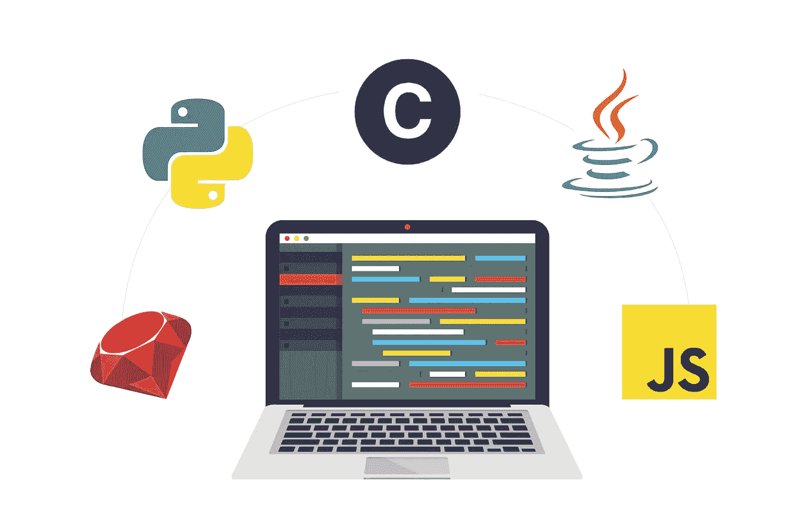

# 先学什么编程语言最好？这要看情况而定

> 原文：<https://blog.devgenius.io/whats-the-best-programming-language-to-learn-first-it-depends-613b68d3e658?source=collection_archive---------13----------------------->

无论你是打算将编程作为一种爱好、一种新的职业，还是仅仅为了提升你目前的角色，你要做的第一件事就是决定你想从哪种编程语言开始。

当然，没有正确的答案。选择第一种语言将取决于你想从事什么样的项目，你想为谁工作，或者你希望它有多简单。希望这个指南能帮助你更好地了解你应该选择哪一个。

# 计算机编程语言

[如果你想先学习一门简单甚至有趣的编程语言，Python](https://www.python.org/) 总是被推荐。Python 读起来像英语，对于编程新手来说也很容易理解，而不必拘泥于严格的语法规则。这允许您获得编码实践的基本知识，而不必纠结于在其他语言中通常很重要的小细节。

Python 也是 web 开发、图形用户界面(GUI)和软件开发的理想选择。事实上，[用它来建立 Instagram、YouTube 和 Spotify](https://makeawebsitehub.com/which-programming-language/) ，所以除了更快的入职速度，它显然也是雇主们的需求。

尽管 Python 有其优势，但它通常被认为是一种需要更多测试的缓慢语言，并且不像其他语言那样适合开发移动应用程序。

# C#

虽然 C 语言是比较难学的语言之一，但它仍然是一门很好的入门语言，因为几乎所有的编程语言都是用 C 语言实现的。这意味着一旦你学会了 C，学习更多的语言就变得简单了，比如 C++和 c#。

因为 C 语言更“机器化”，所以学习对于教你计算机如何工作是很有帮助的。软件开发人员 Joel Spolsky [将它比作成为医生之前理解基础解剖学](https://www.joelonsoftware.com/2005/01/02/advice-for-computer-science-college-students/)，使其成为高效编码的最佳方式。

这样，如果你愿意接受挑战，C 语言是从一开始就成为一名优秀的程序员和有才华的开发人员的绝佳选择。

# Java 语言(一种计算机语言，尤用于创建网站)

Java 是一种面向对象且功能强大的编程语言，需求量很大。它是在“编写一次，在任何地方运行”的前提下构建的，这意味着它可以在任何设备上编写并跨平台工作。

这使得它成为最受欢迎的语言技能之一(是的，我们指的是[高薪](https://www.techworm.net/2016/06/15-highest-paying-programming-languages-2016.html))。所以，如果你想学习一门能让你获得一份好职业的语言，这可能是你的不二之选，尤其是因为【Java 程序员的顶级雇主包括易贝、亚马逊和 IBM 。

此外，Java 通常用于 Android 和 iOS 应用程序开发，因为它是 Android 操作系统的基础，这使得它成为您构建移动应用程序的最佳选择之一。

虽然 Java 可能不像 Python 那么容易掌握，但它是一种高级语言，所以相对来说对初学者还是比较友好的。然而，它的启动速度很慢，新手部署他们的第一个项目需要更长的时间。

# Java Script 语言

[JavaScript](https://www.javascript.com/) 是另一种非常流行的语言。你每天使用的许多网站都依赖于 JavaScript，包括 Twitter、Gmail、Spotify、脸书和 Instagram [，根据大会](https://generalassemb.ly/blog/learning-to-code-why-you-should-learn-javascript-first/)。

此外，在给网站添加交互性时，它是一个必备的工具，因为它可以与 HTML 和 CSS 进行通信。这使得它对于前端开发和面向消费者的网站至关重要，同时在后端开发中变得越来越重要，并且[需求一直在增长](https://medium.freecodecamp.com/what-programming-language-should-i-learn-first-%CA%87d%C4%B1%C9%B9%C9%94s%C9%90%CA%8C%C9%90%C9%BE-%C9%B9%C7%9D%CA%8Dsu%C9%90-19a33b0a467d)。由于其受欢迎程度，JavaScript 也是测试自动化框架中的领军人物，是框架[量角器](https://help.crossbrowsertesting.com/selenium-testing/frameworks/protractor/)和 [Nightwatch.JS.](https://help.crossbrowsertesting.com/selenium-testing/frameworks/nightwatchjs/) 的支柱

JavaScript 不需要安装任何东西，因为它已经内置在浏览器中，所以就设置而言，它是最容易上手的语言。这里的缺点是，这意味着它在不同的浏览器中有不同的解释(你需要做一些额外的[跨浏览器测试](https://crossbrowsertesting.com/))，并且与服务器端脚本相比，在[响应设计](https://crossbrowsertesting.com/responsive-testing)中可能有缺陷。

同样，虽然它不是最难学的，但肯定不像 Python 那么容易。如果 Javascript 一开始看起来很难，试试这个 [Javascript 教程，它简单到连猫都能做](http://jsforcats.com/)。

# 红宝石

Ruby 与 Python 的相似之处在于，对于没有编程经验的人来说，它是最容易阅读的语言之一。学习它不需要知道大量的命令或编程词汇，它有许多方便使用的库和工具。

人们喜欢 Ruby 的一个重要原因是因为令人敬畏的全栈框架 [Ruby on Rails](http://rubyonrails.org/) ，它在创业公司和企业解决方案中越来越受欢迎。Airbnb、Groupon、Hulu 和 Soundcloud 只是用 Ruby on Rails 构建的[网站中的几个，Ruby 如今拥有相当活跃的开发者社区。](http://learn.onemonth.com/10-reasons-beginners-should-learn-ruby-on-rails)

然而，它在小企业中如此受欢迎的原因往往是对它的许多批评之一。Ruby 在大型系统中面临可伸缩性的挑战，在大型网站上可能会遇到性能问题。此外，虽然 Ruby 确实很容易学习，但是您会发现大多数机会都来自于学习 Ruby on Rails，如果您只是想走捷径创建一个网站，这可能会减慢您的学习速度。

# 那么，学什么编程语言最好呢？

*   *如果你正在寻找简单的东西:* Python
*   如果你想要一个坚实的基础来使你成为一个优秀的开发者
*   *如果你在找工作或者想开发移动应用:* Java
*   *如果想尝试前端开发:* Javascript
*   如果你正在为你的初创公司网站编程: Ruby

虽然可能有选择的策略，但 Roger Collier 强调，无论你选择什么，编程都是困难的(即使是用 Python)。开始会令人沮丧，而且，变得真正擅长它。然而，他也表示，这种接受挑战学习他人可能没有耐心学习的技能的亲和力是程序员如此独特的内在原因。

用他自己的话说，作为一个 Javascript 爱好者，Collier 断言“[学习编程很难，这就是我喜欢它的原因](https://medium.freecodecamp.com/make-your-hobby-harder-programming-is-difficult-thats-why-you-should-learn-it-e4627aee41a1)”

尤其是对于测试人员来说，随着 QA 行业开始越来越需要[测试自动化](https://crossbrowsertesting.com/automated-testing)方面的技能，编程知识成为了无价的财富。在“[中，编码是测试自动化职业的关键:你准备好了吗？T.J. Maher 提出学习编码是进入测试自动化的第一途径。然后，即使你认为你理解了，你也需要一直继续练习。](https://techbeacon.com/coding-key-test-automation-career-are-you-prepared#disqus_thread)

“最重要的是，一旦你被聘为测试自动化工程师，就不要停止练习编码，”Maher 说。“学习是一个永无止境的旅程。”

此外，不管你选择哪种语言，最好不要在学习完第一种语言后就停下来——最好的程序员都有自己的语言组合。在你学会一个之后，剩下的可能会更容易掌握。

要开始使用这些语言中的一种进行测试自动化，请查看 [Selenium 测试指南](https://crossbrowsertesting.com/toolkit/selenium-testing/)或查看我们关于从手动到自动化测试的电子书[。](https://crossbrowsertesting.com/pdfs/moving-from-manual-to-automated-testing.pdf)

而且，如果你仍然不能决定，这里有一个非常酷的信息图，应该会让你的事情变得更容易。