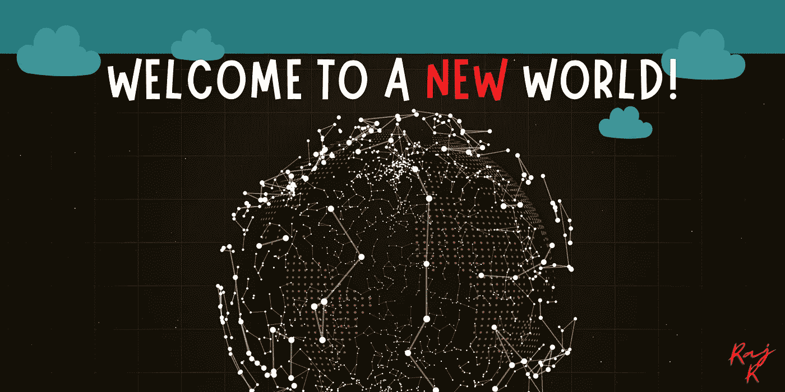

# 什么是热门话题——Web 3.0？

> 原文：<https://blog.devgenius.io/whats-the-buzz-about-web-3-0-4fd928522696?source=collection_archive---------12----------------------->

Raj R 的作品。

> 如果你正在阅读科技博客，追随一些最活跃的科技影响者，而不是生活在岩石下，我相信你一定偶然发现了“Web 3.0”这个词——彻底改变了互联网。它声称要彻底改变互联网的存在方式。你可能还知道一些其他相关的术语，如 NFTs、智能合约、区块链和最后的 Meta-verse(主要是由于脸书)。

这篇文章是写给那些刚刚听说过这个术语，但不知道它的意思的人的。此外，这篇文章标志着我将尝试写下我对新兴技术的看法和想法的系列文章的开始。

所以，让我们开门见山，开始吧。

> Web 3.0 是互联网的下一个版本，也就是每个人之间的连接**，它不受任何群体或组织的控制，但它将由每个人**——字面意思是每个人——控制。

我知道刚开始消化起来似乎不太容易，但试着再读一遍。不要关注我们将如何实现它，我们稍后会讨论它，但只关注你将拥有连接的部分。

你可以说你现在已经拥有了连接和通信，你可以选择打开或关闭你的互联网，你可以选择添加你的朋友，你可以选择关注或不关注谁。但是这里你只是有一个选择，而不是连接的所有权。你有一个选择，因为组织/所有者给了你这个选择。所以你看，到现在为止，你在网上并没有任何东西。你的个人资料，你的聊天记录，你的照片都归主要机构所有，如果他们愿意，他们可以限制你使用互联网。

*“但是我们为什么需要所有权呢？仅仅是用我的 Instagram 发布和喜欢图片，我就很开心。”*

这是一个很好的问题，在尝试构建下一个版本之前，我们真的应该了解当前版本的 web 有什么问题。如果什么都没坏，为什么要修理它？对吗？

> 所以让我们讨论一下为什么现在的 Web 2.0 不好，为什么它需要修正？

首先，让我们试着理解为什么数据是金子，如果你有足够多的数据，你实际上可以做任何事情——你可以通过分析你的偏好，通过分析你与你的朋友和家人谈论什么来赢得选举。你可能认为你的个人观点、喜好和厌恶并不重要，如果这些公司给你“免费”服务作为交换，那么它们存储或处理你的数据也没关系。但你不明白的是，当这些数据是从数百万、数十亿人那里收集的时候，它就变得太强大了，现在这种力量掌握在少数大公司手中，比如亚马逊、脸书、谷歌、推特等。

目前，你无法阻止他们使用你的个人资料、聊天记录和推文，因为他们拥有这些数据——当你与他们注册时是合法的(如果你曾经费心阅读过服务协议)。

有时，这种数据收集似乎对我们所有人都有好处——就像谷歌地图在出现拥堵时显示最短路线，并平衡交通。但是，如果谷歌决定以有利于其附属商店和企业的方式重新路由，会发生什么呢？除了抵制使用谷歌地图，我们什么也做不了，因为谷歌地图已经变得必不可少，这似乎是不可能的。

目前，数据世界是一个君主制的世界，关于如何处理你的数据的决定掌握在大领主(read 公司)手中。Web 3.0 是这个数据世界的民主版本。

> 好吧！！我在船上——但是我们怎么做呢？我们如何拥有数据？

嗯，每个人都说分散式网络是使用区块链技术和智能合同解决这个问题的答案，但是这个版本的网络还没有出现的原因是因为**还有很多事情需要解决！**需要建立大量的细节和概念。没有人知道前进的最佳方式是什么，这就是为什么你应该阅读每个人的 Web 3.0 版本，以真正了解你如何为这一新兴技术做出贡献。

敬请关注即将发布的关于我们如何实现 Web 3.0 以及该领域最大挑战是什么的帖子。

*更多内容尽在*[*blog . dev genius . io*](http://blog.devgenius.io)*。*