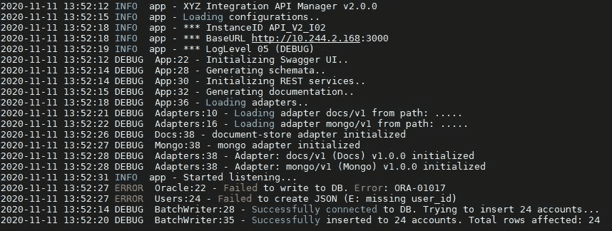
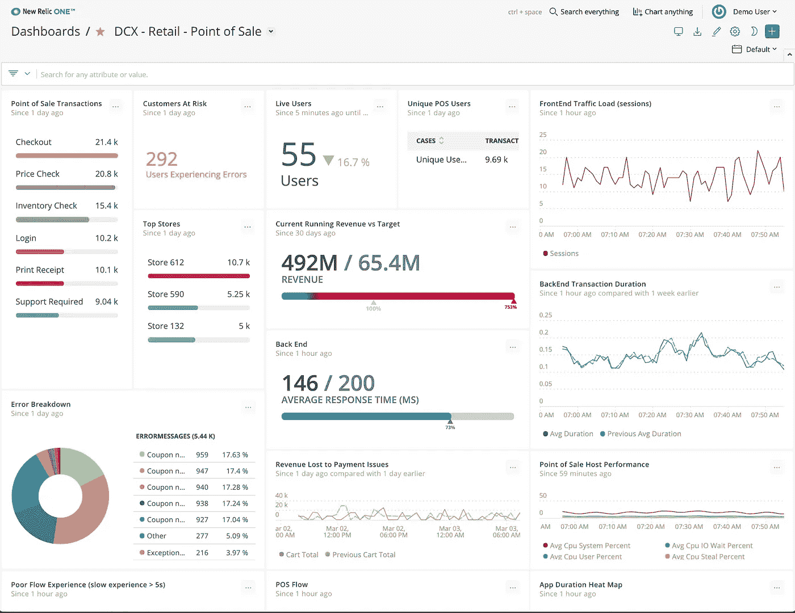

# 监控和日志记录是怎么回事？

> 原文：<https://blog.devgenius.io/whats-the-deal-with-monitoring-and-logging-d21d340330fc?source=collection_archive---------11----------------------->

## 日志语句的真正目的是什么？你为什么要烦恼呢？

卢克·切瑟在 [Unsplash](https://unsplash.com?utm_source=medium&utm_medium=referral) 上的照片

如果你做过任何编程，你可能会遇到一个“日志”语句。您可能将它用作调试辅助工具；让你的代码在有问题的地方吐出一些信息。但这是他们真正的目的吗？如果你的应用要在用户无法访问的网络服务器上运行，那么让你的应用向控制台写一堆信息有什么意义呢？

在本文中，我将解释:什么是日志记录，它与相关的监视概念有何不同，以及如何做好这两者。

## 监控与日志记录

日志记录和监控通常是由 SaaS(软件即服务)应用程序完成的。就像测试一样，它们与为应用程序增加功能的核心工程工作是分开的，但是对于制造高质量的东西仍然是至关重要的。

“日志记录”指的是对应用程序产生的日志数据的管理。根据应用程序的不同，日志数据看起来可能会有很大的不同，但是一般来说，它应该包含一些在应用程序出错时可以用来回顾的信息。所有日志数据通常都应该与某个跟踪/请求/关联 id 相关联，以便您可以隔离特定的会话/请求/事件。日志数据也需要放在某个地方，把它放在控制台不再有用。市场上有很多解决方案可以存储你的数据，并提供一个方便搜索的界面。

按类型分类的示例日志(调试、错误、信息)

“监控”是指确保应用程序保持可用和正常工作所需的任务。现代的、全球可访问的应用程序接收了太多的流量，以至于人们无法跟踪任何一个时间点发生的事情。监控工具处理所有这些数据，并生成更有用的汇总统计数据。同样，这看起来会有所不同，取决于您所监控的内容。对于 REST API，监控可能意味着跟踪每个端点的延迟，以确保它保持在可接受的范围内。我们可能跟踪的其他属性是可用性、吞吐量、故障率、活动用户数量等。通常，团队会确定这些度量的目标区域。你可能见过人们谈论“3 个 9 的正常运行时间”；这意味着他们的应用程序 99.9%的时间都可用。

监控仪表板的示例

## 知道要追踪什么

做好监测和记录的部分问题是确定记录和监测什么。对于监控来说，这稍微容易一点；每个应用程序都希望尽可能地可用和成功。其他措施可能是由商业考虑驱动的。根据你的产品，像每日活跃用户或活跃小时数可能很重要。

记录更加困难，因为很难预测哪些信息将有助于您提前解决问题。一些好的第一步可能是做以下事情。每当发生未处理的异常时，记录它的消息，你就知道一定有什么地方出错了。每当你的应用程序调用外部服务时，记录日志，这可能有助于你诊断问题出在哪里。一旦发现问题，您还可以添加更多日志来帮助解决问题。

## 危机控制

即使有世界上最好的开发团队，您的代码中也会有 bug，部署会失败，硬件会不可靠。当出现问题时，您在监控和日志记录上花费的精力应该有助于您发现问题并快速纠正它。

当开发人员或用户发现并记录了一个 bug 时，你应该(如果你做得对)能够使用他们提供的跟踪/请求 id 来读取他们与你的应用程序交互的日志。由此，你可以更容易地诊断问题。

团队通常会设置警报，当受监控的度量超出可接受的范围时，就会触发警报。一些开发人员将是“随叫随到”的，根据问题的严重性，他们可能会接到自动电话，告诉他们解决问题。我知道很多开发人员晚上睡得很安稳，却被警报打扰了。这显然不好玩，但有时是必要的，许多公司为忍受这种情况的人提供额外的假期。

## 关闭

和测试一样，监控和日志记录很容易被团队忽视。我希望这篇文章已经展示了它们为什么重要。监控将有助于您的团队找出问题所在，日志记录将有助于您找出原因。

如果你喜欢这篇文章，你可能会喜欢我的抖音。或者，看看我在 Medium 上的其他文章，并考虑关注我。