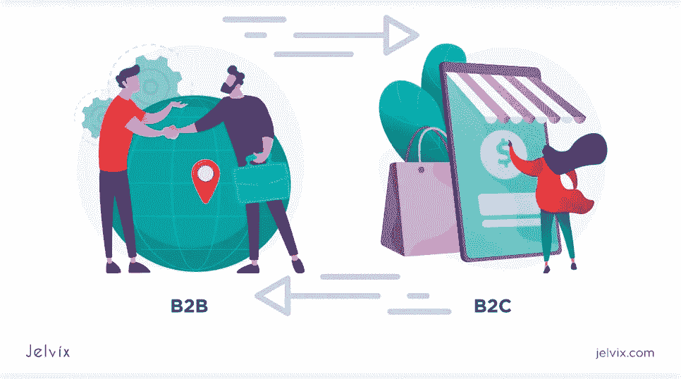

# 电子商务和电子商务有什么区别？

> 原文：<https://blog.devgenius.io/whats-the-difference-between-e-business-and-e-commerce-b87ec7353ea?source=collection_archive---------1----------------------->

由于我们的客户在许多商业报价中对电子商务网站的大量请求和高需求，我们决定在本指南中讨论电子商务和电子商务之间的主要区别。电子商务技术和应用的清单每天都在增长，从而为所有在线业务增加了可观的价值。

寻找智能电子商务解决方案的精明企业家互换使用这两个术语，这可能会使提供这种解决方案的开发机构感到困惑。此外，不明确的需求经常导致开发不准确的业务模型，从而导致项目失败。

为了防止这一点，你必须知道电子商务和电子商务的区别，这样你就可以使你的项目成功是不可避免的。

下一节将详细说明这两个经常混淆的商业术语之间的区别，以及理解和使用这两个流行的网络电子商务和电子商务的一些重要的基础知识。

# 什么是电子商务？

虽然电子商务经常与电子商务混淆，但它们不是同义词。电子商务，也称为互联网商务，是通过互联网销售和购买商品或服务的过程。这个术语也可以用来描述任何通过网络进行的商业交易。与实体商业不同，它不需要任何面对面的会议来完成整个销售和购买过程。

电子商务与电子商务的主要区别在于，后者指的是通过互联网开展业务的所有方面。相比之下，电子商务明确地指处理商品和服务的交易。

电子商务模式千差万别，可以包括不同的销售类型。自 20 世纪 90 年代以来，许多街头企业已经适应了电子商务，现在正在推动网上购物。例如，在 B2B 电子商务中，企业通过网站向消费者销售产品。

许多大公司，如苹果、耐克、沃尔玛等。，也使用流行的视觉市场来增加网上销售。这使得顾客可以以批发价购买他们的产品，同时，也提供了创造更多收入的潜力。所以，无论你是从零售商还是耐克官网购买耐克运动鞋，交易仍然是电子商务的一个例子。

电子商务包括销售的每一个环节:产品订购、订单支付和交货。它也可能只涉及销售过程的一部分。例如，客户可以在网上购买产品，并从附近方便的地点选择当地提货选项。为了完成购买，他们可能使用在线或离线支付方式；不管怎样，这项交易仍然涉及电子商务的元素。

根据最近的统计，预计到 2040 年，95%的采购将通过电子商务进行。

下一节将详细讨论最常见的电子商务模式，并提供一些在电子商务市场中占有一席之地的流行电子商务示例。

# 电子商务模式的类型

下面列出了四种主要的电子商务模式，它们描述了企业和消费者之间进行的任何交易。

# 1.企业对企业(B2B)

这种类型的电子商务涉及两个企业之间进行的各种电子交易处理服务或产品。B2B 模式通常用于描述生产商和零售商之间的关系，后者向最终消费者销售产品。

B2B 市场的一个很好的例子是汽车行业。最大的汽车公司与众多制造商合作，为他们品牌的汽车购买零部件。当你从一家公司购买汽车时，你购买的是由世界各地数十家供应商生产的零部件:因此，它们是 B2B。

**B2B 电子商务模式的最佳案例**

亚马逊商务是一个 B2B 电子商务市场，目标是公司，而不是个人。虽然许多人都熟悉 B2C 亚马逊的成功，但你可能会惊讶地发现，它的 B2B 平台也是市场领导者。到 2021 年底，亚马逊[的 B2B 销售额预计将超过 250 亿](https://www.digitalcommerce360.com/2018/09/11/amazon-business-surpasses-10-billion-in-annualized-sales/)，甚至超过其 B2C 销售额。

这里要考虑的另一件事是，亚马逊业务甚至没有在 2019 年之前瞄准大型国际成功。这意味着该平台的增长才刚刚开始，而且已经达到了令人印象深刻的门槛。

**B2B 亚马逊的特点**

*   **多功能面向业务的管理面板:**该平台允许公司管理多张发票，跟踪库存，生成文档；
*   **Business Prime subscription**在成本和交付费用方面提供了许多优惠&,并允许进入专属社区；
*   **不断更新:**亚马逊业务不断推出核心功能的新更新。他们让竞争对手保持紧张，并以多样化的功能吸引客户。

# 2.企业对消费者(B2C)

这种商业模式被认为是最早和最常见的电子商务形式。据统计，B2C 电子商务市场在行业中占最大份额，预计到 2027 年将达到 6.2 万亿美元。在 B2C 中，产品/服务在卖家和个人消费者之间直接销售。

B2C 商家出售各种实物和电子商品，从服装到电子书，并允许消费者在没有太多等待时间的情况下体验购买过程。B2C 企业的常见例子包括亚马逊、谷歌、沃尔玛和其他在线向最终用户销售产品的公司。

**B2C 商业模式的例子**

Spotify 是创新 B2C 服务的一个例子，它为众所周知的问题提供了创新的解决方案。让用户直接访问音乐、播客和音频文件是该平台的主要目标。基于订阅的商业模式鼓励用户在服务上花费更多时间，而不是为每首歌曲或收听时间付费。

根据 [Spotify 的官方新闻稿](https://s22.q4cdn.com/540910603/files/doc_financials/2020/q3/Shareholder-Letter-Q3-2020_FINAL.pdf)，到 2020 年底，该平台的活跃用户数量已经增长到 3.2 亿用户。每个季度，该平台都显示出 20-30%的稳定增长，证明了该商业模式的可持续性。

**Spotify 的特点**

*   **简单的用户体验**:在 B2C 平台，用户体验的难易程度是决定性因素。如果访问者设法迷上了功能和界面，企业可以建立长期的关系。Shopify 在这方面完全成功，提供了非常透明的功能和整洁的界面。
*   **高效个性化**。许多 B2C 平台都展示了推荐引擎的威力，包括网飞、亚马逊，当然还有 Shopify。该平台跟踪用户的收听偏好，并提供新的曲目——所有这些都是为了鼓励长时间的页面访问。
*   **与艺人合作。B2C 企业经常需要与其他个人和公司合作，以增加产品的多样性。Shopify 也不例外。该平台推出了一些项目，让艺术家更容易受到关注，并提供了一个透明的支付系统。**

# 3.消费者对消费者(C2C)

一种电子商务商业模式，消费者通过流行的在线做市商向其他消费者出售商品或个人服务。做市商的角色是提供一个与搜索引擎标准、定价和销售交易相匹配的目录，这样产品就可以很容易地被发现和支付。

最著名的 C2C 公司网站是易贝、亚马逊、Etsy 和 Craigslist，但还有许多其他非常棒的分类和拍卖网站。C2C 平台不一定要以产品为导向；服务也可以是有市场的。

C2C 平台的一个例子:iTalki

[iTalki](https://www.italki.com/) 是一个面向语言学习者的在线平台，它将想要学习外语的个人与母语人士联系起来。管理员和版主在这个过程中进行调解，但是没有公司实体参与其中。用户提供需求和供给。网站通过从交易中获得佣金来获得收入。

iTalki 现在有 300 多万用户，一些活跃用户每周能提供超过 172 堂课。建立这样一个专门的社区是确保 C2C 平台上持续收入流的一个好方法。

**C2C 平台的特点:**

*   两种类型的用户档案:一种给卖家，一种给买家。买家应该看到他们的订单和收据，并跟踪与卖家的接触。使用 iTalki，学习者可以跟踪他们即将开始的课程，寻找新老师，留下评论，并批准消息。另一方面，教师控制他们的教学进度，与版主交流，并有来自社区的特别优惠。
*   **版主简介**。该团队必须不断雇佣管理员和版主，他们将跟踪欺诈档案，验证报价的质量，并解决冲突。
*   透明的评级和评论系统。有了点对点平台，信任是建立成功社区的关键。向买家展示卖家的评论和评级，让他们了解报价的质量——这正是 iTalki 所做的。

# 4.消费者对企业(C2B)

消费者对企业是指促进消费者和企业组织之间交易的商业模式。C2B 的主要目标是帮助个人向公司销售产品或服务，并为双方创造双赢的局面。在 C2B，企业从优惠的价格中获利，而消费者从市场创造的交易灵活性中获益。

有许多 C2B 网站列出了自由开发者，企业可以浏览他们需要的东西。这类网站的常见例子包括 UpWork、Google、Commission Junction 和 Fotolia。

除了上述类型，电子商务还包括 G2C(政府对消费者)、C2G(消费者对政府)和 B2E(企业对雇主)。

众包公司是消费者对企业模式的一个很好的例子。最大的众包平台 Eyeka 将大品牌与创作者联系起来，帮助公司寻找创意，用户也因其贡献而获得报酬。

就像 C2C 公司一样，C2B 的商业需求管理部门——一个团队应该监督报价的质量，并确保双方满足他们的需求。在 Eyeka 上，每一个提交的标志、创意或命名项目都要经过官方审核，然后才能提交给某个品牌进行审议。

**C2B 公司的特点:**

*   **仪表板**:每个用户都有一个个性化的仪表板，上面有适合特定技能、兴趣和要求的项目或报价。仪表盘提供了一种控制平台活动的方式，让导航变得更加轻松。
*   **个人简介**。用户和公司都应该有一个个人页面，存储他们在平台上的个人信息、历史和成就。人才搜索、求职和众包平台都有这个特点。
*   **公司特别优惠**。通常，吸引企业加入这样的平台比激励个人更难。一旦商家进入平台，人们将不可避免地被激励加入社区。因此，C2B 企业通常有一个专门为公司设计的合作伙伴计划。在用户和企业之间，后者通常具有更高的优先级。

# 什么是电子商务？

在线商务或电子商务可以定义为使用不同类型的在线工作开展业务的过程。与电子商务不同，电子商务处理在线交易，并促进商业过程，如制造，物流，客户服务，营销，销售等。因此，电子商务是电子商务的一部分。

电子商务利用在线技术的力量将组织的触角延伸到实体墙之外，从而提高了商业运作的效率。现代公司、非营利组织、政府和其他机构使用信息和通信技术来提高生产率、削减成本和实现快速业务增长。

例如，数字通信工具(如电子邮件或社交媒体)作为面对面通信的替代方式，通过减少查询和响应之间的延迟来提高客户支持效率。就这一点而言，电子商务通常将社交媒体转变为协作工具，以改善员工之间的沟通，加快决策速度。

公司用来促进电子交易的电子商务支付系统也减少了员工处理交易的时间。例如，电子发票使企业能够加快支付速度，并将员工从重复的手动工作中解放出来。因此，员工可以专注于更紧急、更有价值的任务，并提高工作场所的灵活性。

# 电子商务模式

主要的电子商务模式包括两大类:纯粹的游戏和点击式交易。这两个术语都是指一家在线公司，但不同之处在于这家公司如何利用互联网开展业务。纯游戏商业模式描述的是一家仅在互联网上运营的电子商务公司。

与此同时，实体企业指的是拥有实体店的传统企业，并使用网络作为交换机制。下面，我们确定了纯玩法与传统玩法的特点和区别。

# 纯游戏

投资者术语，最初用于描述服务于特定产品或行业的公司。然而，随着越来越多的玩家进入数字世界，经济专家用它来指代完全通过电子媒介开展的业务。

纯业务通常不受传统实体业务的限制，即复杂的供应链服务、昂贵的租金、排队等。然而，在沃尔玛和 Barnes & Noble 的混合成功故事之后，消费者更喜欢数字购物和为他们提供数字选择的商店。

就这一点而言，世界上最大的科技公司亚马逊在传统和电子商务之间取得了平衡，并将焦点转向了免结账技术。

2018 年 1 月，亚马逊开设了第一家免结账商店——亚马逊 Go 商店。它提供了超级方便的购物体验，包括没有收银员。要购物，你只需在进入商店时用 Amazon Go 应用程序识别自己的身份，扫描你想购买的商品的二维码，然后离开，不要在收银台停留。

一旦你完成购物，亚马逊会自动向你收费，你会收到一张自动收据。

随着新冠肺炎疫情的到来，随着在线购物取代传统零售商，免结账技术可能会停留在早期采用阶段。

# 砖块和点击(也称为点击和砂浆)

砖块和点击是一种商业模式，专注于电子商务(点击)和实体零售店(砖块)之间的线上线下融合。“点击和砂浆”公司利用其在业务中的物理和虚拟存在，从而在两个市场中保持漂浮。

面对面的交流使这些企业能够与他们的客户建立牢固的关系，从而增加他们的数字存在。因为顾客熟悉该品牌的产品，他们自然会花更少的时间浏览网站来找到他们想要的产品。

研究表明，除了实体零售店之外，那些推出互联网销售网站的零售商比实体店零售商更受消费者欢迎。例如，为了推动其业务，沃尔玛在其电子商务网站上投资了数十亿美元，以优化在线购物体验并提高客户忠诚度。今天，[网上销售额占沃尔玛总收入的 11%左右](https://www.forbes.com/sites/greatspeculations/2020/03/02/how-much-in-online-revenue-can-walmart-generate-in-2020/?sh=1769ddc12e26)。

# 电子商务组件

电子商务有三个主要组成部分:信息、通信和交易。然而，主要的焦点在于企业家用来提高电子商务效率的数字网络(信息)。下面列出了这些组件的关键领域。

*   **电子采购**(又名**供应商交换**)是一种 B2B 或 [B2G](https://www.investopedia.com/terms/b/business-to-government.asp) 通过网络以及其他信息系统如[电子数据交换](https://www.ebridgeconnections.com/solutions/edi-integration/edi-accounting-erp.aspx)采购商品和服务的过程。电子采购旨在使整个采购周期的程序自动化，减少成本和人工劳动。

电子采购提供了评估和选择供应商的便利，即电子商务和电子商务，以及使研究产品更容易，包括电子订购和目录。

*   **网上商店**是一个实体企业的官方网站，方便客户访问他们喜欢的品牌，并允许他们在不出门的情况下找到、订购和支付产品。
*   **在线市场**是一个电子商务平台，第三方卖家可以在这里向客户推销他们的产品。亚马逊和阿里巴巴被认为是全球领先的电子商务公司。
*   **在线社区**。这些网站要么是社交网络，要么是产品评论网站，顾客可以在这里互相建议，分享产品体验。[亚马逊顾客评论](https://www.amazon.com/gp/help/customer/display.html?nodeId=200791000)和[安吉的清单](http://www.angieslist.com/)是收集商业和产品评论的社区网站中最受欢迎的例子。
*   电子商务网站。电子商务网站是一个多品牌的在线商店，第三方卖家在这里向客户推销他们的产品。在线市场和电子商务网站的唯一区别在于，在后者中，库存归网站所有者所有，网站所有者可以经营在线商店来销售商品。网站老板还要给客户开发票，交增值税。

# 电子商务与电子商务的主要区别

现在你已经了解了电子商务和电子商务的主要特征，我们可以看看它们的区别。下面我们提供了一个电子商务与电子商务业务差异的列表。

1.  通过网络进行买卖不像开展商业活动那么容易。电子商务意味着使用信息技术来支持业务流程。相反，电子商务是电子商务的一部分，它描述了通过互联网进行的交易。
2.  电子商务使用 ICT 实现供应商和客户之间业务关系的数字化处理。另一方面，电子商务应用信通技术来提高业务流程的速度和经济效率。
3.  如果一个电子商务补充了网上商店的实体存在，它可以被称为电子商务。
4.  电子商务需要一个在线购物网站来提供产品和服务进行销售。电子商务需要成功地集成在线交易处理、CRM、互联网营销、电子数据交换和其他强大的工具，以使业务有效运行。
5.  电子商务使用互联网来提高运营效率，而电子商务使用互联网、内联网和外联网。
6.  电子商务的四种主要类型是 B2B、B2C、C2C 和 C2B。
7.  纯粹的游戏和传统的点击代表了两种主要的电子商务模式。
8.  电子商务行业将继续增长，到 2027 年，全球电子商务市场将达到【27.15 万亿美元。

# 最后的想法

我们的权威指南已经接近尾声，希望它能让你对电子商务行业有所了解。如果你有搬迁的商业计划，确保你知道经营一个成功的电子商务企业应该做什么和不应该做什么。如果您没有确切的想法或者刚刚开始，请访问[服务页面](https://jelvix.com/services)并查看我们的[零售](https://jelvix.com/industries/retail)软件解决方案。

我们可以帮助您实现业务运营自动化，并创造颠覆性的零售技术，彻底改变客户与您的品牌互动的方式。

【https://jelvix.com】最初发表于**。**