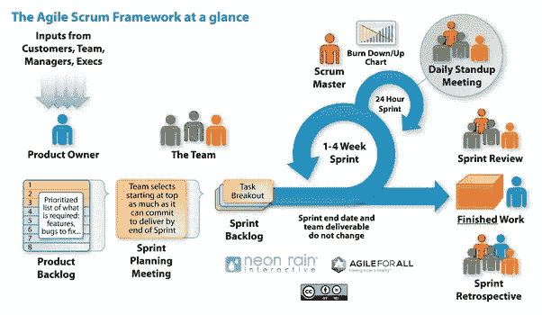

# Scrum 和敏捷有什么区别？

> 原文：<https://blog.devgenius.io/whats-the-difference-between-scrum-and-agile-8109437aa542?source=collection_archive---------4----------------------->

敏捷 vs Scrum 就像寻找两个不同单词“红色”**和**“颜色”之间的区别。红色是一种颜色，它的使用主要取决于使用者的品味。对于 **Scrum vs 敏捷**也可以这么说。

**Scrum** 是一种敏捷方法论。它基本上是一个敏捷过程框架。它快速反复检查主要工作软件。它强调团队合作、责任和朝着明确目标的迭代过程。事实上，软件开发术语中的 Scrum 和看板都是敏捷软件方法论的精确版本。

敏捷是基于**迭代和增量方法**的开发方法。Scrum 只是众多迭代和增量敏捷软件开发过程中的一个。你可以在这里找到非常详细的过程描述。与敏捷相比，它是一种更加严格的方法。所以频繁变动的空间不大。

**跟我来:**

***LinkedIn***-[https://www.linkedin.com/in/shormistha-chatterjee/](https://www.linkedin.com/in/shormistha-chatterjee/)

***博主****-*[*https://shormistha4.blogspot.com/*](https://shormistha4.blogspot.com/)*[*https://qaandsoftwareblog.blogspot.com/*](https://qaandsoftwareblog.blogspot.com/)*

***Dzone****-*[*https://dzone.com/users/3854036/shormistha.html*](https://dzone.com/users/3854036/shormistha.html)

***【Bloglovin】***-[*https://www.bloglovin.com/@shormistha*](https://www.bloglovin.com/@shormistha)