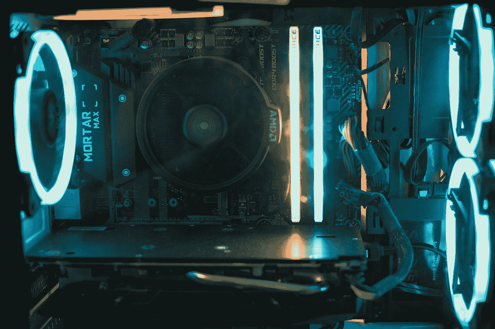
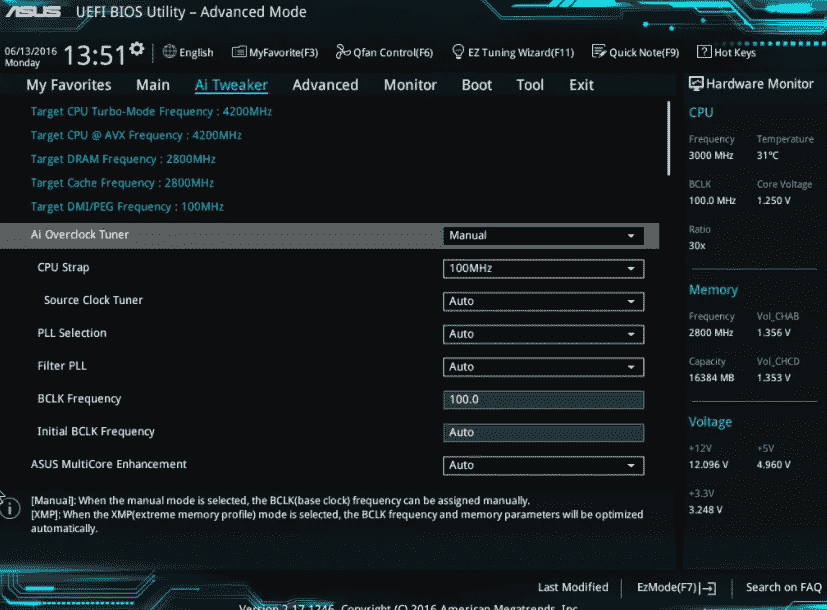
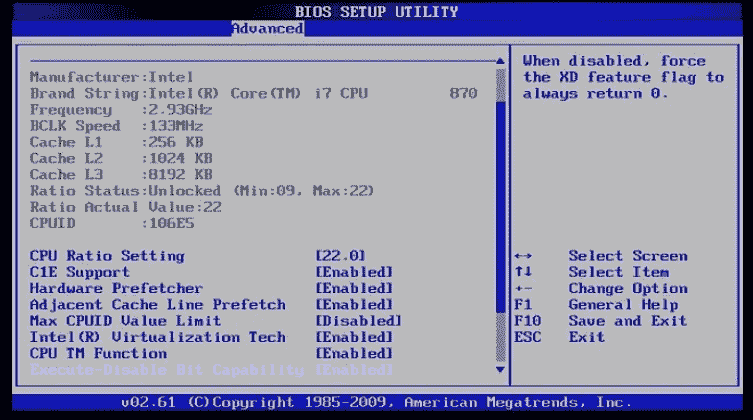

# UEFI 和 BIOS 有什么区别？

> 原文：<https://blog.devgenius.io/whats-the-difference-between-uefi-and-bios-c8bfed674f1f?source=collection_archive---------1----------------------->

你可能以前听说过这些首字母缩写词，尤其是在操作系统方面。您甚至可能知道这些分别代表什么(统一可扩展固件接口和基本输入/输出系统)。但是你有没有想过它们是如何在计算机系统中使用的？

约翰·卡罗·图布勒扎在 Unsplash[拍摄的照片](https://unsplash.com?utm_source=medium&utm_medium=referral)

# 引导程序

所以让我们先来看看一个计算机系统是如何启动的；这将有助于理解这两个概念。

1.  你按下笔记本电脑的电源按钮。
2.  CPU 启动，但需要一些指令来处理；请记住，CPU 总是需要做一些事情。由于主存储器在这个阶段是空的，CPU 推迟从主板上的固件芯片加载指令，并开始执行指令。
3.  固件代码执行开机自检(POST)，初始化剩余的硬件，检测连接的外围设备，如鼠标、键盘、笔驱动器等。，并检查所有连接的设备是否正常。您可能记得它是开机自检成功后台式机发出的“嘟嘟”声。
4.  最后，固件代码循环遍历所有存储设备，并寻找通常位于磁盘第一个扇区的引导加载程序。如果找到了引导加载程序，固件就会将计算机的控制权交给它。

出于本文的目的，我们不需要了解关于这个主题的更多信息。但是如果你感兴趣，那就继续读下去。否则，您可以跳到下一部分。

1.  所以现在启动加载程序已经加载了，它的工作是加载操作系统的其余部分。GRUB 就是这样一个引导加载程序，它能够加载类 Unix 操作系统，也能够链式加载 Windows 操作系统。Boot-loader 只在磁盘的第一个扇区可用，它是 512 字节。鉴于现代操作系统的复杂性，这些引导加载程序中的一些倾向于进行多阶段加载，其中主引导加载程序在不限于 512 字节的环境中加载第二阶段引导加载程序。
2.  然后引导加载程序将[内核](https://en.wikipedia.org/wiki/Kernel_(operating_system))加载到内存中。然后，类 Unix 操作系统运行作为主进程的`init`进程，从该进程中分支/执行其他进程，最后初始化[运行级别](https://en.wikipedia.org/wiki/Runlevel)。
3.  在 Windows 中，`wininit.exe`与其他一些进程一起加载，如用于服务控制的`services.exe`、用于本地安全和权限的`lsass.exe`以及用于本地会话管理的`lsm.exe`。
4.  在所有这一切之后，并且在一些其他驱动程序被初始化之后，图形用户界面(GUI)被加载，并且呈现给你一个登录屏幕。

> 学习最佳交易策略，提升你的交易水平！

成交量分析可以说是世界上最好的交易策略之一，已经被证明是有效的。点击[此链接](https://volumeprofileformula.com/vpf-sales-funnel?affiliate_id=3864458)开始。

# UEFI:

正如我们在开始时简要提到的，UEFI 代表统一可扩展固件接口。它的工作与 BIOS 相同，但有一个基本区别:它将所有关于初始化和启动的数据存储在一个. efi 文件中，而不是存储在固件中。

这个。efi 文件存储在硬盘上一个称为 EFI 系统分区(ESP)的特殊分区中。这个 ESP 分区还包含引导加载程序。

UEFI 旨在克服旧 BIOS 的许多限制，包括:

1.  UEFI 支持最大 9 兆字节的驱动器，而 BIOS 仅支持 2.2 兆字节。
2.  UEFI 提供了更快的启动时间。
3.  UEFI 有独立的驱动支持，而 BIOS 有存储在其 ROM 中的驱动支持，所以更新 BIOS 固件有点困难。
4.  UEFI 提供类似“安全启动”的安全性，防止计算机从未经授权/未签名的应用程序启动。这有助于防止 rootkits，但也阻碍了双重引导，因为它将其他操作系统视为未签名的应用程序。目前，只有 Windows 和 Ubuntu 签署了 OS。
5.  UEFI 在 32 位或 64 位模式下运行，而 BIOS 在 16 位模式下运行。所以 UEFI 能够提供一个 GUI，而不是 BIOS，它只允许使用键盘导航。

# BIOS:

BIOS 代表基本输入/输出系统，我们在上面的引导过程中谈到的固件。

它存储在 EPROM(可擦除可编程只读存储器)上，允许制造商轻松推出更新。

它提供了许多帮助功能，允许读取附加存储的引导扇区和在屏幕上打印东西。在引导过程的初始阶段，您可以通过按来访问 BIOS。`del`、`F2`或`F10`。

# BIOS 还是 UEFI？

尽管所有现代计算机都默认配备了 UEFI，但您可能会选择 BIOS 而不是 UEFI 的一些原因如下:

1.  如果你是一个初学者，并且不在乎摆弄任何类型的固件，BIOS 就是为你准备的。
2.  如果每个硬盘或分区的容量小于 2 TB，可以使用 BIOS。
3.  BIOS 允许在不改变任何设置的情况下运行多个操作系统。从现代的角度来看，这可能是一个安全问题，但是，嘿，对用户来说没有麻烦。
4.  BIOS 向操作系统提供系统信息。因此，如果您的操作系统运行在 16 位模式下，它不需要编写代码来与硬件交互。它可以直接使用 BIOS 提供的方法。否则，如果操作系统切换到 32 位或 64 位模式，它需要提供自己的子程序来与硬件交互。
5.  如果你喜欢键盘和基于文本的用户界面，而不是鼠标和图形用户界面，那么 BIOS 就是你的选择。

UEFI 考虑到了这些限制，并提供了传统模式。在其中，你可以运行一切，就像你有 BIOS 固件一样。但是请记住，英特尔已经宣布，从 2020 年开始，它将不再支持传统的 BIOS。

# 结束语

如果你对这篇文章有任何问题或建议，不要犹豫，在评论区留下回复。喜欢你读的东西吗？为什么不关注我的媒体简讯，这样你就不会错过我未来的任何文章了？很简单，点击[这里](https://kgabeci.medium.com/subscribe)，输入你的邮箱地址，按订阅。

你喜欢阅读媒体上的文章吗？考虑成为会员，有很多功能，你将获得所有创作者的内容，每月只需 5 美元。利用[这个链接](https://kgabeci.medium.com/membership)，你也帮我出一点小提成；点击成为会员，并输入您的信息。