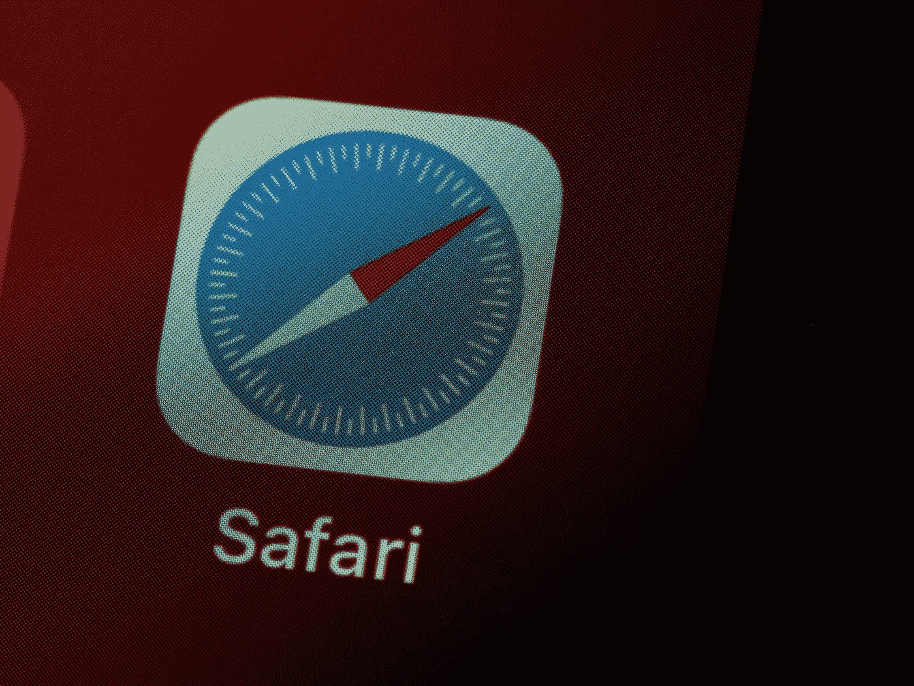

# 浏览器背后有什么故事？

> 原文：<https://blog.devgenius.io/whats-the-story-behind-browsers-a1024e402b64?source=collection_archive---------9----------------------->

## 首先，我们都曾在某个时候使用过浏览器。最有可能的是，你正在用一个阅读这篇文章。

布雷特·乔丹在 [Unsplash](https://unsplash.com?utm_source=medium&utm_medium=referral) 上的照片

首先，我们都曾在某个时候使用过浏览器。最有可能的是，你正在使用一个阅读这篇文章(除非你正在使用一个应用程序 lol。).浏览器有 Chrome、Firefox、Safari 和 Opera。它是用来搜索网页和显示你搜索的内容的软件。

现在我们知道它是什么了。让我们来谈谈它在幕后做些什么，这并不复杂。

浏览器的主要工作是渲染网页的内容。浏览器的主要部分包括:

1.  **用户界面:**你在浏览器中看到的东西(地址栏、导航按钮、书签菜单等。).
2.  **浏览器引擎:**发生在用户界面和渲染引擎之间的动作。
3.  **渲染引擎**(头奖！):它的工作是解析从服务器接收的 HTML 和 CSS 代码，并将该页面显示到屏幕上。
4.  **网络(tab):** 显示用户(客户端)向服务器发出的所有失败或成功的请求。
5.  **Javascript 解释器:**专门解析要执行的 Javascript 代码。
6.  **数据存储:**是浏览器内的一个数据库，帮助保存浏览器 cookies 等用户信息。浏览器本地。

这个过程的典型流程是这样的:客户端向服务器发送请求(脸书页面 URL)，服务器发回响应，浏览器从响应中获取数据，(**呈现引擎**)解析 HTML 和 CSS 代码以呈现在屏幕上。

**注意事项:**该请求可以在**网络选项卡**下找到。Javascript 也将在这个过程中被解析，但是使用的是 Javascript 解释器。

当然，您可以随意深入研究，但这是了解浏览器幕后工作方式的良好起点。

我根据这个[前端开发者](https://roadmap.sh/frontend)指南来写这些帖子，以帮助初学者理解这些主题。尽情享受吧！

还有，我最近成为了 Fiverr 上的自由职业者(用我的技能去帮助别人)。有机会的话来看看我的演出。:)

[五通](https://www.fiverr.com/ajeasmith/convert-your-psd-design-to-a-website)