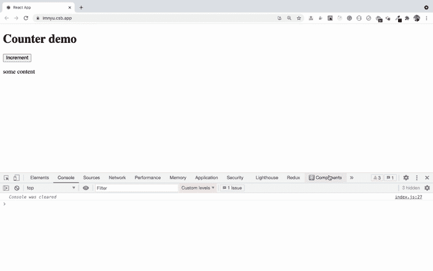
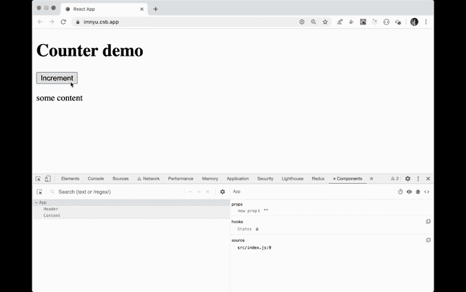
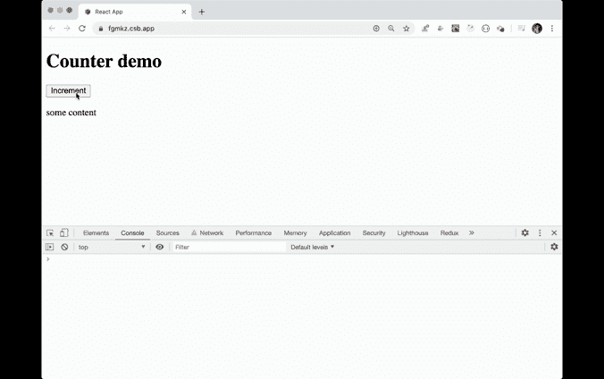

# 当在 React 中使用状态存储数据不合适时

> 原文：<https://blog.devgenius.io/when-its-not-good-to-use-state-for-storing-data-in-react-adcf261e8467?source=collection_archive---------5----------------------->

理解为什么总是使用状态来存储数据不是一个好主意

约翰·施诺布里奇在 [Unsplash](https://unsplash.com?utm_source=medium&utm_medium=referral) 上拍摄的照片

在`React`中，每当我们处理任何数据时，我们总是使用状态来存储数据，状态可以是`string`、`number`或任何复杂的`object`。

> 如果您在呈现组件时使用该状态，或者如果您想在状态值改变时做一些事情，这是没问题的，但是如果您只是将该状态用于存储数据，而不是用于呈现，或者没有正确地传递给其他组件，那么您就不应该使用状态。

*因为每当状态值改变时，React 将重新呈现组件，并且它的所有子组件也将重新呈现。*

看看下面的代码:

Counter.js

这里，我们将`count`存储在状态中，但是我们没有在渲染中使用它，也没有将它作为道具传递给其他组件。您可能只是使用它来检查有多少点击发生或其他一些目的。但这将使你的应用程序重新呈现每一个按钮点击，只是因为你使用了状态。

演示:[https://codesandbox.io/s/invalid-use-of-state-imnyu](https://codesandbox.io/s/invalid-use-of-state-imnyu)

预告:[https://imnyu.csb.app/](https://imnyu.csb.app/)

如果您打开预览链接 about 并打开 react dev 工具，然后在`components`选项卡中单击滚轮图标并选择标有“`Highlight updates when components render`的复选框，您将能够看到何时以及哪些组件被重新渲染

重新渲染应用程序

如果我们有一些呈现大量数据的组件，例如用户列表，那么只需单击一下就可以为每个用户重新呈现组件，这并不好。所以 React 提供了另一种处理方式。

> 如果你想存储一些数据但是不想重新渲染 app，那么你可以使用 React 提供的`useRef`钩子。

看看使用`useRef`编写的相同代码

上面代码中的`inputRef`包含一个`current`属性，它保存 ref 的实际值。

应用程序未重新呈现

如你所见，计数在增加，但应用程序没有重新渲染。

演示:*[【https://codesandbox.io/s/using-ref-to-manage-data-fgmkz】](https://codesandbox.io/s/using-ref-to-manage-data-fgmkz)*

*预告:[https://fgmkz.csb.app/](https://fgmkz.csb.app/)*

> **如果你正在使用类组件而不是功能组件，那么你可以使用* `*React.createRef*` *方法创建一个引用。**

*演示:[https://codesandbox.io/s/using-ref-to-manage-data-vh490](https://codesandbox.io/s/using-ref-to-manage-data-vh490)*

*预告:[https://vh490.csb.app/](https://vh490.csb.app/)*

***结论:***

*只有在`render`方法中使用 state 或者将它作为道具传递时，才应该使用 state。*

*如果你想存储数据只是为了跟踪一些值，你应该使用`ref`而不是状态。*

*这将避免额外的重新渲染，因为多次重新渲染可能会导致性能问题，这对较小的应用程序可能不明显，但它会影响正在进行大量数据处理的大型应用程序。*

*今天到此为止。我希望你学到了新东西。*

***别忘了直接在你的收件箱** [**这里订阅我的每周简讯，里面有惊人的技巧、诀窍和文章。**](https://yogeshchavan.dev/)*