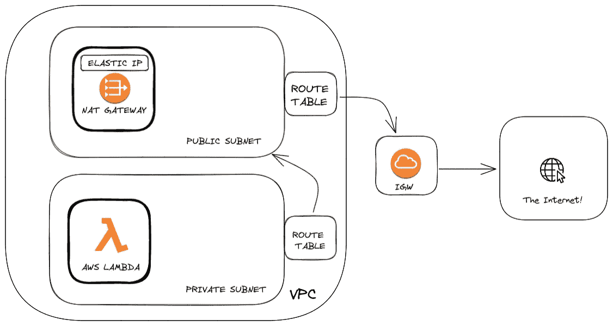
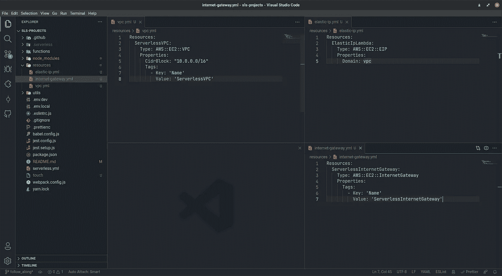
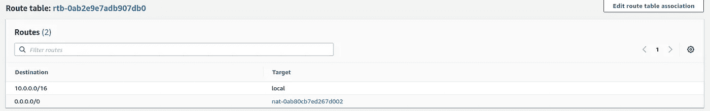
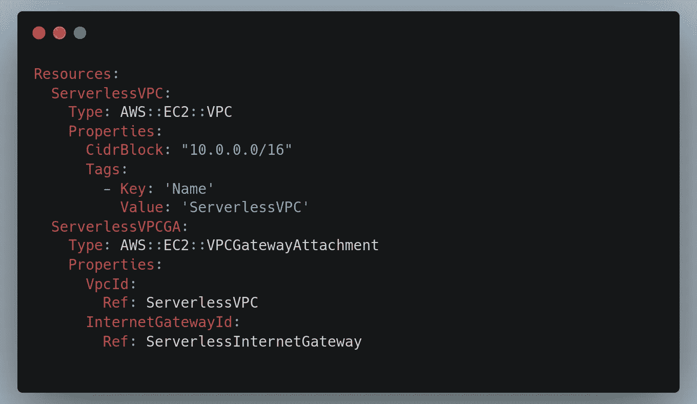
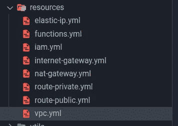
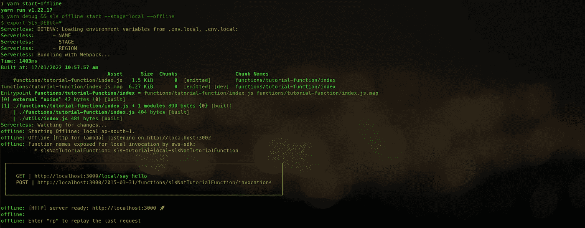
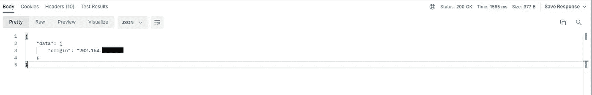

# 当少即是多:无服务器 NAT 网关—第 1 部分

> 原文：<https://blog.devgenius.io/when-less-is-more-serverless-nat-gateway-part-1-b2c2cd2555f6?source=collection_archive---------11----------------------->


无服务器架构为开发人员提供了各种优势，这些优势在大型可伸缩应用程序的开发中证明是有吸引力的。让我们回顾一下 3 大优势:

1.  它提供了编写代码和部署到云的能力，而不用担心基础设施。
2.  它增强了为你所使用的东西付费或**只执行计费的经济意义。**
3.  能够**用您选择的语言/框架编写应用程序**，快速完成生产就绪设置。

第三方服务的集成是开发生命周期中不可避免的一部分。如果您使用的是具有安全意识的第三方服务，那么一个常见的需求就是将一个 IP 列入白名单，以利用这些服务。

在这个由两部分组成的教程系列中，我们将通过一些额外的 AWS 资源来完成 AWS lambda 函数的创建**,这些资源将允许您**为第三方服务提供用于白名单通信的静态 IP** 。**

让我们从本教程的第 1 部分开始，您将:

*   使用 webpack 的无服务器框架创建一个无服务器应用程序和所有必需的 AWS 资源。
*   为静态 IP 集成 NAT 网关和弹性 IP。

在本系列的下一部分(即第 2 部分)中，您将，

*   使用 GitHub Actions 作为 CD 管道来验证和部署到 AWS。

# 建筑

本教程假设您对以下 AWS 服务有专家级的理解:

*   [NAT 网关](https://docs.aws.amazon.com/vpc/latest/userguide/vpc-nat-gateway.html)
*   [VPC](https://docs.aws.amazon.com/vpc/latest/userguide/VPC_Subnets.html)
*   [公共/私有子网](https://docs.aws.amazon.com/vpc/latest/userguide/VPC_Scenario2.html)
*   [互联网网关](https://docs.aws.amazon.com/vpc/latest/userguide/egress-only-internet-gateway.html)
*   [路由表](https://docs.aws.amazon.com/vpc/latest/userguide/VPC_Route_Tables.html)
*   [λ](https://docs.aws.amazon.com/lambda/latest/dg/getting-started-create-function.html)

我们还将使用无服务器框架来本地创建、设置、测试和部署应用程序。无服务器框架是开始使用无服务器架构和系统的绝佳工具。

请访问链接[https://www.serverless.com/framework/docs](https://www.serverless.com/framework/docs)了解更多。

我们的设置如下所示:



在本教程中，我们将帮助您完成一个 Lambda 函数的部署，该函数具有与弹性 IP 相关联的正确连接。

# 让我们开始建造吧

# 启动项目

简单介绍一下我们的产品。设置中最重要的部分是 **serverless.yml** 文件。在里面你会发现:

1.服务名:目前，它从 env 文件中读取。请随意使用您选择的一个。

2.插件:

*   [*-web pack*](https://www.npmjs.com/package/serverless-webpack)插件，用于捆绑功能、依赖项等。点击这里查看 [webpack](https://github.com/wednesday-solutions/sls-nat-gateway-eip-starter/blob/sls-starter/webpack.config.js) 配置。
*   [用于本地测试的无服务器离线](https://www.npmjs.com/package/serverless-offline)插件。

我们将把这部分教程分成两个部分

*   创建 AWS 资源
*   λ函数的加法

# 创建 AWS 资源

# 步骤 1-更新无服务器文件

在 serverless.yml 文件的最后几行下面添加以下几行:

```
...
functions: ${file(./resources/functions.yml)}
resources:
  - ${file(./resources/iam.yml)}
  - ${file(./resources/vpc.yml)}
  - ${file(./resources/security-groups.yml)}
  - ${file(./resources/internet-gateway.yml)}
  - ${file(./resources/elastic-ip.yml)}
  - ${file(./resources/nat-gateway.yml)}
  - ${file(./resources/route-private.yml)}
  - ${file(./resources/route-public.yml)}
```

‍

在这里，我们指出了设置这一切所需的功能(lambdas)和资源(AWS 基础设施)。我们将在此过程中添加这些文件。很刺激吗？

```
YAML syntax maybe problematic for some people.
Please take the **help** **of** lint **plugin** **or** a service 
**like** [**http**://www.yamllint.com/](http://www.yamllint.com/)
```

‍

# 步骤 2-添加 VPC

```
**vi** touch resources/vpc.yml
```

让我们添加资源。首先，在 resources 文件夹中创建一个 **vpc.yml** 文件。这是您将创建 AWS vpc 资源的地方。将以下代码复制并粘贴到 **vpc.yml** 中。不要忘记检查缩进，并根据需要更改名称和标签。

资源:

```
**Resources**:
  **ServerlessVPC**:
    **Type**: **AWS**::**EC2**::VPC
    **Properties**:
      **CidrBlock**: "10.0.0.0/16"
      **Tags**:
        - **Key**: 'Name'
          **Value**: 'ServerlessVPC'
```

‍:很基本的东西，对吧？我们有一个资源类型和一个 CIDR 块(一个 IP 地址范围)。

我们稍后将需要回到这个文件。我们继续吧。

# 步骤 3 —添加弹性 IP 和互联网网关

我们将在 resources 文件夹中创建两个名为 **internet-gateway.yml** 和 **elastic-ip.yml** 的文件。将以下资源添加到 **elastic-ip.yml** 中提到的文件中

```
**vi** touch resources/elastic-ip.yml## Elastic IP
Resources:
  ElasticIpLambda:
    Type: AWS::EC2::EIP
    Properties:
      Domain: vpc
```

‍

现在让我们创建 **internet-gateway.yml** 文件。

```
**vi** touch resources/internet-gateway.yml## Internet GW
Resources:
  SlsTutorialIGW:
    Type: AWS::EC2::InternetGateway
    Properties:
      Tags:
        - Key: Name
          Value: SlsTutorialIGW
```

‍:我们又创造了两种资源。允许我们从 AWS VPC 连接到外部互联网的互联网网关和弹性 IP 是将作为我们的服务 IP 地址提供给第三方的公共静态 IP。域是一个字段，指示弹性 IP 地址是否用于 VPC 中的实例(确实如此！).

此时，您的文件夹结构将如下所示:



# 步骤 4 —添加 NAT 网关资源和子网

```
**vi** touch resources/nat-gateway.yml
```

在参考资料中创建一个 **nat-gateway.yml** 文件。添加以下资源。

```
#nat-gateway.yml
Resources:
  ServerlessNatGateway:
    Type: AWS::EC2::NatGateway
    Properties: 
      AllocationId:
        Fn::GetAtt:
         - ElasticIpLambda
         - AllocationId
      SubnetId:
        Ref: ServerlessPublicSubnet1
  ServerlessPublicSubnet1: 
    DependsOn: 
      - ServerlessVPC
    Type: AWS::EC2::Subnet
    Properties:
      VpcId:
        Ref: ServerlessVPC
      CidrBlock: '10.0.2.0/24'
      AvailabilityZone: ${self:provider.region}a
      Tags:
        - Key: Name
          Value: ServerlessPublicSubnet1
  ServerlessPrivateSubnet1:
    DependsOn: 
      - ServerlessVPC
    Type: AWS::EC2::Subnet
    Properties:
      VpcId:
        Ref: ServerlessVPC
      CidrBlock: '10.0.1.0/24'
      AvailabilityZone: ${self:provider.region}a
      Tags:
        - Key: Name
          Value: ServerlessPrivateSubnet1
```

nat 网关是这场秀的主角。NAT 是一种服务，允许 vpc 内部的实例连接到外部资源或系统，但禁止外部连接到内部 vpc 系统。AllocationId 是一个函数，它获取我们创建的弹性 IP 资源的 AllocationId。Nat 有一个与之相连的公共子网。看建筑的图。

其他资源是子网。一个连接到 vpc 中的资源的私有接口。一个将重新路由并连接到互联网网关的公共网关。点击阅读更多关于子网[的信息。](https://docs.aws.amazon.com/vpc/latest/userguide/VPC_Subnets.html#subnet-basics)

# 步骤 5 —路由表

作为此设置的一部分，我们将有两个路由表。一个用于**私有子网**，另一个用于**公共子网**。创建两个文件 **route-private.yml** 和 **route-public.yml** 并正确添加以下资源。让我们在路线上工作-首先是私人的

```
vi touch resources/route-**private**.yml#route-private.yml
Resources:
  DefaultPrivateRouteTable:
    Type: AWS::EC2::RouteTable
    Properties:
      VpcId:
        Ref: ServerlessVPC
      Tags:
        - Key: Name
          Value: DefaultPrivateRouteTable
  DefaultPrivateRoute:
    Type: AWS::EC2::Route
    Properties:
      RouteTableId:
        Ref: DefaultPrivateRouteTable
      DestinationCidrBlock: 0.0.0.0/0
      NatGatewayId:
        Ref: ServerlessNatGateway
  SubnetRouteTableLambdaAssociation:
    Type: AWS::EC2::SubnetRouteTableAssociation
    Properties:
      RouteTableId:
        Ref: DefaultPrivateRouteTable
      SubnetId:
        Ref: ServerlessPrivateSubnet1
```

现在路由公共文件和资源

```
vi touch resources/route-**public**.yml#route-public.yml
Resources:
  DefaultPublicRouteTable:
    Type: AWS::EC2::RouteTable
    Properties:
      VpcId:
        Ref: ServerlessVPC
      Tags:
        - Key: Name
          Value: DefaultPublicRouteTable
  DefaultPublicRoute:
    Type: AWS::EC2::Route
    Properties:
      RouteTableId:
        Ref: DefaultPublicRouteTable
      DestinationCidrBlock: 0.0.0.0/0
      GatewayId: 
        Ref: SlsTutorialIGW
  IGWRouteTableLambdaAssociation:
    Type: AWS::EC2::SubnetRouteTableAssociation
    Properties:
      RouteTableId:
        Ref: DefaultPublicRouteTable
      SubnetId:
        Ref: ServerlessPublicSubnet1
```

‍

路由表是一组规则，用于确定网络流量的流向。它可以与子网相关联。它有一个目的地和目标网关。对于专用路由表，我们添加了一个路由表规则，通过 NAT 网关路由所有流量。我们还在路由表和我们的私有子网之间创建了一个关联。



这是创建后的布线表。别担心，我们会到达那里的。

公共路由表也遵循同样的模式。唯一的区别是它与我们在步骤 2 中创建的 IG 相关联。

# 步骤 6 — VPC 网关连接

现在让我们回到 vpc 资源上来。是时候了。返回到 **vpc.yml** 文件，添加以下几行

```
**vi** resources/vpc.yml#vpc.yml
.
.
.
ServerlessVPCGA:
    Type: AWS::EC2::VPCGatewayAttachment
    Properties:
      VpcId:
        Ref: ServerlessVPC
      InternetGatewayId:
        Ref: SlsTutorialIGW
```

‍

这将因特网网关连接到 vpc，使得能够通过 vpc 与因特网通信。

记住这是 vpc 文件中的一个新资源。我知道有些人不喜欢代码图片，但我想尝试碳。所以 **vpc.yml** 看起来会像这样:



# 步骤 7-添加 IAM 资源

‍

```
**vi** touch resources/iam.ymlResources:
  TestRoleForSLSNATGateway:
    Type: AWS::IAM::Role
    Properties:
      Description: This is an example role for SLS NAT Gateway
      RoleName: ${self:service.name}-nat-gateway-role
      AssumeRolePolicyDocument:
        Version: '2012-10-17'
        Statement:
          - Effect: Allow
            Principal:
              Service:
                - lambda.amazonaws.com
            Action:
              - sts:AssumeRole
      ManagedPolicyArns:
          - arn:aws:iam::aws:policy/service-role/AWSLambdaVPCAccessExecutionRole
```

‍

我们正在添加一个 IAM 角色，它将允许我们访问 CloudWatch 中的 lambda 和相关的 lambda 日志。现在我们有了所有的资源。所有的文件结构应该是这样的。



‍

# 步骤 8:添加安全组

我们将为我们的体系结构设置添加一个安全组。

```
**vi** touch resources/security-groups.yml#security-groups.yml
Resources:
  ServerlessSecurityGroup:
    DependsOn:
      - ServerlessVPC
    Type: AWS::EC2::SecurityGroup
    Properties:
      GroupDescription: SecurityGroup for Serverless Functions
      VpcId:
        Ref: ServerlessVPC
      Tags:
        - Key: 'Name'
          Value: 'sls-tutorial-sg'
```

‍

我们添加一个安全组，并将其添加到我们使用模板中的 VpcId 密钥创建的 VPC 中。这对控制进出子网的流量非常重要。默认情况下，它有一组与流经该组的流量相关联的规则。

# 添加功能

# 步骤 1:添加函数资源

我们将在这一步添加一个函数或一个 lambda。在 resources 文件夹中创建一个名为 **functions.yml** 的文件，并向其中添加以下代码。这只是指向一个我们会添加的功能，没什么花哨的。

```
**vi** touch resources/functions.yml#functions.yml
slsNatTutorialFunction:
  handler: functions/tutorial-function/index.handler
  role: TestRoleForSLSNATGateway
  events:
    - http
        method: GET
        path: /say-hello
        cors: true
```

‍

我们有函数名和它指向的处理程序。

# 添加功能

在 functions 文件夹中，创建一个名为 tutorial-function 的文件夹和一个 **index.js** 。将以下函数添加到处理程序中

```
mkdir -p functions/tutorial-function
vi touch functions/tutorial-function/index.js**import** { apiSuccess, apiFailure } **from** '@utils';
**import** axios **from** 'axios';exports.handler = **async** (event, context, callback) => {
	console.log(JSON.stringify(event));
	**try** {
		**const** response = **await** axios.get('https://httpbin.org/ip');
		**const** data = response.data;
		console.log(data);
		**return** apiSuccess(callback, data);
	} **catch** (error) {
		**return** apiFailure(callback, error);
	}
};
```

这个函数是非常基本的，其思想是只点击一个外部服务，该服务返回发出请求的服务器的 IP 地址。这将有助于我们看到我们已经为 lambda 分配了一个 NAT 网关弹性 IP。

# 步骤 3 —将资源附加到函数

这是一切汇集的地方。我们已经创建了许多资源，我们需要把它们拼凑在一起，这样我们创建的 lambda 就可以附加这些资源。我们在 **serverless.yml** 文件中这样做。

```
**vi** **serverless**.yml.
.
.
versionFunctions: false
vpc:
    securityGroupIds:
      - Fn::GetAtt:
          - ServerlessSecurityGroup
          - GroupId
    subnetIds:
      - Ref: ServerlessPrivateSubnet1
```

我们应该将从 *vpc* 开始的行添加到文件中。确保你得到正确的缩进。我们将我们的 Lambda 函数与 vpc、安全组和私有子网联系起来。请记住，Lambda 位于专用子网中。

# 步骤 4 —在本地测试

现在作为这个设置的一部分，我们有一个非常有趣的方法来本地测试我们的函数。我们已经添加了一个名为 [**的无服务器离线**](https://www.npmjs.com/package/serverless-offline) 插件，以便在本地轻松启动。

要开始，请转到您的安装程序的工作目录，并运行以下命令。

```
yarn **start**-**offline**
```

这应该会启动一个使用 webpack 的服务器，公开以下 API。



您可以看到服务器公开的 GET 方法。要验证 API，您现在只需进入像 postman 这样的 API 测试资源，并尝试访问这个端点。

```
#here is a cURL for you to copy paste.
**curl** --location --request GET 
'http://localhost:3000/local/say-hello'
```

‍

结果应该是这样的。



不错吧？现在让我们把它部署到 AWS 上，这样整个**世界**都可以对你的 API 说**你好**。那很糟糕。我们继续前进。

# 从这里去哪里？

这有点长了，不是吗？如果您遇到任何问题或想要参考资源，请在此随意参考可用的完成设置

在创建所有这些资源并将它们联系起来方面，我们确实取得了长足的进步。如果你从*一直走到*这里的终点，干得好！

让我们总结一下，部署我们在本系列教程的第 2 部分中使用 GitHub Actions 创建的所有资源。会在那里见到你！

喜欢你看到的吗？觉得有帮助？传播消息。

有反馈/评论吗？在这里发推特给我们。

最初出现在:[https://www . Wednesday . is/writing-tutorials/when-less-is-more-server less-NAT-gateway-part-1](https://www.wednesday.is/writing-tutorials/when-less-is-more-serverless-nat-gateway-part-1)