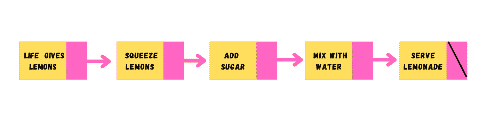
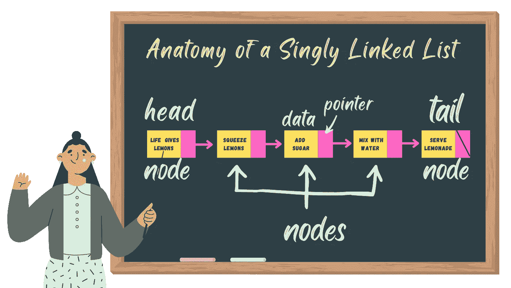
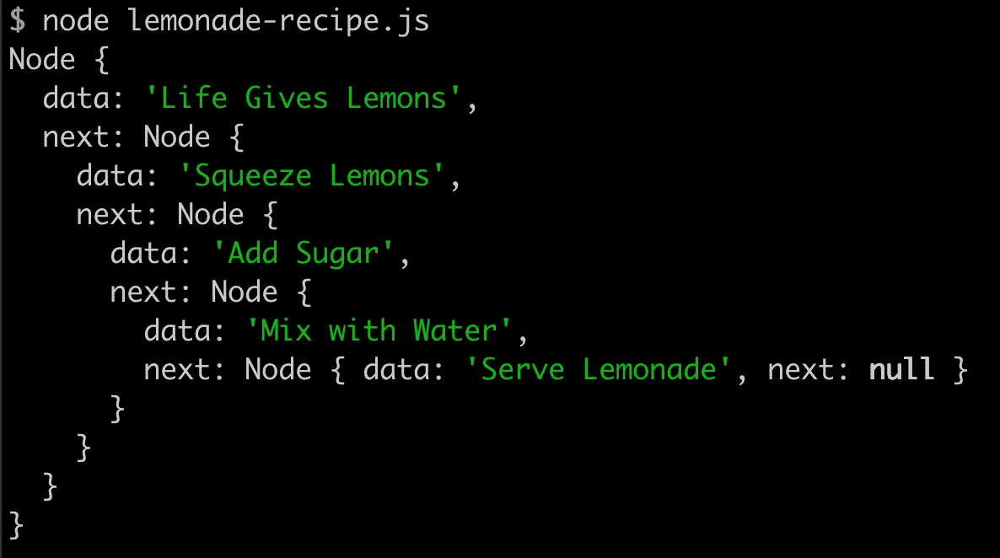
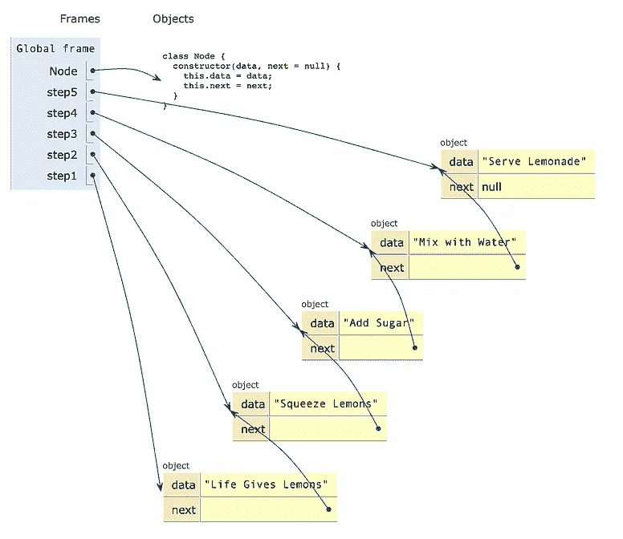
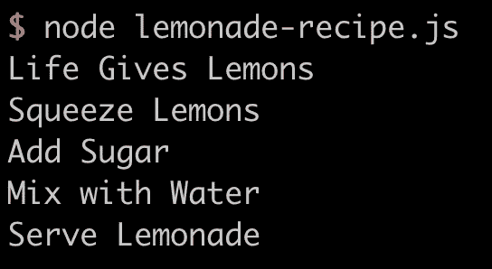
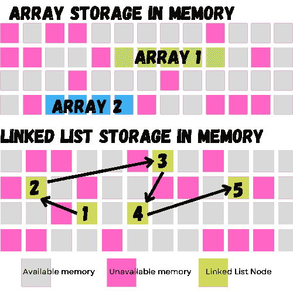
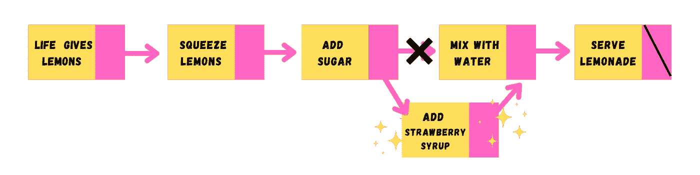
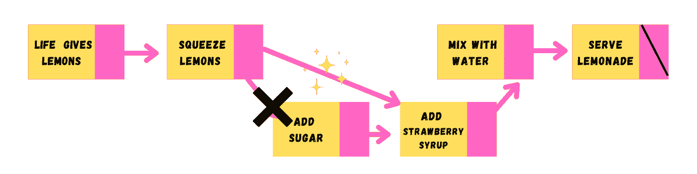

# 当生活给你柠檬:链表介绍

> 原文：<https://blog.devgenius.io/when-life-gives-you-lemons-an-introduction-to-linked-lists-d45a42dc9b1e?source=collection_archive---------9----------------------->



渴望了解链表吗？你来对地方了——这篇文章是对**链表数据结构**的介绍——它们是什么，它们与数组相比如何，以及如何在 JavaScript 中创建和操作它们。

# 什么是链表？

链表是一种线性数据结构，其中每个元素(节点)都存储了**数据**和指向内存中下一个节点位置的方向(**指针**或引用)。

**链表有三种不同的风格:**

1.  单链表🍋
2.  双向链表🍒
3.  循环链表🍑

**这篇文章将关注单链表，**但是你可以阅读更多关于双向链表和循环链表的内容🍒[此处](https://www.geeksforgeeks.org/doubly-linked-list/)🍒和🍑[此处](https://www.geeksforgeeks.org/circular-linked-list/)🍑。



链表图的剖析

链表中的**第一个节点**称为**头**，是链表的入口点。

链表中的最后一个节点**叫做**尾**，它指向**空。****


上图的链表有五个节点，每个节点存储数据(在本例中，是柠檬水配方的指令)和指向下一个节点位置的指针。


## **让我们根据柠檬水的配方创建一个简单的链表:**

```
class Node { constructor(*data*, *next* = null) { *this*.data = *data*; *this*.next = *next*; }}const step5 = **new** *Node*("Serve Lemonade");const step4 = **new** *Node*("Mix with Water", step5);const step3 = **new** *Node*("Add Sugar", step4);const step2 = **new** *Node*("Squeeze Lemons", step3);const step1 = **new** *Node*("Life Gives Lemons", step2);
```

每个节点对象用两个属性实例化:*数据*，和*下一个* (指针)。

如果我们打印第一个节点，可以看到每个对象**的 *next* 属性包含了**链表中的后续节点(嵌套结构)。



注意最后一个(尾部)节点的 next 属性的值为 **null** 。食谱已经完成；没有更多的步骤！这意味着是时候放松一下，喝点柠檬水了😎🍹️.

# **链表遍历**

*在制作食谱时，我们从头开始，每次都按照相同的顺序完成步骤——否则，我们可能会以一些漂亮的* [*可疑的食物*](https://zelda.fandom.com/wiki/Dubious_Food) *而告终！*😱

像数组一样，我们可以遍历列表来访问每个节点的值:

```
function makeLemonade() { let step = step1; while (step != null) { console.log(step.data); step = step.next; }}makeLemonade();
```

运行上面的代码打印出每个节点的*数据*，从**头**开始，到**尾**结束



日志打印输出包含每个节点的数据

啊，真提神！

链表的缺点是我们必须从头部开始按顺序访问节点(不能随机访问节点)🙅🏻‍♀️).这使得搜索效率比数组低得多——如果你选择使用链表，就告别二进制搜索吧。

# 插入和删除节点

*介绍全新改良的✨strawberry 柠檬水 recipe✨！*


真是一团糟！

在我试图在中间添加另一个步骤后，我的食谱(如上图)看起来不那么热门了——没有足够的空间来编写新的步骤，我必须重新编号后续步骤，看起来我必须从头开始重新编写整个东西。这就是当我们试图插入/删除数组时可能发生的情况——它可能需要完全重新组织内存中的数据结构。

与数组不同，链表节点存储在不连续的内存中(不都在同一个位置)，它们的长度在创建时没有定义。这使得链表成为一个很好的选择，如果你需要从你的数据集中进行插入/删除的话。



内存存储的可视化—数组和链表

虽然链表确实比数组占用更多的内存(因为我们需要存储数据和一个指针，而不仅仅是数据)，但是链表的内存使用比数组更加*灵活*和*高效*。

链表在添加/删除节点方面也比数组有优势——我们需要做的只是添加数据并调整指针以适应我们的需要。这意味着我们可以很容易地在列表中的任何地方插入节点，而数组只允许在头部/尾部插入。

## 🍓插入节点🍓

我们开始喝草莓柠檬水吧，好吗？

我们需要给链表添加一些功能——让我们从创建一个名为`LinkedList`的新类开始，它包含了我们与链表对象交互所需的所有方法。

```
class LinkedList { constructor() { *this*.head = null}
```

LinkedList 对象将使用 head 属性进行实例化，该属性保存 head 节点对象(在这种情况下，还没有节点被添加到链表中，因此值为 null)。

接下来，我将定义一个带两个参数的方法:将在新节点之前到达的节点(也称为前一个节点)和新节点的数据。

```
insertAfter(*prevNode*, *data*) { const newNode = **new** *Node*(*data*, *prevNode*.next); *prevNode*.next = newNode;}
```

在这个函数中，我们将实例化一个新的节点对象，传入我们节点的数据和一个指针 previous node's *next。*

然后我们将前一个节点的 next 设置为指向我们的新节点。

最后，我们将增加 LinkedList 对象的长度。

**这是一大堆单词——看看下面的图片来帮助想象刚刚发生了什么:**



如果我们需要在链表的末尾添加一个步骤，我们可以简单地将空值传递给新节点的参数

如果我们需要在链表的开头添加一个步骤呢？这个过程看起来有点不同:

```
insertAtBeginning(*data*) { const newNode = **new** *Node*(*data*, *this*.head); *this*.head = newNode;}
```

您会注意到这个方法只有一个参数，而不是两个，因为在这种情况下没有前一个节点。

然后我们将我们的新节点的下一个设置为当前的头节点，然后将我们的新节点设置为链表的头节点。

## 🦷删除节点🦷

*此时，你可能会想“我们在柠檬水里加糖和草莓糖浆？？你没听说过龋齿吗？!"*

*我也很重视我的口腔健康——我们最好省去“加糖”这一步*

**要从链表中删除一个节点，我们需要:**
1。找到目标节点及其前一个节点(如果有！)
2。改变前一个节点的下一个以绕过目标节点
3。从内存中删除目标节点

我们将使用 LinkedList 类中的另一个方法来解决这个问题——这个方法将接受一个表示我们要删除的节点的数据*的参数。*

看一下代码，我们将讨论下面的步骤。

```
removeValue(*value*) { let prevNode = null; let currentNode = *this*.head; while (currentNode) { if (currentNode.data === *value*) { if (prevNode) { prevNode.next = currentNode.next; } else { *this*.head = currentNode.next; } currentNode = null; return true } prevNode = currentNode; currentNode = currentNode.next; }}
```

我们首先为当前节点和前一个节点定义变量——我们稍后会用到这两个变量。

从头开始，我们遍历链表。当当前节点的值等于我们正在搜索的值时，我们或者:

1.  设置前一个节点的 *next* 指向当前节点的 *next*
2.  如果当前节点是头部，我们将头部设置为当前节点的*的下一个*

然后我们删除当前节点并退出循环。

**又来了，很多话。这里有一个视觉:**



从链表中删除节点的可视化

# 其他有用的方法

这里还有一些方法可以添加到您的链表工具包中:

## 移除所有节点

```
clearList(){ *this*.head = null;}
```

## 返回节点的索引

```
findIndex(data) { let index = 0; let currentNode = *this*.head; while (currentNode) { if (currentNode.data === data) return index; node = node.next; index += 1; }}
```

## 返回第一个节点

```
getFirst() { return *this*.head;}
```

## 返回最后一个节点

```
getLast() { let lastNode = *this*.head; if (lastNode) { while (lastNode.next) { lastNode = lastNode.next; }
  } return lastNode;}
```

## 求链表的长度

```
listLength() { let currentNode = head;
   let length = 0; while (currentNode !== null) { length++; currentNode = currentNode.next; }return length;}
```

# 摘要

*   链表是由非连续存储的节点组成的**线性数据结构**
*   每个节点包含**数据+指向下一个节点的指针**
*   与数组相比，链表允许更加灵活和有效的内存使用
*   与数组相比，链表添加/删除节点要容易得多

现在你知道为什么链表仅仅是热情的表现了，希望在你下一次编码面试中出现时，你会更有信心！

感谢阅读！

# 参考

*   阿里·斯皮特尔， [**谢谢你，下一篇:链表介绍**](https://dev.to/aspittel/thank-u-next-an-introduction-to-linked-lists-4pph)
*   比尔·沃特斯，[**Nodejs 中的链表数据结构入门**](https://medium.com/swlh/beginners-guide-to-the-linked-list-data-structure-in-nodejs-dcf8d2f655e2)
*   极客为极客， [**链表数据结构**](https://www.geeksforgeeks.org/data-structures/linked-list/)
*   莎拉·奇马·阿东沃， [**如何在 Javascript 中实现一个链表**](https://www.freecodecamp.org/news/implementing-a-linked-list-in-javascript/)
*   Shubhangi Raj Atrawal，[**JavaScript 中的链表(ES6 代码)**](https://codeburst.io/linked-lists-in-javascript-es6-code-part-1-6dd349c3dcc3)