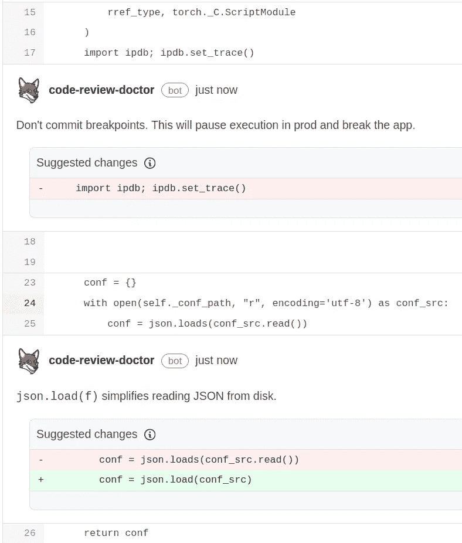

# Python 旧式字符串格式何时是最佳实践

> 原文：<https://blog.devgenius.io/when-python-old-style-string-formatting-is-best-practice-691a0759b37e?source=collection_archive---------3----------------------->


Python 2 中的字符串格式利用了% modulo 运算符。Python 3 于 2008 年发布，它包含了格式化字符串的替代方法:`[str.format()](https://docs.python.org/3/library/stdtypes.html#str.format)`。快进到 2016 年，Python 3.6 [格式的字符串文字](https://docs.python.org/3/tutorial/inputoutput.html#formatted-string-literals)(或 f 字符串)发布了。

说`str.format`和 f 字符串并不*总是*优于旧风格，这看起来像是破坏传统，但是 Python 文档本身说旧风格在像日志记录这样的情况下会更好。这篇博文将解释为什么在日志记录时不应该使用新的字符串格式。

# 何时使用新的字符串格式覆盖旧的格式

大多数人认为 f 字符串比%操作符更方便，也更容易阅读。它们也更加灵活，可用于将 Python 表达式插入字符串。

正如 python 的禅宗所说:可读性很重要。Python 新的字符串格式化工具是提高可读性的好方法。该语法与现有的字符串格式语法非常相似，但也有一些本质区别:

```
# old style. like [printf](https://en.wikipedia.org/wiki/Printf_format_string) in C
print("Hello, %s!" % "world")
print("The answer is %d" % 42)
print("%f + %" = %" % (1, 2, 3))
```

还可以使用 format()方法来格式化字符串。这提供了更灵活的语法，并允许使用[格式规范](https://docs.python.org/3/library/string.html#formatstrings):

```
print("Hello, {0}!".format("world"))
print("The answer is {0}".format(42))
print("{0} + {1} = {2}".format(1, 2, 3)
```

模板字符串允许您将 python 代码直接嵌入到字符串中，这对于复杂的格式化任务非常有用:

```
import datetime
t = datetime.date(2016, 1, 1)
print("Today is {t.day}/{t.month}/{t.year}".format(t=t))
```

新的字符串格式化方法有几个优点:

*   它更灵活，更容易使用。
*   它支持命名参数，这可以使代码更容易阅读。
*   它支持复杂的对象(比如列表和字典)，而旧的% operator 方法不支持。

当处理遗留代码时，旧的% operator 方法可能更好，因为持续的坏比不一致的好更好，或者(想想就不寒而栗)一个仍然支持 Python 2.7 的库。但是一般来说，最好尽可能使用新的字符串格式化方法。

# 为了保护旧的字符串格式

根据 [Python 日志文档](https://docs.python.org/3/howto/logging.html#optimization)，旧样式的格式化字符串可能更好。

# 在 Python 3 中登录

Python 的日志模块为从 Python 程序发出日志消息提供了一个强大而灵活的平台。这个字符串优化的关键是:*根据日志配置，不是每个日志记录器调用都被发送到日志中。*

配置日志记录最简单的方法是调用`basicConfig()`。这将使用一组默认参数来配置日志模块。一旦配置了日志模块，您就可以使用各种日志函数来发出日志消息。最常用的日志功能有`debug`、`info`、`warning`、`error`和`exception`。每个函数都接受一个字符串参数，该参数可能会被发送到日志中(同样，这取决于配置)。

`debug`函数用于调试在开发代码时帮助开发人员的消息，而`info`函数用于帮助开发人员理解代码在生产中如何运行的消息。`warning`、`error`和`exception`功能用于记录严重程度不断增加的问题。

所有这些函数都带有可选的第二个参数，这是一个附加信息的字典，它将与消息一起被记录。

# 记录时新旧对比

[记录模块文档](https://docs.python.org/3/howto/logging.html#optimization)指出 f 字符串不是最佳的，因为正如记录文档所述:

> 消息参数的格式化被推迟，直到无法避免

因此，为了优化，该模块倾向于尽可能晚地对记录的字符串进行评估。举几个例子:

```
logger.debug("encountered %s", foo)  # old style
```

相对

```
logger.debug(f"encountered {foo}")  # f string
```

假设日志配置高于 debug(因此`debug`调用不会发送到日志)。在第一个版本中，不会计算最终的字符串(因为日志处理程序会忽略调试日志调用)，而在第二个版本中，会立即计算字符串。正如医生所说:

> 如果记录器将丢弃您的事件，您可能希望避免这样做

日志记录模块建议这样做的原因是，可能存在评估字符串是资源密集型的情况:也许`foo`表示一个 [ORM 延迟评估的 queryset](https://docs.djangoproject.com/en/4.0/topics/db/queries/#querysets-are-lazy) 并且评估字符串会强制数据库读取。如果遵守代码会对系统产生负面影响，那将是一种耻辱。如果日志记录降低了应用程序的性能，开发人员就会减少使用它，这将降低他们作为开发人员的性能。

# 改进您的代码

Code Review Doctor 是一个代码扫描工具，它建议 Python 和 Django 在您的 pull 请求中进行修复:



检查你的 [GitHub](https://github.com/marketplace/django-doctor/) 或 [Bitbucket](https://marketplace.atlassian.com/apps/1227731/code-review-doctor?tab=overview&hosting=cloud) Pull 请求，[在线免费扫描你的整个代码库](https://codereview.doctor/)，或[在 Twitter 上关注我们](https://twitter.com/CodeReviewDr)。