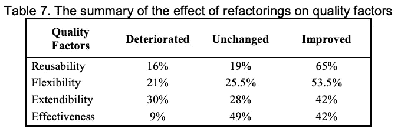
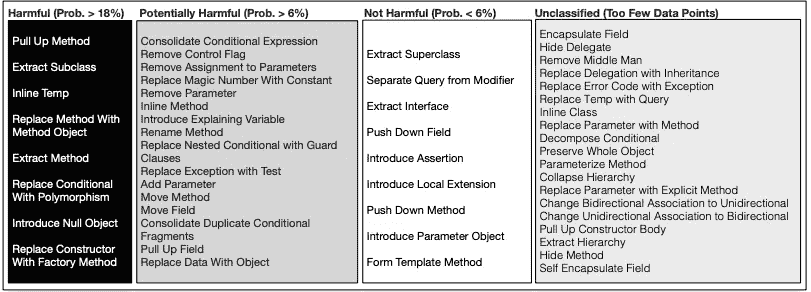

# 什么时候应该停止重构？

> 原文：<https://blog.devgenius.io/when-should-you-stop-refactor-9a61036b2b3f?source=collection_archive---------4----------------------->

## 重构

## 重构十字路口怎么办？

来自 [Pexels](https://www.pexels.com/photo/male-constructor-drawing-draft-on-paper-roll-3760529/?utm_content=attributionCopyText&utm_medium=referral&utm_source=pexels) 的 Andrea Piacquadio 的照片

重构很难。每个开发人员都会遇到重构的十字路口。继续重构，或者重置一切。

> 你在这个十字路口徘徊了多少次？

太多次了。我们都在那里，直到今天也是。

让代码保持原样，或者将当前的代码行为更改为新的行为。

这里有一个何时停止的想法。为什么停下来。

# refactor 带来了哪些问题？

你可能认为重构不会带来任何麻烦。嗯，可以的。重构会降低软件质量。

对几个质量因素进行了实证检验。可重用性、灵活性、可扩展性和有效性。

重构对质量因素的影响综述

重构改进了大部分代码，接近三分之二。我们可以注意到一些因素保持不变。

重构本身并没有好坏之分。重构会使代码在某些方面没有改进。

基于概率评分的 Bug 诱导技术

你在拿项目的健康冒险。打破现有行为。如果没有适当的测试覆盖，这种情况会经常发生。

> 不能保证一次重构就能提高代码的质量。⁴

票的范围越来越大。推进交货时间。

新人，新人，重构者。将新技术添加到项目中。添加新范例。把问题从一个转换到另一个。

删除旧代码。讨论前删除。添加改变行为的新代码。

重构导致分析瘫痪。想太多了。努力做到完美。不想让别人失望。

> 没有完美的软件。

# 开发人员如何进行重构？

我们知道重构的问题。开发者如何重构？

大多数重构都以快速解决方案告终。这是为了避免让学长失望。

开发人员寻求快速解决方案。他们不从上下文相关的开始。难的那些。

> 开发人员倾向于简单的重构。⁴

重写一件事——会引起连锁反应。现在您需要修补依赖关系。循环往复。

有些甚至不重构。很快他们甚至不会编码。

更好的方法是逐步重构。具有返回的能力，例如通过特征开关。

开发人员重构，但没有测试。因为不存在测试，所以它们会影响现有的行为。

重构不应该改变现有的行为。好例子:

# 何时停止重构？

当项目不值得花时间的时候。没有真正的用户。没有真正的问题。

> 一旦人们迷上了它，花时间把它提高到 90%的正确程度。

当即将发布时。发布前的重构会导致很多问题。如果处理不当。不过，我不建议。

我们都知道正确的事情。正确的做法是重构。但这并不总是正确的做法。

有时候越糟越好。你需要简单。项目成功后会有时间进行重构。争取简单、可爱和完整的解决方案。

正如理查德在某些场合所说的“越差越好”。为了简单而牺牲一致性、正确性和完整性。不要添加更多的代码，没有必要。

牢记产品愿景。

你在为谁编码？什么产品推向市场？你真的需要关注重构，或者修复签出错误吗？

> 什么时候做重构？

你有顾客，但很少发行。现在是重构的时候了。

不要进一步延长重构。愤怒的顾客会受不了的。

> 你是重构的合适人选吗？

问问你自己。你是修理工还是制造者？

开发人员喜欢修改代码。制造者，创造新的代码。修理者改善现有的。

当你进退两难时。问问你团队里的修理工。那些即时改造软件的人。

# 参考

[【1】](https://www.jwz.org/doc/worse-is-better.html)理查德·加百列《越糟越好》

[2]沙特纳维、雷德和李玮。"使用层次质量模型对重构对软件质量影响的实证评估."*国际软件工程及其应用杂志*5.4(2011):127–149。

[3] Bavota，Gabriele 等《重构什么时候会诱发 bug？一项实证研究。” *2012 IEEE 第 12 届源代码分析与操作国际工作会议*。IEEE，2012 年。

[4] Szoke，Gábor 等人，“批量修复编码问题及其对软件质量的影响:值得重构吗？." *2014 IEEE 第 14 届源代码分析与操纵国际工作会议*。IEEE，2014 年。

# 灵感

 [## 关于使用遗留代码的建议

### 我需要一些关于如何处理遗留代码的建议。不久前，我被分配了一个任务，给一个…

stackoverflow.com](https://stackoverflow.com/questions/4760074/advice-on-working-with-legacy-code)  [## 过度思维发展

### 我已经做了一年半的应用程序开发人员(我知道时间不长)，我刚刚得到了我的第一个…

softwareengineering.stackexchange.com](https://softwareengineering.stackexchange.com/questions/200545/over-thinking-development/200606#200606)  [## 我应该提前计划，还是在写程序的时候就想好？

### 我也会发表我的意见。开始之前在纸上写下一个完整的计划是一个“CS 101”练习…

softwareengineering.stackexchange.com](https://softwareengineering.stackexchange.com/questions/97985/should-i-plan-ahead-or-figure-out-programs-as-im-writing-them?noredirect=1&lq=1)  [## 新的软件开发人员在重构代码时会犯哪些错误？

### 答案(3 之 1):1。不考虑旧程序所做的一切。开发人员可能会查看一些旧程序…

www.quora.com](https://www.quora.com/What-mistakes-do-new-software-developers-make-when-refactoring-code)