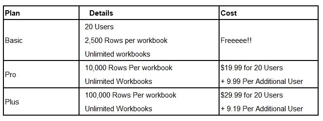
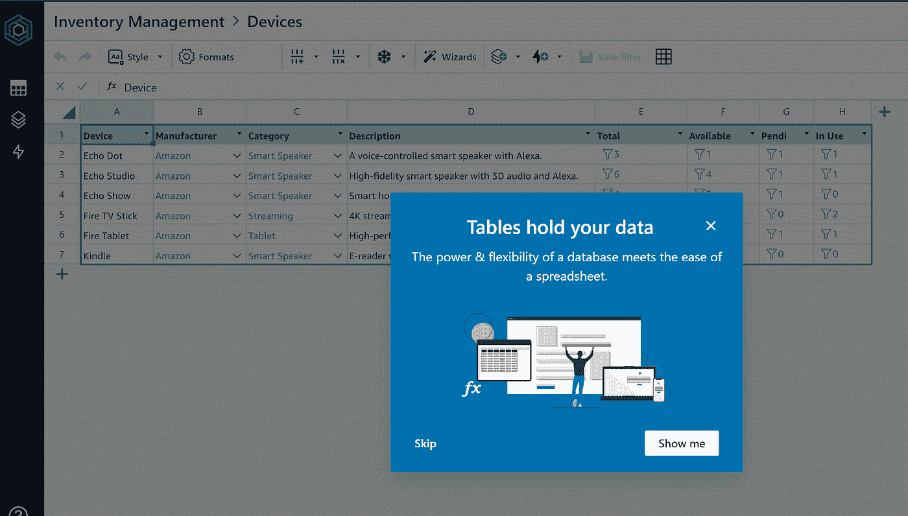
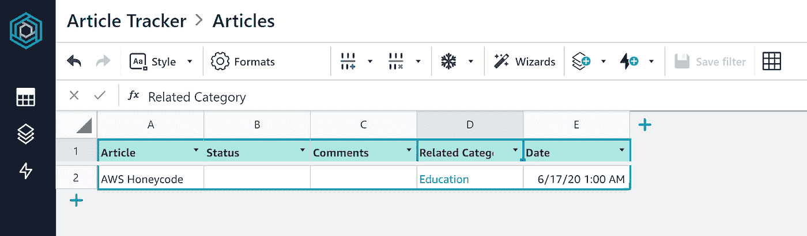
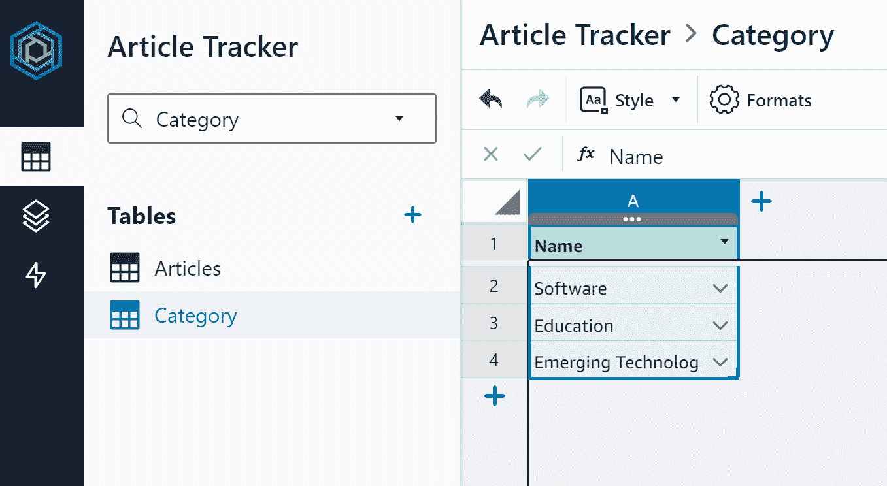
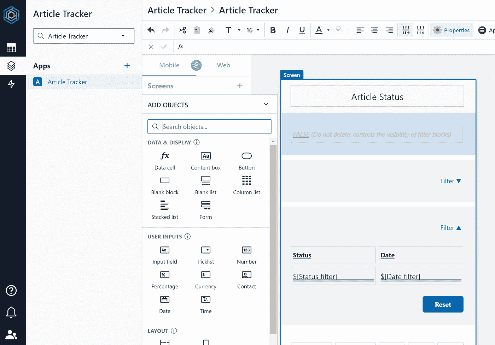
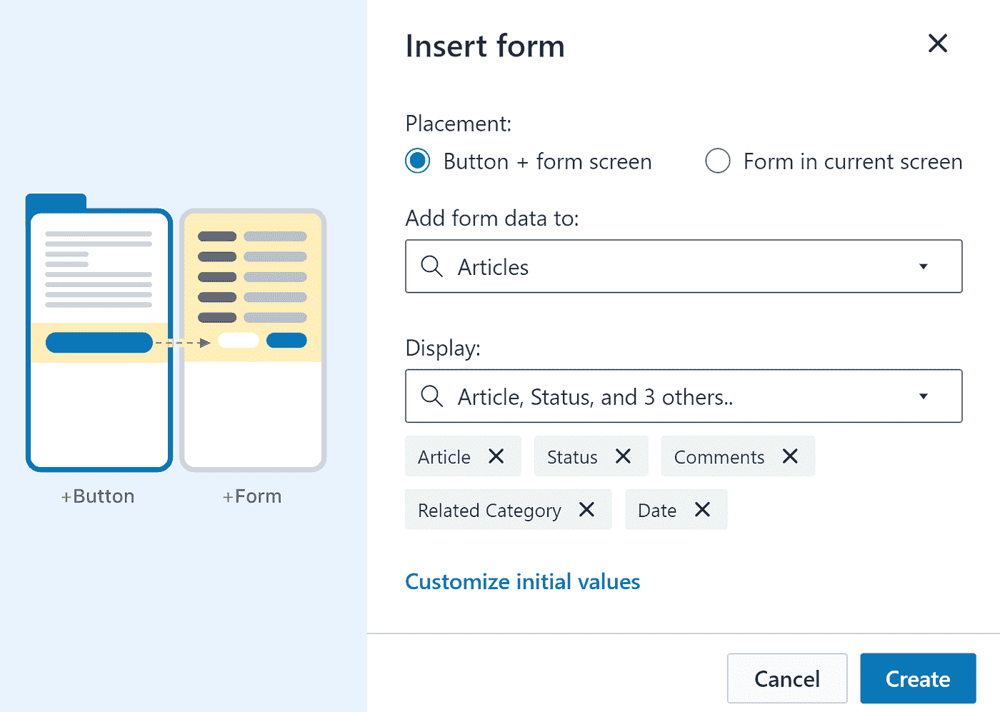
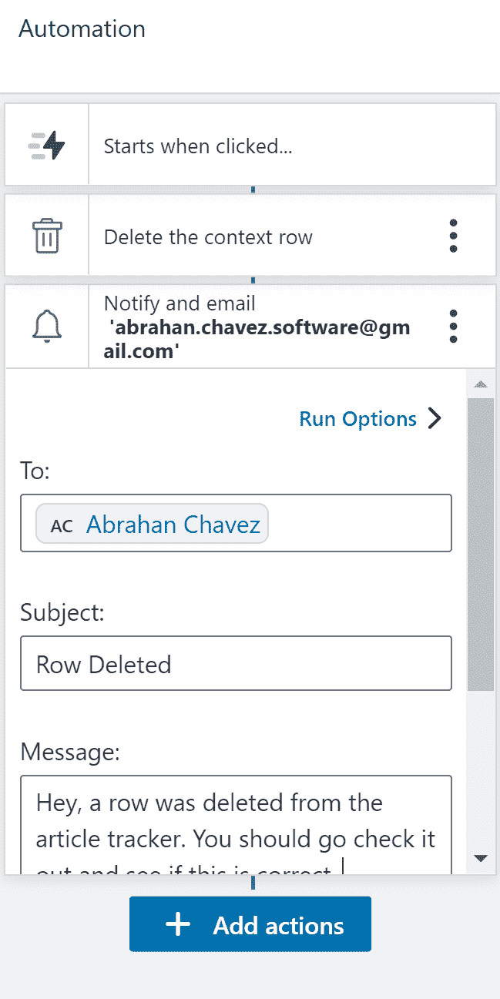
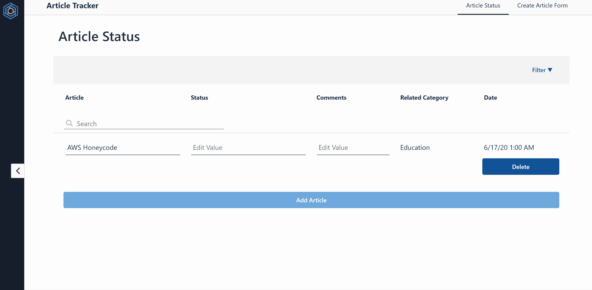

# 什么时候应该使用 AWS Honeycode？

> 原文：<https://blog.devgenius.io/when-should-you-use-aws-honeycode-c11133732645?source=collection_archive---------14----------------------->

保罗·花冈在 [Unsplash](https://unsplash.com?utm_source=medium&utm_medium=referral) 上的照片

每隔几个月，我都会看到一个新的标题，标志着高薪软件开发人员时代的结束，每次我都再次肯定，这个职业仍然是安全的，不会受到无代码提供者的侵扰。

本月的热门话题是 AWS Honeycode。前几天我看到它出现在我的 AWS 控制台上，决定继续尝试一下，让我们看看这东西是否真的能取代我们。

**设置**

如果你已经有一个账户，先为第一次使用[的用户](https://portal.aws.amazon.com/billing/signup#/start)注册一个 AWS 账户。

注册是一件轻而易举的事，他们基本上只是要求你输入你的信用卡信息和哒哒！您拥有 AWS 帐户的全部权限，可以继续使用控制台。

此时，你可以搜索 Honeycode 服务并查看付款计划，这里是一些让我害怕的定价。

**定价**

看到这里，我不明白你为什么要花钱访问 10，000 行。老实说，你可以使用一个 excel 表，马上得到 100，000 行。因为你用 Honeycode 得到的不仅仅是表格行，所以你可以证明花费几个小时来构建它的成本很快就会达到几千美元。

> 与在您自己的软件中构建这些功能相比，Honeycode 提供了立竿见影的成本优势。

**另一个账户**

我实际上需要创建另一个帐户来使用 Honeycode，你不能使用你的 AWS 控制台凭证登录，但是如果你想要一个付费计划，你可以在事后将这些帐户链接在一起。这次我注册 Honeycode 时不需要信用卡。

**我的第一本工作簿**

Honeycode 允许您创建自己的工作簿模式，从 excel 文件导入模式，或者从模板列表中选择。我选择了一个库存管理的模板，看看这些事情会变得多严重。在创建时，我意识到 Honeycode 比 excel 文件更强大，更像是一个关系数据库，其中的表可以相互关联。(如果您是 Excel 高级用户，Power Pivot 可用于关系数据。)

库存管理模式准备充分，关系状态列以下拉列表的形式链接回其他表。相反，我决定为一个简单的文章跟踪器创建自己的模式，我和我的合作伙伴可以用它来跟踪哪篇文章已经被评论过，以及相关的任何评论。

创建新表格就像点击加号一样简单，界面类似于 excel 表格。我重命名了我的表，制作了一个用于跟踪文章，另一个用作类别列表。使用这个表格软件并不令人兴奋，如果你想做更复杂的计算，你确实有能力使用公式。

**应用构建器**

我专注于制作一个简单的 CRUD(**C**reate**R**EAD**U**pdate**D**elete)应用程序来测试 Honeycode 为我们提供了多少功能。

在可以创建视图的构建器中，可以在屏幕上放置一组有限的对象。所有对象都是移动友好的，这是一个优点，但是我们在样式和呈现数据的方式方面受到严重限制。

我们可以选择使用按钮、表格和输入。我继续添加了一个表格来列出我所有的文章。每个行单元格都可以编辑，这样就完成了应用程序的更新部分。我在下面放了一个按钮，并使用**自动化**特性来创建一个工作流。

表单向导

单击该按钮会将用户重定向到一个表单，用户可以在该表单中输入创建新表行的信息。Honeycode 简化了这一部分，它能够点击表单对象并询问您想要填写哪个表和列。

这是一个很好的功能，我更喜欢使用对话框形式而不是被重定向，但是这对于一个简单的 office 应用程序来说很好。

这个 CRUD 应用程序的最后一部分是添加删除行的功能，我在表中添加了一个按钮，并为它自动化了一个工作流来删除相关的行。

至此，我们已经有了一个全功能的移动友好 CRUD 应用程序。我读到的关于 Honeycode 的最后一件事是，你可以让它向用户发送通知。

在 automations 部分，您可以添加一个带有消息的电子邮件地址或链接回应用程序。这是一个非常有用的工具，AWS 让通知服务变得轻而易举。

**成品**

**什么时候不应该使用 Honeycode**

放在屏幕上的对象数量有限。如果你习惯软件开发，你可以修改一个网站的每一个像素。有了 Honeycode，你可以改变颜色、字体大小等等。如果你希望能够修改你的网站的外观…去别处看看。

像 Excel 和 Google Sheets 这样的工具使汇总表格数据变得更加简单，并且能够链接使用 Google forms 可以获得的表单。

如果你正准备创建自己的网站来实现工作流程的自动化，我建议你像使用模型软件一样使用 Honeycode。Honeycode 可用于测试和验证您的想法，包括移动友好功能和用户帐户，一旦您开始扩展，您可以决定是否要继续使用 Honeycode 或过渡到不同的软件。

> 问题是，你应该开始使用 AWS Honeycode 来自动化你的业务吗？

**视情况而定……**

作为一名软件开发人员，我不建议将它用于复杂的工作流。对于任何使用 Airtable、Excel 或 Google Sheets 无法满足的简单办公工作流，请尝试 Honeycode。有足够的现成功能，无需设置 API、数据库服务器或登录解决方案。