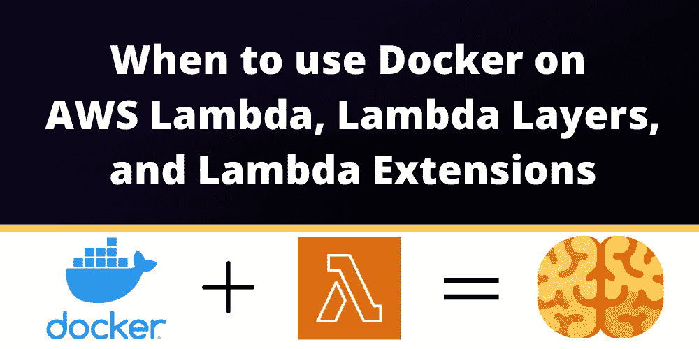

# 何时在 AWS Lambda、Lambda 层和 Lambda 扩展上使用 Docker

> 原文：<https://blog.devgenius.io/when-to-use-docker-on-aws-lambda-lambda-layers-and-lambda-extensions-43f9dbbd758a?source=collection_archive---------5----------------------->

本文最初发表于:[https://dashbird.io/blog/lambda-configuration-error/](https://dashbird.io/blog/docker-lambda-layers-extensions/)

2020 年对我们所有人来说都是艰难的一年，对工程团队来说也是如此。许多软件发布被推迟，行业的开发速度放缓了不少。

但至少在 AWS，一些团队在年底发布了更新。AWS Lambda 获得**两项重大改进**:

*   AWS Lambda 扩展；和
*   为您的功能提供 Docker 图像支持。

有了这两个新特性和 Lambda 层，我们现在有三种方法向 Lambda 添加代码，而这些代码不是 Lambda 函数的直接组成部分。

现在的问题是:**我们应该什么时候使用什么？**

在这篇文章中，我试图阐明 Lambda 层、Lambda 扩展和 Lambda 的 Docker 图像。

重要的事情先来。所有这些**λ特性都可以一起使用**。因此，如果您考虑将代码放在哪里，至少**您的决定不会相互排斥**。你可以上传一个 Docker 图片，附加一个常规的 Lambda 图层和一个 Lambda 扩展。如果你的 Lambda 函数是基于一个 ZIP 存档的，这也是可能的。

这一切意味着什么？继续阅读，找出答案。

# 带有 Docker 的 Lambda 函数

让我们看看基于 Docker 图像的 Lambda 函数。**许多开发人员在他们的开发环境中采用 Docker 容器**,因为它有助于尽可能地复制生产环境。毕竟，如今许多服务都运行在管理 Docker 容器的 Kubernetes 上。

AWS **Lambda 是与** [**微服务**](https://dashbird.io/blog/microservices-serverless-pros-cons/) 不同的方法。它不是基于长期运行的容器，而是基于短命的函数。它最初有自己的开发方式，起初，人们不能使用他们的 Docker 技能。但是自从 re:invent 2020 以来， **AWS Lambda 现在支持 Docker 图像**以迎合已经习惯基于 Docker 的开发工作流的开发人员。

除了将您的函数代码打包到 ZIP 存档中，您还可以将它打包到 Docker 映像中。在许多无服务器支持者看来，这只是把传统开发者从“容器世界”拉到无服务器 T21 的一种方式。不过，它还有一个重要的好处:你可以获得 10GB 的空间。

没错，Lambda 的 **Docker 图像可能比 ZIP 存档文件**大得多，后者只允许 250MB 的解压缩代码和资产。有时候事情就是这样；你拉进了一个巨大的依赖，很快就超过了 250MB。这也是遗留系统的一个重要因素。当您有一个使用了多年的 Docker 映像时，它的大小很可能不是您过去关心的问题，因此将所有代码压缩到 250MB 是不可行的，因为这需要您对许多函数进行重大的重构。

因此，如果你有一个特定的**用例需要超过 250MB** ，你就不能为你的 Lambda 函数找到 Docker 映像。当你的整个映像已经基于其他 Docker 映像，这些映像跟踪监控和其他与你的函数代码不直接相关的事情，**你最好也为你的 Lambda 函数**使用 Docker，而不是试图重构一切来适应 Lambda 层或扩展。

不过，有一点需要注意:**您的容器映像必须实现 Lambda 运行时 API** 。你不能在 Lambda 上运行任何 Docker 映像；它必须**通过运行时 API** 获取 Lambda 事件。你的容器不会无限期运行；像基于 ZIP 的 Lambda 函数一样，它们将被暂停并经历[冷启动](https://dashbird.io/knowledge-base/aws-lambda/cold-starts/)。一项活动最多允许 15 分钟。

# λ层

图层在许多方面都有帮助。**层最普遍的使用方式是定制运行时**。这意味着您可以为 AWS 不正式支持的编程语言创建一个层。甚至还有支持社区的运行时层，所以如果你幸运的话，你可以拉一个开源运行时，开始用你选择的编程语言写代码。

另一种方式是层用于在 Lambda 函数之间共享代码。当你的函数运行时，一个层的代码将是可用的，所以你可以像它是你的函数的一部分一样导入它，但是由于**它被封装在一个层**中，你可以在一个单独的地方维护它。如果你有一个库，一个框架，或者只是一个 utils 文件夹，其中的代码可以在你的 Lambda 函数中使用，**你可以把它打包成一个层**。

虽然层可以与 Docker 图像一起使用，但您可以将它们视为完成相同任务的不同方式。

如果你开始一个新的项目，把你的函数放到 ZIP 存档中，如果你能避开 250MB 的限制，使用 Lambda 层来分解出在多个地方使用的代码。这个限制是针对整个函数及其所有层的，每个函数可以有 5 层。这意味着你不能有 5 层，每层 250MB，但是**你的功能代码和层的总和必须低于 250MB** 。

如果您需要超过 250MB，或者只是有一个基于 Docker 的遗留代码库，它永远也不会适合 250MB，那么使用 Docker 比使用大的 refactor 要好，至少在短期内是这样。你可以将你的库分解到 Docker 镜像中，这些镜像将成为你所有 Lambda 函数的基础，而不是使用 Lambda 层，这样你就不必与每个函数 5 层的限制作斗争了。

# Lambda 扩展

Lambda 扩展被部署为 Lambda 层；如果你想扩展你的 Lambda 函数，但是在 AWS 控制台中找不到这个选项，那是因为扩展只是一个层。

**扩展是一个特殊的层**，因为它们不仅仅为你的函数提供定制的运行时或共享代码。扩展可以和 Lambda 函数在同一个进程中运行，也可以在单独的进程中运行。这个独立的过程在 Lambda 函数执行之前开始，在它完成之后停止。

在一个独立的进程中运行使得 Lambda 扩展可以做常规层通常不能做的事情。例如，在函数工作之前从某个地方收集秘密，或者跟踪函数运行的时间并在函数失败时收集错误。由于**一个扩展在它自己的进程**中运行，一个 Lambda 函数崩溃通常不会使扩展崩溃，所以它可以花时间找出哪里出错了，并把它发送给你选择的监控服务。

因此，如果你有可能需要[监控或可观察性](https://dashbird.io/blog/monitoring-vs-observability/)的代码，或者需要在多个函数运行之前或之后执行动作，你应该考虑将这些代码放入 Lambda 扩展中。

# 摘要

综上所述，你应该看到 **Docker images** 主要是作为部署更多代码的一种方式，或者是将遗留容器代码库移植到 AWS Lambda 的一种更简单的方式。250MB 的 ZIP 部署通常不够，10GB 的 Docker 映像是唯一的解决办法。

**Lambda 层**是一种向 Lambda 函数添加库、框架、实用文件夹和定制运行时的方式。

**Lambda 扩展**是可以在单独的进程中运行的 Lambda 层，这允许它们在函数执行之前和之后执行动作。用例是监控或秘密收集。

有了这些知识，你现在能够以一种有意义的方式构建你的 Lambda 代码，并且当你达到代码大小限制时不会绝望。