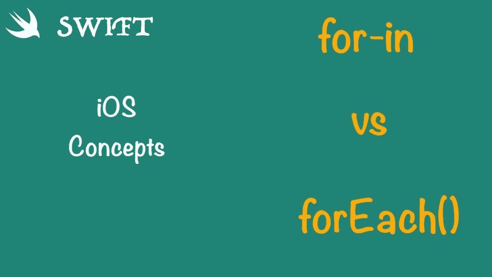
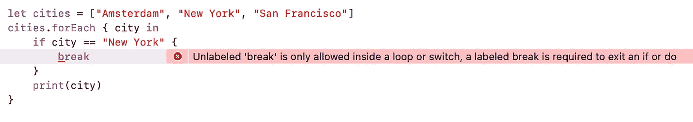
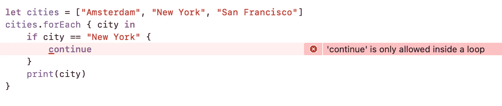
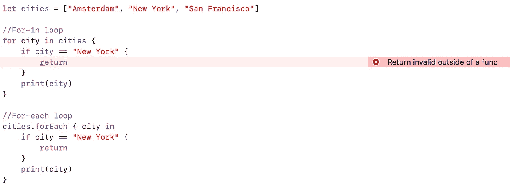

# 何时使用 Swift For-in 和 ForEach

> 原文：<https://blog.devgenius.io/when-to-use-swift-for-in-and-for-each-361d55d6cc45?source=collection_archive---------2----------------------->

## Swift For-in 和 For-each 的区别



For-in 和 for each 是 Swift 中控制流语句的示例。它们是 Swift 中 for 循环的不同变体，用于迭代数组、字典、范围、字符串和其他序列。虽然大多数看起来相似，但也有一些不同。

# **1。用于输入**

for-in 循环用于将代码块运行一定的次数。它用于迭代序列，如数组、范围、字符串等。

**a)带数组的 for-in 循环**

使用字典进行 for-in 循环
你也可以遍历字典来访问它的键值对。当字典迭代时，字典中的每一项都作为一个`(key, value)`元组返回，并且您可以将`(key, value)`元组的成员分解为显式命名的常量，以便在 **for-in** 循环的主体中使用。

```
**let** numberOfLegs = ["spider": 8, "ant": 6, "cat": 4]
**for** (animalName, legCount) **in** numberOfLegs {
    print("\(animalName)s have \(legCount) legs")
}
```

**c)带有 where 子句的 for-in 循环** 有些情况下，我们希望将序列限制为仅匹配特定条件的元素，为此，我们可以添加一个带有 **for-in** 循环的 **where** 子句，以在循环中实现过滤器。也就是说，如果**中的条件**子句返回*真*，则执行循环。

```
**let** languages = ["Swift", "Java", "Objective-C", "Pyhton"]
**for** language **in** languages where language == "Swift"  {
   print(language)
}**Output:-** *Swift*
```

**d) for-in 循环用 enumerated()** 同时访问元素的各个索引，我们可以使用实例方法 **enumerated()** 。它返回一系列包含索引和元素值的对。

```
**let** continents = ["Asia", "Africa", "North America", "South America", "Antarctica", "Europe", "Australia"]**for** (index, value) **in** continents.enumerated()  {
    print("Continent \(index+1):", value)
}
```

**e)带步幅功能的 for-in 循环**

```
**for**(i = 0; i < n; i++) {  
   statements
}
```

swift 不支持上述 C 风格的 for 循环，我们可以使用 Stride 来存档 counter 变量的增量/减量。

```
**for** i **in** stride(from: 0, to: 10, by: 2) {
    print(i)
}**for** i **in** stride(from: 0, through: 10, by: 2) {
    print(i)
}
```

**f)带范围的 for-in 循环** 范围是两个数值区间之间的一系列数值。我们可以使用一个 **for-in** 循环来遍历一个范围。

```
**for** i **in** 1...3 {
    print(i)
}**for** index **in** (0...3).reversed() {     
   print("\(index)..") 
}
```

要了解更多关于Swift range 运算符，请阅读帖子 [**Swift Range 表达式**](https://medium.com/p/91a9e8dd188b) **。**

[](https://medium.com/@ashokrawat086/swift-range-expressions-91a9e8dd188b) [## 快速范围表达式

### 不同类型的范围运算符

medium.com](https://medium.com/@ashokrawat086/swift-range-expressions-91a9e8dd188b) 

**g)具有可选模式的 for-in 循环** 如果序列包含可选值，我们可以对 case let 使用**来过滤零值，仅对非零元素执行循环。**

```
**struct** User {
  **let** name: String
  **let** isAuthenticate: Bool?
}**let** users: [User?] = [User(name: "XYZ", isAuthenticate: **false**), User(name: "ABC", isAuthenticate: **nil**)]**for** **case** **let** user? **in** users **where** user.isAuthenticate == **false** {
    print(user)
}
```

# 2.对于每个人

**forEach** 是一个方法，它接受一个闭包，使用一个 for 循环来遍历列表中的所有元素，并以每个元素作为参数来调用闭包。

```
**@inlinable public** func forEach(_ body: (Element) **throws** -> Void) **rethrows** {   
  **for** element **in** self {     
      **try** body(element)   
   } 
}
```

**forEach** 按照与 **for-in** 循环相同的顺序调用序列中每个元素的给定闭包。

```
**let** numbers = [1, 2, 3, 4, 5]
numbers.**forEach** { num **in**
    print(num)
}**let** currencyCodes = ["United States": "USD", "India": "INR", "United Kingdom": "GBP", "South Korea": "KRW"] 
currencyCodes.forEach { country, currencyCode in     
   print("\(country) currency code is \(currencyCode)") 
}
```

## For-in 和 forEach 的区别

使用 **forEach** 方法与使用 **for-in** 循环有以下重要区别:

**1。For-in** 是一个运算符，而 for-each 是一个函数。

**2。**不能使用 **break** 或 **continue** 语句退出主体闭包的当前调用或跳过后续调用。

> Break 和 continue 是 for 循环的基本语法，用于中断循环迭代或继续下一个元素。由于 **for-each** 是一个函数，试图在 for-each 迭代中使用 break 和 continue 会导致编译时错误。



**3。**在 body 闭包中使用 **return** 语句只会从当前对 body 的调用中退出，不会从任何外部作用域退出，也不会跳过后续调用。



> 在 for-in 循环中，从 for 循环的范围返回是不可能的。如果在函数内部，我们可以在 for-in 循环中使用 return，但是它将从函数返回，而不是从 for-loop 作用域返回。

**4。** For-each 可以与 Swift 的闭包或一级函数一起使用，而不能与 for-in 循环一起使用。

```
**func** printEvenNumber(for number : Int) {
   **guard** number % 2 == 0 **else** {
     **return** }
  print(number)
}(0...10).forEach(printEvenNumber)
```

## 结论

使用`for`循环给了我们对迭代更大程度的控制，而使用 **forEach** 使我们能够利用闭包和一流函数的强大功能，即使迭代一旦开始就无法停止

感谢阅读。如果您有任何意见、问题或建议，请在下面的评论区发表！👇请**分享**并给予**掌声**👏👏如果你喜欢这个帖子。