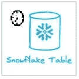
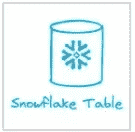
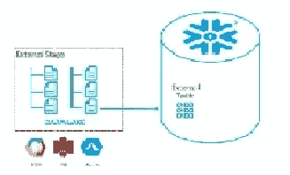
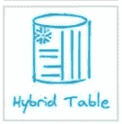
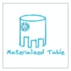

# 雪花里什么时候用哪个表？

> 原文：<https://blog.devgenius.io/when-to-use-which-table-in-snowflake-8133b25da758?source=collection_archive---------1----------------------->


肯尼·埃利亚松在 [Unsplash](https://unsplash.com?utm_source=medium&utm_medium=referral) 上的照片

在这篇博客中，我们将讨论 Snowflake 中可用的各种表格类型以及它们的具体用例。我将努力使用例尽可能清晰，并希望读完这篇博客后，您可以轻松地做出决定，为您的需求选择正确的表类型。我还将包括所有表格类型的简介，以便您知道我们在谈论什么。

我想给**帕特里克古巴**一些不错的图标，你可以在下面看到。我用它们来使我的博客更有吸引力。谢了。

# 临时表—



1.  临时表是特定于会话，也称为会话表。在 SQL server、Sybase 等较老的 RDBMS 中，这种表也被称为#temp 表。
2.  这些表在会话之外不可见，除了创建它的用户之外，其他用户也不可见。
3.  临时表不像其他表那样强制名称唯一性，您可以创建一个与同一模式中任何其他现有表同名的临时表，但是在会话中，该临时表将优先于同一模式中同名的其他表。
4.  临时表在会话中保存数据期间会产生存储费用。
5.  您可以创建一个临时表，该表与同一模式中的现有表同名，从而有效地隐藏现有表。
6.  您可以在同一架构中创建一个与现有临时表同名的表；但是，新创建的表被临时表隐藏了。
7.  临时表的时间行程为 0-1 天或会话的剩余时间，以较短者为准。
8.  临时表没有自动防故障装置
9.  临时表 ***不*** 需要在创建对象的模式上具有 CREATE TABLE 权限。
10.  要创建临时表，我们必须使用下面的语法示例。

```
CREATE TEMPORARY TABLE RAJIVTABLE (ID NUMBER, CREATION_DATE DATE);
```

## 使用案例:

1.  任何临时数据需求。
2.  对于 ETL 过程，您希望存储一些在当前会话之外不需要的中间会话数据。
3.  会话之外不需要数据保护。

# 瞬态表—



1.  临时表就像永久表一样，只是它们没有故障安全期。
2.  临时表保存跨会话和与其他用户的数据。
3.  该表需要像永久表一样被显式删除。
4.  瞬态表在保存数据期间会产生存储费用，就像永久表一样。故障安全期费用不适用于此表。
5.  临时表不能转换为任何其他表类型。
6.  瞬态表的时间行程为 0–1 天。
7.  瞬态表无故障保护
8.  要创建临时表，我们必须使用下面的语法示例。

```
CREATE TRANSIENT TABLE RAJIVTABLE (ID NUMBER, CREATION_DATE DATE); 
```

## 使用案例:

1.  需要像永久表这样的功能，但想要经济高效的解决方案。
2.  不想在故障安全期间保护数据。
3.  需要一个选项来恢复最多 1 天的已删除历史数据。
4.  专为需要在每次会话后维护的临时数据而设计。

# 永久表—


1.  这些是雪花中的默认表格类型。
2.  这些表保存数据，直到您显式删除它们。对于希望长期存储数据的应用程序来说，这些是最首选的表类型。
3.  永久表可以根据选择的版本由时间旅行保护。**标准版(0 或 1) &企业版或更高(1 到 90)。**
4.  永久表 7 天自动防故障。
5.  24 小时支持查询缓存。
6.  要创建永久表，我们必须使用下面的语法示例。

```
CREATE TABLE RAJIVTABLE (ID NUMBER, CREATION_DATE DATE);
```

## 使用案例:

1.  适用于所有持久性数据存储业务案例。
2.  想要一个选项来恢复 1-90 天内删除的历史数据。
3.  希望在故障安全期间获得数据保护。

# 外部表格—



1.  外部表顾名思义，数据驻留在雪花数据库之外，但在一个受支持的云提供商存储帐户中，仅存储有关数据文件的文件级元数据，如文件名、版本标识符和相关属性。
2.  外部表可以访问以[支持的任何格式存储的数据，复制到<表>语句中。](https://docs.snowflake.com/en/sql-reference/sql/copy-into-table.html)
3.  外部表是只读表。
4.  您可以对外部表进行分区以获得更好的性能。
5.  通过在外部表之上创建一个物化视图，可以提高外部表的性能。
6.  所有表操作(查询、连接等。)除了可以在外部表上进行 DML 操作。
7.  外部阶段是创建外部表的先决条件。
8.  外部表可以通过云事件通知自动刷新**，并在 **snowpipe 收费下收费。**另一方面，它可以手动刷新**并在标准**云服务**计费模式下收费。****
9.  **虽然数据驻留在雪花之外，因此它不会在雪花中产生存储成本，但它会产生外部表元数据刷新成本，这是保持文件元数据最新所必需的。**
10.  **所有数据存储在称为**值**的单个变量列中。**
11.  **要创建外部表，您只需要了解源数据文件的文件格式和记录格式。不需要知道数据文件的模式。**
12.  **当您选择将外部表与其他 metastores(例如 AWS Glue 或 Apache Hive)同步时，请使用手动刷新外部表选项。使用表定义中的参数**PARTITION _ TYPE = USER _ SPECIFIED**进行手动刷新。**
13.  **外部表可以通过包含参数 **TABLE_FORMAT = DELTA 来支持 **Delta Lake 格式**。目前，在预览中。****
14.  **像永久表一样 24 小时支持查询缓存。**
15.  **要创建外部表，我们必须使用下面的语法示例。**

```
CREATE EXTERNAL TABLE RAJIV_EXT_FEED(
 DATE_PART DATE AS TO_DATE(SPLIT_PART(METADATA$FILENAME, '/', 3)
   || '/' || SPLIT_PART(METADATA$FILENAME, '/', 4)
   || '/' || SPLIT_PART(METADATA$FILENAME, '/', 5), 'YYYY/MM/DD'),
 TIMESTAMP BIGINT AS (VALUE:TIMESTAMP::BIGINT),
 COL2 VARCHAR AS (VALUE:COL2::VARCHAR))
 PARTITION BY (DATE_PART)
 LOCATION=@EXTSTAGE/DAILY/
 REFRESH_ON_CREATE =  FALSE
 AUTO_REFRESH = FALSE
 FILE_FORMAT = (TYPE = PARQUET)
 TABLE_FORMAT = DELTA;
```

## **使用案例:**

1.  **当您有一些法规限制需要从特定区域提取数据，而您雪花帐户在不同的区域时。**
2.  **当您有静态参考数据，并且数据偶尔会有很小的变化，并且您希望将该数据用作参考数据时。**
3.  **您不想在表上执行任何 DML 操作。**
4.  **你有大量的数据文件，但你只需要一小部分数据供你使用。**
5.  **性能不是首要目标。**
6.  **读取模式对于您的业务需求是有效的。**
7.  **如果您想使用外部表将 [Apache Hive](https://docs.snowflake.com/en/user-guide/tables-external-hive.html) metastores 与雪花集成。**

# **目录表—**

****

1.  **目录表是将非结构化数据支持成雪花的构造块。**
2.  **顾名思义，目录表实际上并不是一个保存数据的表，而是用于检索雪花托管的文件 URL 到 stage 中的每个文件。**
3.  **目录表是在内部或外部阶段之上创建的，并且在外部阶段的情况下由所有 3 个云提供商支持。**
4.  **目录表与外部表非常相似，但在用法上有所不同。外部表用于读取雪花外部的数据，而目录表将暂存文件的目录存储在云存储中。**
5.  **要使用目录表查询命名阶段，我们必须使用以下语法示例。**

```
SELECT * FROM DIRECTORY( @<stage_name> );
```

**6.以下类型的 URL 可用于访问云存储中的文件:**

****作用域 URL —** 编码的 URL，允许临时访问登台文件，而无需授予登台权限。**

****文件 URL —** 标识一组文件的数据库、方案、阶段和文件路径的 URL**

****预签名 URL —** 用于通过网络浏览器访问文件的简单 HTTPS URL。**

## **使用案例:**

1.  **支持非结构化数据用例。**
2.  **想要使用雪花功能安全地共享非结构化数据。**
3.  **想在雪花中使用非结构化数据进行 AI/ML。**

# **混合表—**

****

1.  **这是目前在私人预览和一些事情可能会在适当的时候改变。**
2.  **Unistore 是雪花中的一种混合工作负载，它将 OLTP 工作负载变为现实。**
3.  **混合表是 Unistore 体系结构的实现，它允许在雪花中进行基于行的存储。**
4.  **您可以连接混合表和普通表，它们一起工作很好，不需要对查询结构做任何改变。所有的复杂性对消费者来说都是透明的。**
5.  **它就像任何其他表一样工作，并支持所有的雪花功能，如时间旅行，克隆等。**
6.  **支持混合表中的主键和外键。**
7.  **支持主键列上的主键索引。**
8.  **您将为雪花中的所有混合表支付双倍的存储费用，因为相同的数据同时保存在后台的行存储和列存储中，以满足两种表一起使用时的相同性能。**
9.  **行和列存储之间的混合表的所有后台数据复制等。对终端消费者透明，但计算作为标准云服务收费。**
10.  **要创建混合表，我们必须使用下面的语法示例。**

```
CREATE HYBRID TABLE RAJIVTABLE (ID NUMBER, CREATION_DATE DATE);
```

## **使用案例:**

1.  **当您想要将中小型数据量的事务性应用程序迁移到雪花时。**
2.  **适用于中小型 web 应用程序。**
3.  **不适合 OLTP 工作负载，因为它需要对大量数据做出亚秒级响应。**
4.  **通过结合两者的优势缩短上市时间，并减少 ETL 或其他处理时间。**
5.  **在单个平台上简化体系结构并标准化安全和治理控制，同时消除移动或复制数据的需要。**

# **动态表格—**

****

1.  **动态表最初是在提交 2022 期间作为物化表引入的，后来它被重命名为动态表。**
2.  **这是目前在私人预览和一些事情可能会在适当的时候改变。**
3.  **动态表是雪花中的一种新的表类型，它允许团队使用简单的 SQL 语句来声明性地定义数据管道的结果。**
4.  **它具有流和任务的组合特征，仅在特定的滞后(持续时间)看起来增量变化。**
5.  **它目前不支持用 Python、Java 或 Scala 编写的 UDF/udtf、存储过程、外部函数和 Snowpark 转换。**
6.  **与基于雪花内部算法刷新物化视图不同，您可以根据业务需求控制动态表刷新。您可以完全控制数据的新鲜度。**
7.  **在动态表的情况下，虚拟仓库用于所有计算需求。您可以根据自己的工作量来确定仓库的规模。**
8.  **支持多个表上连接，并与复杂的业务逻辑无缝协作。**
9.  **支持普通表和动态表组成 DAG。**
10.  **自动刷新已更改的内容，即使是复杂的查询。在没有新数据要处理的情况下，或者如果相关表在没有任何用户干预的情况下仍在刷新，动态表也将智能地跳过任何刷新。**
11.  **与实体化视图相比，数据并不总是最新的，但是您将看到根据您定义的延迟刷新的最新数据。**
12.  **如果您正在构建基于 SQL 的转换管道，那么就不再需要定义多个流和任务。**
13.  **不适用于在任何 BI 工具上构建的实时或接近实时的可视化仪表板，因为数据并不总是最新的。这取决于你的刷新定义。**
14.  **要创建动态表，我们必须使用下面的语法样本。**

```
CREATE OR REPLACE DYNAMIC TABLE RAJIVTABLE
  LAG = ' 1 minute'
  WAREHOUSE = COMPUTE_WH
  AS SELECT * FROM RAJIVTAB ;
```

## **使用案例:**

1.  **您希望构建一个基于 SQL 的转换管道，该管道需要复杂的 SQL，包括连接、聚合、窗口函数以及对刷新频率和计算规模的控制。**
2.  **你不是在寻找“总是最新的数据”像你在物化视图中得到的功能。否则你必须使用物化视图。**
3.  **如果您构建的管道不需要包含用 Python、Java 或 Scala 编写的 UDF/udtf、存储过程、外部函数和 Snowpark 转换。Esle 你必须使用传统的使用流和任务的方法。**

**希望这篇博客能帮助你深入了解雪花中的**不同表格类型以及它们的用例**。如果你对此有任何疑问，欢迎在评论区提问。如果你喜欢这个博客，请鼓掌。保持联系，看到更多这样的酷东西。谢谢你的支持。**

****你可以找到我:****

**【https://www.youtube.com/c/RajivGuptaEverydayLearning】订阅我的 YouTube 频道:**

****跟我上媒:**[https://rajivgupta780184.medium.com/](https://rajivgupta780184.medium.com/)**

****在推特上关注我:**[https://twitter.com/RAJIVGUPTA780](https://twitter.com/RAJIVGUPTA780)**

****在 LinkedIn 上联系我:**[https://www.linkedin.com/in/rajiv-gupta-618b0228/](https://www.linkedin.com/in/rajiv-gupta-618b0228/)**

****

****#继续学习#继续分享# RajivGupta everyday learning # SnowflakeDataSuperhero # RajivGupta****