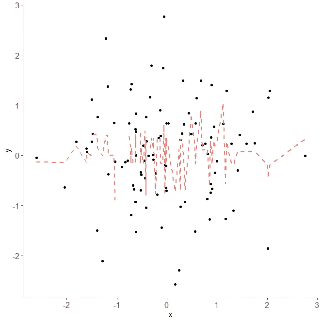

# 当我们谈到 X 和 Y 相关时，这意味着什么？

> 原文：<https://blog.devgenius.io/when-we-talk-about-x-and-y-being-correlated-what-it-means-63d780d6b194?source=collection_archive---------3----------------------->

根据[维基百科](https://en.wikipedia.org/wiki/Correlation)，相关性是两个随机变量或双变量数据之间的任何统计关系，无论因果与否。定义中的关键词是`relationship`、`causal or not`和`between two variables`。在我们进入如何计算相关数之前，让我们先讨论一下。

# 两个变量之间的因果关系。

这意味着我们可以计算两个变量之间是否存在任何关系，但我们不能保证是否有因果关系。理解相关性很重要，这并不总是意味着有因果关系，但因果关系必须相关。这就是为什么关于相关性和因果关系的金玉良言是:

> 相关性并不意味着因果关系。

那么，100 万美元的问题就是: ***如何知道哪种相关性确实隐含着因果关系？这就是领域知识发挥作用的地方。我们将在计算相关系数时讨论这一点。***

相关性的类型:

1.  正相关
2.  负相关
3.  弱相关
4.  强相关

如果我们将上面的类型放入一个矩阵中，我们可以看到它是这样的:


图一。相关性的类型。

如何决定我们拥有的相关系数是负的，正的，弱的，还是强的？它介于-1 ≤ X ≤ 1 之间，我们可以这样分类:


图二。如何确定相关类型

正如我们所看到的，如果相关系数太接近于 0，就意味着变量之间没有关系。据我所知，一些公司使用不同的阈值来决定相关强度。因此，只介绍如何根据相关系数确定相关类型，阈值将取决于不同的事情。

我想这些理论和解释已经足够了，让我们开始讨论如何计算相关系数，好吗？:)

# 如何计算相关系数？

我们将使用这个[样本数据集](https://docs.google.com/spreadsheets/d/1kWENedoGv_30OI0LnIr7ENVyL3n6iVufJAKPpmtwkgs/edit#gid=2062579209&range=A1:C301)，它由孩子的身高(厘米)和父母的身高(厘米)组成，分为父亲和母亲。

我们可以使用这个公式来计算 Google Sheets 中的相关系数:


图 3。计算相关系数并定义类型

根据上表，我们可以看到孩子的身高和父亲的身高有着比其他人更高的相关系数。数字怎么读？ ***子女与父亲身高呈 0.57 的正中度相关。*** 我们可以在网上看到有很多与此事相关的研究，认为父母的身高直接或间接地影响孩子的身高。这些研究中有很多变量，但对于这篇文章，我们想说的是，与母亲的身高相比，父亲的身高对孩子的身高有更大的影响。 如果有人问靠多远？我们可以说孩子和父亲之间的相关系数比孩子和母亲之间的相关系数高 1.48 倍。

现在，我们正在谈论父亲和母亲的身高。在这种情况下，利用领域知识，我们从生物学的角度知道，父亲的身高不可能影响母亲的身高，反之亦然。因为他们之间没有家庭或遗传关系。但是，就常识而言，通常，当人们寻找配偶时，男性会寻找比他们矮的女性，而女性通常会寻找比他们高的男性，但是我们不能使用这一点，因为没有确切的证据。这就是为什么父亲和母亲身高之间的相关系数并不意味着因果关系。希望对你有意义。

用另一种方法，我们可以用散点图来研究变量之间的相关系数。


图 4。父亲和孩子身高的 R 平方散点图。

通常，相关系数使用符号`r`或`R`。在上图中，R 平方表示调整后的相关系数，即父亲的身高(厘米)解释了孩子的身高(厘米)。它就像我们的相关系数平方一样简单，这意味着值必须是正的。在我们的例子中，父亲和孩子之间的相关系数是 0.57，平方后等于 0.327。让我们试着和其他的儿童和母亲身高散点图，以及父亲和母亲身高散点图进行比较。


图 5。母亲和孩子身高的 R 平方散点图。


图 6。父亲和母亲身高的 R 平方散点图。

# 还有其他类型的关联吗？是的。

基于上面的例子，我们正在寻找一个线性关系。如果我们发现一种非线性关系呢？我们不能用同样的方法。让我们看一个什么是非线性关系[的例子。](https://stats.stackexchange.com/a/30981')


图 7。一个非线性关系的例子，用 R 语言创建。

从图 7 中，我们可以看到 X 和 y 之间的非线性强负相关。为了计算这种类型的相关系数，我们不能使用前面提到的相同方法。不幸的是，目前我仍然没有在 Google Sheets 中看到任何计算非线性关系的内置函数。但是，使用 R 语言计算一个真的很容易，特别是使用`nlcor`包。

```
# How to install the nlcor package in R
> install.packages("devtools") 
> library(devtools)
> install_github("ProcessMiner/nlcor")
> library(nlcor)
```

在执行了上面的 R 脚本之后，您可以创建一个样本数据集，使用一个非线性数据集来比较线性和非线性相关性的计算。



图 8。下面是一个使用 R script 创建的非线性数据集的示例。

```
# How to compare the linear and non-linear correlation
> library(lattice)
> x <- rnorm(100) 
> y <- rnorm(100)> cor(x,y)
-0.00111939> c <- nlcor(x, y, plt = T)
> c$cor.estimate
0.2916413
```

正如我们所看到的，普通方法和非线性方法是有区别的。常见的说 X 和 Y 不相关(-0.0011)，相比于 X 和 Y 的非线性相关(0.2916，弱正相关)。

# 这里没有解释的事情

说实话，有很多和相关性有关的东西没有写在这里。比如:

1.  如何使用相关性进行线性或非线性回归分析？
2.  什么是多重共线性假设？
3.  计算相关性的方法很多，如皮尔逊(常用的)、肯德尔、斯皮尔曼等。
4.  很多类型的非线性相关，如指数、二次、阶跃等等。
5.  说实话，就算是我，也不可能一次记住所有的事情，LOL。

# 摘要

如果使用得当，相关系数会非常有用。假设我们想知道如果我们增加 X，我们能增加 Y 吗？这是回归分析的基本概念，它的基本知识是我们需要知道如何计算相关系数。相关系数更多地用于数据分析和数据科学。