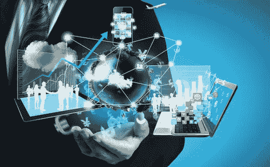

# 这就是人工智能将如何接管世界。

> 原文：<https://blog.devgenius.io/when-will-technology-take-over-the-world-artificial-intelligence-a427f21db845?source=collection_archive---------15----------------------->

只要敞开你的心扉，想想过去 10 年里技术发生了多大的变化……现在想想未来 10 年，这是有可能的。

现在比以往任何时候都更令人生畏的事实是，技术可能接管人类并不像人们想象的那样荒谬…

我们的生活已经被技术占据，年轻一代已经在年轻时熟悉复杂的技术，我记得我在外面玩是为了娱乐，而不是呆在社交媒体上玩几个小时的电脑游戏。

老实说，我们都为在技术和社交媒体上花费了太多时间而感到内疚，公平地说，人类已经变得依赖技术，但在什么情况下技术会比人类聪明呢？它只需要瞄准我们的电网，让我们停电，让世界陷入完全的混乱。

我说的不是一些人，比如机器人，亲自去破坏电网，如果我们庞大的网络和系统决定不遵守指令，自行重新编程，那会怎样？然后它就可以接入电网，关闭世界上的大部分地区。我不会去探究它是如何做到这一点的，因为我也不是很确定，但我相信这是有可能的。

人工智能超越我们的潜力比你想象的要近得多，特别是随着技术的进步和全世界的交流…

也许在不久的将来，人类将与人工智能合作，但我们无法控制它，它将能够在它想做的时候做它想做的事情…

这让许多人紧张不安，但我个人认为人工智能和人类会相互合作，人工智能毁灭我们会有什么好处？也许它不会以机器人的形式出现，但人工智能肯定会对我们未来的生活方式产生重大影响。

没有办法确定，但继续等待，我们会看到未来会给人类带来什么。

我同意想到人工智能的影响是可怕的，特别是当它在各方面都比我们聪明时，一个自我学习的人工智能已经知道关于人类的一切，将能够决定它是否希望我们在身边。

从我们过去的记录来看，我不喜欢 AI 特别喜欢我们，但是我们是它的创造者，这肯定对它有一些感情价值？也许人类注定要创造人工智能，它将把我们推向未来，帮助我们开发难以想象的物品和技术，为我们的驱动力和探索太阳系提供燃料。

无论哪种方式都比你想象的要近，这绝对是我们不应该忽视的。