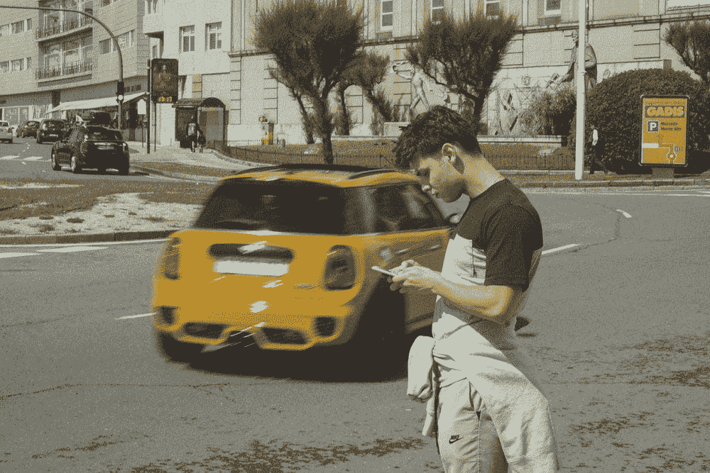

# 当你认为你的职业生涯正在分崩离析时，作为一名程序员，你可以做这三件现实的事情

> 原文：<https://blog.devgenius.io/when-you-think-your-career-is-falling-apart-then-you-can-do-these-3-realistic-things-as-a-d65c75696e1b?source=collection_archive---------13----------------------->

## #2 开始容忍

[安德雷斯·费尔南德斯](https://unsplash.com/@photosandres?utm_source=unsplash&utm_medium=referral&utm_content=creditCopyText)在 [Unsplash](https://unsplash.com/?utm_source=unsplash&utm_medium=referral&utm_content=creditCopyText) 上拍照

有时候，你肩上的担子似乎比你能承受的还要重，一切都显得索然无味。你可能会觉得你的职业生涯正在分崩离析，最糟糕的是，你认为你没有其他选择，只能继续看着它分崩离析。

我不知道其他人会如何处理这种情况，但我知道有很多人对此有不同的看法。

作为一名程序员，曾经有一段时间，我看到一切都分崩离析，我问自己的唯一问题是“在这种情况下，我到底应该做什么？”。

## 重新集中你的注意力

先说实话，我们都是欲望驱动的。渴望达到新的经济地位，渴望赚更多的钱，渴望买一辆好车，渴望买一栋大房子…

这没什么不好，我确实有各种各样的愿望和梦想，为此我每天都在更加努力地工作。

毫无疑问，你的梦想可以成为你动力的燃料，但如果长期看不到任何结果，它也会让你失去动力。这种情况真的会让你沮丧和难过。在这种情况下，你能做的就是面对事实，继续前进。我们失败了，但我们学会了胜利。

## 开始容忍

你有没有听过学长说的这三个神奇的词，“*妥协，妥协，妥协*”？为了成功，你必须妥协。这可能是你听过的最大的谎言。

如果你真的不喜欢做一些事情，那就不要容忍它。走出你的舒适区是另一回事，像加班却没有额外报酬是另一回事。停止免费加班(没人会给你奖励)。

长时间做你真正不喜欢的事情会让你失去继续工作的动力，你会发现一切都消失了。

## 发现新的东西

如果你讨厌你正在做的事情，那么为什么不干脆转而做所有必要的计划。

如果你一直想做自己喜欢的事情，为什么不考虑去做呢？在采取任何重大步骤之前，确保你有一个适当的计划。

没有人喜欢坚持一件事，如果你没有得到你应得的，改变是新的提神剂。害怕被拒绝会一直对你不利。你应该知道自己的价值，如果你对某样东西不满意，为什么不去想别的，这没什么不好。

只要记住—

> “最大的风险是不冒任何风险”

就是这样。我希望这能激励你。祝你的编程之旅好运！

关于我——我是*科技*和*自我提升、* [*的顶级作家点击这里*](https://aniketz.medium.com/) *阅读更多我的文章。*

如果你想购买 5 美元的中等会员资格， [*点击这里*](https://aniketz.medium.com/membership) (当你使用 [*这个链接*](https://aniketz.medium.com/membership) 购买中等会员资格时，我会从你的会员费中抽取一小部分作为佣金，不需要你额外付费)。如果你想订阅我的电子邮件列表然后 [*点击这里*](https://aniketz.medium.com/subscribe) *。*

 [## 通过我的推荐链接加入 Medium-Aniket

### 阅读 Aniket 上的每一个故事(以及媒体上成千上万的其他作者)。你的会员费直接支持了一个市场…

aniketz.medium.com](https://aniketz.medium.com/membership) 

[**通过电子邮件获取我的文章点击这里**](https://aniketz.medium.com/subscribe) **|** [**购买 5 美元的中等会员资格**](https://aniketz.medium.com/membership)