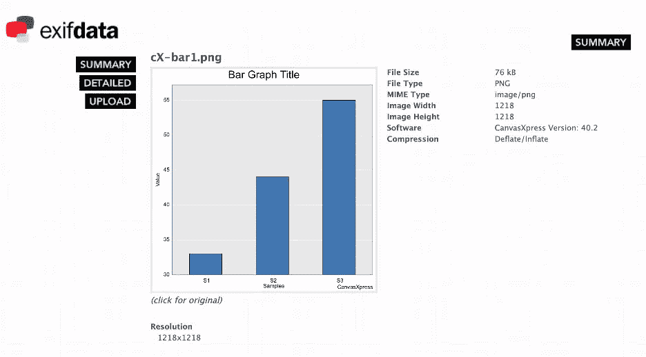
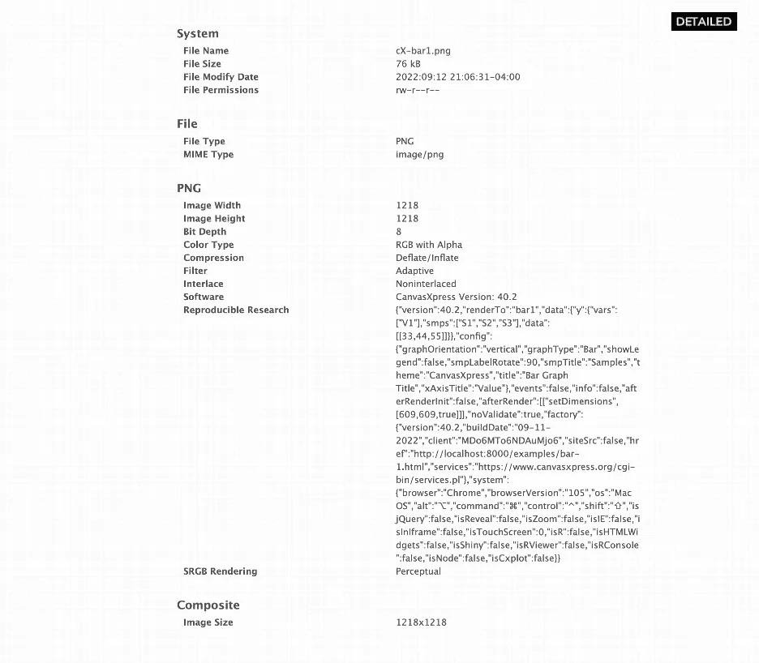
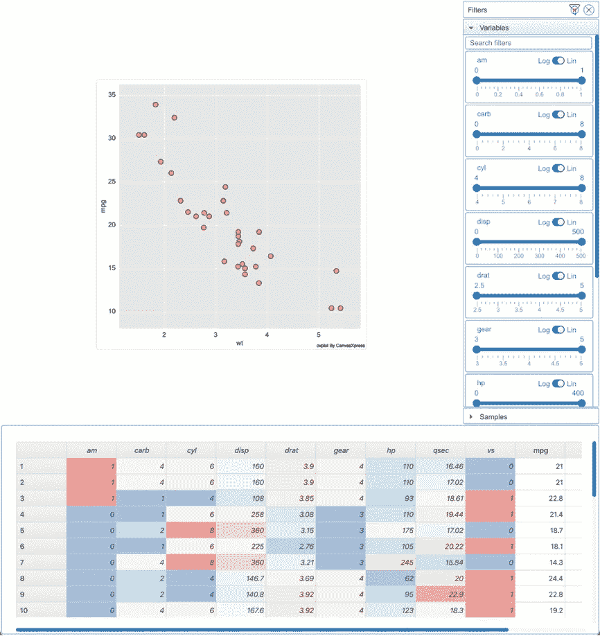

# 数据在哪里？

> 原文：<https://blog.devgenius.io/where-is-the-data-bdaecd502076?source=collection_archive---------5----------------------->

## 将原始数据嵌入数据可视化的原子命题

CanvasXpress 生成的原始图形

对数据科学家来说，最令人沮丧的问题之一是在科学杂志或在线出版物中找到用于创建特定图形的数据。幸运的是，随着可再现研究指南的推广和采用，一些期刊要求科学家提供原始数据，一些甚至要求 R 或 Jupyter 笔记本电脑提供源代码和数据，以再现出版物中的每个图形。

然而，即使在有原始数据链接或有与图形相关联的笔记本的情况下，数据源也可能会丢失，因为当图形从原始文档中取出作为会议或内部讨论的演示文稿的一部分时，它们会被独立保存。

这里有一个原子方法的提议，它以不显眼的方式将原始数据注入可视化中，以便数据科学家和用户不仅可以欣赏可视化，还可以重新创建它，甚至探索其他替代方法来解释数据或将其与其他数据集合并。

原则上，这个概念很容易实现。它只需要将原始数据嵌入到 PNG、SVG 或其他类型的图像中。这样，数据和可视化在单个文件中的原子对象中共存。主要的挑战是如何在幕后毫无痛苦地存储和检索数据，以便数据科学家能够专注于创建完美可视化的任务。

大多数数据分析平台(如 R 或 Python)使用一种数据结构，将数据组织成一个由行和列组成的二维表格，非常像一个电子表格或数据框。然后，这些对象用于绘制属性，以创建图形或数据可视化。虽然在创建可视化时可以将这些对象嵌入到图像文件中，但这是不切实际的，因为它们本质上是二进制的，并且在不同的分析平台中不是标准的。

一种更合理的方法是将这些结构转换成人类可读的文本字符串，这些文本字符串可以在不同的分析工具中很容易地进行解释。“csv”或“制表符”分隔的文件也不理想，因为这些文件缺乏结构。例如，将数据映射到轴、识别元数据以及分配创建可视化所需的其他信息，都不能以这种格式轻松存储。显而易见的替代方法是创建一个 JSON 文件，其中包含原始数据以及如何创建可视化的说明，并很容易将其转换为文本字符串。事实上，JSON 实际上是 web 应用程序中数据通信的标准，web 应用程序是向科学家和用户展示这些可视化的首选媒介。

使用*可交换图像文件格式*(Exif—【https://exifdata.com】)可以将结果字符串作为元数据存储在图像中。在其上，图像将包含用于创建可视化的原始数据，而不干扰图像本身的呈现(图 1a、1b)。也就是说，用户可以在网页(或任何其他媒体)中查看可视化，并看到图像，而不会意识到原始数据就在其中。图像中唯一的区别是它的大小，它将与数据的大小成比例增加。

图 1a。https://exifdata.com 的[屏幕截图显示了在 https://www.canvasxpress.org/examples/bar-1.html](https://exifdata.com)[显示的 CanvasXpress 图的 Exif 信息。](https://www.canvasxpress.org/examples/bar-1.html)

图 1b。[https://exifdata.com](https://exifdata.com)的截图，详细显示了[https://www.canvasxpress.org/examples/bar-1.html](https://www.canvasxpress.org/examples/bar-1.html)中显示的 CanvasXpress 图形的 Exif 信息。

为了在图像中存储/写入原始数据，需要在不同的分析平台(R、Python 等)中使用一个函数来编写创建可视化所需的 JSON。类似地，我们需要另一个函数来从图像中检索/读取和解析原始数据，以便对其进行访问。如上所述，公开数据可视化的首选介质是 web，这使得 JavaScript 成为编写这些函数的理想语言，因此人们不仅可以在不同的分析平台中使用它们，还可以在呈现可视化的任何网页中使用它们。

CanvasXpress 是一个开源的 JavaScript 可视化库，它被设计用来做上面所描述的事情(这里有一个到 https://www.canvasXpress.org 网站的链接)。原始数据以及创建可视化的指令被嵌入到图像中，而不需要任何额外的编码。CanvasXpress 可以生成 PNG 和 SVG 文件，这些文件可以有效地充当原始数据的外壳。可以将该库创建的图像拖放到其他 CanvasXpress 图形中，以重新创建可视化效果并显示原始数据。该库有一个不引人注目的、开发良好的用户界面，使科学家和用户能够看到原始数据以及这里没有描述的其他数据分析功能集(图 2)。

图二。显示加载到 CanvasXpress 中的 mtcars R 数据集的网页截图，其中显示了数据和元数据。在 R 中运行以下 common 后图像被保存:**库**(gg plot 2)；**库**(canvasXpress)；g < - ggplot(mtcars，aes(wt，mpg))+geom _ point()；加拿大运通(g)

CanvasXpress 有一个开发良好的 R 接口(这里有到 https://github.com/neuhausi/canvasXpress github[和 CRAN repositories](https://github.com/neuhausi/canvasXpress)[https://CRAN . R-project . org/web/packages/CanvasXpress/index . html](https://cran.r-project.org/web/packages/canvasXpress/index.html)的链接)和利用 ggplot 对象作为输入产生数据可视化的能力(图 2)。此外，CanvasXpress 还有一个成熟的 python 接口(这里有一个到 Pypi[https://pypi.org/project/canvasxpress](https://pypi.org/project/canvasxpress/)的链接)，这使得端到端实现所描述的范例变得非常容易。本出版物的目的不是提供工程实施的细节，而是在向同行评审期刊提交研究论文时倡导这种做法，以促进科学发展并帮助可重复研究。