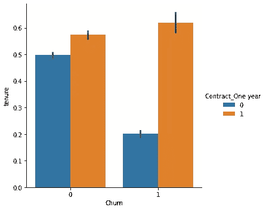

# 机器学习和博弈论相遇的地方

> 原文：<https://blog.devgenius.io/where-machine-learning-meets-game-theory-f44ff176fe70?source=collection_archive---------6----------------------->

# 介绍

如果您对刚刚训练的 ML-model 有更多的了解，您就可以知道如何改进它的性能。幸运的是，有一个强大的工具来解释你的模型的行为，叫做 **Shapley 值**。

考虑一个二元分类问题。在数据集中，有 *m* 个特征， *n* 个观测值， *2* 个标签。但从博弈论的观点来看，二分分类是 *m* 个玩家， *n* 个玩轮之间的合作博弈，两种可能的结果(每轮)。

每一轮都有助于我们更好地理解玩家的互动如何影响整个游戏的结果。在游戏结束时，我们还可以观察每个玩家在每一轮中对模型输出的影响。

# 进口

我们将要使用的[数据集](https://github.com/Vice10/datasets/blob/main/churn.csv)包含了一家电信公司的客户信息，这些客户要么停止(**流失**、 **1** )要么继续(**无流失**、 **0** )使用其服务。

# 准备好数据集

让我们快速浏览一下数据类型为“object”的列。

显然，有很多分类变量。让我们通过用“否”替换多余的值来简化其中的一些，例如，“没有互联网服务”。我猜这几乎没有打破任何商业逻辑。

之后，为了简洁起见，用 1 和 0 替换“是”和“否”值。

一些特征被认为是特殊的。对虚拟变量进行编码，并检查数据集结构。

其他三个数字特征应该被缩放，因为它们代表以不同方式测量的值。

# 电子设计自动化(Electronic Design Automation)

让我们更好地了解我们的数字数据。

条形图有助于更好地理解分类数据。

# 平衡、分割、训练、测试

下面是 BSST 的套路。

平衡是为了保证两个标签的公平训练。

我们将用 **2000** 估算器训练一个 **XGBClassifier** 。

模型的准确率达到了 **83.98%** 。

# 评估模型性能

测试曲线稳定，这意味着**没有过拟合**。

给定卡方统计的所有可能阈值，ROC 曲线绘制了真阳性率对假阳性率，用于测量观察结果和预期结果之间的差异。

ROC AUC 评分为 **0.918** 。

这是混淆矩阵。在我们的例子中，假阳性率是我们想要尽可能最小化的。这是因为我们要识别尽可能多的翻炒者，否则我们会赔钱。

无聊的东西在后面。时间到了。

# 确定关键人物

使用 xgboost 包中的 plot_importance 绘制每个要素的重要性。

沙普利价值观是时候解释是什么影响了比赛的结果了。

水平条代表每个特征的平均模数 Shapley 值。月费是最重要的，任期次之。

有趣的是，其他 17 个没有包括在剧情中的特征，和列表中的前 5 个一样重要。这意味着，如果我们必须降低数据集的维数，我们不能简单地把它们扔掉。

看下一张图。如果计算这些值之间的肯德尔等级相关系数,“保有权”与其 Shapley 值几乎完全相关。因此，这一特性显然会影响每一轮的结果(不会弄乱关于观察的信息)。

在右边的图片中，你还可以发现每个特性的价值，也就是说，它是将整个游戏的输出拉向 **0** (负值)还是拉向 **1** (正值)。越接近无穷大(即离零越远)，影响越大。

,

下图是一个类固醇相关矩阵(也称为相互作用图),显示了所有可能的特征组合是如何相互作用的。

如果您决定从数据集中移除某个要素，请三思，因为您可能会将一名重要的团队成员踢出游戏。

# 结论

本文描述了一个名为 Shapley 值的博弈论概念如何帮助评估每个特征对模型预测的影响。

*此处***有本文代码的笔记本可用。**