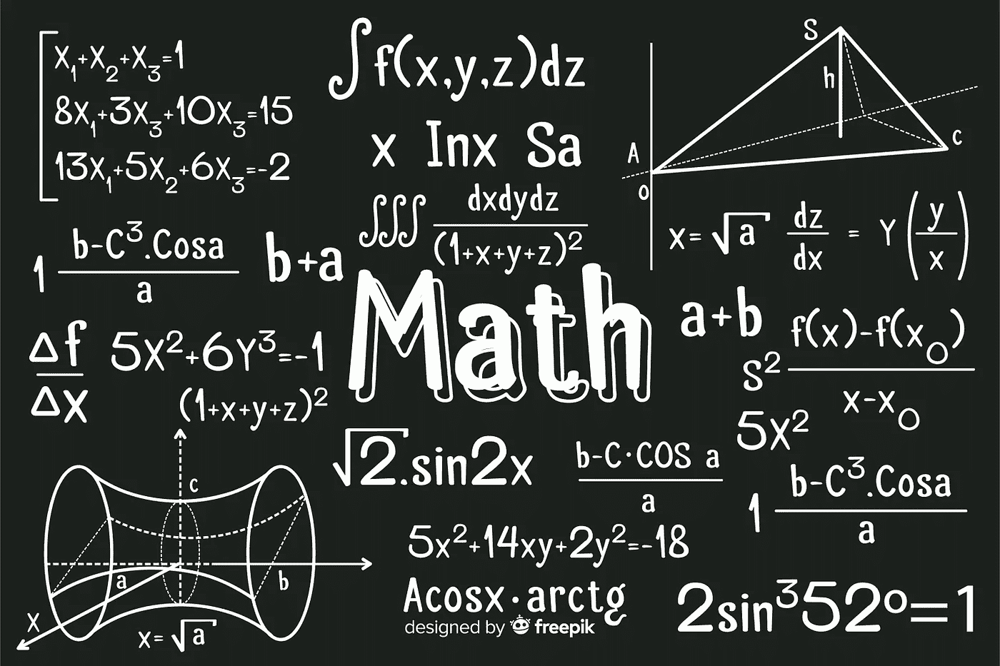
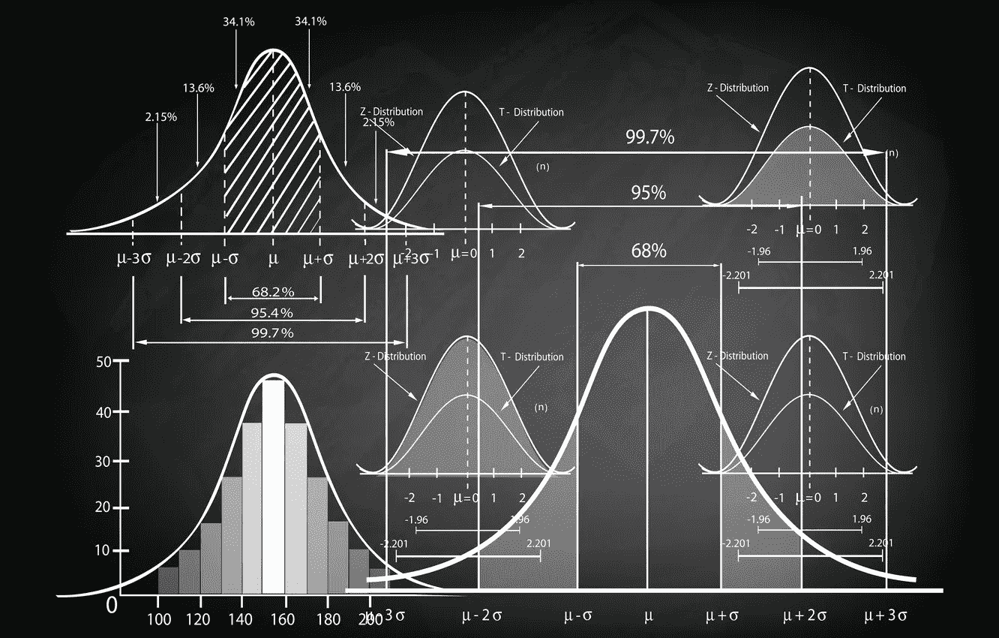

# 数学在哪里被普遍使用？

> 原文：<https://blog.devgenius.io/where-mathematics-being-used-commonly-352bd9e1787b?source=collection_archive---------11----------------------->

太多的地方，但还会有更多的地方。

自从它有了 4000 多年的历史以来，它创造了无数的奇迹，并在我们的生活中创造了更多。在这里，我们将概述数学在当今世界的应用。

## 1-计算机科学

随着数学的最新进展，计算机科学学科诞生了，这是几个世纪以来不同地方的不同数学家共同努力的结果。现在，在每一个计算机科学系，数学被用来教授当今计算机科学中大多数概念的逻辑。

## 2-统计

因为它的基础，数学最突出的用途。但是每个领域都需要某种程度的统计，因为它们都涉及数据。尤其是涉及技术密集型流程时。更重要的是，区块链、人工智能、云技术和数据科学领域最有影响力的人都有统计学背景，他们可以很容易地理解所有这些背后的技术流程。此外，他们可以用一种很容易应用于决策的方式来解释数据。

## 3-工程

像计算机科学和工程一样，它被非常显著地使用。更有甚者，大多数工科学生会在他们的数学密集型课程中努力抓住主题，并最终通过他们的讲座。即使他们设法通过了他们的讲座，他们也不能真正使用在课程中获得的知识，因此，即使他们有经验也不能这样做。但这并不意味着工程学独立于数学，因为计算已经被数学证明了。

## 4-物理

这是另一个为物理学的高级课题而集中教授数学的地方。尽管如此，大多数物理专业的学生在理解他们的学科时还是有困难。在没有进一步理解课程的情况下通过考试。但与工程类似，物理学也依赖于数学，统计也是如此。他们仅仅依靠数学来解释他们的建模。

## 5-经济学

而是数学和统计哪个力量更占优势的问题？尽管近几十年来，统计学的进步导致数理经济学落后于所有的发展。但这并没有让数学在经济学中变得毫无用处，因为它是理解这一现象所必需的。尽管如此，通常需要一个漫长的学习过程才能理解最基本的数学概念。但是它与数学的关系依赖于做出一些解释。

*数学用在哪里？我们是不是忘了单子上的什么东西？在下面的评论区分享你的想法。*