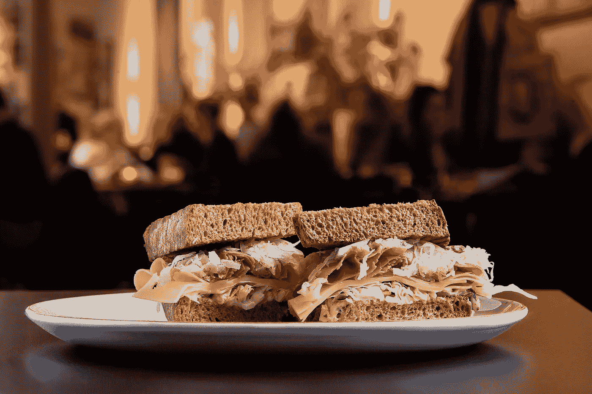

# 纽约市哪里不能吃东西

> 原文：<https://blog.devgenius.io/where-not-to-eat-in-new-york-city-ae383bfa1b0b?source=collection_archive---------9----------------------->

## 使用 Python 调查纽约市 27，000 家餐馆的健康检查结果

吕本斯风格的熏牛肉，作者图片

一周前，我看到阿什利·威利斯(@ashleymcnamara)发的一条[推文](https://twitter.com/ashleymcnamara/status/1278537744352862208)，她问道，“你见过的最好的科技演讲是什么？”。反应非常热烈。请务必查看一些最精彩的技术演讲的答案。

从那以后，我一直在看一些推荐的讲座。我看的第一部是大卫·比兹利的[《发现 Python》](https://www.youtube.com/watch?v=RZ4Sn-Y7AP8&feature=youtu.be)。他用 Python 来支持专利诉讼的一次特别演讲。

当我搜索更多大卫·比兹利的演讲时，我发现了[“内置超级英雄”](https://www.youtube.com/watch?v=lyDLAutA88s&t=1357s)在这次演讲中，他使用标准的 Python 数据类型来分析食品检测。一场精彩有趣的表演！

它启发了我写这篇文章。在本文中，我使用标准 Python 数据结构来调查纽约市 27，000 家餐馆的健康检查结果。

# 读取数据和初步检查。

纽约市 27000 家餐馆的卫生检查结果在纽约市[开放数据网站](https://opendata.cityofnewyork.us/)上公开。你可以从网站[这里](https://data.cityofnewyork.us/Health/DOHMH-New-York-City-Restaurant-Inspection-Results/43nn-pn8j)下载 CSV。按导出按钮，将数据下载为 CSV 文件。

我使用 Python v3.8 命令行来分析数据。我分析数据的时候，你可以跟着我。

我使用 CSV 模块中的`DictReader`函数将整个文件读入字典。我根据`DictReader`的结果创建了一个标准列表。这将产生一个列表，其中每个项目都是一个字典，包含单次检验的数据。

使用字典阅读器阅读 CSV

如您所见，包含检验结果的 CSV 包含 **400305** 记录。由于数据集经常更新，您的数字可能会有所不同。每条记录包含单次检验的详细信息。我们打印第一条记录的内容，以显示单个记录中的内容。

检查数据集中的第一条记录

有几件令人兴奋的事情需要注意。比如说`VIOLATION CODE`。这是指示违规类型的代码。字段`DESCRIPTION`描述检查的结果。

另一个有趣的字段`CRITICAL FLAG`表明检查的结果是否重要。现在我不确定批判是什么意思，但我可以想象。

看看这个数据集中有多少不同的违规代码会很有趣。我们可以使用下面的集合理解来过滤违规代码。

使用集合理解计算违规代码的数量

集合理解从每个记录中选择`VIOLATION CODE`，并从结果中创建一个集合。由于集合不能包含重复项，它会自动移除所有重复项。如你所见，数据集中有 105 个不同的违规代码。

现在，有多少餐厅得到了正面评价？我们可以通过选择没有违规代码的记录来对它们进行计数。

5855 次检查得到了积极的评价。

# 选择最差的餐馆

现在，如果我们能够选择并显示检查次数最多且结果为阴性的餐厅，那就太好了。

让我们首先使用下面的语句来看看这个数据集中有多少关键检查。

计算关键检查的数量

该列表理解创建了包含违规代码和关键的所有检验的列表。我们使用`len`函数来显示关键评论的数量。有 **218375** 关键检查。这差不多是 55%！

## 统计每家餐厅的负面检查数量

字段`DBA`包含公司的名称。意思是*作为*做生意。我们使用下面的语句使用`Counter`函数来计算每个公司的关键检查次数。

统计每个数据库管理员的负面评价数量

前面的代码打印了以下前 10 个结果。我重新格式化了一下。

`DUNKIN’ 1995
SUBWAY 1442
MCDONALD’S 915
STARBUCKS 749
KENNEDY FRIED CHICKEN 696
CROWN FRIED CHICKEN 597
DUNKIN’, BASKIN ROBBINS 567
BURGER KING 466
POPEYES 450
GOLDEN KRUST CARIBBEAN BAKERY & GRILL 375`

有几件事引起了我的注意。第一，这些都是知名餐厅。其次，还有一点清理工作要做。如你所见，Dunkin' Donuts 有不同的名字。

此外，结果是自以为是的，因为某个品牌的餐厅越多，检查的次数就越多，负面检查的风险也就越大。

要放大并查看哪家餐厅的负面检查最多，我们可以使用`CAMIS`。根据[数据字典](https://data.cityofnewyork.us/api/views/43nn-pn8j/files/ec33d2c8-81f5-499a-a238-0213a38239cd?download=true&filename=RestaurantInspectionDataDictionary_09242018.xlsx)，这个数字是餐厅的一个十位数的唯一标识符。如果我们利用`CAMIS`字段再次执行选择，我们会得到下面的结果。

统计每个 CAMIS 的负面评价数量

现在，这些是纽约市负面检查最多的餐馆。让我们看看能否将餐馆的名称添加到结果中。

我们通过迭代排名前 10 位的餐馆`CAMIS`来添加名字。我们通过使用关键列表中的`CAMIS`号进行搜索来选择`DBA`字段。

显示负面检查最多的餐厅名称

这些是检查结果最差的餐馆的名字。我们还没有考虑到的一件事是检查的日期。

例如，如果一家餐馆在去年有了显著改善，它就不会出现在之前的选择中。让我们尝试用下一个选择来修复它。

# 年度最差餐厅

Vegi PokeBowl，作者图片

首先，让我们使用 Python 集合理解来查看哪些检查年份在数据集中。我使用 sorted 对输出进行排序。

选择检查的年份

所以数据集包含了 2013 年到 2020 年的检查结果。我不认为 1900 年有检查。数据字典明确了这一点，如其所述，*“1900 年 1 月 1 日的检查日期意味着一个机构还没有进行检查。”*

现在，如果我们想看看 2019 年检查最严格的前 10 家餐厅会怎么样？

检查最严格的十大餐厅

为了得到餐馆的名字，我们可以用下面的例子。

检查最严格的十大餐厅名称

现在，如果我想去纽约的餐馆吃饭，我会拒绝这些餐馆。

# 最差的餐馆

我想从这些数据中提取的最后一个有趣的细节是哪一类餐厅的负面检查最多。

数据中有一个名为`CUISINE DESCRIPTION`的字段描述了餐厅的菜系类型。所以，我们先来看看数据集中有多少不同类型的美食。我们通过使用集合理解来做到这一点。

统计检查结果中菜系的数量

该数据集包含 84 种不同类型的餐馆。我们可以使用`Counter`来统计否定检查的数量。

计算每种烹饪类型的否定结果的数量

在这里我们看到，最负面的检查是在美国美食。

现在，这些数字有很大的偏差，因为我们没有考虑餐馆的数量。所以我们来统计一下每个菜系的餐厅数量。

计算每种菜肴的餐馆数量

如果我们将`worst_cuisine`和`cuisine_count`结合起来，我们应该能够计算出一个比单独的 cuisine_count 更有意义的比率。

我用每种菜系的关键检查次数除以该菜系的餐厅数量来计算这个比率。

通过将每种菜肴的检查次数除以餐厅数量来计算比率

# 结论

在本文中，我展示了使用标准 Python 数据结构从任何数据集中提取有用信息的可能性。我使用字典、列表、集合和列表理解来提取纽约市最差的餐馆。

如果你有时间，想看看人们认为最好的科技演讲是什么，看看下面这个由[大卫·希斯](https://medium.com/u/9ecbb42ce00d?source=post_page-----ae383bfa1b0b--------------------------------)根据阿什利·威利斯推特上的回复创建的列表。

 [## 你见过的最好的科技演讲是什么？

### 简介阿什莉·威利斯在推特上写道“你见过的最好的科技演讲是什么？”…

t.co](https://t.co/Qb1BlNGWMj?amp=1) 

感谢您的阅读。