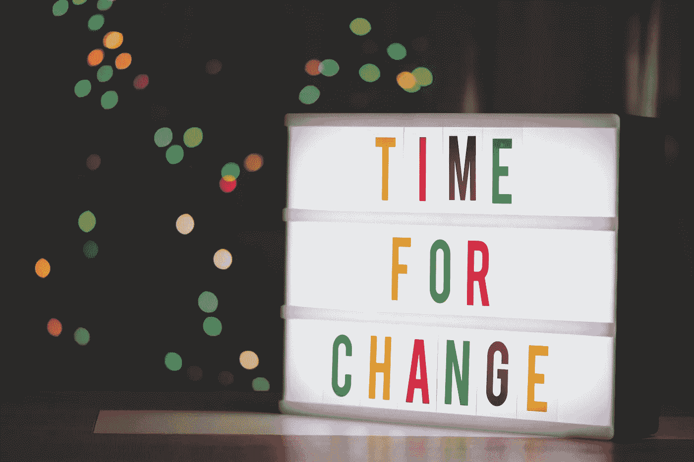

# SRE 从哪里来？

> 原文：<https://blog.devgenius.io/where-sre-came-from-2aa06850a0f?source=collection_archive---------19----------------------->

照片由 [**Alexas Fotos**](https://www.pexels.com/@alexasfotos?utm_content=attributionCopyText&utm_medium=referral&utm_source=pexels) 发自 [**Pexels**](https://www.pexels.com/photo/time-for-change-sign-with-led-light-2277784/?utm_content=attributionCopyText&utm_medium=referral&utm_source=pexels)

> *“SRE 就是当你让一个软件工程师设计一个运营团队时所发生的事情”。*
> 
> ***本杰明·特雷纳·斯洛斯***

过去，生产工作负载由系统管理员(系统管理员或运营人员)管理。产品团队中的开发人员(软件工程师)构建由运营人员管理的软件。运营人员想要稳定的环境，而开发人员想要提供越来越多的功能。开发人员的想法是:*“让我们用一个新的特性让我们的客户吃惊吧！”*，而 Ops 的心态是:*“没坏就不要修！”*。每个小组都有不同的技能、经验和目标。随着时间的推移，由于他们的差异，这些群体之间的对抗盛行。

2003 年，本杰明·特雷纳接受了管理谷歌“生产团队”的任务。本杰明一生都在做软件工程师。软件工程师通常喜欢用软件解决复杂的问题，并且很容易厌倦一次又一次地执行手工任务。因此，他将软件工程实践引入运营，并在充分了解另一面的情况下，改变了我们通常管理服务的方式。

乍一看似乎没有多大意义的东西，实际上是一个巨大的成功。将软件工程实践引入运营领域是 Google 能够大规模运营分布式系统而不必相应增加员工数量的因素之一。

2014 年，在第一届 USENIX 斯雷康会议上，本杰明·特雷纳·斯洛斯展示了“SRE 之钥”。在本次演示中，Benjamin 描述了 SRE 的方法，并分享了他的良好成果。会后，SRE 迅速成为 IT 行业的一个新领域。如今，越来越多成功的公司正在效仿谷歌的运营方式。

事实证明，SRE 的方法能够有效地协调开发人员和运营人员之间的关系。SRE 有能力让它们协同工作，从而提供更可靠、更成功的服务。

Benjamin 将 SRE 方法记录为:

*   只雇佣编码员
*   为您的服务制定 SLA
*   根据 SLA 衡量和报告绩效
*   使用误差预算并对其进行门控启动
*   SRE 和发展的共同人员库
*   过多的运营工作溢出到开发团队
*   SRE 上限工作负荷为 50%
*   与开发团队分享 5%的运营工作
*   Oncall 团队至少 8 人，或 6x2
*   每个待命班次最多 2 个事件
*   每个事件的事后分析
*   事后批评是无可指责的，它关注的是过程和技术，而不是人

后来，更多关于 SRE 综合 SRE 原则和实践的内容被发表。

总而言之:

*   开发商和运营商之间有着历史上的对立
*   SRE 于 2003 年与本杰明·特雷纳·斯洛斯一起在谷歌起步
*   SRE 将软件工程师的实践引入运营和服务管理
*   经过 10 年的完善和改进，SRE 的方法才被记录下来并呈现给公众
*   SRE 已经成为 IT 行业的一个新领域
*   SRE 让开发人员和运营人员协同工作
*   在谷歌成功之后，许多其他成功的公司正在采用 SRE

为了更多地了解 SRE，我推荐我的 Udemy 课程:[https://www.udemy.com/course/sre-the-big-picture/?referral code = fa 215 c 81 b 6 b 26 c 631 f 5f](https://www.udemy.com/course/sre-the-big-picture/?referralCode=FA215C81B6B26C631F5F)