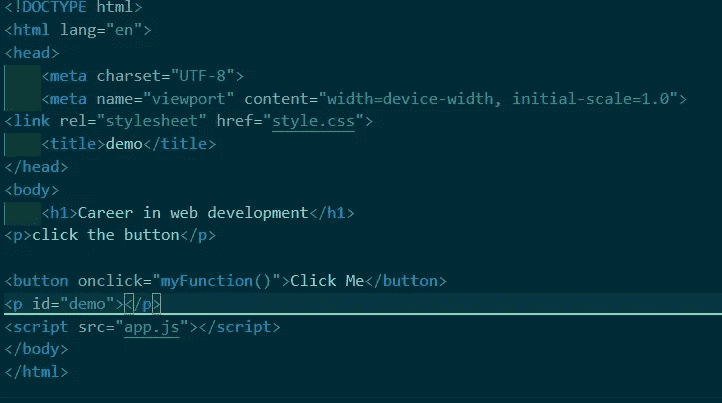
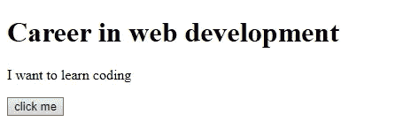
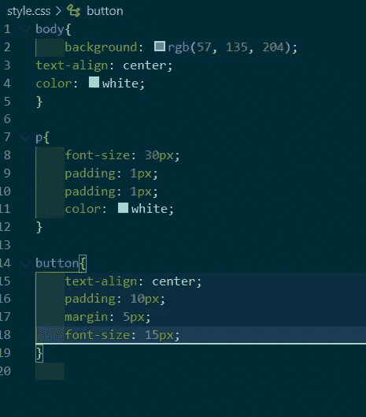
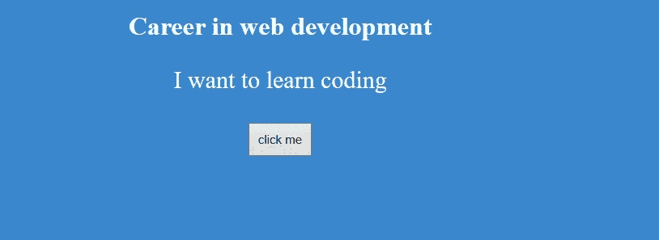
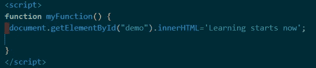
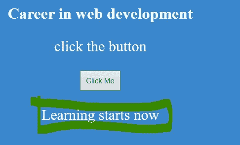
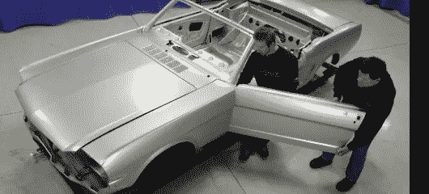
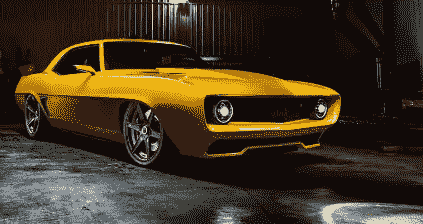

# 从哪里开始 Web 编程？

> 原文：<https://blog.devgenius.io/where-to-start-programming-the-web-2592394bd586?source=collection_archive---------15----------------------->

## 一份 *简明指南，帮助完全的初学者开始他们的 Web 开发生涯*

google 相册

## **到底什么是 WEB 开发:**

Web 开发就是简单地编写一些叫做代码的计算机指令，使网站看起来具有交互功能，完成一些特定的任务。例如，看看我们每天在脸书使用的最常见的 web 应用程序之一。当通过浏览器而不是其移动应用程序访问时，这是一个典型的网站应用程序(由 web 开发创建)的例子，从用户界面的设计到所包含的功能。现在，让我们深入了解在这一旅程中需要学习的三项最重要的技能。

## **所需技能:**

在这个领域取得成功所需的三个基本技能是 HTML、CSS 和 JAVASCRIPT。这三者相互依赖。跟随下面的线索来看看这三者是如何工作的。我将展示一个简短的例子来说明它们是如何工作的，这个例子的标题是“演示”。

# **HTML:**

这是旅程中的第一件事。HTML 代表超文本标记语言。从本质上讲，Html 不是一种编程语言，而是一种用于创建网页的标记语言。HTML 负责网页的显示，就像房屋的支柱或身体的骨骼一样，Html 负责网页在网络上的显示。

对于最新的 HTML 5，HTML 标签，有将近 100 个标签被使用&作为一个初学者，你并不期望把它们都塞满，令人惊讶的是你只需要少数几个，大约 10 个就可以开始你构建令人惊叹的东西的旅程

你练习得越多，你就越能理解它们的用法。让我们访问我们的演示页面，看看 HTML 是如何工作的。该示例将在最流行的代码编辑器 vscode text editor 上进行，任何一个都可以，您可以随意使用任何一个。

通过在线编辑器检查，到目前为止我们在屏幕上看到的都是标签，不要害怕。它们使输出结果更好。 ***h1*** 标签代表标题， ***P*** 代表段落&***按钮*** 。按钮内的 **onclick** 函数是一个 JavaScript 函数，用于在 JavaScript 中引用按钮

**代码的输出如下图所示**

**浏览器上 html 代码的输出**

# **CSS:**

这代表级联样式表。CSS 有助于为已经制作好的标记语言提供很酷的设计，就像绘画对于公寓或者化妆对于面部一样，CSS 对于任何网页都是如此。让我们从给上面的 HTML 代码一些样式开始。

上面的这段代码会产生下面的输出。

**CSS 样式带来了好看的界面**

现在我们可以看到 CSS 的用处了，它们都是相互依赖的，如果没有 HTML，CSS 就没有任何作用，如果没有 CSS，HTML 就不会有好看的界面。

## **JAVASCRIPT:**

大 JavaScript 来了。JavaScript 是一种编程语言，有助于向网页添加功能。想想制造汽车的引擎，我们网页/网站的 javascript 也是如此。我们已经完成了第一步，建立了一个标记页面，然后给它添加了一些美丽的东西。现在让我们为页面添加一些功能。让我们通过让按钮在被点击时显示一些东西来使它具有响应性。

**Javascript 函数**

记住 HTML 中使用的 onclick 函数，这个函数是用来引用我们的按钮的。现在，当您点击该按钮时，它会显示“现在开始学习”。

Javascript 效果

下面是上面强调的三种技能的另一个简单例子

## *HTML:*

下图显示了我们的 html。

**发动机，身体的一部分连接在一起**

## CSS:

给汽车添加设计使其看起来更有价值代表了我们的 CSS

**现在看起来很漂亮的汽车是我们网页上 CSS 的一个例子**

**JAVASCRIPT:**

让汽车在高速公路上行驶所必需的东西&功能在这里代表我们的 javascript。

Javascript 是网页互动的基础

> 这是一个开始网页开发职业生涯的简要指南，这是一个令人兴奋的职业，你一定会喜欢它。决心和一致性是关键。

> 罗伊·t·班尼特说过的一句话是我最喜欢的:“现在就是开始。”

感谢您的阅读，您的掌声，评论，意见将不胜感激。