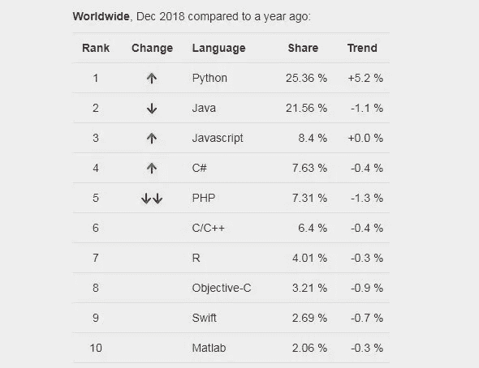

# 哪种编程语言适合初学者

> 原文：<https://blog.devgenius.io/which-programming-language-for-beginners-18cfef0099d4?source=collection_archive---------3----------------------->

每种编程语言对每个人都有很多好处。在这篇文章中，我将研究最流行的语言。

首先，我想给你看最流行的语言图表

img 最流行的语言

1.  计算机编程语言

Python 图像

Python 名字来源于 Monty Python。这些知识与我们的主题无关，但我也喜欢 Monty Python。Python 是一种脚本语言，非常容易学习。什么是脚本语言？脚本语言不需要编译步骤，而是被解释。Python 是最常用的编程语言，因为你可以写更少的代码行，但你可以表达很多东西。它是开源和免费的，有很多工具和文档可以用来学习 Python。

如果你想学习 python，点击[这里](https://www.python.org/about/gettingstarted/)

2.Java 语言(一种计算机语言，尤用于创建网站)

img java eclipse ide

Java 是继 python 之后最流行的编程语言。为什么 java 流行

最流行的语言，因为 java 1.0 是在 1995 年发布的，其原则是“一次编写，随处运行”。它是一种基于类的、面向对象的语言，被设计成可移植的，这意味着你可以在所有平台、操作系统和设备上找到它。java 已经有将近 24 年的历史了，它有大量的文档，所以这使得 Java 非常容易学习，对于初学者来说，你找不到任何未解决的错误。我是一名软件工程专业的学生，在大学里我们学习 java。

你可以在这里学习 java

3.C#

img c#

C#读作升 c 调。C#就像 java。语法非常相似。C#多用于游戏开发和一般微软开发。但是 c#不像 java 那样是平台独立的。C#是一种面向对象的语言，所以它有类和对象。

你可以在这里学习 c#

结论

在这篇文章中，我们检查了 3 种语言，并学习了一些简单的东西。如果你考虑我的意见，我主要推荐面向对象语言给初学者。因为一旦你学会了面向对象逻辑，你就不会忘记它，面向对象逻辑是一种非常有效的编写代码的方式。我从 java 开始，但是所有面向对象的语言对初学者来说都是可以的。