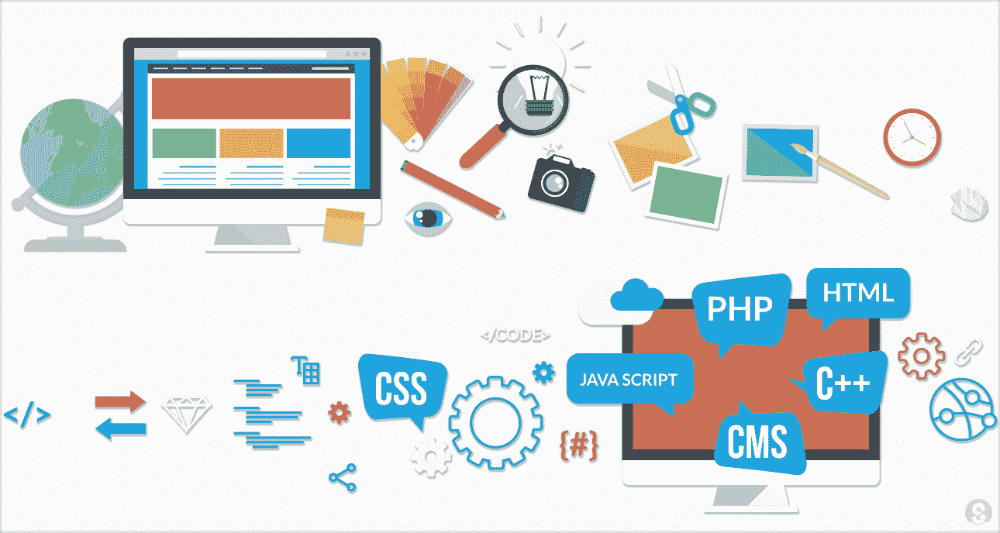
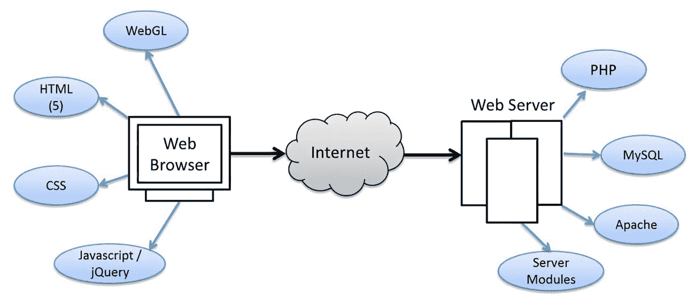
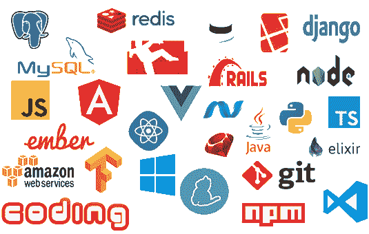

# 应该学哪种编程语言？

> 原文：<https://blog.devgenius.io/which-programming-language-should-i-learn-19c893cbfda2?source=collection_archive---------4----------------------->

应该学哪种编程语言？这是我一直在网上看到的一个问题。我是 Python 爱好者，也是机器学习爱好者，所以一直说 Python。然而，我们都知道真正的答案取决于你想做什么。你应该选择你喜欢做的事情。工作占据了你醒着的一半时间，如果你在醒着的一半时间里不喜欢你正在做的事情，你就不会快乐。如果你的目标仅仅是“我想要一份编程工作”，我建议你开始思考你真正想要的是什么。真的是编程的工作还是只是想要更多的钱？

# 应用程序开发

随着智能手机的兴起，应用程序在 2010 年代开始普及。随着公司的现代化，提出的申请越来越多。有四个主要的应用程序平台可供开发。有 iOS、Android、OSX 和 Windows。当然也有其他应用程序平台，但它们相对较小。请注意，如果您的应用程序需要连接到服务器，您也必须进行编程。除非你和其他人一起工作。

# 移动应用

人们开发的两个移动应用平台是 iOS 和 Android。脸书为此做了一个 JavaScript/TypeScript 框架，叫做 [React Native](https://reactnative.dev/) 。React Native 承诺允许你创建移植到两个平台的原生移动应用。在很大程度上，这是真的。然而，如果你想做一些特定于移动操作系统的事情，你就需要使用本地语言。对于 iOS 来说，这就是 Swift。Android 开发要开放得多，可以用 Java、Kotlin、C#、Python 或 JavaScript 来完成。出于性能原因，我建议使用 Java 或 Kotlin。

# 桌面应用

和移动应用一样，桌面应用也有两大平台。OSX 和窗户。事实上，任何`. exe '格式的文件都可以在任一平台上运行。然而，OSX 应用程序几乎都是用 Objective-C 开发的，这是一种 Mac OS 自带的语言。Windows 应用程序和 Android 应用程序一样，几乎可以用任何语言开发。Windows 应用程序最流行的语言取决于用例。例如，C++几乎总是被选择用于视频游戏开发，因为它的速度快。由于其速度和可定制性，c 语言在 Windows 桌面应用程序中也非常流行。近年来，我们也看到 Python 作为一种流行选择的兴起。这有两个主要原因，a) Python 实际上是 C，b)由于 Python 非常容易读写，所以已经发布了大量的 Python 库。

# Web 开发

JavaScript/TypeScript 在这里胜出。TypeScript 只是 JavaScript 的一个包装器，用于强制输入。你必须学习用于 web 开发的 HTML/CSS，但是让我们澄清一个常见的误解——它们不是编程语言。HTML 代表超文本标记语言，CSS 代表级联样式表。进行 web 开发还有其他方法，但是 React 框架对于 JavaScript 和 TypeScript 来说实在是太棒了。带有 Flask 或 Django 的 Python 也是一种流行的选择，但远没有那么流行。为什么 JavaScript 更好？JavaScript 运行在浏览器中，而 Python 运行在服务器端。

# 后端(服务器端)

你听说过的大多数编程语言，如 C、C++、C#、Python、Java 等都是服务器端语言。大型科技公司(FAANG)最常用的是 Java 和 C 或 C++。如果你特别想在谷歌找份工作，你也可以去看看 Go。在谷歌之外，围棋最近也越来越受欢迎，我个人认为这很酷。然而，围绕它的社区可能还不够大，不足以让大多数初学者进入它，也不足以让他们在合理的时间内开发出真正的程序。

大型公司(和中型公司)后端开发的一个重要方面是规模。一旦您的应用程序达到一定的受众规模，伸缩性就是一个真正的问题。出于这个原因，也仅仅是这个原因，Java 和 C/C++才是正确的选择。对于大规模的 web 应用程序，具有 Spring/Springboot/Spring MVC 的 Java 是非常令人垂涎的，因为它可以扩展到每秒超过 100，000 个事务(TPS)。另一方面，C 不需要这些 Java 框架提供的依赖注入。它还可以扩展到更高的 TPS。只是用起来稍微难一点。

在较小的范围内，或者如果您的应用程序不需要很高的 TPS，或者如果您想在一家初创公司工作，Python 是一个不错的选择。Python 不是最流行的编程语言之一，但可能是初创公司最流行的语言。Python 的灵活性、可扩展性和易用性使其非常适合快速构建概念证明、最小可行产品，并且可以很好地满足大多数初创企业的需求。大多数应用程序不需要 100，000 TPS，Python 可以轻松处理高达 10 TPS。

# AI/ML

Python 很容易成为赢家。用于训练机器学习模型的 Tensorflow 和 Pytorch 就是为 Python 而生的。这是使用的两个最大的机器学习库。Python 中用于机器学习和人工智能的库数量之多，使得它比其他任何语言都要好。到目前为止，AI/ML 领域已经用 Python 开发出来，现在你可以用几行代码完成复杂的自然语言处理任务[。](https://pythonalgos.com/2021/11/23/what-is-natural-language-processing-nlp/)

# 数据科学

数据科学是另一个由 Python 主导的领域。Python 是构建数据科学项目的默认语言，原因与它为什么适合 AI/ML 类似。Python 有许多围绕数据科学构建的不错的库，因为数据科学领域与机器学习领域深深交织在一起。诸如“pandas”、“numpy”和“matplotlib”之类的库使得处理大数据和绘制漂亮的图变得容易。Python 也是大型科技公司提取、转换、加载(ETL)管道中脚本数据处理的默认代码。

# 行业总结

在软件行业，你可以学习很多不同的语言，也有很多不同的工作和角色。这篇文章涵盖了所有的基础知识，但是你可以一直深入到兔子洞。

总的来说，2021 年和 2022 年最流行的两种语言是 Python 和 JavaScript。如果你想做网络开发，学习 JavaScript。如果你想做别的事情，学习 Python 吧。最大的例外是，如果你想做后端开发，那么你应该学习 Java 或基于 C 的语言。

## 进一步阅读

*   [用 SciKit Learn 创建一个神经网络](/create-a-neural-network-in-sci-kit-learn-943c928a306d)
*   [Python 中的神经网络代码](https://pythonalgos.com/create-a-neural-network-from-scratch-in-python-3/)
*   [接口 vs 抽象类](https://medium.com/plain-simple-software/whats-the-difference-between-an-interface-and-an-abstract-class-d1fe50338325)
*   [Python 矩阵乘法](https://pythonalgos.com/level-1-python-pure-python-matrix-multiplication/)
*   [软件领域你可能不知道的五个工作](/five-jobs-in-software-jobs-you-may-not-know-9712b26623b0)