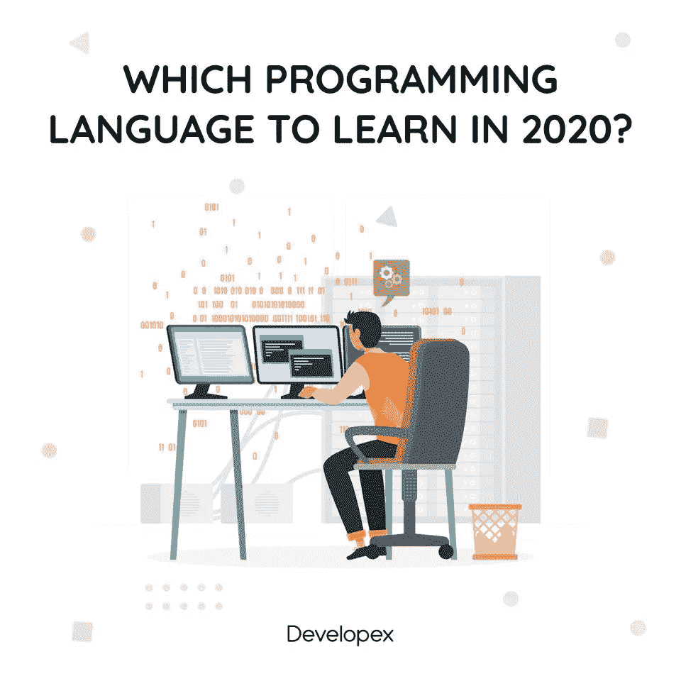

# 2020 年学哪门编程语言？

> 原文：<https://blog.devgenius.io/which-programming-language-to-learn-in-2020-721d96b70ac1?source=collection_archive---------15----------------------->

如今，就生活而言，我们都面临着不同的挑战，这些挑战在某种程度上改变了我们的生活。

由于 IT 行业是当今最稳定的行业之一，我们中的许多人都想在这个领域工作。当然，情况各不相同，但无论如何，我们决定提供帮助，为您带来一份 2020 年最需要的编程语言清单。

这就是:

## 计算机编程语言

最终，世界上教授最多的语言之一。也是最好的和最用户友好的编程语言之一，并且很容易学习。

## Java 语言(一种计算机语言，尤用于创建网站)

它是面向对象的，是一种强大的语言。Java 是高度平台独立的。因此，人们可以从任何地方简单地编码。最适合 web 应用程序。

## Java Script 语言

今天，它已经发展成为一种多范例、高级、动态编程语言。JavaScript 几乎可以在任何地方运行:浏览器、服务器、移动设备、云、容器、微控制器。

## C/C++

几乎所有底层系统的主干。如果你的目标是成为一名系统级程序员，C/C++是你应该学习的语言。

## C#

它是一种建立在 c 基础上的面向对象语言，不仅在 Windows 平台上广泛使用，在 iOS/Android 平台和 Linux 平台上也广泛使用。对了，凡是对 VR 开发感兴趣的，都应该考虑学 C#。

## 服务器端编程语言（Professional Hypertext Preprocessor 的缩写）

它是一种高效的服务器端 Web 开发编程语言。许多大公司都在使用 PHP(脸书，WordPress)，这为它带来了极好的工具支持。

## Go (Golang)

Go 是谷歌打造的一种编程语言。它有一个清晰的语法，这使得它更容易学习。如果你想加入一家专注于核心系统的硅谷创业公司，你应该掌握 Golang。

## 迅速发生的

这是苹果公司开发的一种编程语言，为开发者提供了一种简单而有凝聚力的语法。随着 iOS 和苹果产品越来越受欢迎，知道这一点真的很有好处。

## 矩阵实验室

这是开发科研应用的完美选择。如果你认为数据是你的事情，MatLab 是一个伟大的编程语言。

## 稀有

正如你可能知道的，机器学习在 2020 年获得了动力，所以如果你想在那个领域建立你的职业生涯——R 是正确的选择。

这不是 2020 年使用的编程语言的完整列表，但是，知道哪些语言越来越受欢迎，或者仍然至关重要，可以帮助确保更好的职业发展。所以，利用这篇文章中分享的信息，做出正确的决定吧！

希望你喜欢阅读这篇文章。我们将非常感谢关于它的任何评论。如果你正在努力为你的开发团队寻找一个完美的匹配，请不要犹豫[联系我们](https://developex.com/contact-form/):【contact@developex.com】T2

[无论你何时寻找离岸外包公司，developerx](https://developex.com/)都会为你服务